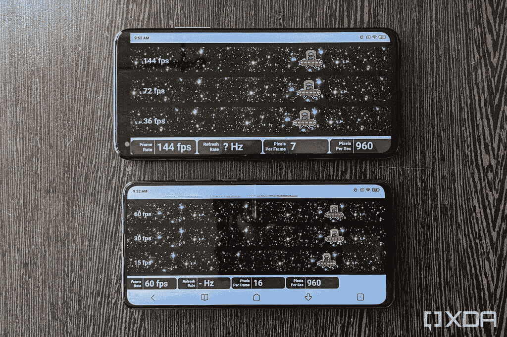
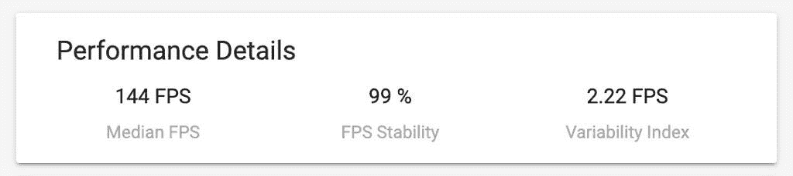
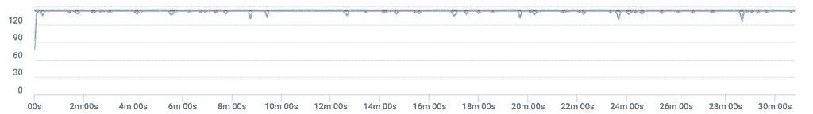

# 小米 Mi 10T Pro 性能和游戏评测:T 是为了了不起

> 原文：<https://www.xda-developers.com/xiaomi-mi-10t-pro-performance-gaming-review/>

智能手机游戏现在比以往任何时候都更受欢迎。它已经从一个利基市场发展成为智能手机的核心价值主张。如今，从智能手机制造商到芯片制造商，每个人都试图抓住尽可能多的机会来宣传他们设备的游戏功能。在这当中，负担得起的“旗舰杀手”有一个新的职责，娱乐铁杆手机游戏玩家。小米 Mi 10T 和 Mi 10T Pro 于 9 月份推出，非常适合列入“旗舰杀手”类别。

尽管小米对“T”升级的定义与一加(以 OnePlus 3T 引领潮流)的预测不同，但小米 10T Pro 的内部硬件与 2020 年初推出的更高端的[小米 10 系列](https://www.xda-developers.com/xiaomi-launches-mi-10-90hz-screen-108mp-camera-snapdragon-865/)相同。Mi 10T Pro 由高通目前的旗舰[骁龙 865](https://www.xda-developers.com/qualcomm-snapdragon-865-processor-specifications-features/) 芯片组以及 8GB 的 RAM LPDDR5 RAM 驱动。因此，我们预计性能不会有任何下降。有利的是，Mi 10T Pro 还具有 144Hz [刷新率](https://www.xda-developers.com/smartphone-display-refresh-rates-explained/)显示屏，该显示屏还支持自适应刷新率，以提供无抖动的使用和游戏体验。

因此，在这篇评论中，我们将检查小米在 Mi 10T Pro 上的无抖动性能，同时测试它在一些要求更高的游戏中的能力。在我们深入性能分析之前，这里是智能手机提供的规格。

### 小米米 10T Pro 规格。单击/点击以展开

| 规格 | 小米米 10T Pro |
| --- | --- |
| **尺寸&重量** |  |
| **显示** |  |
| **SoC** | 高通骁龙 865:肾上腺素 650 GPU 肾上腺素 650 GPU 肾上腺素 650 GPU

*   1 个 Kryo 585(基于 ARM Cortex-A77)Prime core @ 2.84 GHz
*   3 个 Kryo 585(基于 ARM Cortex-A77)性能内核@ 2.4GHz
*   4 个 Kryo 385(基于 ARM Cortex A55)高效内核@ 1.8GHz

Adreno 650 GPU |
| **闸板&存放** |  |
| **电池&充电** |  |
| **安全** |  |
| **后置摄像头** | 视频视频视频:

*   **主要:** 108MP，f/1.69，1/1.33”传感器，OIS
*   **次要:** 13MP，超广角，f/2.4，1.12 m 像素尺寸，123 FoV
*   **第三:** 5MP，微距，f/2.4，1.12 m 像素尺寸

Video:

*   8K @ 30fps
*   双视频模式:垂直、水平、PiP

 |
| **前置摄像头** | 200 万像素，f/2.2，1/3.4 英寸传感器，0.8 米像素尺寸 |
| **端口** | USB 类型-C |
| **音频&振动** |  |
| **连通性** |  |
| **软件** | 基于 Android 10 的 MIUI 12 |
| **其他特性** |  |

**关于这篇评论:**小米印度借给我们一个米 10T Pro 的 8GB/128GB 版本的预零售单元。在写这篇评论之前，我已经使用该设备近一个月了。

* * *

## 小米米 10T Pro:性能

高通骁龙 865 移动平台是小米 10T Pro 的动力。它是一款采用 TSMC N7P 工艺制造的 7 纳米 SoC(片上系统)。骁龙 865 上的 CPU 采用 1+3+4 配置，具有一个基于 ARM Cortex-A77 设计的 Kyro 585“Prime”内核，最高频率为 2.84GHz，另外三个 Kryo 585 内核的频率较低，为的是保持性能，还有四个 Kryo 385 内核，基于 ARM 的 Cortex-A55 设计，主频为 1.8GHz

尽管高通也发布了超频 Prime core 的[骁龙 865 Plus](https://www.xda-developers.com/qualcomm-snapdragon-865-plus-launch/) ，但大多数制造商都坚持使用原来的芯片组——华硕 ROG 手机 3 是一个明显的例外。除了前述的 CPU，骁龙 865 还配备了 Adreno 650 GPU，以及对 5G、Wi-Fi 6 和[双频 GPS](https://www.xda-developers.com/oppo-find-x2-realme-x50-pro-samsung-galaxy-s20-iqoo-3-dual-frequency-gps-gnss/) 的原生支持。

合成基准是我们很多人用来客观评估性能的初步方法之一。为 2020 年的大多数旗舰智能手机提供动力的骁龙 865，已经使用流行的合成基准进行了广泛的分析，包括 Geekbench 5、PCMark Work 2.0、3DMark、GFXBench 等。

在小米 Mi 10T Pro 上运行这些基准测试后，我们发现它的分数与小米 10 的分数一致，小米 10 采用相同的芯片组，并在今年早些时候接受了我们的评估。因此，我们在本次审查中省略了单独的测试。如果你有兴趣了解这些设备在基准测试方面的表现，请查看我们的小米 10 评测的[性能部分。](https://www.xda-developers.com/xiaomi-mi-10-review/#performance)

尽管合成基准是指示性的，但它们并不能说明真实世界性能的全部情况。这就是为什么我们使用 XDA 的内部基准来评估应用程序的启动速度和用户体验的流动性。我们在 Mi 10T Pro 上使用这些测试进行的详细分析如下:

### 应用启动速度测试

《XDA》杂志主编[米莎尔·拉赫曼](https://www.xda-developers.com/author/mishaalrahman/)和资深撰稿人[马里奥·塞拉费罗](https://www.xda-developers.com/author/mario-serrafero/)编写了一个新脚本，来测试应用在不同智能手机上的运行速度。这项测试利用 Android 的 ActivityManager shell 界面来量化任何智能手机从冷启动(即当这些应用程序尚未在后台运行时)启动 12 个受欢迎的应用程序所需的时间。这些应用程序(按照测试中使用的顺序)是谷歌浏览器、脸书、Gmail、谷歌地图、信息、网飞、谷歌照片、谷歌 Play 商店、推特、WhatsApp、XDA 和 YouTube。

在测试期间，这些应用程序中的每一个都被启动，然后在下一个启动之前终止。冷启动然后终止一个应用程序若干次迭代所用的总时间(以毫秒计)由每个条形底部的值计算和表示。同时，中值由条形上方的数字表示。

[sc name = " pull-quote-left " quote = " Mi 10T Pro 启动应用程序的速度比 ROG Phone 3 和三星 Galaxy S20 更快。"]

在我们的应用程序启动速度测试中记录的时间值表明，小米在优化米 10T Pro 上的应用程序启动方面做得很好——总的来说，就是 [MIUI 12](https://www.xda-developers.com/tag/miui12/) 。虽然 Mi 10T Pro 在积分榜上的排名比我们在[一加 8T 评测](https://www.xda-developers.com/oneplus-8t-review/)中看到的要低，但所有这 12 款应用的启动持续时间都明显短于米沙在华硕 ROG 手机 3 评测中记录的华硕 ROG 手机 3 和三星 Galaxy S20 (Exynos)的持续时间。查看上面的图表，了解 Mi 10T Pro 与其他设备的对比情况。

从整体上来看，所有这些智能手机打开应用程序的速度都非常快。几毫秒的差别，在任何情况下都肯定是肉眼察觉不到的。

### UI 口吃/邱建测试

我们的下一个内部基准测试衡量智能手机显示屏的平滑度及其呈现新画面的能力，没有任何延迟或口吃。

 <picture></picture> 

Xiaomi Mi 10T Pro on top vs. Mi 9T at the bottom

XDA 用户界面口吃和邱建测试使用了谷歌开源的 JankBench 基准的修改版本。该基准通过模拟不同应用程序中常见的各种任务来确定智能手机的性能。这些任务包括滚动带有文本的列表视图、滚动带有图像的列表视图、滚动带有阴影效果的网格视图、滚动带有低命中率的文本呈现视图、滚动带有高命中率的文本呈现视图、用键盘输入和编辑文本、用卡片重复透支以及上传位图。

在这些测试的每一次中，绘制和呈现每一帧所花费的时间被记录下来，并相对于由彩色水平线表示的阈值进行绘制。这些阈值(以毫秒为单位)对应于在不同刷新率值下在显示器上呈现一帧所花费的时间。例如，60Hz 刷新率意味着每秒显示 60 次新帧，这意味着 16.67 毫秒显示一次。同样，11.11 毫秒代表 90Hz 刷新率，8.33 毫秒代表 120Hz 刷新率，6.94 毫秒代表 144Hz。同时，竖线表示显示每一帧所花费的时间，任何超过上述水平线的竖线表示断续或抖动。

小米 Mi 10T Pro 支持最高 144Hz 的刷新率，并支持 AdaptiveSync。这意味着显示器可以根据要显示的内容在七种不同的刷新率设置之间切换，即 30Hz、48Hz、50Hz、60Hz、90Hz、120Hz 和 144Hz。尽管如此，所有这些测试都启动了任何设备支持的最高刷新率，在本例中恰好是 144Hz。

在我们的邱建测试中，小米 10T Pro 在大多数测试中运行流畅。以下是我们的观察结果:

*   它轻而易举地通过了 **ListView 图像滚动**和 **ListView 文本滚动**测试，几乎没有任何停顿，在两次测试中，只有不到 1%的帧丢失了 144Hz。
*   在**低命中率**和**高命中率渲染**测试的情况下，分别只有 1.01%和 1.65%的帧没有达到 144Hz 的目标。同样，在这两项测试中，不到 1%的帧未达到 120Hz 的目标。
*   在**文本输入和编辑测试**中，Mi 10T Pro 的表现相对较差，有 4.07%的帧未达到 144Hz 标记，2.76%的帧未达到 120Hz 标记，1.57%的帧落后于 90Hz 目标。这可能会导致在智能手机上输入或编辑文本时出现一些轻微的口吃。
*   当谈到 **GPU 透支**时，7.19%的帧无法匹配到 144Hz 的目标，而 6.11%的帧无法达到 120Hz。这种不规则性主要只出现在总帧的一小部分中(大约 n=12000 帧标记)。
*   也许唯一令人担忧的结果是 **[位图上传](https://developer.android.com/topic/performance/vitals/render#tabpanel-kotlin:~:text=Bitmap%20uploads)** 测试，其中 94.78%的帧显示 144Hz 下的 janky 行为。此外，34.73%的帧也没有达到 120Hz 的目标。相比之下，在华硕 ROG 手机 3 上，大约 78%和 16%的帧分别没有达到 144 赫兹和 120 赫兹的目标。由于 Android 中的所有图形元素都是使用位图绘制的，我们可以怀疑大尺寸位图的主要障碍——特别是像游戏这样的图形密集型应用程序。在现实世界的使用中，除了在第三方启动器的应用抽屉中，没有明显的口吃。

既然我们已经提到了游戏，那么更多的人会在游戏时感觉到任何 jank 或口吃，而不是在 Mi 10T Pro 上滚动 UI 或打字。这也是为什么我们要针对各种热门游戏对米 10T Pro 的性能进行基准测试。

### 真实世界游戏

对于我们对小米 10T Pro 的游戏分析，我们使用了 Gamebench 的 Pro 版本，并收集了至少 25 分钟的游戏数据。所有这些游戏都是在 MIUI 的游戏加速模式下运行的，下面是我们的发现:

#### PUBG 移动

[*PUBG Mobile*](https://www.xda-developers.com/best-pubg-mobile-accessories/) 已经成为最受尊崇的皇室对战游戏之一。小米米 10T Pro 可以在 *PUBG Mobile* 上驱动最高超高清的图形设置，这简直太棒了。然而，对于这种模式，帧速率被限制在超设置 ie。40fps。如果你想享受游戏在极端帧率即。60fps，您必须将图形设置切换到 HDR。虽然一加 7T 以上的一加手机以及华硕 ROG 3 也支持 90Hz 的游戏性，但遗憾的是，截至目前，包括小米 10T Pro 在内的其他设备都不支持。

在 HDR 图形和极限帧速率设置下，Mi 10T Pro 表现出了稳定的性能，在 26 分钟的游戏中持续输出接近 60fps 的帧速率。唯一的帧速率下降出现在加载屏幕期间。在我们的测试中，我们获得了 60fps 的平均帧速率和 90%的 fps 稳定性，以及仅 0.8FPS 的可变性指数。从帧速率分布中，我们可以看到超过 96%的帧以 59fps (~14%)、60fps (~72%)或 61fps (~10%)的速率传输。

在 HDR 图形和极限帧速率设置下，Mi 10T Pro 表现出稳定的性能，在 26 分钟的游戏中持续输出接近 60fps 的帧速率

平心而论，这样的表现是一款旗舰杀手小米 Mi 10T Pro 所期待的。虽然智能手机的上半部分在 10 分钟内开始预热，但温度的上升不会影响或抑制性能。因此，您可以在 Mi 10T Pro 上玩 PUBG Mobile 时，自信地从对手那里抢走鸡肉晚餐。

#### 虚荣

*Vainglory* 是一款受欢迎的 RPG，支持高帧率，这意味着我们可以很好地利用 144Hz 显示器来享受超级流畅的体验。由于其引人入胜的图形和快节奏的游戏，Vainglory 对硬件的要求非常高，这使得它成为测试 Mi 10T Pro 游戏性能的绝佳游戏。

我们选择了持续 25 分钟的 5v5 比赛来测试米 10T Pro 的性能。尽管有图形密集型游戏，智能手机可以输出近 144fps 的稳定帧速率——这是该显示器所支持的最大值。对于超过 95%的帧，帧速率要么是 143fps (~35%)，要么是 144fps (60%)，导致游戏非常流畅。在在线游戏实际连接之前，在 7 分钟长的等待之后，在加载屏幕上观察到帧速率的唯一下降。

#### 皇家战场

*皇家战场*是另一款皇家战场游戏，但你不是以第一人称或第三人称视角进行游戏，而是从空中俯瞰，这让游戏非常吸引人。

小米 Mi 10T Pro 再次表现出色，稳定的帧率为 144fps。由于每场比赛只持续大约 3-4 分钟，我们看到的唯一偶然的帧速率下降是在加载屏幕上。

#### 劳拉·克劳馥走了

在这个充满冒险的游戏中，萝拉·卡芙特，来自*古墓丽影*的主要角色，在精心设计的棋盘游戏风格的奇异运动中行进在障碍面前。尽管被设计成一个谜题，但游戏的特色是一些强烈的图形，显示了强大的生物，如被围困的寺庙中的巨蛇和蜥蜴。这些图形元素足以让硬件紧张，让我的一加 7T 发热。下面是游戏在米 10T Pro 上的运行方式:

米 10T Pro 在保持 140fps 以上的帧速率方面绝对没有困难。帧率唯一的波动或差距来自加载屏幕和过场动画，除此之外，智能手机完全可以满足预期。

塞尔达传说:带有 Citra 模拟器的 Majora 面具 3D

#### 除了享受一些艰苦的 Android 游戏，我们还测试了*塞尔达传说:Majora 的面具 3D* ，这是一款使用 Citra 模拟器的 2015 年任天堂 3DS 游戏。图形分辨率被设置为 ROM 最初渲染游戏分辨率的 4 倍。

就像我们上面玩的所有游戏一样，Mi 10T Pro 在 Citra 模拟器上也保持了出色的性能。在整个游戏过程中，帧速率恒定在 60fps 左右，只有轻微的断断续续。在过场动画中观察到帧速率的唯一下降。除了 Citra 偶尔出现的触摸响应问题，玩任天堂 3DS 游戏时没有任何问题。

*注意:我们不支持使用盗版的模拟器光盘。请确保您使用合法拥有的 ROM。*

*感谢 [GameBench](https://quality.gamebench.net/pro-ref?utm_campaign=Journalist&utm_company=XDA_Journalist+908425307) 为我们提供了记者执照。GameBench 是一套开发工具，用于分析游戏的流畅性、功耗和内存使用情况。GameBench 可以作为谷歌 Play 商店(未上市)的应用程序和桌面应用程序使用。欲了解更多信息，请访问[GameBench.net](http://quality.gamebench.net/pro-ref?utm_campaign=Journalist&utm_company=XDA_Journalist+908425307)。*

*如果您无法从谷歌 Play 商店下载 Gamebench 应用程序，您可以使用他们的桌面应用程序下载。*

*如果您无法从谷歌 Play 商店下载 Gamebench 应用程序，您可以使用他们的桌面应用程序下载。*

* * *

结论

## 小米 Mi 10T Pro 配备了强大的硬件，没有理由怀疑它的性能。正如我们在上面看到的，它与其他平价旗舰和旗舰杀手并驾齐驱，尽管价格比它们略低。在这个价格点上，米 10T Pro 面临的唯一严重竞争可能来自一加 8T。

[sc name = " pull-quote-right " quote = "使用 Mi 10T Pro，性能丝毫不打折扣。"]

虽然这两款设备都提供了出色的性价比，但一加 8T 采用了更亮的 AMOLED 显示屏和 65W 充电，而米 10T Pro 则采用了其[高质量液晶显示屏，提供了令人印象深刻的色彩精确度](https://www.xda-developers.com/xiaomi-mi-10t-pro-great-lcd-better-than-good-amoled-display/)和随着显示内容而变化的自适应刷新率。这种在不需要更高刷新率时降低刷新率的能力有助于 Mi 10T Pro 拥有更长的电池寿命。此外，米 10T Pro 还配有 108MP 主摄像头。但如果你不需要那种相机能力，你可以选择非专业的型号，它配有 6400 万像素的相机，相对来说更加实惠。

在游戏方面，尽管长时间的游戏，小米 10T Pro 也不会屈服于任何压力。在支持高刷新率游戏的游戏方面，它表现出了不可动摇的实力。出色的游戏性能，尤其是 144Hz 的游戏，也缓解了我们在 UI 邱建的位图上传测试和上面的口吃测试中看到的抖动性能问题。

在游戏方面，尽管长时间的游戏，小米 10T Pro 也不会屈服于任何压力。在支持高刷新率游戏的游戏方面，它表现出了不可动摇的实力。出色的游戏性能，尤其是 144Hz 的游戏，也缓解了我们在 UI 邱建的位图上传测试和上面的口吃测试中看到的抖动性能问题。

**[小米米 10T & 10T Pro XDA 论坛](https://forum.xda-developers.com/xiaomi-mi-10t)**

总的来说，如果你需要一个好的旗舰杀手，你不会做出任何妥协，如果你买米 10T 或米 10T Pro。

强大的性能搭配超级平滑的 144Hz 显示屏和 108MP 摄像头，是一款出色的旗舰杀手。

 <picture></picture> 

Xiaomi Mi 10T Pro 8GB/128GB

强大的性能搭配超级平滑的 144Hz 显示屏和 108MP 摄像头，是一款出色的旗舰杀手。