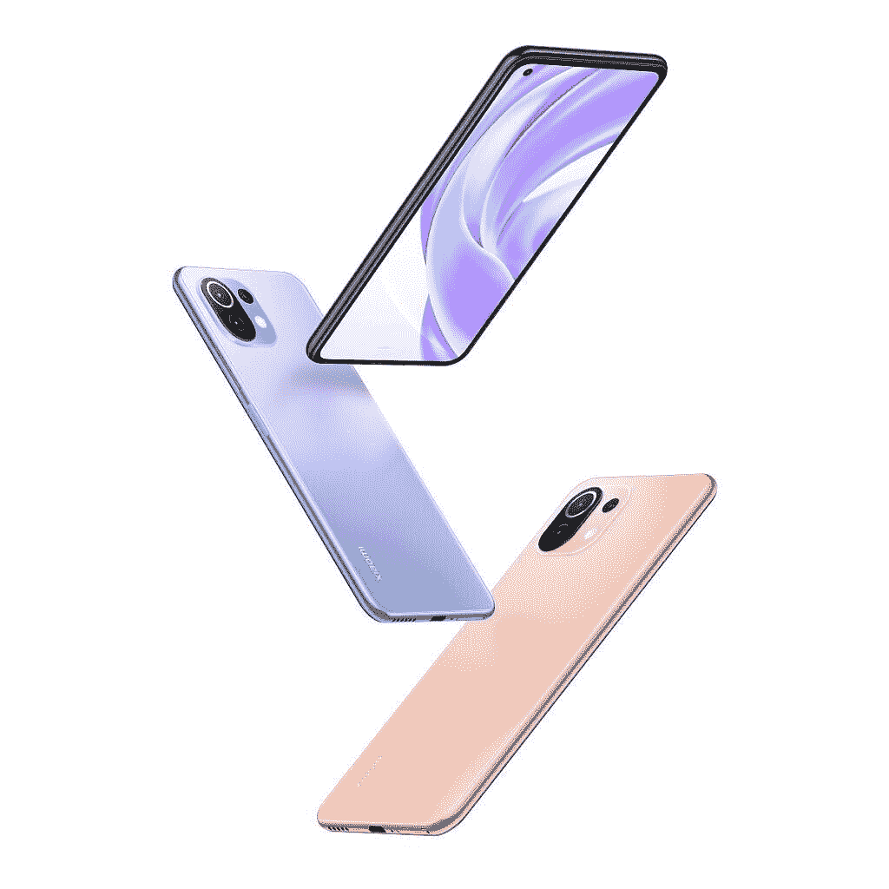

# 小米 Mi 11 Lite:规格，功能，定价和可用性！

> 原文：<https://www.xda-developers.com/xiaomi-mi-11-lite/>

小米以其提供巨大价值的智能手机而闻名，但在该公司今天的“2021 年新品发布会”上，他们将很大一部分活动奉献给了高端旗舰设备。然而，该公司没有忘记成功背后的原因，因此除了新的[米 11i](https://www.xda-developers.com/xiaomi-mi-11i/) 和[米 11 Ultra](https://www.xda-developers.com/xiaomi-mi-11-ultra/) ，小米正在揭开新的米 11 Lite 系列的面纱。

小米的 mi 系列有许多不同的配置，尽管更高端的型号总是比“精简”型号早几周或几个月推出。今天推出的 Mi 11 Lite 系列是在常规 Mi 11 推出近 3 个月后推出的，我们说这款手机[提供了出色的性价比](https://www.xda-developers.com/xiaomi-mi-11-review/)。不过，标准的 Mi 11 起价为€649 英镑，对许多人来说可能太贵了，这就让我们看到了 Mi 11 Lite 系列的两款手机。

在欧洲，你可以买到 Mi 11 Lite 4G 或 Mi 11 Lite 5G。两款手机从外观上看非常相似，甚至有许多相同的规格，最大的区别显然是后一种型号支持 5G 连接。

## 小米 Mi 11 Lite 系列:设计、规格和功能

关于 Mi 11 系列的两款手机，你首先会注意到的一点是它们有多薄。两款手机的厚度都只有 6.81 毫米，与市场上的大多数旗舰相比，这是令人印象深刻的薄。它们的重量都非常轻，4G 型号仅重 157 克，5G 型号仅重 159 克。相比之下，新的 Mi 11 Ultra 带有巨大的摄像头，厚度为 8.38 毫米，重量为 234 克。这两款手机都有平板显示器，显示器的左上方有一个打孔的切口，三个后置摄像头位于方形摄像头凸起中。这两款手机都有双立体声扬声器，一个 USB Type-C 端口，一个双 SIM 卡托盘，以及一个集成在电源按钮上的指纹扫描仪。

小米正在销售米 11 Lite 4G，有三种颜色:波巴黑、泡泡糖蓝和桃红。下面可以看到泡泡糖蓝和桃红色。

 <picture></picture> 

Xiaomi Mi 11 Lite 4G

小米 Mi 11 Lite 5G 还将有三种配色，包括松露黑、薄荷绿和柑橘黄。

除了不同的颜色选择，只有一个其他的设计差异:Mi 11 Lite 4G 的显示屏由一层康宁的大猩猩玻璃 5 保护，而 5G 型号的显示屏由一层康宁的大猩猩玻璃 6 保护。

**[小米米 11 Lite 4G 论坛](https://forum.xda-developers.com/f/xiaomi-mi-11-lite-4g.12187/) ||| [小米米 11 Lite 5G 论坛](https://forum.xda-developers.com/f/xiaomi-mi-11-lite-5g.12189/)**

这些手机在内部和设计上都很相似。Mi 11 Lite 4G 和 5G 均采用 6.55 英寸 AMOLED 显示屏，全高清+分辨率，90Hz 刷新率和 240Hz 触摸采样率，至少 6GB 的 LPDDR4X RAM，UFS 2.2 存储，4,250mAh 电池，支持 33W 快速充电，NFC 和 Z 轴线性电机。5G 型号拥有更高分辨率的自拍相机(20MP 对 16MP)，但提供了与 4G 型号相同的三摄像头设置，包括一个主 64MP f/1.79 摄像头，一个 8MP 超广角 f/2.2 摄像头和一个 5MP“tele macro”f/2.4 摄像头。

如前所述，两款手机最大的区别从名字上就很明显:连接性。小米 Mi 11 Lite 4G 由[高通的骁龙 732G](https://www.xda-developers.com/qualcomm-snapdragon-732g/) 提供支持，这是一款中端芯片组，集成了骁龙 X15 4G LTE 调制解调器。另一方面，小米 Mi 11 Lite 5G 首次采用了[高通的新骁龙 780G](https://www.xda-developers.com/qualcomm-snapdragon-780g/) ，这是一款中端芯片组，集成了骁龙 X53 5G 调制解调器。骁龙 780G 还可以与蓝牙 5.2 和 Wi-Fi 6 兼容的芯片组配对，Mi 11 Lite 5G 就是这种情况。骁龙 732G 和骁龙 780G 都采用八核 CPU，前者有 2 个 ARM Cortex-A76 内核与 6 个 ARM Cortex-A55 内核配对，后者有 4 个 ARM Cortex-A78 内核与 4 个 ARM Cortex-A55 内核配对。骁龙 732G 配备了高通的 Adreno 618 GPU，而骁龙 780G 配备了高通的 Adreno 642。

因此，Mi 11 Lite 5G 不仅提供了更好的连接，而且还具有更快的 CPU 和 GPU 性能。尽管如此，很高兴看到小米继续提供 4G LTE 连接的手机，因为许多国家仍然缺乏成熟的 [5G](http://xda-developers.com/5g) 网络。

软件方面，两款手机都运行小米基于 Android 11 的 MIUI 12 版本。小米表示，广角摄像头和前置摄像头已针对夜间模式进行了优化，并有新的视频模式和滤镜可供使用，如 AI Skyscaping 3.0。除此之外，软件体验应该和小米的其他 MIUI 12 设备非常相似。

| 

规格

 | 

小米 Mi 11 Lite 4G

 | 

小米 Mi 11 Lite 5G

 |
| --- | --- | --- |
| **构建** | 

*   颜色:波巴黑，泡泡糖蓝，桃红
*   防护:康宁大猩猩玻璃 5

 | 

*   颜色:松露黑，薄荷绿，柑橘黄
*   防护:康宁大猩猩玻璃 6

 |
| **尺寸&重量** | 160.53 毫米 x 75.72mm 毫米 x 6.81mm 毫米，157 克 | 160.53 毫米 x 75.72mm 毫米 x 6.81mm 毫米，159 克 |
| **显示** | 

*   6.55 英寸 AMOLED 点阵显示屏(2400 x 1080 FHD+)
*   10 位真彩色和 DCI-P3
*   90Hz 刷新率，240Hz 触摸采样率
*   HDR10 支持
*   德国莱茵 TV 低蓝光认证

 | 

*   6.55 英寸 AMOLED 点阵显示屏(2400 x 1080 FHD+)
*   10 位真彩色和 DCI-P3
*   90Hz 刷新率，240Hz 触摸采样率
*   HDR10+支持
*   德国莱茵 TV 低蓝光认证

 |
| **SoC** | 

*   高通骁龙 732G
    *   中央处理器
        *   1x ARM Cortex-A76 @ 2.3GHz
        *   1x ARM Cortex-A76 @ 2.2GHz
        *   6x ARM Cortex-A55 @ 1.8GHz
    *   GPU: Adreno 618
    *   三星的 8 纳米 LPP 制造工艺
*   小米的 LiquidCool 技术

 | 

*   高通骁龙 780G
    *   中央处理器
        *   1x ARM Cortex-A78 @ 2.4GHz
        *   3 个 ARM Cortex-A78 @ 2.2GHz
        *   4x ARM Cortex-A55 @ 1.9GHz
    *   GPU: Adreno 642
    *   三星的 5 纳米制造工艺
*   小米的 LiquidCool 技术

 |
| **风筒&储存** | 

*   6GB LPDDR4X 内存+ 64GB UFS 2.2 存储
*   6GB LPDDR4X 内存+ 128GB UFS 2.2 存储

 | 

*   6GB LPDDR4X 内存+ 128GB UFS 2.2 存储
*   8GB LPDDR4X 内存+ 128GB UFS 2.2 存储

 |
| **电池&充电** | 

*   4，250 毫安时电池
*   通过附带的充电器进行 33W 快速充电

 | 

*   4，250 毫安时电池
*   通过附带的充电器进行 33W 快速充电

 |
| **安全** | 弧形侧面安装指纹、PIN/密码、图案 | 弧形侧面安装指纹、PIN/密码、图案 |
| **后置摄像头** | 

*   主屏幕:64MP (F/1.79，0.7μm 四合一至 1.4μm，1/1.97 英寸传感器尺寸，6P 镜头，对比度自动对焦)
*   超广角摄像头:800 万像素(F/2.2，1.12μm，1/4 英寸传感器尺寸，5P 镜头)
*   微距:500 万像素 telemacro 相机(F/2.4，1.12μm，4P 镜头，对比度自动对焦，3-7cm)
*   单音闪光灯

 | 

*   主屏幕:64MP (F/1.79，0.7μm 四合一至 1.4μm，1/1.97 英寸传感器尺寸，6P 镜头，对比度自动对焦)
*   超广角摄像头:800 万像素(F/2.2，1.12μm，1/4”传感器尺寸，5P 镜头)
*   微距:500 万像素 telemacro 相机(F/2.4，1.12μm，1.5 英寸传感器尺寸，4P 镜头，对比度自动对焦，3-7 厘米)
*   单音闪光灯

 |
| **前置摄像头** | 1600 万像素内置自拍相机 | 200 万像素显示屏自拍相机 |
| **端口** | USB 类型-C | USB 类型-C |
| **音频&振动** | 

*   双音频扬声器
*   2x 录音麦克风
*   高分辨率音频认证，高分辨率音频无线认证
*   z 轴直线电机

 | 

*   双音频扬声器
*   高分辨率音频认证，高分辨率音频无线认证
*   z 轴直线电机

 |
| **连通性** | 

*   高通骁龙 X15 4G LTE 集成调制解调器
    *   4G LTE FDD:1/2/3/4/5/7/8/12/17/20/28/32/66
    *   4G LTE TDD: 38/40/41 (120M)
    *   3G WCDMA: 1/2/4/5/8
    *   4x4 MIMO(仅 4G，B3，B7)
*   双 SIM 卡
*   蓝牙 5.1
*   无线网络 5
*   NFC 和红外增强器

 | 

*   高通骁龙 X53 4G LTE 和 5G 集成调制解调器
    *   5G NR:n1/n3/n5/n7/n8/n20/n28/n38/n40/n41/n77/n78/n66
    *   4G LTE FDD:1/2/3/4/5/6/7/8/12/13/17/20/28/32/66
    *   4G LTE TDD: 38/40/41
    *   3G WCDMA: 1/2/4/5/8
    *   2G GSM: 2/3/5/8
*   双 5G
*   蓝牙 5.2
*   无线网络 6
*   NFC 和红外增强器

 |
| **软件** | 基于 Android 11 的 MIUI 12 | 基于 Android 11 的 MIUI 12 |

## 定价和可用性

米 11 Lite 5G 有 6GB + 128GB 和 8GB + 128GB 两种型号，在中国的起价为 2299 美元，最高可达 2599 美元。在欧洲，电话从€369 开始。

小米 11 Lite 4G 有 6GB + 64GB 和 6GB + 128GB 两种型号，€299 英镑起。