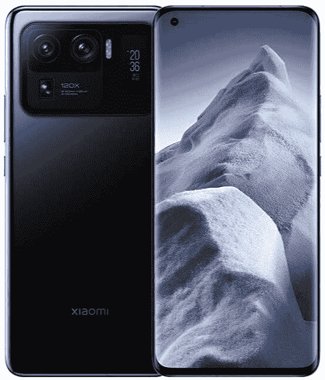

# 小米 11 Ultra 评论:小米手机迄今为止最好的硬件

> 原文：<https://www.xda-developers.com/xiaomi-mi-11-ultra-review/>

小米 Mi 11 Ultra 是小米对过去一年发布的每一款“Ultra”手机的回答。小米 Mi 11 Ultra 是小米智能手机中最好的硬件的巅峰之作，是一款旨在夺取旗舰 Android 宝座的高端设备。小米实现了一个令人印象深刻的壮举，但它并不完美，因为 MIUI 12.5 更新给我的单位带来了许多问题，几周后才得到修复。

*关于本次评审:2021 年 4 月底收到小米美国送来的小米 Mi 11 Ultra 进行评审。这篇评论是我和我在印度的 XDA 同事共同撰写的。小米对该评论的内容没有任何意见。*

## 小米 Mi 11 Ultra:规格

| 

规格

 | 

小米 Mi 11 Ultra

 |
| --- | --- |
| **打造** | 

*   颜色:陶瓷白和陶瓷黑
*   防护:康宁大猩猩 Victus(正面)，陶瓷(背面)，防水防尘等级 IP68

 |
| **尺寸&重量** | 164.3 毫米 x 74.6mm 毫米 x 8.38mm 毫米，234 克 |
| **显示** | 

*   主要的
    *   6.81 英寸 AMOLED 四曲面点显示器
    *   WQHD+分辨率(3200 x 1440)，20:9 宽高比，515 ppi
    *   120Hz 刷新率；自适应同步:30/60/90/120 赫兹
    *   480Hz 触摸采样率
    *   1700 尼特峰值亮度(带 HBM 和 100% APL)
    *   杜比视界，HDR10+
    *   360°环境光传感器，阳光模式 3.0，阅读模式 3.0
*   后面的
    *   1.1 英寸 AMOLED 屏幕
    *   126 x 294 分辨率，450 尼特峰值亮度
    *   始终显示、通知提醒、自拍预览
    *   超级省电模式

 |
| **SoC** | 

*   高通骁龙 888
    *   中央处理器
        *   1x ARM Cortex-X1 @ 2.84GHz
        *   3 个 ARM Cortex-A78 @ 2.4GHz
        *   4x ARM Cortex-A55 @ 1.8GHz
    *   GPU: Adreno 660
    *   三星的 5 纳米(5 英寸)制造工艺
*   三相冷却技术

 |
| **闸板&存放** | 

*   8GB LPDDR5 内存+ 256GB UFS 3.1 存储
*   12GB LPDDR5 内存+ 256GB UFS 3.1 存储
*   16GB LPDDR5 内存+ 256GB UFS 3.1 存储

 |
| **电池&充电** | 

*   5000 毫安时电池
*   67W 有线涡轮增压
*   67W 无线涡轮充电
*   10W 反向充电

 |
| **安全** | 

*   屏幕指纹识别器
*   AI 人脸解锁

 |
| **后置摄像头** | 

*   **初选:**
    *   50MP 三星 ISOCELL GN2，f/1.95，85 ̊视场角，1/1.12 英寸传感器尺寸，1.4μm 4 合 1 至 2.8μm，8P 镜头
    *   OIS，dToF 激光聚焦
    *   双像素专业版，双原生 ISO 融合，交错 HDR
*   **超宽:**
    *   48MP，f/2.2，128 FOV，1/2.0 英寸传感器尺寸，0.8μm 四合一至 1.6μm，7P 镜头
    *   PDAF
    *   微距拍摄
*   **长焦:**
    *   48MP，f/4.1，1/2.0 英寸传感器尺寸，0.8μm 四合一至 1.6μm
    *   5 倍光学变焦、10 倍混合变焦、120 倍数码变焦
    *   PDAF OIS
*   **视频:**所有 3 个摄像机的 8K 视频记录和夜间模式

 |
| **前置摄像头** | 20MP，f/2.2，78 FOV，0.8μm 4 合 1 至 1.6μm，定焦 |
| **端口** | 

*   USB 类型-C
*   没有 3.5 毫米耳机插孔

 |
| **音频&振动** | 

*   双扬声器
*   哈蒙·卡顿的声音
*   高分辨率音频认证
*   x 轴线性振动电机

 |
| **连通性** | 

*   高通骁龙 X60 4G LTE 和 5G 集成调制解调器
    *   5G:n1/n3/n5/n7/n8/n20/n28/n38/n40/n41/n77/n78/n79
    *   4G:LTE FDD:B1/2/3/4/5/7/8/12/17/20/28/32/66
    *   4G: LTE TDD: B38/40/41/42
    *   3G: WCDMA: B1/2/4/5/8
    *   2G: GSM: 850 900 1800 1900 MHz
*   双 SIM 卡，双 5G 待机
*   蓝牙 5.2
*   Wi-Fi 6E
*   NFC 和红外增强器

 |
| **软件** | 基于 Android 11 的 MIUI 12 |

* * *

## 设计

小米 Mi 11 Ultra 两极分化，没有其他真正的说法。取决于你问谁，它要么是市场上最好看的手机之一，要么是最差的。白色的设备看起来有点像我们中间的*角色*，这要归功于背面近乎滑稽的大摄像头凸起。

对某些人来说，这是未来派。对其他人来说，这是一个眼中钉。我是它的粉丝，但我明白为什么你可能不是。尽管如此，这无疑是小米有史以来设计的最高端的智能手机，即使你实际上并不那么喜欢这种设计。

小米 11 Ultra 的陶瓷背面有点像指纹磁铁，我很感谢盒子里的透明外壳。它在手机的所有边缘都有轻微的弯曲，握在手中很舒服。小米 Mi 11 Ultra 的陶瓷背面在舒适度和手感上都比 Mi Mix 2S 有所改善，Mi Mix 2S 是我使用的最后一款陶瓷背面的小米设备。这意味着当你摔下手机时，你需要小心手机的两侧，但它看起来很好，也允许无线充电，所以它确实有一个目的。

这无疑是小米有史以来设计的最高端的智能手机

不过 Mi 11 Ultra 很重，重 234 克。虽然一旦你习惯了就可以使用它，但是换成任何更轻的东西都是一种新鲜空气。我换到谷歌 Pixel 5 上简单试用了一下 [Android 12](https://www.xda-developers.com/android-12/) beta，我对两者在手感上的差异感到惊讶。更小的手机更轻，但这是一个巨大的差异。

它拿在手中感觉也很大，即使它并不比[一加 9 Pro](https://www.xda-developers.com/oneplus-9/) 或 OPPO Find X3 Pro 大多少。显示屏的曲线确实意味着单手滚动时你的手掌会越过显示屏的正面，但小米的手掌拒绝在很大程度上是好的。

显示器上覆盖着大猩猩玻璃 Victus，该公司没有给出任何背面覆盖物的指示。中框也是铝制的，顶部、底部和侧面都是弯曲的，这意味着四个角看起来都有点奇怪。当你每天使用手机时，你永远不会注意到它，我发现这严重夸大了这个问题。使用电话时你不会注意到这一点，而且我发现它实际上看起来很好。

手机最疯狂的部分是显示屏背面的屏幕

这款设备最大胆的设计是后置摄像头，这也是这款智能手机获得“超”绰号的一部分。它拥有(当时)智能手机中最大的相机传感器，以及超宽相机和可放大 120 倍的长焦相机。最疯狂的部分是显示屏背面的屏幕，你可以用它来查看时间、电池电量、一些通知，甚至控制你的音乐。

不管你喜欢它还是讨厌它，它确实有一些用处，尽管作为一个粉丝，我不确定它到底有多大用处。除了手机朝下的时候，我真的从来不看手机，但大多数时候我都会让手机的显示屏朝上，这样就能一直显示。

## 显示

小米 Mi 11 Ultra 的显示屏是 WQHD+ 120Hz AMOLED 面板，看起来*不错*。虽然由于打孔相机，它不是完全不受阻碍，但它是市场上最亮的显示器之一。我一直在关注人们在智能手机上容易发现的所有显示问题，比如黑屏、色带和视角不佳。这些在我的单位都没有。

Mi 11 Ultra 拥有市场上最亮的显示器之一，支持 10 位和 HDR10+支持

我注意到的唯一问题是，在最低亮度水平时，亮度似乎有点不一致。测试亮度不一致的一个很好的方法是将亮度设置为最低，在谷歌浏览器中打开一个隐名标签，然后查看显示屏。我的在底部最暗，在面板中间亮，尽管整个面板应该是完全一致的。诚然，这是一个小众的案例，除了打开一个隐姓埋名的标签，并积极*寻找*一个非统一的显示之外，这甚至不是什么值得注意的事情。在日常使用中，它完全不会被注意到。

小米表示，Mi 11 Ultra 的峰值亮度可以达到 1700 尼特，这可能是在 100% APL 和启用高亮度模式的情况下测得的。我在户外阳光直射下使用它没有任何问题，它还可以调整显示器的对比度，使其更亮。还有 DC 调光(在显示设置中称为“防闪烁模式”)，所以显示屏比平时更暗。无论是在床上还是在黑暗的房间里，我在晚上使用这部手机都没有问题。

小米表示，Mi 11 Ultra 既支持 10 位，也支持 HDR10+,从我的测试来看，网飞确实为 Mi 11 Ultra 提供了 HDR10 内容。10 位颜色意味着显示器可以显示超过 10 亿种颜色，而其他设备上更“标准”的颜色为 1678 万种。如果你想知道这些颜色值到底是如何计算的，8 位显示器意味着三个颜色通道中的每一个都有 8 位数据( **r** ed， **g** reen， **b** lue，RGB)，使其成为每像素 24 位。从那里，我们计算出 2^24 可能的颜色数，等于 16，777，216，或 1，678 万。10 位显示器每个颜色通道有 10 位，这意味着我们每个像素得到 30 位，相当于 2^30.2^30 大约为 10.7 亿，这是屏幕上可以显示的颜色数量。

遗憾的是，Mi 11 Ultra 没有低温多晶氧化物或 LTPO 显示屏，我认为这是最大的错失机会。LTPO 正在成为下一个重要的显示技术，它让显示器的刷新率低至 1Hz，同时大大降低了功耗。也没有办法设置 90Hz 的刷新率，这意味着你必须选择最耗电的 120Hz 或者直接降到 60Hz。没有中间地带。如果您使用 adb，可以通过执行以下命令将刷新率降低到 90Hz 来覆盖刷新率。

```
 adb shell settings put system peak_refresh_rate 90 
```

然而，问题是在一分钟内，MIUI 覆盖了这一点，并将其设置回 120Hz。似乎没有什么办法可以一直主动强制 90Hz。

## 表演

小米 Mi 11 Ultra 在性能上不会令人失望，并且可以处理你扔给它的几乎所有东西。它封装了最新的高通骁龙 888，具有超越其前辈的所有代次飞跃和 5 纳米节点尺寸，可在不大幅增加功耗的情况下获得更好的性能。骁龙 888 保留了高通已经运行了一段时间的 1+3+4 配置，单个 Prime 内核基于 [ARM 的新 Cortex-X1](https://www.xda-developers.com/arm-announces-cortex-x-custom-cpu-program/) 。

此外，还有三个基于 Cortex-A78 的性能内核和四个基于 Cortex-A55 的“效率”内核。骁龙 888 配备了 Adreno 660 GPU，据称比其前身快 35%。最后，该芯片组还配有一个集成的骁龙 X60 调制解调器，用于无缝 5G 连接，尽管我无法在爱尔兰测试 5G 连接，我的同事也无法在印度测试。

[sc name = " pull-quote-left " quote = "小米 Mi 11 Ultra 在性能上不会令人失望，并且可以处理几乎所有你想处理的事情"]

高通骁龙 888 是迄今为止驱动安卓智能手机的最强大的芯片组。它是去年发布的最令人兴奋的旗舰产品的核心，驱动着三星 Galaxy S21 系列、一加 9 和 9 Pro，以及像 [Realme GT](https://www.xda-developers.com/realme-gt-europe-launch/) 和 Redmi K40 Pro+这样的“旗舰杀手”。然而，智能手机不仅仅是其性能的总和，这就是为什么我们总是以智能手机之间如此广泛的定价而告终。小米 Mi 11 Ultra 还拥有高达 512GB 的 UFS 3.1 存储和 12GB 的 LPDDR5 RAM。我的设备有 12GB 的内存和 256GB 的存储空间。

### 真实世界的性能

我们设计了一系列测试 Android 手机真实性能的基准。第一个测试是应用程序启动速度的真实测试，连续 30 次迭代，启动我们每天使用的 12 个流行应用程序。这些应用程序都是在设备上“冷”启动的，这意味着应用程序在启动前不会缓存在内存中。当应用程序的主活动第一次开始绘制时，计时就会停止，因此无需等待从网络加载内容。因此，该测试可以确定设备将应用程序从存储加载到内存的速度，但需要注意的是，该测试对应用程序和操作系统版本的变化非常敏感。

有趣的是，这些结果实际上一直比[的一加 9 Pro](https://www.xda-developers.com/oneplus-9-pro-review) 好，除了谷歌 Chrome 是一个*的大规模*异常值。大多数应用程序的启动时间在 300 毫秒左右，其中许多应用程序的启动时间低于 300 毫秒。对于任何智能手机来说，这些都是令人印象深刻的结果，几乎超过了去年的所有设备。虽然谷歌 Chrome 的结果很奇怪，但由于小米 11 Ultra 的内存容量很大，它很可能是一个大部分时间都在内存中的应用程序。

我们创建的下一个测试是 Google 开源的 JankBench 基准的修改版本。该基准测试模拟了您将在日常应用中看到的一些常见任务，包括滚动带有文本的 ListView、滚动带有图像的 ListView、滚动带有低命中率的文本渲染视图、滚动带有高命中率的文本渲染视图、使用键盘输入和编辑文本、使用卡片重复透支以及上传位图。

我们的脚本记录了测试过程中每一帧的绘制时间，最终将所有帧及其绘制时间绘制在一个图中，还有几条水平线代表四种常见显示刷新率(60Hz、90Hz、120Hz 和 144Hz)的目标帧绘制时间。)

*小米 Mi 11 Ultra 在谷歌的 JankBench 基准测试中成绩*

*一加 9 Pro 在谷歌 JankBench 基准测试中的结果*

小米 Mi 11 Ultra 在上述图表中产生了一些有趣的结果，并在某些方面胜过一加 9 Pro。在 7 次测试中的 5 次，就像一加 9 Pro 一样，小米 Mi 11 Ultra 在 120Hz 的显示器上及时呈现了 99%的帧。然而，在“编辑文本输入”和“位图上传测试”中，它都经历了 jank。

我还没有注意到在显示器上打字时掉帧。在浏览 Twitter(这是“位图上传测试”所指的内容类型)时，曾有过*一些*可察觉的帧丢失，但这种情况足够罕见，我对小米 Mi 11 Ultra 的真实表现感到满意。

### 持续的性能、存储速度和游戏

小米 11 Ultra 的持续性能给我留下了深刻的印象，因为它在谷歌 Play 商店上使用 CPU 节流测试应用程序进行了半个小时的压力测试后，仅节流到总性能的 79%。这意味着长时间游戏对性能的影响应该很小，只有最繁重的游戏才会拖累性能。存储速度也不会成为你最喜欢的游戏和应用程序的瓶颈，因为 UFS 3.1 存储和你预期的一样快。

可以说，在小米 Mi 11 Ultra 上玩游戏是一种享受，即使它不是一部*游戏*手机。我主要是用它来进行仿真，像*《辛普森一家:Hit & Run* 和*The Legend of Zelda:Wind Waker*这样的游戏运行得近乎完美。3DS 游戏也可以玩，如*神奇宝贝 X* 和*动物穿越:新叶*运行得非常好，特别是在[最近的 Citra 更新添加了对着色器缓存的支持](https://www.xda-developers.com/citra-nintendo-3ds-shader-cache-update/)之后。高通骁龙 888 可以处理你扔给它的一切，谷歌 Play 商店上很少有游戏能够将芯片推到极限。

## 电池

小米 Mi 11 Ultra 是一款巨大的手机，配有耗电的显示屏和处理器。5000 毫安时的电池或多或少可以处理我扔给它的一切，在大量使用后让我度过一天。鉴于电池的大小，我预计电池续航时间会稍微长一点，但即使在旅途中，这对我也足够了。

我用手机进行很多社交媒体、YouTube 和工作，它让我度过了一天，在结束时还有点剩余。这是因为全天候显示屏处于启用状态，并且混合使用 Wi-Fi 和移动数据。这是我典型的一天的使用情况，就纯电池统计而言。你可以看到我在上午 9 点左右起床，电池支持我到晚上 9 点左右回到家。

在 PCMark 的 Work 3.0 基准测试中，在设备的最低亮度下测试小米 MI 11 ultra，我们的测试结果为 9 小时多一点。这项测试是在 200 尼特的恒定亮度下进行的，测量了手机电池从 80%到 20%需要多长时间。这不是最好的电池寿命，但它完成了工作，充电速度有助于补充电池，如果你需要它。

小米 Mi 11 Ultra 还支持高达 67W 的快速充电，小米在欧洲的包装盒中包括一个充电器。在印度，该公司的包装盒中只包括一个 55W 的充电器。我测试了从 1%到 100%的充电速度，对结果印象深刻。插入 67W 快速充电器时，充电需要 35 分钟，这是我在智能手机中测试过的最快的充电器。

小米 Mi 11 Ultra 还支持 67W 快速无线充电，但你需要小米专有的无线充电器才能实现这一点。小米表示，使用无线充电器从 1%充电到 100%需要 49 分钟，但注意这将取决于环境条件。如果在温暖的房间中使用，将会收集更多的热量，并且在无线充电中会减慢充电速度以防止过热，因此您需要确保您的充电环境更凉爽，以便它能够工作。

在印度测试我们配备 55W 充电器的设备时，将 5,000 mAh 电池充满大约需要 50 分钟。

## 照相机

小米 Mi 11 Ultra 拥有手机中最大的主相机传感器之一，并且由于自然的*散景*，它可以显示照片。你在特写照片中得到的背景模糊不是软件——它真的只是大型相机传感器在做它应该做的事情。虽然相机有时确实有很多需要改进的地方，但总体来说我还是很满意的。

我认为这是智能手机上较好的小米相机之一(视频质量非常好)，但有些时候它肯定做得更好。小米将小米 11 Ultra 作为 DSLR 的竞争对手，所以我上了 XDA YouTube 频道和我的 Twitter 页面，看看人们更喜欢哪张照片。结果很有趣，因为在大多数情况下，人们实际上更喜欢 Mi 11 Ultra 而不是 DSLR。

总的来说，小米 Mi 11 Ultra 的相机我认为在目前的状态下被夸大了，但有时绝对能够拍出很棒的照片。我知道随着更新有了改进和变化，但自从我有了这个设备后，还没有完全改变游戏规则。这是一个很好的超宽和很棒的变焦相机的固体拍摄者，但我仍然发现即使是谷歌 Pixel 5 也更适合静态照片。它与移动的物体斗争，在移动一团模糊的东西时给我的猫拍照。小米的相机是 Android 智能手机上较好的相机之一，尤其是在光线较好的情况下，但你最好还是使用 Pixel 5 拍摄静态照片。

## 软件:第一次 MIUI 12.5 更新造成了很多问题

智能手机上的软件可以创造或破坏体验，在很多方面，它可能比内置的硬件更重要。我知道很多人不会使用小米设备，不管它的硬件有多好，这要感谢 MIUI，这只是一个例子。每个人都有权发表自己的意见，但软件是很多人的症结所在，几乎可以肯定，它是旗舰智能手机成为旗舰智能手机的一部分。

前言——我一直是 MIUI 的超级粉丝。我认为它给 Android 带来的特性使它成为最好的 Android 变体之一，我喜欢它的外观。动画很流畅，我在 MIUI 设备上使用智能手机从未遇到过任何问题。我遇到过一些小米设备特有的故障，但没有什么让我像 MIUI 12.5 一样在一段时间内讨厌使用手机。

我在小米 11 Ultra 上的体验一开始非常积极，任何软件故障都很快得到修复。有许多热修复更新在发布后不久就出现了，包括一般的系统改进和相机更改——通常的更新会在发布后出现，没有什么不寻常的。

然后 MIUI 12.5 就出现了。

欧洲地区的第一次 MIUI 12.5 更新破坏了我对小米 Mi 11 Ultra 的体验，并使该设备使用起来令人沮丧。我不得不在更新后重置我的手机来修复一些问题，这是我以前从未做过的事情。我遇到的问题包括永远不会消失的持续音乐通知(当它消失时，在我的通知中留下了巨大的空白)、硬崩溃、严重的电池耗尽和过热问题。我们和我在印度的同事的单位没有我在这里提到的任何问题，但事情是这样的——那个单位在 MIUI 12.0.6 上。

然而，有一个主要问题挥之不去，我似乎并不孤单。屏幕的触摸灵敏度完全关闭，这意味着滑动被记录为屏幕上的点击。我们[已经就这个问题](https://www.xda-developers.com/xiaomi-mi-11-ultra-touch-response-problems/)联系了小米，并被告知修复方案正在进行中，该方案已经出台。这个补丁确实解决了我在小米 11 Ultra 上遇到的所有问题，但它花了几周的时间才开始不可用。

[sc name = " pull-quote-right " quote = "该修复确实解决了我在小米 11 Ultra 上遇到的所有问题，但花了几周时间才获得更新"]

该问题影响了设备上的所有内容，它随机消失并再次出现。这使得滚动(占手机使用量 90%的东西)成了一件苦差事，我解决它的唯一方法就是更用力地滑动。[Reddit](https://www.reddit.com/r/Xiaomi/comments/mpdnbi/mi_11_touch_screen_problems_none_responsive/)上的用户最近在大量小米制造的智能手机上提到了这个问题。从帖子中的评论来看，这似乎不是小米 Mi 11 Ultra 独有的问题。让小米担心的是，根据帖子，这似乎也不是 MIUI 12.5 独有的问题。在 MIUI 12.5 更新后不久，这个问题就出现在我们的设备上，我们在印度的设备似乎没有受到影响，因为它在 MIUI 12.0.6 上。

这一切都是巧合吗？有可能，但是 MIUI 12.5 好像出了点问题。我以前从来没有在软件更新后重置过我的手机，更新后我也有很多其他问题迫使我这样做。另外值得一提的是，这个问题并不影响我的 POCO F3，它也更新到了 MIUI 12.5。总的来说，MIUI 12.5 可能是一个完美的更新，但对我来说，它肯定比它值得的麻烦多得多。

在这些问题出现之前，MIUI 在很大程度上是优秀的。有时 Facebook Messenger 的通知发送问题即使没有设置电池限制也没有解决，而且仍然有一两个 UI 问题，就像我在[小米 11](https://www.xda-developers.com/xiaomi-mi-11-review/) 上发现的一样。在我们的印度部门，广告充斥着整个系统，尽管我的欧洲部门没有广告。广告推荐可以在附加设置中关闭，除非你想看下面显示的所有内容，否则我建议你这样做。

我明白为什么要在更便宜的设备上这样做，因为这有助于补贴价格，但我不明白为什么他们要在他们最超值的智能手机上这样做。如果这真的是三星的竞争对手，我猜他们知道[三星喜欢逃避这种事情](https://www.xda-developers.com/samsung-one-ui-2-5-add-lockscreen-ads-problem/)。

MIUI 12.5 和你期待的一样，可悲的是，软件问题大大破坏了我之前令人惊叹的 Android 体验。如果触摸问题没有得到解决，那么这将是一款很难向任何人推荐的手机。在目前的状态下，一切正常，对我来说，这很容易成为年度最佳安卓手机。虽然这些问题可能不一定普遍存在，但小米绝对承认存在一个问题。一部售价 1199 美元的€智能手机不应该有这么多软件问题，真可惜。

公平地说，随着 MIUI 12.5 的所有改进和变化，手机似乎回到了它的优秀状态。体验很好，自从获得更新后，我没有遇到任何问题，尽管我现在因此对未来的软件更新有点担心。对于任何现在在欧洲购买这款设备的人来说，你会直接获得 MIUI 12.5.6 的更新，并且你可能会跳过我到目前为止的整个体验。

以前，我也会说指纹传感器不是很好，但这次最新的更新也在某种程度上大大改善了它，这是以前任何软件更新都没有的。

## 结论

小米 Mi 11 Ultra 是我用过的功能最多、最顶级的智能手机。它有出色的扬声器，相当好的摄像头，漂亮而充满活力的显示屏，以及出色的性能。电池续航时间充足，充电速度快得惊人，总体而言，我在打电话、发短信或移动数据连接方面没有任何问题。敏锐而强大的触觉也意味着当通知到来时，我知道它们，这是我在打字时启用触觉反馈的少数手机之一。遗憾的是，MIUI 12.5 的更新破坏了整个体验，但我很高兴的是，当一个补丁发布时，它至少最终得到了纠正。

 <picture></picture> 

Xiaomi Mi 11 Ultra

##### 小米 Mi 11 Ultra

小米 Mi 11 Ultra 是该公司迄今为止智能手机中最好的硬件的顶峰，尽管 MIUI 可能是一些人的症结所在。

在目前的状态下，这款手机或多或少是一个显而易见的东西，只要你喜欢 MIUI。对于一部智能手机来说，€1199 英镑是一个很高的要价，但这是一部可以使用几年的手机，而且它有一定的弹性，这要归功于目前市场上其他智能手机都没有的后置屏幕。它与[三星 Galaxy S21 Ultra](https://www.xda-developers.com/samsung-galaxy-s21/) 针锋相对，我认为这正是小米打算实现的目标。