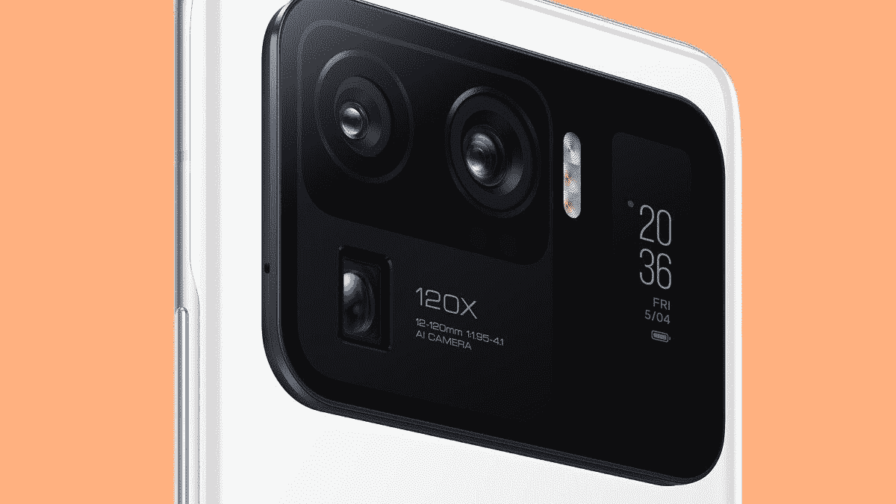

# 小米 11 超:规格，功能，价格和可用性！

> 原文：<https://www.xda-developers.com/xiaomi-mi-11-ultra/>

继去年年底在中国首次亮相之后，小米上个月已经在欧洲发布了小米 11。然而，我们仍然在等待小米更优质的 Mi 11 Ultra，自一个多月前[泄露以来，我们一直在期待它。小米今天终于完整地展示了这款手机，正如预期的那样，它采用了新的三摄像头阵列，高分辨率显示屏，快速有线和无线充电，以及高通最新的旗舰芯片组。](https://www.xda-developers.com/xiaomi-11-ultra-leak-120x-zoom-secondary-screen/)

## 小米 Mi 11 Ultra:设计、规格和功能

小米 Mi 11 Ultra 是一款厚重的手机，高 164.3 毫米，厚 8.38 毫米，重 234 克。考虑到它的陶瓷构造、大型相机和昂贵的显示器，这些尺寸是有意义的。说到陶瓷，小米提供了两种配色的 Mi 11 Ultra:陶瓷白和陶瓷黑。这两种型号的正面都有一层康宁的 Gorilla Glass Victus 进行保护，防水和防尘等级为 IP68。小米 11 Ultra 实际上是小米有史以来第一款 IP68 级别的设备，这是他们自豪地吹捧的东西，但却是高端旗舰手机的标准。

小米的 Mi 11 Ultra 与非 Ultra 型号的[有一些相似之处，如 6.81 英寸 120Hz 四核高清+分辨率显示屏，120Hz 刷新率，高通骁龙 888 芯片组，通过集成的骁龙 X60 调制解调器的 5G 连接，以及一个显示下指纹传感器。然而，存储和 RAM 得到了升级——只有一种配置，256GB 的存储容量和 12GB 的 RAM。似乎没有 microSD 卡插槽，所以你只能得到 256GB。此外，Ultra 现在根据地区支持](https://www.xda-developers.com/xiaomi-mi-11-launched-europe/) [Wi-Fi 6E](https://www.xda-developers.com/tag/wifi-6e/) 连接。

**[小米 Mi 11 Ultra 论坛](https://forum.xda-developers.com/f/xiaomi-mi-11-ultra.12139/)**

另一个不同于标准 Mi 11 的变化是后置摄像头阵列，它要大得多，并具有不同的传感器设置。你会得到一个 50MP 主传感器和三星新的 [ISOCELL GN2](https://www.xda-developers.com/samsung-isocell-gn2-50mp-sensor-faster-autofocus-better-low-light-performance/) 图像传感器，一个 48MP 超宽和一个 48MP 长焦。长焦支持 5 倍光学变焦、10 倍混合变焦和 120 倍数码变焦。与 [Galaxy S21 Ultra](https://www.xda-developers.com/samsung-galaxy-s21-ultra-preview-five-takeaways/) 的长焦镜头相比，这是一个进步，后者提供 10 倍光学变焦和 100 倍数码变焦，但比标准的 Mi 11 变焦好得多。

 <picture></picture> 

Xiaomi Mi 11 Ultra camera array with rear display

后置摄像头 bump 还包含 1.1 英寸 AMOLED 屏幕，分辨率为 126 x 294。小米表示，它可以用来用后置摄像头自拍，充当永远在线的显示器，等等。早期的泄露显示，屏幕基本上可以反映手机主显示屏上的任何内容，尽管在手指大小的屏幕上观看 YouTube 或查看电子邮件可能并不理想。

这不是我们第一次看到带有后置显示屏的智能手机拍照了——[Vivo NEX 在 2018 年有一个大得多的后置显示屏](https://www.xda-developers.com/vivo-nex-dual-display-edition/)，2019 年的 [Nubia Z20 也是如此](https://www.xda-developers.com/nubia-z20-dual-screen-hands-on/)。最近，[华硕 ROG 手机 5 Pro 和旗舰版](https://www.xda-developers.com/asus-rog-phone-5/)的背面中央有一个小屏幕，但那个是点阵显示屏，只能显示文本和简单的标志。

小米还在 Mi 11 Ultra 中加入了一些我们迄今为止见过的最快的充电技术。该设备配备了容量为 5,000mAh 的硅氧阳极电池。它应该可以轻松持续一整天，但你也可以获得 67W 的有线和无线充电，小米表示可以在 36 分钟内充满电池。这比一加 9 Pro 略快，后者使用附带的电源适配器可以以 65 瓦的速度充电，或使用一加专有的无线充电器以同样的速度充电。手机还有 10W 反向无线充电。

| 

规格

 | 

小米 Mi 11 Ultra

 |
| --- | --- |
| **构建** | 

*   颜色:陶瓷白和陶瓷黑
*   防护:康宁大猩猩 Victus(正面)，陶瓷(背面)，防水防尘等级 IP68

 |
| **尺寸&重量** | 164.3 毫米 x 74.6mm 毫米 x 8.38mm 毫米，234 克 |
| **显示** | 

*   主要的
    *   6.81 英寸 AMOLED 四曲面点显示器
    *   WQHD+分辨率(3200 x 1440)，20:9 宽高比，515 ppi
    *   120Hz 刷新率；自适应同步:30/60/90/120 赫兹
    *   480Hz 触摸采样率
    *   1700 尼特峰值亮度(带 HBM 和 100% APL)
    *   杜比视界，HDR10+
    *   360°环境光传感器，阳光模式 3.0，阅读模式 3.0
*   后面的
    *   1.1 英寸 AMOLED 屏幕
    *   126 x 294 分辨率，450 尼特峰值亮度
    *   始终显示、通知提醒、自拍预览
    *   超级省电模式

 |
| **SoC** | 

*   高通骁龙 888
    *   中央处理器
        *   1x ARM Cortex-X1 @ 2.84GHz
        *   3 个 ARM Cortex-A78 @ 2.4GHz
        *   4x ARM Cortex-A55 @ 1.8GHz
    *   GPU: Adreno 660
    *   三星的 5 纳米(5 英寸)制造工艺
*   三相冷却技术

 |
| **风筒&储存** | 

*   8GB LPDDR5 内存+ 256GB UFS 3.1 存储
*   12GB LPDDR5 内存+ 256GB UFS 3.1 存储
*   16GB LPDDR5 内存+ 256GB UFS 3.1 存储

 |
| **电池&充电** | 

*   5000 毫安时电池
*   67W 有线涡轮增压
*   67W 无线涡轮充电
*   10W 反向充电

 |
| **安全** | 

*   屏幕指纹识别器
*   AI 人脸解锁

 |
| **后置摄像头** | 

*   **主要:**
    *   50MP 三星 ISOCELL GN2，f/1.95，85 ̊视场角，1/1.12 英寸传感器尺寸，1.4μm 4 合 1 至 2.8μm，8P 镜头
    *   OIS，dToF 激光聚焦
    *   双像素专业版，双原生 ISO 融合，交错 HDR
*   **超宽:**
    *   48MP，f/2.2，128 FOV，1/2.0 英寸传感器尺寸，0.8μm 4 合 1 至 1.6μm，7P 镜头
    *   PDAF
    *   微距拍摄
*   **长焦:**
    *   48MP，f/4.1，1/2.0 英寸传感器尺寸，0.8μm 4 合 1 至 1.6μm
    *   5 倍光学变焦、10 倍混合变焦、120 倍数码变焦
    *   PDAF OIS
*   **视频:**所有 3 个摄像机的 8K 视频记录和夜间模式

 |
| **前置摄像头** | 20MP，f/2.2，78 FOV，0.8μm 4 合 1 至 1.6μm，定焦 |
| **端口** | 

*   USB 类型-C
*   没有 3.5 毫米耳机插孔

 |
| **音频&振动** | 

*   双扬声器
*   哈蒙·卡顿的声音
*   高分辨率音频认证
*   x 轴线性振动电机

 |
| **连通性** | 

*   高通骁龙 X60 4G LTE 和 5G 集成调制解调器
    *   5G:n1/n3/n5/n7/n8/n20/n28/n38/n40/n41/n77/n78/n79
    *   4G:LTE FDD:B1/2/3/4/5/7/8/12/17/20/28/32/66
    *   4G: LTE TDD: B38/40/41/42
    *   3G: WCDMA: B1/2/4/5/8
    *   2G: GSM: 850 900 1800 1900 MHz
*   双 SIM 卡，双 5G 待机
*   蓝牙 5.2
*   Wi-Fi 6E
*   NFC 和红外增强器

 |
| **软件** | 基于 Android 11 的 MIUI 12 |

## 定价和可用性

小米已经宣布，小米 11 Ultra 在中国的价格为 8/256GB 型号 5599 元起，12/256GB 型号 5999 元起，16+256GB 型号 6999 元起。在欧洲，12/256GB 版本将花费€1200 英镑。

除了 Mi 11 Ultra，小米还发布了 [Mi 11i](https://www.xda-developers.com/xiaomi-mi-11i/) 、 [Mi 11 Lite](https://www.xda-developers.com/xiaomi-mi-11-lite/) 系列、 [Mi Band 6](https://www.xda-developers.com/xiaomi-mi-band-6/) 和[两款无线充电配件](https://www.xda-developers.com/xiaomi-80w-wireless-charger-airpower-clone/)。