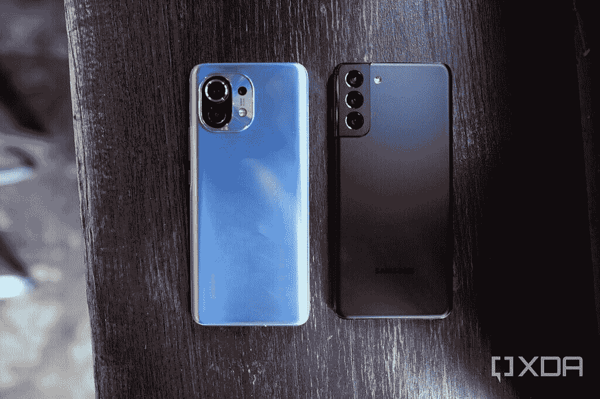
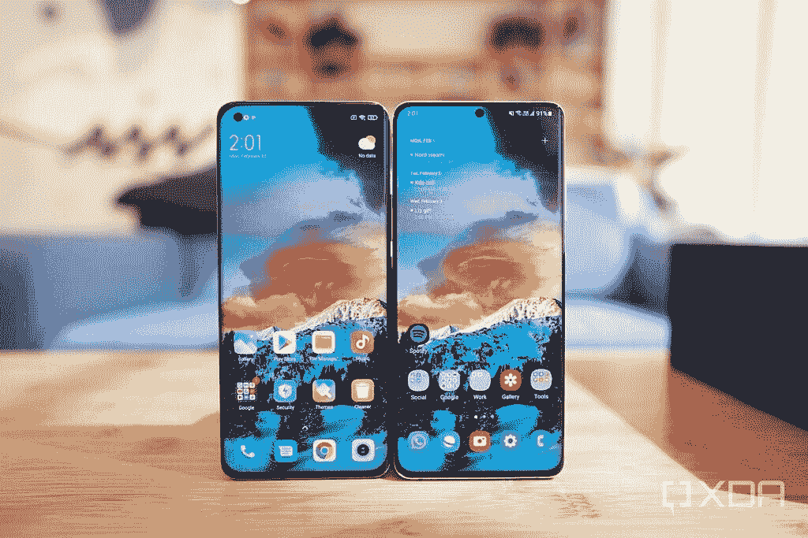

# 小米 Mi 11 比三星 Galaxy S21 更值得购买

> 原文：<https://www.xda-developers.com/xiaomi-mi-11-versus-galaxy-s21/>

小米刚刚在欧洲推出了它的 Mi 11 旗舰，过去四天我一直在测试欧洲/国际单元。在将我的 SIM 卡放入小米的最新产品之前，我一直在对三星 Galaxy S21 系列进行广泛的测试。因此，当我收到小米的新手机时，我打算回答的问题是:小米 Mi 11 与三星的旗舰产品相比如何，特别是 Galaxy S21(另外还有 S21 Plus)？

我认为将小米 Mi 11 与 Galaxy S21 Ultra 进行比较是不公平的，因为后者是[三星的绝对顶级溢价产品](https://www.xda-developers.com/samsung-galaxy-s21-ultra-preview-five-takeaways/)，其定价反映了这一点。在撰写本文时，我不知道每个 Mi 11 变体在所有市场的确切价格，但我们被告知，8GB + 128GB 变体的起价为€749。这意味着对于欧洲的消费者来说，小米 11 的价格低于三星 Galaxy S21。

## 小米 Mi 11 对比三星 Galaxy S21:规格

| 

规格

 | 

小米米 11

 | 

三星 Galaxy S21

 |
| --- | --- | --- |
| **打造** | 

*   金属中框
*   前面是康宁大猩猩玻璃 Victus
*   玻璃背面

 | 

*   铝制中框
*   塑料背面
*   大猩猩玻璃 Victus 正面

 |
| **尺寸&重量** | 

*   磨砂玻璃:
    *   164.3 x 74.6 x 8.06 毫米
    *   196 克
*   纯素皮革:
    *   164.3 x 74.6 x 8.56mm 毫米
    *   194 克

 | 

*   151.7 x 71.2 x 7.9 毫米
*   171 克

 |
| **显示** | 

*   6.81 英寸 QHD+ AMOLED 显示屏
*   120 赫兹刷新率
*   480Hz 触摸响应速率
*   515 ppi 像素密度
*   1500 尼特峰值亮度
*   10 位颜色
*   HDR10+
*   穿孔显示器
*   四曲线的

 | 

*   6.2 英寸 FHD+动态 AMOLED 2X 平板显示器
*   2400 x 1080 像素
*   421 PPI
*   120Hz 可变刷新率
*   20:9 宽高比
*   HDR10+
*   1300 尼特峰值亮度
*   始终显示
*   无限显示

 |
| **SoC** | 高通骁龙 888:

*   1 个 Kryo 680 Prime 内核@ 2.84GHz
*   3 个 Kryo 680 性能内核@ 2.4GHz
*   4 个 Kryo 680 高效内核@ 1.8GHz

肾上腺素 660 | 

*   **国际:** Exynos 2100:
    *   1x ARM Cortex X1 @ 2.9GHz +
    *   3 个 ARM Cortex A78 内核，2.8GHz 以上
    *   4 个 ARM Cortex A55 内核@ 2.2GHz
*   **美国/香港:**高通骁龙 888:
    *   1 个 Kryo 680 Prime 内核@ 2.84GHz
    *   3 个 Kryo 680 性能内核@ 2.4GHz
    *   4 个 Kryo 680 高效内核@ 1.8GHz

 |
| **闸板&存放** | 

*   8GB LPDDR5 + 128GB UFS 3.1
*   8GB LPDDR5 + 256GB UFS 3.1
*   12GB LPDDR5 + 256GB UFS 3.1

 | 

*   8GB LPDDR5 + 128GB UFS 3.1
*   8GB LPDDR5 + 256GB UFS 3.1

 |
| **电池&充电** | 

*   4600 毫安时
*   55W 有线快充
*   50W 无线快速充电
*   10W 反向无线充电
*   含 55W GaN 充电器

 | 

*   4000 毫安时
*   25W USB 供电 3.0 快充
*   15W 无线充电
*   4.5 反向无线充电
*   在大多数地区，包装盒中没有充电器

 |
| **安全** | 显示器内光学指纹传感器 | 超声波显示指纹扫描仪 |
| **后置摄像头** | 

*   **初选:** 108MP，1/1.33”传感器，f/1.85，1.6 米，OIS
*   **次要:** 13MP，f/2.4，123 FoV，广角传感器
*   **三级:** 5MP，f/2.4，自动对焦，微距

视频: | 

*   **主:** 12MP，广角镜头，f/1.8，1/1.76”，1.8 m，OIS，双像素自动对焦
*   **次要:** 12MP，超广角镜头，f/2.2，120 FoV，1/2.55”，1.4 m，定焦
*   **第三:** 64MP，长焦镜头，f/2.0，1/1.76”，0.8 米，OIS PDAF

 |
| **前置摄像头** | 20MP，f/2.4 | 10MP，f/2.2，1.22 m，80 FoV，双像素自动对焦 |
| **端口** | USB 3.2 类型 C | USB 3.2 类型 C |
| **音频** | 哈曼卡顿调音的立体声扬声器 | 

*   由 AKG 调音的立体声扬声器
*   杜比大气

 |
| **连通性** | 

*   蓝牙 5.1
*   国家足球联盟
*   无线网络 6
*   5G 低于 6GHz
*   红外线增强器

 | 

*   蓝牙 5.1
*   国家足球联盟
*   无线网络 6
*   5G 低于 6GHz 和毫米波

 |
| **软件** | 基于 Android 11 的 MIUI 12.0 | 基于 Android 11 的三星 One UI 3.1 |
| **其他特性** | 使用两个蓝牙设备同时共享音频 | 

*   IP68 防水等级
*   三星 DeX
*   三星 Knox

 |

## 设计和硬件:小米感觉更高端

小米 Mi 11 是一款典型的时尚玻璃铝三明治，配有 6.8 英寸、120Hz 的 AMOLED 屏幕。虽然小米的显示面板没有 Galaxy S21 系列的智能可变刷新率，但其 3，200 x 1，440 分辨率(WQHD+)面板优于 Galaxy S21 和 S21 Plus 的 2，400 x 1，080 面板。老实说，我认为在小一点的手机屏幕上，1080p 对人眼来说绰绰有余，所以如果我必须选择一个赢家，我会说 Galaxy S21 的可变刷新率比 Mi 11 的“更多像素”更重要

 <picture></picture> 

Mi 11 and S21 Plus

尽管如此，小米 Mi 11 的屏幕*还是很牛逼的*。它四面弯曲(像华为 P40 Pro 一样)，具有 480Hz 的触摸采样率和 5，000，000:1 的色彩对比度，并支持 HDR 10+。我把小米 11 和三星 Galaxy S21 Ultra(大狗手机)并排放在一起，两个屏幕在我看来都一样华丽。

 <picture></picture> 

Mi 11 and S21 Ultra

Galaxy S21 和 S21 Plus 外观相同，但尺寸和背面材料不同。标准的 Galaxy S21 使用塑料背面(S21 Plus 保持玻璃背面)。三星做得很好，让塑料看起来不像塑料，这并不重要，事实是，使用塑料的决定是三星削减成本的措施，所以如果我们将小米 Mi 11 与标准的 Galaxy S21 进行比较，一款手机显然更高端。Galaxy S21 Plus 在手感和构造方面比小米 Mi 11 好得多。

 <picture></picture> 

The Galaxy S21 and the Mi 11

在内部，小米 Mi 11 由高通的骁龙 888 驱动，而 Galaxy S21 系列使用高通的 SoC 或三星自己的 Exynos 2100。我测试的所有 Galaxy S21 手机都是骁龙版本，所以我不知道 Exynos 2100 与骁龙 888 相比如何。但普遍的共识似乎是支持高通的 SoC。如果是这样的话，那么小米 Mi 11 在欧洲和东南亚具有 SoC 优势，三星在这些地区发运 Exynos 驱动的设备。

Galaxy S21 Plus 在手感方面比 S21 好得多

Galaxy S21 手机的防水和防尘等级均为 IP68，而小米的 Mi 11 没有官方评级。然而，小米赢得了扬声器之战:其立体声扬声器由哈曼/卡顿(恰巧是三星的子公司)微调，比任何 S21 手机都发出明显更饱满、更响亮、更有活力的音频。

谈到电池，Galaxy S21 Plus 和 S21 分别配备了 4，800 mAh 和 4，000 mAh 的电池，而小米 Mi 11 的电池容量为 4，600 mAh，但小米的电池可以以 55 瓦的有线或 50 瓦的无线速度充电，而三星的充电速度在 25 瓦的有线和 15 瓦的无线速度下感觉很普通。此外，与其在中国的决定相反，小米决定在其国际包装中包括一个 55W 的充电砖；[三星没有](https://www.xda-developers.com/best-galaxy-s21-fast-chargers/)。

## 相机:交易打击

小米 Mi 11 的相机系统包括一个 108MP 传感器，具有 1/1.33 英寸的大传感器尺寸，以及一个 13MP 超广角相机和一个 5MP 宏观传感器。Galaxy S21 和 S21 Plus 拥有相同的相机系统:12MP 主相机、12MP 超宽相机和 64MP 长焦相机。

对于静态照片，如果我在手机屏幕上或社交媒体上查看图像，小米 Mi 11 的照片看起来与 Galaxy S21 的照片非常相似。

然而，如果我在电脑显示器上将图像放大到全尺寸和像素，小米的照片会更清晰，这要归功于小米 11 的 108MP 摄像头像素仓，可拍摄 2700 万像素的照片，而 Galaxy S21 手机只使用了一年多前的普通 12MP 传感器。

 <picture></picture> 

100% cropped shots, Mi 11 (left), S21 (right).

对于日落后的照片，脚本会翻转:如果我只是在手机屏幕上观看，小米 Mi 11 的拍摄效果与 Galaxy S21 的相比非常好，但一旦我进行像素窥视，S21 的夜间拍摄往往会更清晰，动态范围略好，因为照片中的像素越多，你需要的光线就越多。

小米 Mi 11 和 Galaxy S21/S21 Plus 的超广角相机很坚固，但不在华为 Mate 40 Pro 甚至一加 8 Pro 的 48MP 镜头等最佳超广角相机的水平上。如果你放大，细节有点软，动态范围没有他们的主相机好。

变焦是小米和三星决定妥协的地方，以便都满足 1000 美元以下的价格点。Galaxy S21 和 S21 Plus 所谓的长焦镜头与 Galaxy S21 Ultra 中看到的潜望式系统相差甚远；小米的 Mi 11 完全跳过了变焦镜头，而是通过 108MP 传感器依赖数字作物。

两款手机的变焦效果都不错——当然比大多数 iPhone 变焦好——但无法与 Galaxy S21 Ultra 或顶级华为手机相媲美。下面是一系列 10x 样品。小米 Mi 11 的照片细节略好，但 Galaxy S21 的颜色更好。

小米米 11 和 Galaxy S21 或 S21 Plus 的视频性能都非常好。这三款手机都可以以高达 8K 的分辨率拍摄，并产生高达 4K/30fps 的真正稳定的镜头。小米 11 今年新增了一系列“电影效果”拍摄模式，这些模式基本上都是预设的视频效果，用户可以在相机应用程序中启用。其中一些非常有趣，包括类似于“平行世界”模式的*盗梦空间*。我也是小米“克隆”模式的超级粉丝，这种模式可以将同一个人多次叠加到一张照片或视频中，结果相当有说服力(也很好玩)。

就我个人而言，我觉得小米 11 更有意思，可以用来玩视频。

## 软件:干净、灵活、充满快捷手势

小米和三星的手机都运行 Android 11 的皮肤版本，分别是 MIUI 12.0.1 Global(用于 Mi 11)和 [One UI 3.1](https://www.xda-developers.com/samsung-one-ui-3-1-features-changes/) (用于 Galaxy S21 系列)。MIUI 有一个更有趣的触摸，包括一些小软件，如卸载时应用程序“爆炸”，以及手机的存储容量由一杯水表示，随着方向流动。One UI 更具商业气息，但如果你愿意深入研究，它确实提供了大量的定制选项。

然而，撇开审美不谈，它们的行为非常相似。由于这是面向中国以外受众的国际版 MIUI，它内置了谷歌支持，包括作为默认语音助手的谷歌助手。甚至还有一个应用托盘，这是小米手机多年前就没有的。

MIUI 12 和 One UI 3.1 都充满了增加 Android 体验的手势快捷方式，例如可以在浮动窗口中打开大多数应用程序，或者双击屏幕来打开或关闭显示。

事实上，小米的 Mi 11 比我测试过的大多数手机都集成了更多的快捷手势，包括通过双击设备背面或用指关节敲击屏幕来启动应用程序或快捷方式(如打开手电筒或打开二维码扫描仪)。

然而，MIUI 12 有一个恼人的问题已经存在了几年:只有当用户使用屏幕上的软件按钮而不是滑动手势导航时，才能激活单手模式。

最后，在软件支持方面，这是三星击败小米的一个领域。三星已经承诺[发布三代 Android 操作系统更新](https://www.xda-developers.com/samsung-3-years-android-os-updates-galaxy-note-20/)，而小米仍然为其旗舰手机提供标准的两年支持。

## 性能和电池寿命:两者都不缺电

由于我测试的小米 Mi 11 和 Galaxy S21 运行在高通的骁龙 888 上，我看不到性能上的差异。然而，在我看来，Mi 11 感觉“更快”，尽管这只是一种错觉——小米的 MIUI 动画只是跑得更快。在我看来，Mi 11 上的 120Hz 感觉比 Galaxy S21 手机上的 120Hz 略快/更快，包括 Ultra。

然而，这只是我的看法。在一个更客观的比较中，我发现 Galaxy S21 和 S21 Plus 的电池续航时间远远超过小米 Mi 11，因为前者的屏幕像素密度较低，可以根据内容调整刷新率，而对于 Mi 11，我的手机大部分时间都在 120Hz 和 WQHD+分辨率下运行。

事实上，电池寿命可能是 Mi 11 的一个问题，因为在我拥有这款手机的日子里，没有一天它能够在没有充电器的情况下持续超过 11 个小时。Galaxy S21 和 S21 Plus 可以轻松地持续一整天 14 个小时。

## 结论:这些手机都不是真正的高端旗舰，但有一个更接近

移动领域最近确立的一个趋势是，有旗舰手机，然后有高端旗舰手机。前者通常已经拥有最新的 SoC、漂亮的屏幕和功能强大的摄像头，但后者只是拥有那些额外的花里胡哨和所有前沿组件。

没有人会把塑料背面的 1080p 平板手机混淆为高端旗舰手机

小米 Mi 11 处于一个有趣的位置，因为它的大部分组件，从 120Hz WQHD+屏幕到 108MP 摄像头，再到弯曲的铝合金机身，都使它处于高端旗舰级，但它缺乏变焦镜头，使它无法成为旗舰级。这是一款打着高端旗舰地位的手机，但最终略低于这一地位。

三星的非 Ultra S21 手机，特别是标准的 Galaxy S21，更牢固地确立了它们的地位:没有人会将塑料背面的 1080p 平板手机混淆为高端旗舰手机。换句话说，小米 Mi 11 比 Galaxy S21 或 S21 Plus 略高，但价格却比二者都低。

**[三星 Galaxy S21 论坛](https://forum.xda-developers.com/c/samsung-galaxy-s21.11933/)**| | |**|[三星 Galaxy S21+论坛](https://forum.xda-developers.com/f/samsung-galaxy-s21.12089/)|**| |**|[三星 Galaxy S21 超论坛](https://forum.xda-developers.com/f/samsung-galaxy-s21-ultra.12091/)**

**[小米 Mi 11 论坛](https://forum.xda-developers.com/f/xiaomi-mi-11.12057/)**

如果你生活在小米手机正式销售的地区(北美以外的大部分地区)，那么小米 Mi 11 可能比标准的 Galaxy S21 和 S21 Plus 更划算。如果你有更多的钱花，想要一些更高级的东西，那么你最好的选择是 Galaxy S21 Ultra。然而，传言暗示小米将推出一款米 11 Pro，并可能推出米 11 Pro+(或米 11 Ultra？)在不久的将来，所以可能值得等待一段时间，看看商店里有什么。

### 小米米 11

凭借 Mi 11，小米再次以极具竞争力的价格提供了旗舰硬件的出色组合。

**Affiliate Links**

Mi

[View at Mi](https://www.mi.com/uk/index.html)

### 三星 Galaxy S21

虽然 Galaxy S21 没有 S21 Ultra 提供的所有功能，但它仍然是一款具有旗舰级硬件的引人注目的智能手机。

**Affiliate Links**

Samsung

[View at Samsung](https://shop-links.co/link/?exclusive=1&publisher_slug=xda&article_name=The+Xiaomi+Mi+11+is+a+better+buy+than+the+Samsung+Galaxy+S21&article_url=https%3A%2F%2Fwww.xda-developers.com%2Fxiaomi-mi-11-versus-galaxy-s21%2F&u1=UUxdaUeUpU900&url=https%3A%2F%2Fwww.samsung.com%2Fus%2Fsmartphones%2Fgalaxy-s21-5g%2Fbuy%2F)