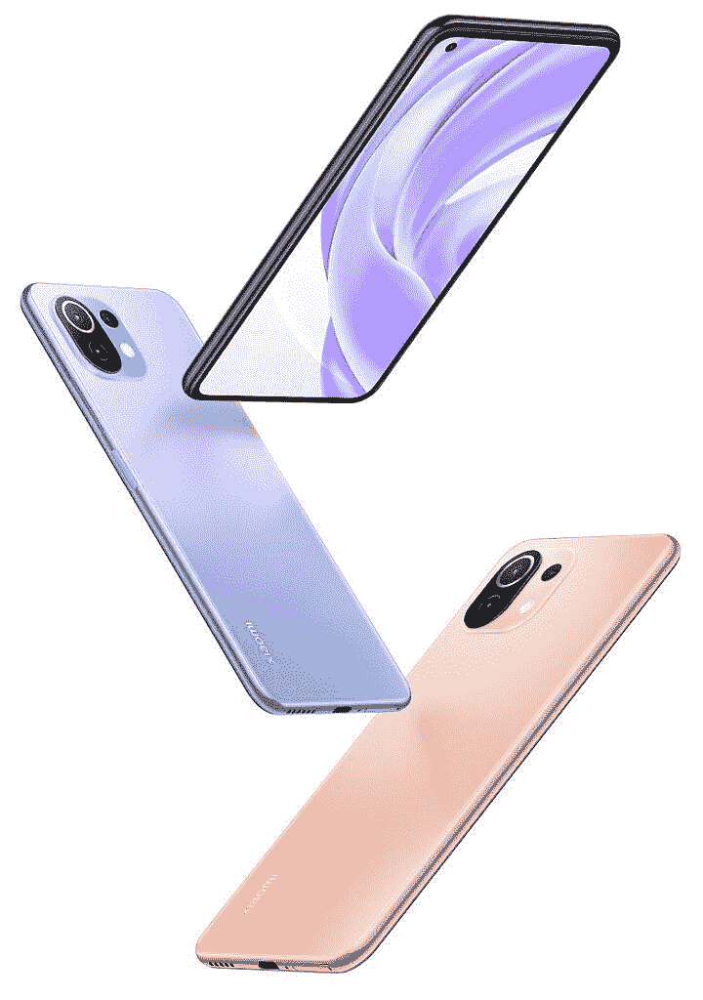
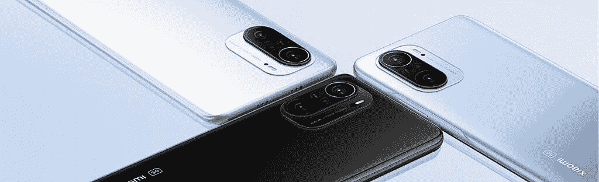
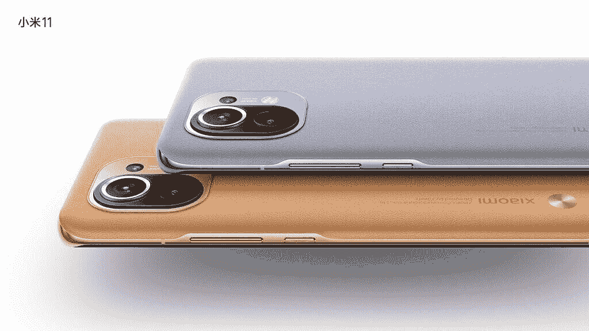
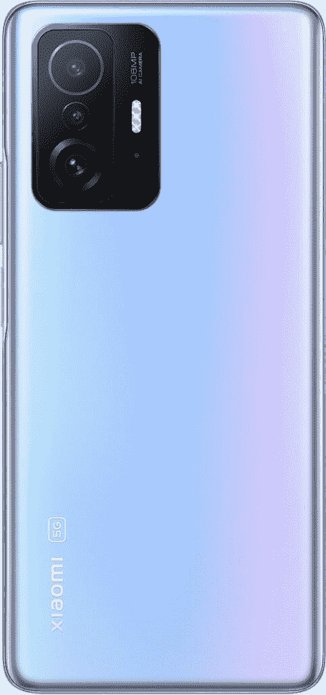
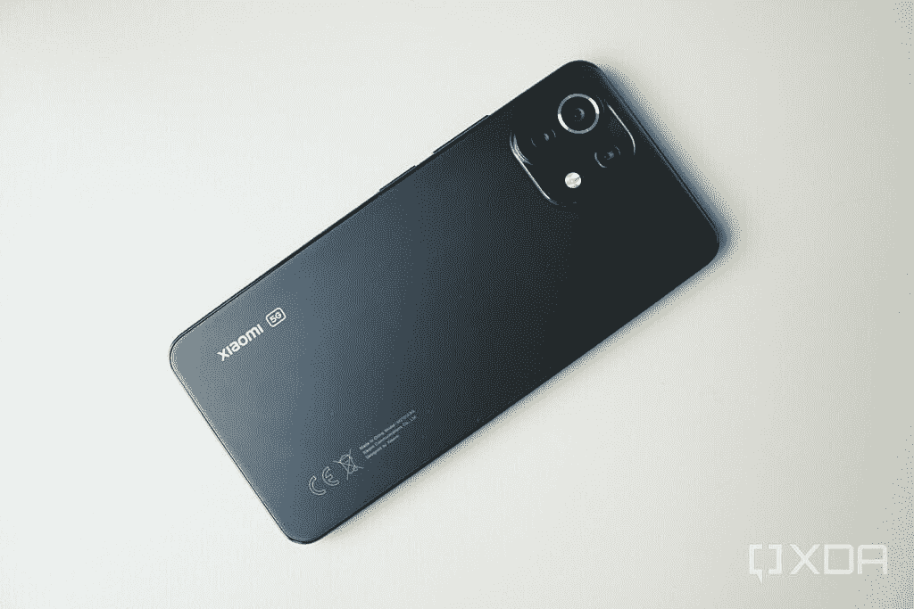
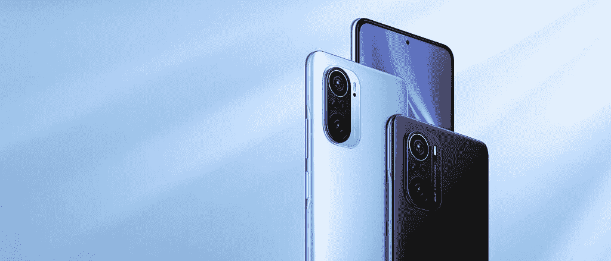
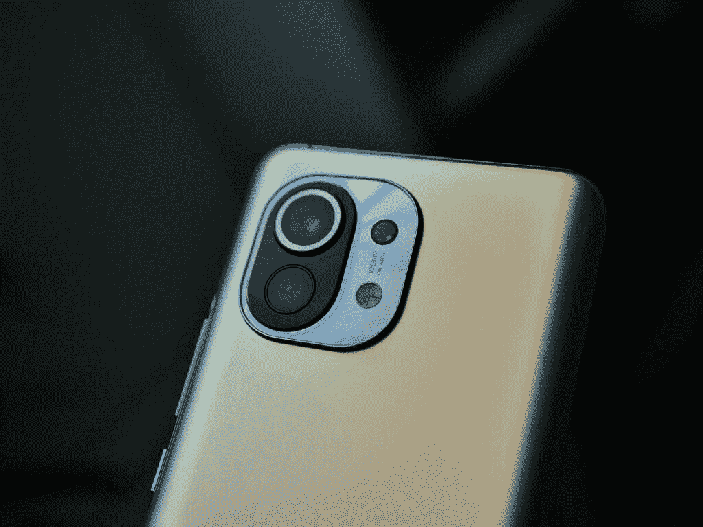
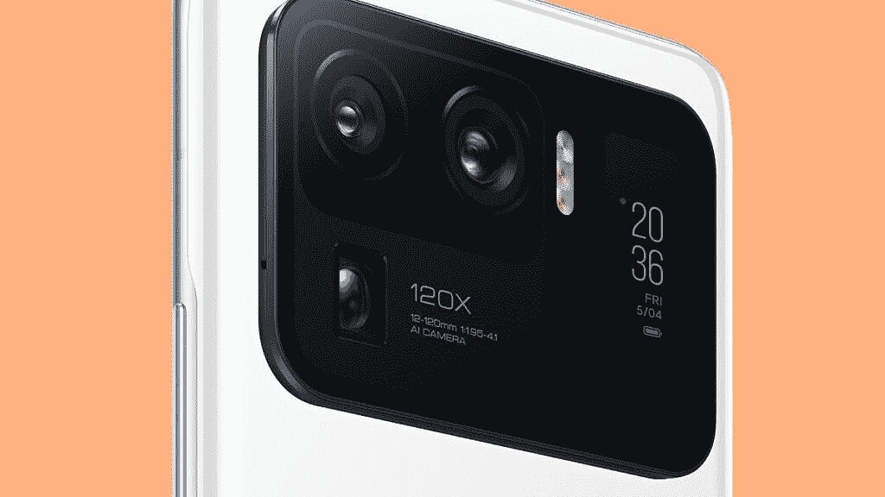

# 小米 11 系列:规格，定价，可用性，销售，新闻，等等

> 原文：<https://www.xda-developers.com/xiaomi-mi-11/>

在高通正式发布骁龙 888 的前一天，该公司[公布了旗舰 SoC](https://www.xda-developers.com/qualcomm-teases-snapdragon-888-confirms-14-oems-smartphones/) 的部分细节，并确认了将推出采用新处理器的设备的 14 家原始设备制造商的名称。小米是名单上的制造商之一，[该公司在高通发布会的第二天就取笑了](https://www.xda-developers.com/xiaomi-oppo-realme-launch-details-snapdragon-888/)小米 11。几周之后，中国 OEM 厂商透露将在年底前推出 Mi 11，使其成为[第一款采用高通最新旗舰芯片](https://www.xda-developers.com/xiaomi-mi-11-launches-december-28th-first-phone-snapdragon-888/)的设备。正如承诺的那样，小米[于 12 月 28 日在中国揭开了](https://www.xda-developers.com/xiaomi-mi-11-flagship-5g-launch-china-qualcomm-snapdragon-888/)小米 11 的外壳，让我们第一次看到了它的设计、规格和独特功能。在推出香草米 11 几个月后，小米在米 11 阵容中又增加了五款设备——米 11 Lite 4G、米 11 Lite 5G、米 11i、米 11 Pro 和米 11 Ultra。这里有你需要知道的关于小米广泛的米 11 阵容的一切。

**浏览此页面:**

## Mi 11 系列—普通版、精简版、专业版、超级版和其他版本

小米在去年年底推出香草机型时首次推出了小米 11 系列。该公司随后在今年 3 月向产品线添加了 5 款新设备。米 11 阵容现在由六款设备组成，包括价格实惠的米 11 Lite 4G 和米 11 Lite 5G，中端的米 11i，旗舰的米 11 和米 11 Pro，以及顶级的米 11 Ultra。此外，该系列还包括另外两款设备——Mi 11X 和 Mi 11X Pro——这两款设备被更名为 Redmi K40 系列手机。

Mi 11 Lite 设备包含骁龙 700 系列 SOC，它们以相当实惠的价格提供了一些高级功能。中端的 Mi 11i 是今年早些时候在中国推出的 Redmi K40 Pro+的更名版本。它采用了高通的旗舰产品骁龙 888 芯片，因此它属于旗舰杀手领域。该设备以相对实惠的价格提供了大量的高级功能选择。

小米 11 和小米 11 Pro 是成熟的旗舰产品，不仅采用了骁龙 888 芯片，还提供了现代安卓旗舰产品的所有功能。最后，顶级的 Mi 11 Ultra 是小米对三星 Galaxy S21 Ultra 的回应，具有金钱可以买到的最好的硬件。它提供了一个出色的摄像系统和一个独特的辅助显示器。

正如在[之前的泄露](https://www.xda-developers.com/redmi-k40-k40-pro-india-mi-11x-11x-pro-skipping-poco-f3-rebranding/)中看到的，小米也在印度推出了 Mi 11 旗下的两款 Redmi K40 系列设备。这些手机名为小米 Mi 11X 和 Mi 11X Pro，与今年早些时候在中国推出的 Redmi K40 和 Redmi K40 Pro+完全相同。

继推出米 11X 和米 11X Pro 之后，小米在米 11 系列中又增加了两款设备。然而，由于该公司现在已经正式放弃了 Mi 品牌，这些设备被称为小米 11T 和小米 11T Pro。虽然这些手机没有 Mi 品牌，但它们是 Mi 11 和 Mi 11 Pro 的继任者。因此，它们具有顶级的硬件。

## 小米米 11 系列:规格

| 

规格

 | 

小米米 11 Lite 4G/米 11 Lite 5G

 | 

小米米 11

 | 

小米 Mi 11i

 | 

小米 Mi 11 Pro

 | 

小米 Mi 11 Ultra

 | 

小米 Mi 11X

 | 

小米 Mi 11X Pro

 |
| --- | --- | --- | --- | --- | --- | --- | --- |
| **建造** | 

*   **4G:**
    *   康宁大猩猩玻璃 5 背面

*   **5G:**
    *   康宁大猩猩玻璃 6 背面

 | 

*   金属中框
*   前面是康宁大猩猩玻璃 Victus
*   大猩猩玻璃 5 背面

 | 

*   金属中框
*   大猩猩玻璃 5 背面

 | 不适用的 | 

*   金属中框
*   前面是康宁大猩猩玻璃 Victus
*   陶瓷背面

 | 

*   正面和背面的康宁大猩猩玻璃 5

 | 

*   正面和背面的康宁大猩猩玻璃 5

 |
| **尺寸&重量** | 

*   **4G:**
    *   160.53 x 75.72 x 6.81mm 毫米
    *   157 克

*   **5G:**
    *   160.53 x 75.72 x 6.81mm 毫米
    *   159 克

 | 

*   磨砂玻璃:
    *   164.3 x 74.6 x 8.06mm 毫米
    *   196 克

*   纯素皮革:
    *   164.3 x 74.6 x 8.56mm 毫米
    *   194 克

 | 

*   163.7 x 76.4 x 7.8mm 毫米
*   196 克

 | 不适用的 | 

*   163.7 x 76.4 x 7.8mm 毫米
*   196 克

 | 

*   163.7 x 76.4 x 7.8mm 毫米
*   196 克

 | 

*   163.7 x 76.4 x 7.8mm 毫米
*   196 克

 |
| **显示** | 

*   6.55 英寸 FHD+ AMOLED 显示屏(2400 x 1080p)
*   90Hz 刷新率
*   240Hz 触摸采样率
*   10 位颜色
*   HDR10+
*   穿孔显示器

 | 

*   6.81 英寸 QHD+ AMOLED 显示屏
*   120 赫兹刷新率
*   480Hz 触摸响应速率
*   515 PPI 像素密度
*   1500 尼特峰值亮度
*   10 位颜色
*   HDR10+
*   穿孔显示器
*   四曲线的

 | 

*   6.67 英寸 FHD+ AMOLED 显示屏
*   120 赫兹刷新率
*   360Hz 触摸响应速率
*   1300 尼特峰值亮度
*   10 位颜色
*   HDR10+
*   MEMC

 | 

*   6.81 英寸 QHD+ AMOLED 显示屏
*   120 赫兹刷新率
*   480Hz 触摸响应速率
*   515 PPI 像素密度
*   1700 尼特峰值亮度
*   10 位颜色
*   HDR10+，杜比视界
*   穿孔显示器
*   四曲线的

 | 

*   主要:
    *   6.81 英寸 QHD+ AMOLED 显示屏
    *   120 赫兹刷新率
    *   480Hz 触摸响应速率
    *   515 PPI 像素密度
    *   1700 尼特峰值亮度
    *   10 位颜色
    *   HDR10+，杜比视界
    *   穿孔显示器
    *   四曲线的

*   后部:
    *   1.1 英寸 AMOLED 屏幕
    *   126 x 294 分辨率，450 尼特峰值亮度
    *   始终显示、通知提醒、自拍预览

 | 

*   6.67 英寸 AMOLED 显示屏
*   FHD+ (2400 x 1080 像素)
*   120 赫兹刷新率
*   360Hz 触摸采样率
*   1300 尼特峰值亮度，900 尼特典型亮度
*   大猩猩玻璃 5
*   原彩显示
*   5000000:1 对比度
*   HDR10+
*   MEMC

 | 

*   6.67 英寸 AMOLED 显示屏
*   FHD+ (2400 x 1080 像素)
*   120 赫兹刷新率
*   360Hz 触摸采样率
*   1300 尼特峰值亮度，900 尼特典型亮度
*   大猩猩玻璃 5
*   原彩显示
*   5000000:1 对比度
*   HDR10+
*   MEMC

 |
| **SoC** | 

*   **4G:** 高通骁龙 732G:
    *   1x ARM Cortex-A76 @ 2.3GHz
    *   1x ARM Cortex-A76 @ 2.2GHz
    *   6x ARM Cortex-A55 @ 1.8GHz
    *   肾上腺素 618

*   **5G:** 高通骁龙 780G:
    *   1x ARM Cortex-A78 @ 2.4GHz
    *   3 个 ARM Cortex-A78 @ 2.2GHz
    *   4x ARM Cortex-A55 @ 1.9GHz
    *   肾上腺素 642

 | 

*   高通骁龙 888:
    *   1 个 Kryo 680 Prime 内核@ 2.84GHz
    *   3 个 Kryo 680 性能内核@ 2.4GHz
    *   4 个 Kryo 680 高效内核@ 1.8GHz

*   肾上腺素 660

 | 

*   高通骁龙 888:
    *   1 个 Kryo 680 Prime 内核@ 2.84GHz
    *   3 个 Kryo 680 性能内核@ 2.4GHz
    *   4 个 Kryo 680 高效内核@ 1.8GHz

*   肾上腺素 660

 | 

*   高通骁龙 888:
    *   1 个 Kryo 680 Prime 内核@ 2.84GHz
    *   3 个 Kryo 680 性能内核@ 2.4GHz
    *   4 个 Kryo 680 高效内核@ 1.8GHz

*   肾上腺素 660

 | 

*   高通骁龙 888:
    *   1 个 Kryo 680 Prime 内核@ 2.84GHz
    *   3 个 Kryo 680 性能内核@ 2.4GHz
    *   4 个 Kryo 680 高效内核@ 1.8GHz

*   肾上腺素 660

 | 

*   高通骁龙 870:
    *   1 个 Kryo 585 主内核@3.2GHz
    *   3 个 Kryo 585 性能内核@ 2.4GHz
    *   4 个 Kryo 385 高效内核@ 1.8GHz

*   Adreno 650 GPU

 | 

*   高通骁龙 888:
    *   1 个 Kryo 680 Prime 内核@ 2.84GHz
    *   3 个 Kryo 680 性能内核@ 2.4GHz
    *   4 个 Kryo 680 高效内核@ 1.8GHz

*   肾上腺素 660

 |
| **风筒&储存** | 

*   **4G:**
    *   6GB LPDDR4x + 64GB UFS 2.2
    *   6GB + 128GB

*   **5G:**
    *   6GB LPDDR4x + 128GB UFS 2.2
    *   8GB + 128GB

 | 

*   8GB LPDDR5 + 128GB UFS 3.1
*   8GB+256GB
*   12GB+256GB

 | 

*   8GB LPDDR5 + 128GB UFS 3.1
*   8GB + 256GB

 | 

*   8GB LPDDR5 + 128GB UFS 3.1
*   8GB + 256GB
*   12GB + 256GB

 | 

*   8GB LPDDR5 + 256GB UFS 3.1
*   12GB + 256GB
*   12GB + 512GB

 | 

*   6GB LPDDR5 + 128GB UFS 3.1
*   8GB + 128GB

 | 

*   8GB LPDDR5 + 128GB UFS 3.1
*   8GB + 256GB

 |
| **电池&充电** | 

*   4，250 毫安时电池
*   33W 快速充电
*   含 33W 快速充电器

 | 

*   4600 毫安时
*   55W 有线快充
*   50W 无线快速充电
*   10W 反向无线充电
*   含 55W GaN 充电器

 | 

*   4520 毫安时
*   33W 快速有线充电
*   含 33W 快速充电器

 | 

*   5000 毫安时
*   67W 有线快速充电
*   67W 无线快速充电
*   10W 反向无线充电

 | 

*   5000 毫安时
*   67W 有线快速充电
*   67W 无线快速充电
*   10W 反向无线充电

 | 

*   4520 毫安时
*   33W 快速有线充电
*   含 33W 快速充电器

 | 

*   4520 毫安时
*   33W 快速有线充电
*   含 33W 快速充电器

 |
| **安全** | 侧装式指纹扫描仪 | 显示器内光学指纹传感器 | 侧装式指纹传感器 | 显示器内光学指纹传感器 | 显示器内光学指纹传感器 | 侧装式指纹传感器 | 侧装式指纹传感器 |
| **后置摄像头** | 

*   **初级:** 64MP，1/1.97”传感器，f/1.79
*   **第二:** 8MP 超宽，1/4″传感器
*   第三代:5MP f/2.4，telemacro

 | 

*   **主要:**108 兆像素，1/1.33 英寸传感器，f/1.85，1.6 米，OIS
*   **次要:** 13MP，f/2.4，123 FoV，广角传感器
*   **三级:** 5MP，f/2.4，AF，telemacro

视频: | 

*   **初选:** 108MP 三星 ISOCELL HM2，f/1.75
*   **辅助:** 8MP 广角传感器，f/2.2，119 FoV
*   **第三级:** 5MP 宏

 | 

*   **主要:** 50MP 三星 ISOCELL GN2，f/1.95，85 ̊视场角，1/1.12 英寸传感器尺寸，1.4μm 4 合 1 至 2.8μm，8P 镜头
*   **次要:**1300 万像素，f/2.4，123 FoV，广角传感器
*   **三级:** 8MP，f/3.4，AF，telemacro

视频: | 

*   **主要:** 50MP 三星 ISOCELL GN2，f/1.95，85 ̊视场角，1/1.12 英寸传感器尺寸，1.4μm 4 合 1 至 2.8μm，8P 镜头
*   **次要:** 48MP 超宽，f/2.2，128 FoV，1/2.0”传感器尺寸，0.8μm 四合一至 1.6μm，7P 镜头
*   **第三:** 48MP 长焦，f/4.1，1/2.0”传感器尺寸，0.8μm 四合一至 1.6μm，5 倍光学变焦，120 倍数码变焦

 | 

*   初选: 48MP IMX 582，f/1.79
*   **次要:** 8MP 超宽摄像头，f/2.2，119 FoV
*   **三级:** 5MP 远距微距相机

 | 

*   **主:** 108MP 三星 HM2，f/1.75 主摄像头
*   **次要:** 8MP 超宽摄像头，f/2.2，119 FoV
*   **三级:** 5MP 远距微距相机

 |
| **前置摄像头** |  | 20MP，f/2.4 | 2000 万 | 20MP，f/2.2 | 20MP，f/2.2 | 20MP，f/2.45 | 20MP，f/2.45 |
| **端口** | USB 类型-C | USB 型 | USB 型 | USB 型 | USB 类型-C | USB 类型-C | USB 类型-C |
| **音频&振动** | 

*   双音频扬声器
*   高分辨率音频认证，高分辨率音频无线认证
*   z 轴直线电机

 | 

*   哈曼卡顿调音的立体声扬声器
*   高分辨率音频认证
*   z 轴直线电机

 | 

*   双扬声器
*   杜比全景声认证
*   高分辨率音频认证
*   z 轴直线电机

 | 

*   哈曼卡顿调音的立体声扬声器
*   高分辨率音频认证
*   z 轴直线电机

 | 

*   哈曼卡顿调音的立体声扬声器
*   高分辨率音频认证
*   z 轴直线电机

 | 

*   立体声扬声器
*   杜比全景声认证
*   高分辨率音频认证

 | 

*   立体声扬声器
*   杜比全景声认证
*   高分辨率音频认证

 |
| **连通性** | 

*   **4G:**
    *   高通骁龙 X15 4G LTE 集成调制解调器
    *   双 SIM 卡
    *   蓝牙 5.1
    *   无线网络 5
    *   NFC 和红外增强器

*   **5G:**
    *   高通骁龙 X53 4G LTE 和 5G 集成调制解调器
    *   双 5G
    *   蓝牙 5.2
    *   无线网络 6
    *   NFC 和红外增强器

 | 

*   高通骁龙 X60 4G LTE 和 5G 集成调制解调器
*   无线网络 6
*   蓝牙 5.2
*   NFC 和红外增强器

 | 

*   高通骁龙 X60 4G LTE 和 5G 集成调制解调器
*   Wi-Fi 6E
*   蓝牙 5.2
*   NFC 和红外增强器

 | 

*   高通骁龙 X60 4G LTE 和 5G 集成调制解调器
*   Wi-Fi 6E
*   蓝牙 5.2
*   NFC 和红外增强器

 | 

*   高通骁龙 X60 4G LTE 和 5G 集成调制解调器
*   Wi-Fi 6E
*   蓝牙 5.2
*   NFC 和红外增强器

 | 

*   高通骁龙 X55 4G LTE 和 5G 调制解调器
*   无线网络 6
*   蓝牙 5.1
*   国家足球联盟
*   GPS、GLONASS、QZSS、NavIC、伽利略、北斗

 | 

*   高通骁龙 X60 4G LTE 和 5G 集成调制解调器
*   Wi-Fi 6E
*   蓝牙 5.2
*   国家足球联盟
*   GPS、GLONASS、QZSS、NavIC、伽利略、北斗

 |
| **软件** | 基于 Android 11 的 MIUI 12 | 基于 Android 11 的 MIUI 12 | 基于 Android 11 的 MIUI 12 | 基于 Android 11 的 MIUI 12 | 基于 Android 11 的 MIUI 12 | 基于 Android 11 的 MIUI 12 | 基于 Android 11 的 MIUI 12 |

* * *

## 小米 11T 系列:规格

| 

规格

 | 

小米 11T

 | 

小米 11T Pro

 |
| --- | --- | --- |
| **建造** | 

*   金属框架
*   康宁大猩猩玻璃 Victus

 | 

*   金属框架
*   康宁大猩猩玻璃 Victus

 |
| **尺寸&重量** | 

*   164.1 毫米 x 76.9mm 毫米 x 8.8mm 毫米
*   203 克

 | 

*   164.1 毫米 x 76.9mm 毫米 x 8.8mm 毫米
*   204 克

 |
| **显示** | 

*   120 赫兹 6.67 英寸 AMOLED
*   FHD+ (2400 x 1080)
*   120 赫兹刷新率
*   高达 480Hz 的触摸采样率
*   显示伴侣 A+
*   长宽比:20:9
*   真实显示
*   HBM 800 尼特(典型值)，峰值 1000 尼特
*   HDR10

 | 

*   120 赫兹 6.67 英寸 AMOLED
*   FHD+ (2400 x 1080)
*   120 赫兹刷新率
*   高达 480Hz 的触摸采样率
*   显示伴侣 A+
*   长宽比:20:9
*   真实显示
*   HBM 800 尼特(典型值)，峰值 1000 尼特
*   HDR10+
*   杜比视觉

 |
| **SoC** | 

*   联发科天玑 1200:八核(最高 2.0GHz)
*   ARM G77 MC9 GPU
*   6 纳米工艺

 | 

*   高通骁龙 888
    *   中央处理器
        *   1x ARM Cortex-X1 @ 2.84GHz
        *   3 个 ARM Cortex-A78 @ 2.4GHz
        *   4x ARM Cortex-A55 @ 1.8GHz

    *   GPU: Adreno 660

 |
| **闸板&存放** | 

*   8GB LPDDR5 + 128GB UFS 3.1
*   8GB + 256GB

 | 

*   8GB LPDDR5 + 128GB UFS 3.1
*   8GB + 256GB
*   12GB + 256GB

 |
| **电池&充电** | 

*   5000 毫安时
*   67W 快速充电(含充电器)

 | 

*   5000 毫安时
*   120W 快速充电(含充电器)

 |
| **安全** | 

*   侧装式指纹扫描仪

 | 

*   侧装式指纹扫描仪

 |
| **后置摄像头** | 

*   **初级** : 108MP f/1.75 初级
    *   7P 透镜
    *   8K 录音
    *   HDR10+录音

*   **二级** : 8MP f/2.2，120 度 FOV，超宽
*   **第三级** : 5MP 宏

 | 

*   **初级** : 108MP f/1.75 初级
    *   7P 透镜
    *   8K 录音
    *   HDR10+录音

*   **二级** : 8MP f/2.2，120 度 FOV，超宽
*   **第三级** : 5MP 宏

 |
| **前置摄像头** | 16MP | 16MP |
| **端口** | USB 型 | USB 型 |
| **音频** | 双扬声器 | 哈曼卡顿调谐的双扬声器 |
| **连通性** | 

*   5G
*   国家足球联盟
*   无线网络 6
*   蓝牙 5.2

 | 

*   5G
*   国家足球联盟
*   无线网络 6
*   蓝牙 5.2

 |
| **软件** | 基于 Android 11 的 MIUI 12.5 | 基于 Android 11 的 MIUI 12.5 |

* * *

## 显示

### 小米米 11 Lite 4G/米 11 Lite 5G

经济实惠的 Mi 11 Lite duo pack 更小的 6.55 英寸 FHD+ AMOLED 显示器，没有弯曲的边缘。两款设备的峰值刷新率都被限制在 90Hz，触摸采样率被限制在 240Hz。这些手机也没有显示指纹扫描仪，而且峰值亮度明显较低。

Mi 11 Lite 4G 和 Mi 11 Lite 5G 上的显示器分别提供 HDR10 和 HDR10+支持。这些面板也是 10 位的，它们覆盖了 100%的 DCI-P3 色域。他们还提供莱茵 TV 低蓝光认证。

**[小米 Mi 11 Lite 5G 是一款做对了的平板手机](https://www.xda-developers.com/xiaomi-mi-11-lite-5g-preview/)**

### 小米 Mi 11i

Mi 11i 采用 6.67 英寸 FHD+ AMOLED 面板，刷新频率为 120Hz，触摸采样率为 360Hz。它的典型亮度为 900 尼特，峰值亮度为 1300 尼特。与 vanilla Mi 11 上的显示器非常相似，Mi 11i 的面板覆盖了 100%的 DCI-P3 色彩空间，支持 HDR10+，对比度为 5，000，000:1。

### 小米米 11

正如本在我们的[小米 11 动手预览](https://www.xda-developers.com/xiaomi-mi-11-hands-on-preview/)中指出的那样，该设备采用了华丽的 6.81 英寸 QHD+ AMOLED 显示屏，刷新频率为 120Hz，四面弯曲。该显示器的像素密度为 515 PPI，左上角有一个用于自拍相机的打孔切口，以及一个显示指纹扫描仪，该扫描仪可以兼作心率传感器。

虽然手机上的 120 赫兹面板不支持像 [Galaxy S21](https://www.xda-developers.com/samsung-galaxy-s21/) Ultra 那样的自适应刷新率，但它可以根据内容在 30 赫兹、60 赫兹、90 赫兹和 120 赫兹之间切换。该面板支持 10 位，提供 HR10+支持，触摸采样率为 480Hz，峰值亮度为 1，500 尼特。这款手机还包含一些很酷的软件功能，如超分辨率，可以进一步增强您的观看体验。

### 小米米 11 Pro/米 11 Ultra

顶级的 Mi 11 Pro 和 Mi 11 Ultra 采用了与香草 Mi 11 相同的 6.81 英寸 QHD+四曲面 AMOLED 面板。两款器件均提供 120Hz 的峰值刷新率，支持 AdaptiveSync (30/60/90/120Hz)、480Hz 触摸采样速率和 HDR10+支持。这两款手机还配备了显示指纹扫描仪。

这两款手机的面板也通过了杜比视觉认证，峰值亮度为 1700 尼特。两者的唯一区别是，Mi 11 Ultra 在背板上配备了一块 1.1 英寸的辅助 AMOLED 显示屏。该显示器的分辨率为 126 x 294 像素，峰值亮度为 450 尼特。它提供了一个永远在线的显示功能，主要用于通知提醒和自拍预览。

在软件增强方面，Mi 11 Pro 和 Mi 11 Ultra 具有 MEMC 支持、超分辨率等功能。

### 米 11X 和米 11X 专业版

Mi 11X 和 Mi 11X Pro 采用 6.67 英寸平板 FHD+ AMOLED 面板，分辨率为 2400 x 1800 像素。面板以 120Hz 的频率刷新，并提供 360Hz 的触摸采样率。这两款手机都提供了 1300 尼特的峰值亮度和 900 尼特的典型亮度。True Tone 面板还拥有 5，000，000:1 的对比度、HDR10+支持和 MEMC 支持。

### 小米 11T 和小米 11T Pro

小米 11T 和 11T Pro 采用 6.67 英寸 FHD+ AMOLED 显示屏，分辨率为 2400 x 1080 像素。该显示器提供 120Hz 的峰值刷新率和 480Hz 的触摸采样率，其峰值亮度为 1000 尼特。这些面板还提供 HDR10+和杜比视觉支持。

* * *

## 设计

整个阵容遵循相同的设计语言，相机岛是唯一的主要区别因素。然而，也有一些显著的变化，将该系列中的经济型设备与高端设备区分开来，如曲面/平板显示器、构建质量和背板饰面。

 <picture></picture> 

Xiaomi Mi 11 Lite 4G

价格实惠的 Mi 11 Lite duo 具有最小的相机岛。它们采用平板显示器，每款都有三种醒目的配色方案。Mi 11 Lite 4G 有波巴黑、泡泡糖蓝和桃红色可选，而 Mi 11 Lite 5G 有松露黑、薄荷绿和柑橘黄可选。

*小米 Mi 11 Lite 5G*

这些设备也明显比该系列中的其他手机更薄，最厚处只有 6.81 毫米。由于这些手机的显示屏是所有手机中最小的，所以它们的占地面积也相对较小。

Mi 11i 有一个更大的矩形摄像头岛，但它像 Mi 11 Lite duo 一样有一个平板显示器。然而，与该系列中的所有其他设备不同，Mi 11i 的显示屏上有一个居中的打孔切口，用于自拍相机。该设备还采用了稍微更高级的背板涂层，有三种配色方案——宇宙黑、霜白和天银。

 <picture></picture> 

Xiaomi Mi 11i

这三款价格实惠的手机都具有类似的按钮和端口位置，底部有一个 USB Type-C 端口，右侧有电源和音量按钮，双扬声器和一个 IR blaster。与高端设备不同，这款手机还配备了侧装指纹扫描仪。

香草手机的相机岛看起来很像 Mi 11 Lite duo 上的相机岛，它装有相同数量的相机传感器。然而，手机有点矮胖。尽管厚度增加了，但这款设备看起来和感觉上都比 Mi 11 Lite 或 Mi 11i 更高端，因为它有一个四曲面显示屏，加上曲面背板，握起来更舒适。

 <picture></picture> 

Xiaomi Mi 11

按钮和端口的位置保持不变，该设备具有双扬声器设置，USB Type-C 端口位于底部，电源和音量按钮位于右边缘，红外爆炸位于顶部。该设备有三种磨砂玻璃配色方案——午夜灰、地平线蓝和霜白——以及两种纯素食皮革饰面——紫丁香紫色和蜂蜜米色。遗憾的是，纯素食皮革仅限于中国市场。

Mi 11 Pro 也有相同的 squircle 形状的摄像头岛，有三个摄像头传感器。但它的双色 LED 闪光灯位于相机岛之外，不像香草 Mi 11 上的闪光灯。除此之外，Mi 11 Pro 看起来和普通的 Mi 11 一样，它有相同的按钮/端口位置。该设备有三种配色方案——黑色、绿色和紫色。

米 11 Ultra 上的摄像头岛是其最引人注目的设计特色之一。它比产品线中其他设备上的大得多，并且跨越了手机的整个宽度。这是因为它装有一个微型辅助显示器和三个摄像头传感器。米 11 Ultra 上的小米品牌也不一样。

*小米 Mi 11 Ultra*

此外，Mi 11 Ultra 采用了陶瓷背面，不像该系列中的其他设备，它有两种配色方案-陶瓷黑和陶瓷白。由于陶瓷背板上的摄像头岛更大，这款设备明显比系列中的其他手机更重，重达 234 克。

尽管 Mi 11X 和 Mi 11X Pro 被更名为 Redmi K40 系列设备，但它们与 Mi 11 系列中的其他设备遵循相同的设计语言。

 <picture></picture> 

Xiaomi Mi 11X

这两款手机的背面都有一个矩形的摄像头模块，具有弯曲的边缘，弯曲的背板提供了优质的手感，前面有一个打孔显示屏。这款手机的正面和背面都有 Gorilla Glass 5，右边缘有一个侧装指纹扫描仪，正上方有一个音量摇杆。

 <picture></picture> 

Xiaomi Mi 11X Pro

这款手机的背板上有小米品牌，而不是 K40 系列手机上的红米品牌，它们都有三种配色方案可供选择——天空银、月球白和宇宙黑。

 <picture></picture> 

Xiaomi 11T

小米 11T 和 11T Pro 的设计与米 11 系列中的其他设备相同，有一个带圆角边缘的矩形摄像头岛，一个金属框架，一个打孔显示屏和弯曲的后边缘。

* * *

## SoC、RAM 和存储

虽然 Mi 11 Lite 4G 和 Mi 11 Lite 5G 在外观上几乎相同，但它们采用了不同的 SOC，并且采用了不同的 RAM/存储配置。4G 型号由高通的骁龙 732G 芯片提供支持，该芯片由一个主频为 2.3GHz 的 ARM Cortex-A76 prime 核心，一个主频为 2.2GHz 的 ARM Cortex-A76 性能核心和六个主频为 1.8GHz 的 ARM Cortex-A55 效率核心组成。它采用 Adreno 618 GPU，并提供两种 RAM/存储配置- 6GB LPDDR4x RAM + 64GB UFS 2.2 存储和 6GB LPDDR4x RAM + 128GB UFS 2.2 存储。

Mi 11 Lite 5G 封装了支持 5G 的骁龙 780G 芯片，这是一款新的 5 纳米芯片，具有一个主频为 2.4GHz 的 ARM Cortex-A78 prime 核心，三个主频为 2.2GHz 的 ARM Cortex-A78 性能核心和四个主频为 1.9GHz 的 ARM Cortex-A55 效率核心。它封装了 Adreno 642 GPU，并提供两种 RAM/存储配置- 6GB LPDDR4x RAM + 128GB UFS 2.2 存储和 8GB LPDDR4x RAM + 128GB UFS 2.2

与 Mi 11 Lite duo 不同，Mi 11i 采用了高通的旗舰产品骁龙 888 芯片。它包含一个主频为 2.84GHz 的 ARM Cortex-X1 prime 内核，三个主频为 2.4GHz 的 ARM Cortex-A78 性能内核，以及四个主频为 1.8GHz 的 ARM Cortex-A55 效率内核。该 SoC 包含 Adreno 660 GPU，并配有 8GB lpddr 5 RAM 和高达 256GB 的 UFS 3.1 存储。

常规的 Mi 11、Mi 11 Pro 和 Mi 11 Ultra 都采用相同的骁龙 888 芯片。但是，它们有不同的 RAM/存储配置。vanilla Mi 11 配有 8GB 或 12GB LPDDR5 内存和高达 256GB 的 UFS 3.1 存储。米 11 Pro 还配备了 8GB 或 12GB 的 LPDDR5 内存，搭配 128GB 或 256GB 的快速 UFS 3.1 存储。顶级的 Mi 11 Ultra 还配备了 8GB 或 12GB 的 LPDDR5 RAM，以及 256GB 或 512GB 的 UFS 3.1 存储。

小米 Mi 11X 封装了高通的骁龙 870 芯片，本质上是骁龙 865 的翻版。它包含一个主频为 3.2GHz 的 Kryo 585 prime 内核，三个主频为 2.4GHz 的 Kryo 585 性能内核和四个主频为 1.8GHz 的 Kryo 386 效率内核。该 SoC 与 6GB 或 8GB 的 LPDDR5 RAM 和 128GB 的 UFS 3.1 存储配对。另一方面，Mi 11X Pro 装有高通的旗舰产品骁龙 888 芯片。它配备了 8GB 的 LPDDR5 内存和 128GB 或 256GB 的 UFS 3.1 存储。

和它的前辈一样，小米 11T Pro 封装了高通的骁龙 888 芯片和 Adreno 660 GPU。不过香草小米 11T 包含联发科的 Dimensity 1200 SoC。八核联发科芯片采用 ARM G77 MC9 GPU。

* * *

## 摄像机

两种型号的 Mi 11 Lite 背面都具有相同的三摄像头设置，包括 64MP f/1.79 主摄像头、8MP f/2.2 超广角摄像头和 5MP f/2.4 telemacro 摄像头。两款手机的后置摄像头系统还包括单音闪光灯。然而，从正面来看，这两款手机的自拍功能不同。4G 版本配备了 16MP 自拍相机，而 5G 版本配备了 20MP 传感器。

 <picture></picture> 

Xiaomi Mi 11 Lite 5G

Mi 11i 背面还配备了三摄像头设置，具有 108MP f/1.75 三星 ISOCELL HM2 主摄像头，8MP f/2.2 超宽摄像头和 5MP f/2.4 telemacro 摄像头。在正面，它有一个 200 万像素的自拍相机。

 <picture></picture> 

Xiaomi Mi 11i

vanilla Mi 11 更进一步，配备了 108MP f/1.85 三星 ISOCELL 明亮 HMX 主摄像头，13MP f/2.4 超广角摄像头，123 FoV，以及 5MP f/2.4 telemacro 摄像头。但它采用了与 Mi 11i 和 Mi 11 Lite 5G 相同的 20MP f/2.4 自拍相机。

 <picture></picture> 

Xiaomi Mi 11

Mi 11 Pro 配备了更好的 50MP f/1.95 三星 ISOCELL GN2 主摄像头和 8MP f/2.3 telemacro 摄像头，但它具有与 Mi 11 相同的 13MP f/2.4 超广角摄像头。在正面，它有相同的 20MP 自拍相机。

 <picture></picture> 

Xiaomi Mi 11 Ultra

正如你所料，Mi 11 Ultra 拥有最好的相机系统。它拥有与 Mi 11 Pro 相同的 50MP 主摄像头，但它具有更强大的 48MP f/2.2 超广角摄像头，具有 128 FoV 和 48MP f/4.1 长焦摄像头，具有 5 倍光学变焦、10 倍混合变焦和 120 倍数字变焦。不过在正面，它有相同的 20MP f/2.2 自拍相机。

**[小米 Mi 11 Ultra 的全新 50MP 摄像头可以产生 DSLR 式的散景](https://www.xda-developers.com/xiaomi-mi-11-ultra-hands-on-preview/)**

在相机部门，小米 Mi 11X 背面采用了三摄像头设置，包括 48MP 索尼 IMX 582 主摄像头，8MP 119 FoV 超宽摄像头和 5MP 远摄微距摄像头。然而，Mi 11X Pro 配备了更好的 108MP 三星 ISOCELL HM2 主摄像头。但是另外两个摄像头保持不变。自拍方面，两款手机都配备了 20MP f/2.45 自拍相机。

小米 11T Pro 采用三摄像头设置，具有 108MP f/1.75 主拍摄器、8MP 超宽摄像头和 5MP 微距摄像头。在正面，它有一个 16MP 自拍相机。小米 11T 也采用了相同的相机设置。

* * *

## 电池和充电

小米 Mi 11 系列中的所有手机都配备了支持快速充电的大尺寸电池。Mi 11 Lite 的两种型号都装有 4，250mAh 电池，支持 33W 快速充电和随附的充电器。Mi 11i 配备了略大的 4，520mAh 电池，但它也提供 33W 快速充电支持。

小米在 Mi 11 上提供了一个更大的 4,600mAh 单元，支持更快的充电能力。该设备支持 55W 有线快速充电(使用随附的 GaN 充电器(不包含在中文版本中)，50W 无线快速充电和 10W 反向无线充电。Mi 11 Pro 和 Mi 11 Ultra 更进一步，配备 5,000mAh 电池，支持 67W 有线快充、67W 无线快充和 10W 反向无线充电。

Mi 11X 和 Mi 11X Pro 配备 4，520mAh 电池，支持 33W 有线快速充电，附带充电器。小米在小米 11T 系列上推出了主要的电池寿命和充电改进。这两款机型都配备了 5000 毫安时的电池，但 Pro 型号获得了 120 瓦的快速充电支持，vanilla 型号获得了 67 瓦的快速充电支持。这两款设备都在包装盒中附带了快速充电器。

* * *

## 5G 和连接

得益于高通骁龙 888 的集成骁龙 X60 调制解调器-RF 系统，Mi 11i、Mi 11、Mi 11 Pro 和 Mi 11 Ultra 可在多个频段提供 5G 支持。这包括 n1/n3/n5/n8/n20/n28/n38/n41/n77/n78/n79。此外，这些设备具有蓝牙 5.2、多功能 NFC 和红外增强器。就 Wi-Fi 而言，Mi 11 提供 Wi-Fi 6 支持，而阵容中的其他骁龙 888 供电的设备提供 Wi-Fi 6E 支持。

Mi 11 Lite 4G 采用高通支持 4G 的骁龙 X15 LTE 调制解调器、蓝牙 5.1、Wi-Fi 5 支持、多功能 NFC 和红外增强器。另一方面，5G 版本包含骁龙 X53 5G 调制解调器，可在 n1/n3/n5/n7/n8/n20/n28/n38/n40/n41/n77/n78/n66 频段提供 5G 支持。该设备在其他连接方面也优于 4G 版本，因为它提供了 Wi-Fi 6 支持、蓝牙 5.2、多功能 NFC 和红外增强器。

Mi 11X 和 Mi 11X Pro 都支持 5G，非 Pro 型号采用高通的骁龙 X55 调制解调器-RF 系统，Pro 型号采用骁龙 X60 调制解调器-RF 系统。Mi 11X 还提供 Wi-Fi 6 支持、蓝牙 5.1、NFC 和 IR blaster。作为更高级的变体，Mi 11X Pro 提供 Wi-Fi 6E 支持、蓝牙 5.1、NFC 和红外增强器。这两款手机还支持 GPS、GLONASS、QZSS、NavIC、Galileo 和北斗定位跟踪。

小米 11T 和小米 11T Pro 支持 5G，支持 NFC、Wi-Fi 6 和蓝牙 5.2。这两款设备都有一个 USB Type-C 端口，用于充电和数据同步。

* * *

## MIUI 12.5 和 Android 11

虽然小米在国内推出了基于 Android 11 的 MIUI 12.5 的米 11，但国际版并没有推出最新的软件版本。相反，小米推出了基于 Android 11 的 MIUI 12，并承诺在 Q2 2021 年前发布更新。该公司也没有推出 MIUI 12.5 的任何其他版本，但它一直在稳步向所有手机发布更新。以下是 MIUI 12.5 更新后你可以在设备上看到的新功能:

### MIUI 12.5 变更日志

*   系统:
    *   新:对手势的反应现在是即时的
    *   新功能:渲染能力提高了 20 倍，现在您在屏幕上看到的内容几乎没有限制。
    *   新:通过定制设备型号调整，任何手机在升级后都变得更快。
    *   优化:MIUI 变得更轻、更快、更耐用。

*   系统动画:
    *   新:一个新的动画框架渲染运动更加真实。
    *   新:新的用户界面设计侧重于可视化，并使您与设备的互动更加逼真。

*   系统声音:
    *   新:自然混合是一个新的令人兴奋的方式来创建自己的通知声音系统。
    *   新:数百个系统声音，代表来自世界各地的动物。
    *   新:立体声系统声音。

*   超级壁纸:
    *   新:四姑娘山超级壁纸。

*   隐私保护:
    *   新:现在你可以看到什么应用程序访问你的剪贴板和控制访问。
    *   新:使用近似位置为隐私保护加分。
    *   新:你现在可以独立管理敏感权限和相关的应用程序行为。
    *   新:网页的行为现在也被跟踪，这有助于您阻止不想要的和恶意的行动。
    *   新:现在由你决定谁和什么时候可以跟踪你的在线行为。
    *   新:现在所有的应用程序都有 GetApps 的安全声明。
    *   新:隐私风险扫描器。
    *   新功能:控制哪些应用程序可以访问和删除图库中的项目。
    *   新:对所有敏感权限的全面概述。
    *   新功能:每当使用高风险权限时，您都会收到通知，并能够阻止相应的操作。
    *   优化:一个全新的隐私保护页面。

*   注意事项:
    *   新:用复杂的结构组成思维导图。
    *   新:涂鸦和素描的新工具。
    *   新增:按住草图以自动调整笔划。
    *   新:手势快捷方式现在允许你在任何地方创建笔记、任务和摘录。
    *   新功能:只需轻按几下，即可将文本、网址和图像保存到笔记中。
    *   新:Dynamix layouts 将 Notes 中的排版带到了一个新的水平。
    *   全新的笔记。

*   MIUI+:
    *   你可以把你的电话和电脑合并成一个工作站。
    *   您可以在电脑上查看 MIUI 通知和打开手机应用程序。
    *   你手机上的应用程序可以转移到电脑上。
    *   手机上复制的内容现在可以粘贴到电脑上，反之亦然。
    *   移动设备上的照片和截图可以立即在电脑上使用。
    *   网页可以无缝地从一个设备传递到另一个设备。
    *   您可以使用电脑上的“MIUI+”面板将文件传输到移动设备。
    *   新的电脑“文件管理器”和“笔记”。

*   浮动窗口:
    *   新:即时信使现在支持浮动窗口。
    *   新:浮动窗口可以很快被全屏版本的应用程序所取代。
    *   新:当应用程序显示为浮动窗口时，应用程序抽认卡会显示关键信息。
    *   在“特殊功能”中了解更多新功能。

*   小米健康:
    *   新:你现在可以用相机测量你的心率了。
    *   新功能:开始手动记录跑步、步行和自行车训练，并享受大量在线训练课程。
    *   优化:自动训练识别现在更加准确。

*   主屏幕:
    *   新:下载应用程序的“涟漪”动画。
    *   新:卸载应用程序的“爆发”动画。
    *   新:应用程序文件夹的新设计。
    *   新:最近的垂直布局。

*   铸造:
    *   新:宽高比自动调整到外部显示器在铸造过程中。
    *   新:应用程序的音频在一个浮动窗口中播放，与其他音频分开。

*   小米云:
    *   新:密码管理器允许你在云中存储密码。
    *   新功能:您可以与家人共享群组中的其他人共享设备位置。
    *   新:位置信息可以在设备关机前自动记录。
    *   新增:将图像转换为 PDF。

*   Mi 运营商服务:
    *   新:你现在可以管理多个 SIM 卡。

*   IME:
    *   新:一种更方便的使用滚动条移动光标的方式。
    *   新:功能按钮支持语言和键盘之间的切换。
    *   新功能:您可以按住功能按钮来访问更多功能。
    *   新:自定义键盘主题。

*   主题:
    *   新:第三方字体的字体粗细调整选项。
    *   优化:系统壁纸、动画和声音的个性化功能。

*   浏览器:
    *   新:在建兴模式下定制壁纸。
    *   优化:重新设计的隐姓埋名模式。
    *   优化:现在页面加载速度快多了。

*   米家:
    *   新:你现在可以管理多个 SIM 卡。
    *   优化:改进设备控制中心。

*   搜索:
    *   优化:本地搜索结果现在自动排序。
    *   优化:全新设计。

除了上述变化，Mi 11 系列还能够同时与两个连接的蓝牙音频配件共享音频。这将允许你和你的一个朋友在不打扰他人的情况下从你的手机上听同一首音乐。我们希望在产品线中的其他两款设备上看到类似的功能。

Mi 11 Ultra 还配备了一种新的静态壁纸。你可以通过点击[这个链接](https://www.androidfilehost.com/?fid=2188818919693774568)来下载它们。米 11X 和米 11X Pro 开箱即可运行基于 Android 11 的 MIUI 12。MIUI 12.5 已经开始在几款 Mi 11 设备上推出。您可以通过关注[此链接](https://www.xda-developers.com/download-miui-12-closed-beta-xiaomi-redmi-devices/)了解更多信息。

小米还为米 11 系列发布了 Android 12 测试版。您可以按照我们基于 Android 12 发布的 [MIUI 测试版中的说明注册测试计划。](https://www.xda-developers.com/mi-11-android-12-update-global-stable-testing/)

### 第三方开发

小米已经发布了米 11、米 11 Lite 系列和米 11 Ultra 的内核源代码。如果你是一个开发者，并且你有兴趣为这些手机开发，你可以从下面的链接下载内核源代码。

**内核来源:[米 11](https://github.com/MiCode/Xiaomi_Kernel_OpenSource/tree/venus-r-oss) || [米 11 Lite 4G](https://github.com/MiCode/Xiaomi_Kernel_OpenSource/tree/courbet-r-oss) || [米 11 Lite 5G/米 11 Pro/米 11 Ultra](https://github.com/MiCode/Xiaomi_Kernel_OpenSource/tree/star-r-oss)**

我们还为产品线中的大多数设备开放了论坛，以促进讨论和第三方开发。如果你已经购买了一个设备或计划在不久的将来得到一个，请确保您检查了自定义 rom，恢复和更多的各自的论坛。

**XDA 论坛:[米 11](https://forum.xda-developers.com/f/xiaomi-mi-11.12057/) || [米 11 Lite 4G](https://forum.xda-developers.com/f/xiaomi-mi-11-lite-4g.12187/) || [米 11 Lite 5G](https://forum.xda-developers.com/f/xiaomi-mi-11-lite-5g.12189/) || [米 11i](https://forum.xda-developers.com/f/xiaomi-mi-11i-11x-redmi-k40-pro.12191/) || [米 11 Ultra](https://forum.xda-developers.com/f/xiaomi-mi-11-ultra.12139/)**

* * *

## 小米 Mi 11:定价和可用性

小米 Mi 11 阵容定价如下:

| 

没有。

 | 

设备

 | 

中国

 | 

全球的

 | 

印度

 |
| --- | --- | --- | --- | --- |
| **1。** | **小米 Mi 11 Lite 4G**

*   波巴黑
*   泡泡糖蓝
*   桃红色

 |  |  |  |
| 1.1. | 6GB + 64GB | - | €299 | - |
| 1.2. | 6GB + 128GB | - | - | ₹21,999 |
| 1.3 | 8GB + 128GB | - | - | ₹23,999 |
| **2。** | **小米米 11 Lite 5G**

*   黑松露
*   薄荷绿
*   柑橘黄

 |  |  |  |
| 2.1 | 6GB + 128GB | ¥2299 | €369 | - |
| 2.2 | 8GB + 128GB | ¥2599 | - | - |
| **3。** | **小米米 11i**

*   宇宙黑
*   霜白色
*   天银

 |  |  |  |
| 3.1 | 8GB + 128GB | - | €649 | - |
| 3.2 | 8GB + 256GB | - | €699 | - |
| **4。** | **小米米 11**

*   国际:
    *   午夜灰色
    *   地平线蓝
    *   霜白色

*   中国:
    *   淡紫色(纯素皮革)
    *   蜂蜜米色(纯素皮革)

 |  |  |  |
| 4.1 | 8GB + 128GB | ¥3,999 | €749 | - |
| 4.2 | 8GB + 256GB | ¥4,299 | €799 | - |
| 4.3 | 12GB + 256GB | ¥4,699 | - | - |
| **5。** | **小米 Mi 11 Pro** |  |  |  |
| 5.1 | 8GB + 128GB | ¥4,999 | - | - |
| 5.2 | 8GB + 256GB | ¥5,299 | - | - |
| 5.3 | 12GB + 256GB | ¥5,699 | - | - |
| **6。** | **小米 Mi 11 Ultra**

*   陶瓷黑
*   陶瓷白

 |  |  |  |
| 6.1 | 8GB + 256GB | ¥5,999 | - | - |
| 6.2 | 12GB + 256GB | ¥6,499 | - | ₹69,999 |
| 6.3 | 12GB + 512GB | ¥6,999 | - | - |
| **7。** | **小米米 11X**

*   天银
*   月球白
*   宇宙黑

 |  |  |  |
| 7.1 | 6GB + 128GB | - | - | ₹29,999 |
| 7.2 | 8GB + 128GB | - | - | ₹31,999 |
| 8. | **小米米 11X Pro**

*   天银
*   月球白
*   宇宙黑

 |  |  |  |
| 8.1 | 8GB + 128GB | - | - | - |
| 8.2 | 8GB + 256GB | - | - | - |
| 9. | **小米 11T**

*   陨石灰
*   月光白
*   天蓝色

 |  |  |  |
| 9.1 | 8GB + 128GB | - | €499 | - |
| 9.2 | 8GB + 256GB | - | €549 | - |
| 10. | **小米 11T Pro**

*   陨石灰
*   月光白
*   天蓝色

 |  |  |  |
| 10.1 | 8GB + 128GB | - | €649 | - |
| 10.2 | 8GB + 256GB | - | €699 | - |
| 10.3 | 12GB + 256GB | - | €749 | - |

过去几个月，Mi 11 已经在中国和其他地区上市销售。小米 Mi 11 Ultra 已经在印度宣布了 12GB + 256GB 版本的₹69,999 价格。Mi 11X 和 Mi 11X Pro 也在印度地区亮相，并从 4 月 27 日开始销售。

该系列中的其他设备也已通过小米在欧洲各地区的网站销售。你可以通过前往你所在地区的小米官方网站查看价格和可用性细节。小米在印度推出了 4G 版的小米 11 Lite。该设备于 6 月 28 日在该地区上市，有 6GB+ 128GB 和 8GB+128GB 两种配置。小米 11T 和小米 11T Pro 在欧洲上市。可以查看小米的地区网站了解供货详情。

 <picture></picture> 

Xiaomi Mi 11X Pro

##### 小米 Mi 11X Pro

米 11X Pro 是一款功能丰富的旗舰杀手，拥有 120Hz AMOLED 显示屏，骁龙 888，108MP 摄像头等。