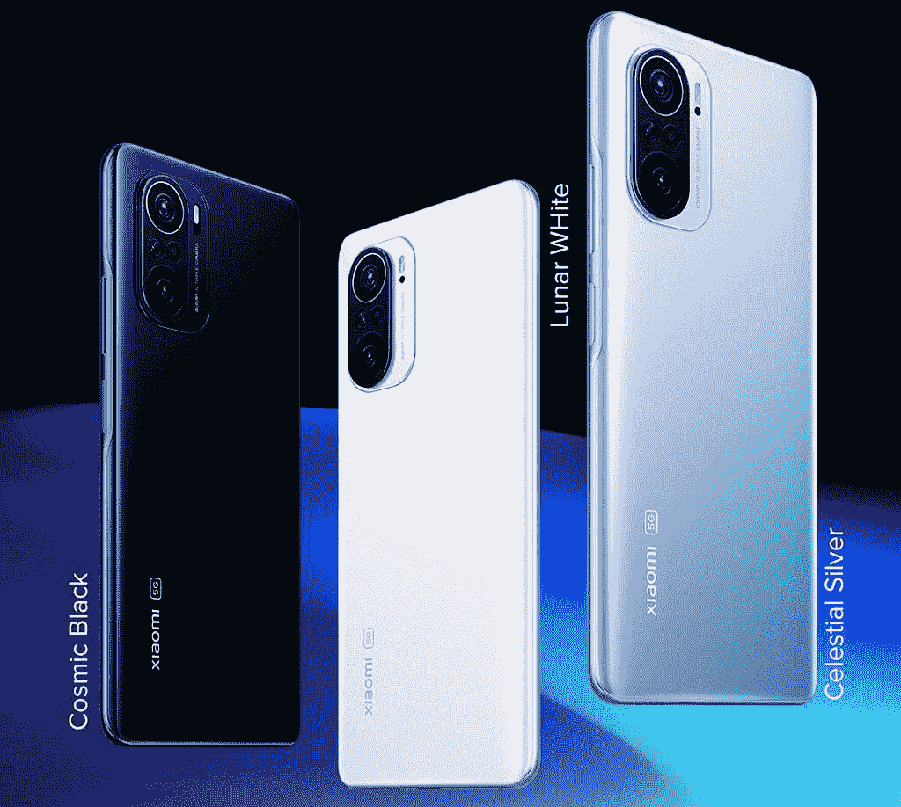

# 小米 Mi 11X、配备 120Hz AMOLED 的 Mi 11X Pro、True Tone 在印度发布

> 原文：<https://www.xda-developers.com/xiaomi-mi-11x-pro-launch-india/>

POCO F1 是小米在印度的第一款旗舰杀手。此后，该公司将旗下不同子品牌的运营和营销分开，包括 Redmi 和 POCO，并在中国推出了多个其他旗舰杀手。继 [Redmi K20](https://www.xda-developers.com/xiaomi-redmi-k20-pro-launch-india/) 系列和[小米 Mi 10T](https://www.xda-developers.com/xiaomi-mi-10t-pro-snapdragon-865-144-hz-refresh-rate-launch-india/) 系列之后，小米推出了又一个旗舰杀手系列，Mi 11X 和 Mi 11X Pro 终于来到了印度。Mi 11X Pro 配备了骁龙 888 SoC、108MP 三摄像头，而 Mi 11X 配备了骁龙 870 SoC 和 48MP 摄像头。这两款设备都具有 120Hz Super AMOLED 显示屏，快速充电，以及更多令人兴奋的价格。

Mi 11X 和 Mi 11X Pro 是该公司在其他市场推出的现有设备的新名称。米 11X 是重新改装的[红米 K40](https://www.xda-developers.com/redmi-k40-launched-china/) ，在全球也被称为 [POCO F3](https://www.xda-developers.com/poco-f3-hands-on/) 。同时， [Mi 11X Pro 是一个更名的 Redmi K40 Pro+](https://www.xda-developers.com/redmi-k40-k40-pro-india-mi-11x-11x-pro-skipping-poco-f3-rebranding/) ，这些设备的规格保持不变，与品牌无关。

从 Mi 11X Pro 开始，它采用了新的[高通骁龙 888](https://www.xda-developers.com/qualcomm-snapdragon-888-explained-specs-features/) 芯片组，配有 8GB LPDDR5 RAM。这与高达 256GB 的 UFS 3.1 存储搭配使用。另一方面，Mi 11X 采用了[骁龙 870](https://www.xda-developers.com/qualcomm-unveils-snapdragon-870/) SoC，这是高通之前的旗舰 SoC——骁龙 865/865 Plus 的超级充电版本。非专业智能手机配有 6GB 或 8GB 内存和 128GB 存储空间。

 <picture></picture> 

Xiaomi Mi 11X Series colors

这两款设备的下一个区别是摄像头。小米 11X Pro 配备了 108MP [三星 ISOCELL HM2](https://www.xda-developers.com/samsung-isocell-lineup-promises-smaller-camera-bumps-future-smartphones/) 传感器，这种传感器也可以在小米和红米的其他次优设备上看到，如[小米 10i(我们的评测)](https://www.xda-developers.com/xiaomi-mi-10i-5g-review/)和[红米 Note 10 Pro/Pro Max(我们的评测)](https://www.xda-developers.com/xiaomi-redmi-note-10-pro-review/)。其他品牌也在他们的 mid-rangers 上使用了相同的 108MP 传感器，如 [Realme 8 Pro(我们的评论)](https://www.xda-developers.com/realme-8-pro-review/)和[摩托罗拉 Moto G60](https://www.xda-developers.com/motorola-moto-g60-moto-g40-fusion-india-launch/) 。另一方面，vanilla 变种采用了 48MP 索尼 IMX582 传感器，我们在 [Mi 9T/Redmi K20 的摄像头](https://www.xda-developers.com/xiaomi-mi-9t-real-life-camera-review/)上看到了这一点。除了不同的主摄像头，这两款设备都具有 8MP 超广角和 5MP 远距微距摄像头。所有这些相机都支持夜间模式拍摄照片和视频。此外，这两款手机还在正面配备了一个 200 万像素的自拍摄像头。

现在说到相似之处，这两款设备都采用了 6.67 英寸的全高清+ AMOLED 显示屏。该显示器的刷新率为 120 赫兹，据称峰值亮度为 1300 尼特。此外，该显示器还支持 True Tone，它可以像苹果设备上的 True Tone 一样，根据环境光调整显示器的色温。除了正面的环境光线传感器，Mi 11X 系列还在背面配备了一个辅助环境光线传感器，以实现无缝的自动亮度体验。该显示器还支持 HDR10+和基于软件的 MEMC，以弥补自适应刷新率的不足。这两款智能手机的超分辨率功能使用人工智能将标清内容升级到高清分辨率。

这两款 Mi 11X 设备都配备了 4520 毫安时电池，可进行 33W 快速有线充电。5G 和 Wi-Fi 6 是这两款手机的标准连接选项。为了安全起见，你会得到一个侧面安装的指纹扫描仪。这两款设备还配有双立体声扬声器，支持杜比音频。

软件方面，米 11X 系列运行 Android 11，顶配 [MIUI 12](https://www.xda-developers.com/download-miui-12-stable-update-rolling-out-several-xiaomi-redmi-mi-poco-devices/) 。

## 小米 Mi 11X 系列:在印度的价格和可用性

配备 6GB 内存和 128GB 存储空间的 Mi 11X 在印度的售价为₹29,999(约 400 美元)。8GB + 128GB 版本的价格在₹31,999(约 427 美元)。

小米 11X Pro 的 8GB + 128GB 型号将在₹39,999 上市(约 535 美元)，而 8GB + 256GB 型号将在₹41,999 上市(约 560 美元)。

Mi 11X 将于 4 月 27 日开始通过闪购在印度通过[亚马逊](https://www.amazon.in/b?tag=xdaportalin-21)销售。Pro 版本将于 4 月 27 日开始通过亚马逊印度订购，而交付将于 5 月 6 日开始。

 <picture></picture> 

Xiaomi Mi 11X

##### 小米 Mi 11X

小米 11X 是小米最新的平价旗舰产品，配有骁龙 870 SoC、48MP 三摄像头和无广告 MIUI 体验。

 <picture></picture> 

Xiaomi Mi 11X Pro

##### 小米 Mi 11X Pro

米 11X Pro 是一款功能丰富的旗舰杀手，拥有 120Hz AMOLED 显示屏，骁龙 888，108MP 摄像头等。

## 小米 Mi 11X 系列规格

| 

规格

 | 

小米 Mi 11X

 | 

小米 Mi 11X Pro

 |
| --- | --- | --- |
| **尺寸&重量** | 

*   163.7 x 76.4 x 7.8mm 毫米
*   196 克

 | 

*   163.7 x 76.4 x 7.8mm 毫米
*   196 克

 |
| **显示** | 

*   6.67 英寸 AMOLED 显示屏
*   FHD+ (2400 x 1080 像素)
*   120 赫兹刷新率
*   360Hz 触摸采样率
*   1300 尼特峰值亮度，900 尼特典型亮度
*   大猩猩玻璃 5
*   原彩显示
*   5000000:1 对比度
*   HDR10+
*   MEMC

 | 

*   6.67 英寸 AMOLED 显示屏
*   FHD+ (2400 x 1080 像素)
*   120 赫兹刷新率
*   360Hz 触摸采样率
*   1300 尼特峰值亮度，900 尼特典型亮度
*   大猩猩玻璃 5
*   原彩显示
*   5000000:1 对比度
*   HDR10+
*   MEMC

 |
| **SoC** | 

*   高通骁龙 870
*   肾上腺素 650

 | 

*   高通骁龙 888
*   肾上腺素 660

 |
| **内存&存储** | 

*   6GB LPDDR5 + 128GB UFS 3.1
*   8GB LPDDR5 + 128GB UFS 3.1

 | 

*   8GB LPDDR5 + 128GB UFS 3.1
*   8GB LPDDR5 + 256GB UFS 3.1

 |
| **电池&充电** | 

*   4520 毫安时
*   33W 快速有线充电

 | 

*   4520 毫安时
*   33W 快速有线充电

 |
| **安全** | 侧装式指纹传感器 | 侧装式指纹传感器 |
| **后置摄像头** | 

*   4800 万像素 IMX 582 f/1.79 主摄像头
*   800 万像素超宽摄像头，f/2.2，119 FoV
*   500 万像素远距微距相机

 | 

*   108MP 三星 HM2，f/1.75 主摄像头
*   800 万像素超宽摄像头，f/2.2，119 FoV
*   500 万像素远距微距相机

 |
| **前置摄像头** | 20MP 自拍相机 | 20MP 自拍相机 |
| **端口** | USB 类型-C | USB 类型-C |
| **音频** | 

*   立体声扬声器
*   杜比全景声认证
*   高分辨率音频认证

 | 

*   立体声扬声器
*   杜比全景声认证
*   高分辨率音频认证

 |
| **连通性** | 

*   SA/NSA 5G
*   无线网络 6
*   蓝牙 5.1
*   国家足球联盟
*   GPS、GLONASS、QZSS、NavIC、伽利略、北斗

 | 

*   SA/NSA 5G
*   Wi-Fi 6E
*   蓝牙 5.2
*   国家足球联盟
*   GPS、GLONASS、QZSS、NavIC、伽利略、北斗

 |
| **软件** | 基于 Android 11 的 MIUI 12 | 基于 Android 11 的 MIUI 12 |
| **其他特征** | 

*   色温传感器
*   红外线增强器

 | 

*   色温传感器
*   红外线增强器

 |