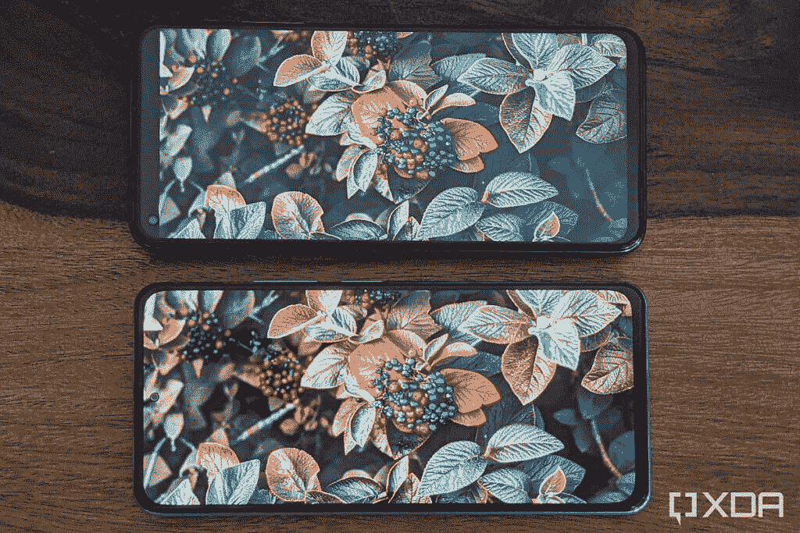
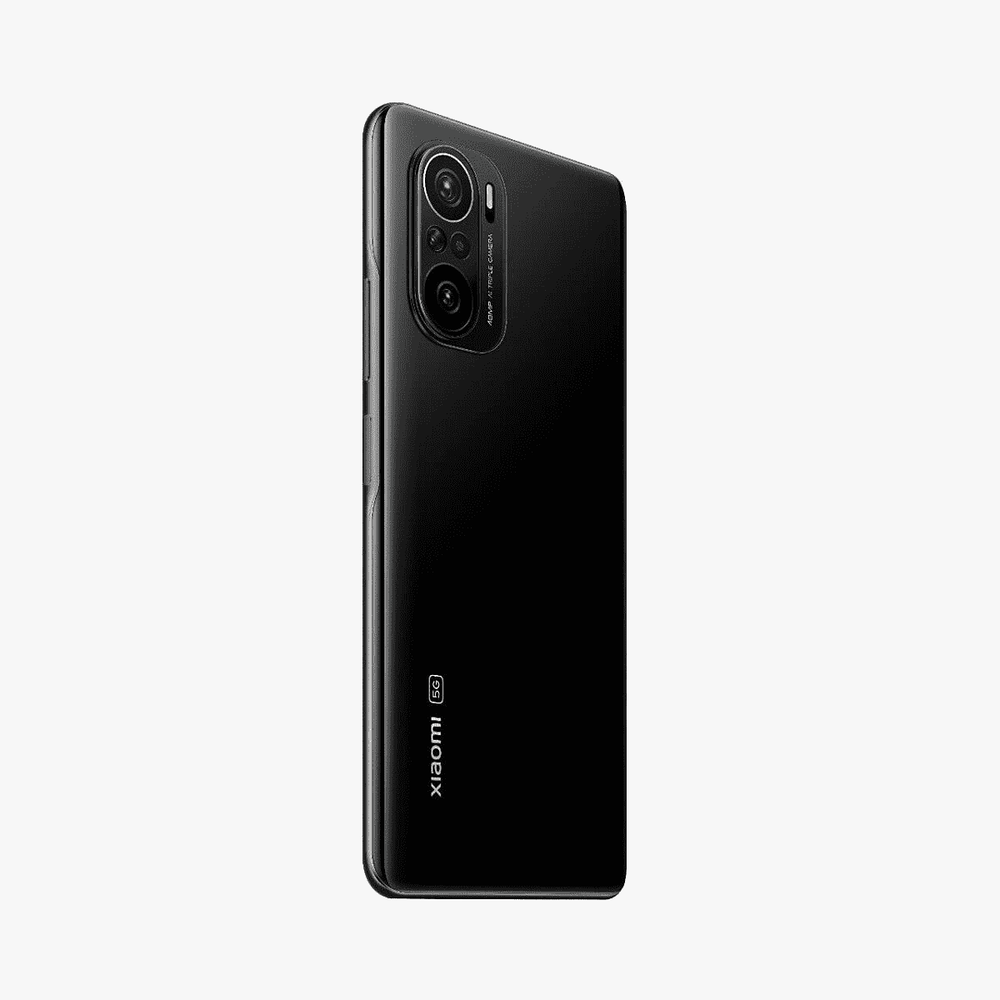

# 小米 Mi 11X 和 Mi 11X Pro 评测:一加 9 系列的麻烦

> 原文：<https://www.xda-developers.com/xiaomi-mi-11x-pro-review/>

小米最近在印度推出了 [Mi 11X 和 Mi 11X Pro](https://www.xda-developers.com/xiaomi-mi-11x-pro-launch-india/) 。这两款旗舰杀手最初在中国宣布为 [Redmi K40 和 Redmi K40 Pro+](https://www.xda-developers.com/redmi-k40-launched-china/) ，是小米征服印度高端手机市场的一部分，因为它已经进入了低端市场。米 11X 系列有能力削弱一加在次高档旗舰市场的长期主导地位。

小米是印度最畅销的智能手机品牌，其受欢迎程度源于超值的 Redmi 阵容。在有意识地将自己限制在入门级和中端市场几年后，小米在 2019 年推出了 Redmi K20 Pro，进入了高端市场，起价为₹30,000 或大约 400 美元。在接下来的一年，即 2020 年，小米在印度市场迈出了一大步，推出了第一款高端智能手机——小米 Mi 10，这是继上一款高端智能手机 Mi MIX 2 之后的三年。正如我在我的 [Mi 10 评论](https://www.xda-developers.com/xiaomi-mi-10-review/)中提到的，这款手机的任务是改变该品牌在印度的形象。米 10 之后是米 10T 和米 10T，它们针对印度买家的价格预期进行了优化。虽然小米 11 没有到达印度，但小米在该国推出了更贵的小米 11 Ultra。Mi 11X 和 Mi 11X Pro 与 Mi 11 Ultra 一起推出，它们以令人难以置信的价格提供了引人注目的功能。

Mi 11X 和 Mi 11X Pro 在一定程度上是相同的。这两个人共享相同的 120Hz AMOLED 显示屏，相同的设计和颜色选项，相同的电池和充电能力，以及第二和第三摄像头。同时，两款手机之间的区别因素包括主摄像头和处理器。

因此，在这次审查中，我们将一起看一看 Mi 11X 系列，并仅在必要时指出差异。有趣的是，在推出 Mi 11X 之前，Redmi K40 在全球市场(不包括印度)也被更名为 [POCO F3](https://www.xda-developers.com/poco-f3-poco-x3-pro-global-launch/) 。您也可以查看我们的 [POCO F3 实践预览](https://www.xda-developers.com/poco-f3-hands-on/)，了解更多关于这些设备的不同之处。

* * *

## 小米 Mi 11X 和 Mi 11X Pro:规格

### 小米 Mi 11X 系列规格。单击/点击以展开

| 

规格

 | 

小米 Mi 11X

 | 

小米 Mi 11X Pro

 |
| --- | --- | --- |
| **尺寸&重量** | 

*   163.7 x 76.4 x 7.8mm 毫米
*   196 克

 | 

*   163.7 x 76.4 x 7.8mm 毫米
*   196 克

 |
| **显示** | 

*   6.67 英寸 AMOLED 显示屏
*   FHD+ (2400 x 1080 像素)
*   120 赫兹刷新率
*   360Hz 触摸采样率
*   1300 尼特峰值亮度，900 尼特典型亮度
*   大猩猩玻璃 5
*   原彩显示
*   5000000:1 对比度
*   HDR10+
*   MEMC

 | 

*   6.67 英寸 AMOLED 显示屏
*   FHD+ (2400 x 1080 像素)
*   120 赫兹刷新率
*   360Hz 触摸采样率
*   1300 尼特峰值亮度，900 尼特典型亮度
*   大猩猩玻璃 5
*   原彩显示
*   5000000:1 对比度
*   HDR10+
*   MEMC

 |
| **SoC** | 

*   高通骁龙 870
*   肾上腺素 650

 | 

*   高通骁龙 888
*   肾上腺素 660

 |
| **风筒&储存** | 

*   6GB LPDDR5 + 128GB UFS 3.1
*   8GB LPDDR5 + 128GB UFS 3.1

 | 

*   8GB LPDDR5 + 128GB UFS 3.1
*   8GB LPDDR5 + 256GB UFS 3.1

 |
| **电池&充电** | 

*   4520 毫安时
*   33W 快速有线充电

 | 

*   4520 毫安时
*   33W 快速有线充电

 |
| **安全** | 侧装式指纹传感器 | 侧装式指纹传感器 |
| **后置摄像头** | 

*   48MP IMX 582，f/1.79 主摄像头
*   800 万像素超宽摄像头，f/2.2，119 FoV
*   500 万像素远距微距相机

 | 

*   108MP 三星 HM2，f/1.75 主摄像头
*   800 万像素超宽摄像头，f/2.2，119 FoV
*   500 万像素远距微距相机

 |
| **前置摄像头** | 20MP 自拍相机 | 20MP 自拍相机 |
| **端口** | USB 类型-C | USB 类型-C |
| **音频** | 

*   立体声扬声器
*   杜比全景声认证
*   高分辨率音频认证

 | 

*   立体声扬声器
*   杜比全景声认证
*   高分辨率音频认证

 |
| **连通性** | 

*   SA/NSA 5G
*   无线网络 6
*   蓝牙 5.1
*   国家足球联盟
*   GPS、GLONASS、QZSS、NavIC、伽利略、北斗

 | 

*   SA/NSA 5G
*   Wi-Fi 6E
*   蓝牙 5.2
*   国家足球联盟
*   GPS、GLONASS、QZSS、NavIC、伽利略、北斗

 |
| **软件** | 基于 Android 11 的 MIUI 12 | 基于 Android 11 的 MIUI 12 |
| **其他特征** | 

*   色温传感器
*   红外线增强器

 | 

*   色温传感器
*   红外线增强器

 |

***注:**小米印度给我们发来了宇宙黑的米 11X 的 8GB+128GB 变种和天球银颜色的米 11X Pro 的 8GB+256GB 变种。此次评测是在米 11X 近 20 天和米 11X 专业版 10 天后进行的。小米印度在这次审查中没有任何投入。*

* * *

## 盒子里有什么？

这些是您在 Mi 11X 系列智能手机包装盒内获得的以下物品:

*   电话听筒
*   USB 型到 C 型电缆
*   33W 充电器砖
*   USB Type-C 转 3.5 毫米耳机转换器
*   SIM 弹出工具
*   硅胶外壳
*   保修和其他文书工作

* * *

## 设计

小米 Mi 11X 系列采用玻璃设计，两侧为大猩猩玻璃 5，外观尊贵。两款手机的背面都有一个厚厚的摄像头凸起，由于摄像头传感器更大，Mi 11X Pro 的摄像头凸起明显更厚。相机凸起的设计似乎受到了[小米 Mi 11 系列](https://www.xda-developers.com/xiaomi-mi-11-review/)的启发，小米 Mi 11 系列本身似乎也从 [iPhone 12](https://www.xda-developers.com/apple-iphone-12-pro-max-hands-on-preview/) 系列中汲取了相机设计的灵感。

*天球银和午夜黑变体*

然而，与采用四曲面显示屏的 Mi 11 不同，Mi 11X 系列采用平板显示屏。平板显示器和曲面显示器之间的争论似乎是永恒的，但它似乎是这个价格区间的最佳选择。然而，Mi 11X 的边缘不是尖锐的边缘，而是以 2.5D 弯曲。

米 11X 系列感觉溢价，但塑料框架是一个值得警惕的原因。

夹在玻璃之间的是一个塑料框架，混合了光泽和缎面。使用塑料而不是金属作为框架可能有助于小米控制手机的重量，但也削弱了手机的溢价吸引力。除此之外，塑料框架导致手机发热和节流，我们将在接下来的章节中看到。对于那些不太担心节流或极限性能限制的人来说，塑料框架确实让 Mi 11X 系列感觉明显更轻，特别是当其他旗舰和旗舰杀手突破 200 克大关时。

这款手机也非常纤薄，容易握持，即使有外壳也是如此。框架的顶部和底部边缘相对较宽，可容纳双立体声扬声器。这款手机的特点是侧面安装的电容式指纹扫描仪，位于框架右侧的电源按钮附近。我觉得这是一个比平庸的显示指纹扫描仪更好的选择，但你可能会有不同的看法。与小米、Redmi 和 POCO 的其他一些配备侧装指纹扫描仪的手机不同，Mi 11X 系列的手机几乎与边框齐平，更容易与外壳配合使用。

Mi 11X 和 Mi 11X Pro 有三种颜色可供选择——闪亮且高反射性的*宇宙黑*、漫射落在其上的光的*月球白*，最后是最令人兴奋的天空银。根据落在它上面的光线的角度和强度，颜色可以是金属粉色、橙色、金色、蓝绿色或蓝色，但很少是银色。它在引起人们对手机的注意方面起着巨大的作用。

*不同角度的天球银*

回到背面的摄像头，这两款智能手机都有三摄像头。主摄像头位于顶部，用一个银环突出。辅助超广角相机位于底部。在这两个摄像头的中间，有一个微型微距摄像头，靠近后置麦克风。相机阵列侧面有一个双音闪光灯。在闪光灯旁边，手机上有一个后置的环境传感器。这个辅助传感器有助于调整显示器的亮度和颜色，即使光源不在显示器前面。

尽管更名，米 11X 系列的设计感觉非常优质和像样。这对于 Mi 11X 来说尤其令人兴奋，因为这个价格范围内的大多数其他手机要么体积庞大，要么采用毫无创意的塑料设计。

* * *

## 显示

小米 Mi 11X 系列配备 6.67 英寸 AMOLED 显示屏。它的分辨率为 2400 x 1080 像素，具有一个用于自拍相机的打孔切口。这款显示器还有 120 赫兹的刷新率，让动画和过渡看起来更流畅。像它以前的化身 Redmi K40 系列和 POCO F3 一样，Mi 11X 系列也采用了三星 E4 显示屏。这些显示器比以前的 E3 级显示器领先一步，提供了更好的亮度和更高的对比度。小米声称其显示器的典型高亮度为 900 尼特，峰值亮度为 1300 尼特，对比度高达 5000000:1。

该显示器在室内非常明亮，但其室外可读性却令人惊讶。除了非常亮之外，显示器也可以变得相当暗，以便在光线较暗的情况下使用。除此之外，小米还复制了苹果的 True Tone 功能，它会自动调节显示器的温暖度，以最大限度地减少眼睛疲劳。然而，智能手机缺乏对 [DC 调光](https://www.xda-developers.com/oneplus-dc-dimming-optional-feature-future-update/)的支持，这是一种用于消除低亮度下可能导致眼睛疲劳的频闪或闪烁的技术。令人惊讶的是， [Redmi K20](https://www.xda-developers.com/redmi-k20-pro-xiaomi-mi-9t-pro-review-flagship/) 系列自推出以来就有这个功能。

显示器提供出色的色彩输出，支持 DCI-P3 色域中的 100%颜色。此外，小米给了你大量的选项来优化你喜欢的颜色。然而，就像这个价格范围内的大多数其他智能手机一样，当你从倾斜的角度看显示屏时，彩虹微光很容易被注意到。

丰富的饱和度，高亮度，以及许多定制选项，使 Mi 11X 的显示器非常讨人喜欢。

与米 10T Pro 的 LCD 相比，米 11X 系列上的 AMOLED 具有更丰富的活力和更好的对比度。

 <picture></picture> 

Display comparison: Mi 10T Pro on top vs Mi 11X Pro at bottom

这些智能手机经过 HDR10+认证，支持在 YouTube 和网飞上播放 HDR 内容，但不支持在亚马逊 Prime Video 上播放。这些手机还获得了 Widevine L1 认证，这意味着您可以享受全高清的 OTT 内容。

duo 还提供了一种颜色暗淡的阅读模式和类似纸张的纹理，以减少在弱光下阅读时的压力。此外，duo 还提供了一些视频增强功能，如 MEMC，用于更流畅的视频播放，以及 SDR 到 HDR 的升级，用于增强原本不支持的内容的 HDR。Mi 11X Pro 还具有标清到高清的升级功能，但在普通型号上却没有。

正如我上面提到的，显示器有 120 赫兹的刷新率。这意味着显示器上的内容每秒钟可以刷新 120 次，是标准 60Hz 显示器的两倍。显示器还支持自适应刷新率切换，这意味着刷新率会根据内容更改为不同的值。由于 AMOLED 面板的限制，Mi 11X 和 Mi 11X Pro 上的显示器支持 120Hz、90Hz 和 60Hz 模式。这比[小米 Mi 10T Pro](https://www.xda-developers.com/xiaomi-mi-10t-pro-great-lcd-better-than-good-amoled-display/) 等自适应 LCD 支持的模式少。出现这种限制是因为制造商必须分别校准每个刷新率的颜色输出和亮度值，与 AMOLED 相比，这在 LCD 面板上更容易实现。

显示器无法像 Mi 10T Pro 那样快速地从一种刷新率切换到另一种刷新率。另一个警告是，视频应用程序的频率限制为 60 赫兹，最近菜单的频率限制为 90 赫兹。此外，该显示器还具有 360Hz 的触摸采样率，虽然我们没有专业工具来验证这一说法，但几乎没有任何错过或延迟触摸响应的情况。

总的来说，显示屏是这些智能手机最令人印象深刻的亮点之一。但这并不是这些设备令人兴奋的唯一原因，因为性能才是真正让我们兴奋的地方。下一节将详细讨论这个方面。

* * *

## 表演

Mi 11X 和 Mi 11X Pro 采用高通的骁龙 8 系列移动平台。米 11X Pro 比纸面上的普通变种更强大。它采用了更强大的[高通骁龙 888](https://www.xda-developers.com/qualcomm-snapdragon-888-explained-specs-features/) 片上系统(SoC)，这是高通最优秀的智能手机芯片组。相比之下，常规版本由[骁龙 870](https://www.xda-developers.com/qualcomm-unveils-snapdragon-870/) 驱动，这是去年[骁龙 865 Plus](https://www.xda-developers.com/qualcomm-snapdragon-865-plus-launch/) 的超频版本。

以下是骁龙 870 和骁龙 888 芯片组之间的快速比较:

| 

高通骁龙 870

 | 

高通骁龙 888

 |
| --- | --- |
| 

*   5 纳米制造
*   CPU:
    *   1 个 Kryo 585 主内核@ 3.2GHz
    *   3 个 Kryo 585 性能内核@ 2.4GHz
    *   4 个 Kryo 585 效率内核@ 1.8GHz
*   GPU: Adreno 650
*   适用于 LTE 和 5G 的骁龙 X55 调制解调器
    *   毫米波:800Mhz 带宽，8 个载波，2×2 MIMO
    *   低于 6 GHz: 200MHz 带宽，4×4 MIMO
*   无线网络 6

 | 

*   5 纳米制造
*   CPU:
    *   1 个 Kryo 680 Prime 内核@ 2.84GHz
    *   3 个 Kryo 680 性能内核@ 2.4GHz
    *   4 个 Kryo 680 效率内核@ 1.8GHz
*   GPU: Adreno 660
*   面向 LTE 和 5G 的骁龙 X60 集成调制解调器
    *   毫米波:800Mhz 带宽，8 个载波，2×2 MIMO
    *   低于 6 GHz: 200MHz 带宽，4×4 MIMO
*   Wi-Fi 6E

 |

骁龙 888 上较新的 Kryo 680 Prime 内核基于 ARM 的新 Cortex-X1 设计，而芯片组上的其他内核基于 Cortex-A78。与此同时，骁龙 870 采用了基于旧 Cortex-A77 设计的内核。虽然 Mi 11X Pro 预计将超过 Mi 11X，但我们进行了一些测试来量化这一领先优势。

### 极客工作台 5

首先，Geekbench 5 用于比较这两款芯片组的单核和多核性能。以下是我们在这两款设备上获得的结果对比:

| 

试验

 | 

小米 Mi 11X

 | 

小米 Mi 11X Pro

 |
| --- | --- | --- |
| 单核的 | 970 | 1107 |
| 多核 | 3231 | 3614 |

尽管 Prime core 的内核频率较低，但骁龙 888 的速度超过了骁龙 870，因为其制造效率更高，内核架构更新。多核结果还表明，Pro 的性能比普通型号提高了大约 12%。

### XDA 应用启动速度测试

接下来，为了测试这两款设备的灵活性，我们使用了由 XDA 的米沙·拉赫曼和 T2 的马里奥·塞拉费罗设计的定制基准。在这项测试中，12 个流行的应用程序以冷启动的方式启动，即当应用程序已经不在后台运行时，循环运行。该循环运行两次——一次 15 次迭代，另一次 30 次迭代，手机启动每个应用程序所需的时间用条形图绘制。测试中使用的应用程序包括谷歌浏览器、Discord、脸书、Gmail、谷歌地图、信息、谷歌照片、谷歌 Play 商店、Slack、Twitter、WhatsApp 和 YouTube。

以下是我们在 Mi 11X 和 Mi 11X Pro 上运行基准测试时获得的结果:

正如所料，在包含 15 次迭代的测试中，Mi 11X Pro 比 Mi 11X 快得多。最大的差异出现在启动谷歌浏览器、WhatsApp 和谷歌照片时。Mi 11X Pro 的这些值类似于我们在[一加 9 Pro](https://www.xda-developers.com/oneplus-9-pro-review/) 评测中看到的值。

当运行 30 次迭代时，Chrome、WhatsApp 和 Google Photos 显示出相同的趋势，这表明这两种设备之间的偏差最大。值得注意的是，米 11X 启动这些应用程序的时间比骁龙 865 的米 10T Pro 少。

### UI 口吃/邱建测试

除了定制应用程序启动测试，我们还使用内部基准测试来测试智能手机的流畅度。由于这两款器件都配有 120Hz 显示屏，因此显示器的任何输入都必须以 120fps 的最低帧速率发送，以避免任何抖动或断续。对于这个测试，我们使用了 Google 开源的 JankBench 的修改版本，它模拟了各种日常任务。绘制每一帧所花费的时间在竖线的帮助下绘制出来。我们逐一考虑这些测试的结果，并比较两款手机在每种情况下的性能。

在带文本滚动的**列表视图**中，Mi 11X 上只有 0.22%的帧未达到 120Hz 的目标，而 Mi 11X Pro 上有 0.39%的帧未达到目标。

在**滚动图像的列表视图**中，Mi 11X 上 0.36%的帧未达到 120Hz 的目标，而 Pro 上 0.59%的帧未达到目标。

当谈到具有低命中率渲染的**列表视图滚动**时，0.79%的帧未能达到 Mi 11X 上 120Hz 的预期目标，而 1.12%的帧未能在 Pro 上以所需的 120Hz 进行渲染。

对于具有高命中率渲染的**列表视图滚动**，0.73%的帧未能达到 Mi 11X 上 120Hz 的目标，而 0.95%的帧未能达到 Pro 上的目标。

在**使用键盘**输入和编辑文本时，在 Mi 11X 上有 1.84%的帧数达不到 120Hz 的目标，在 Pro 上有 6.55%的帧数达不到这个目标。与其他结果相比，这一差距要大得多，这表明后者在使用屏幕键盘时会经历明显的丢帧。

在使用卡重复透支的情况下，只有 0.01%的帧没有达到 Mi 11X 上的 120Hz 标记，而 0.03%的帧没有达到 Pro 上的目标。

最后，当进行位图上传测试时，在 Mi 11X 上，13.25%的帧未达到 120Hz 的目标，0.06%的帧未达到 90Hz 的目标。相比之下，11.46%的帧没有达到 120Hz 的目标，0.12%的帧没有达到 Pro 上的 90Hz 标记。

我们在 UI 口吃和邱建测试中看到了一个令人惊讶的趋势，除了位图上传测试，Mi 11X 在所有测试中的表现都始终优于 Pro。这可能是因为前者运行的是较新版本的 MIUI 12 (12.0.4 ),而后者运行的是 MIUI 12.0.1。小米印度告诉我们，Pro 应该进行更新，但我的部门还没有收到更新。

总的来说，这些结果都不令人担忧，尽管位图上传测试有点令人担忧，因为 Android 中的所有图形元素都是使用位图绘制的。这意味着我们可以在这些智能手机上观察到微口吃，特别是在需要更高图形处理能力的应用程序中。

### 节流

我们在上面提到，Mi 11X 系列在玻璃背板和显示器之间使用了塑料框架。由于玻璃和塑料都是热绝缘体，所以热量很有可能被截留在手机内部，尤其是在你玩游戏或长时间使用手机的时候。随着外壳内热量的增加，专用的节流算法会限制设备的性能。

为了测试他们在高温下的节流倾向，我们在手机上使用了 CPU 节流测试，得到了以下结果:

这两款智能手机在高压力情况下都经历了严重的节流。Mi 11X 节流到峰值性能的 68%，并且在 CPU 节流基准的前 10 分钟开始出现问题的迹象。另一方面，Pro 在前五分钟开始节流，并被限制在其最大性能的 64%，仅比普通版本高 2%。

Mi 11X 系列在高应力情况下经受严重的节流。

执行这些测试时，环境温度为 25-30°C，而 Mi 11X 的内部温度高达 78°C。这引发了警报，因为在这些情况下，大范围节流将导致长时间性能比预期低得多。

* * *

## 电池寿命和充电

Mi 11X 和 Mi 11X Pro 采用完全相同的 4520mAh 电池，比 Mi 10 小 10%。从好的方面来看，更小的电池允许更轻的外形。电池足够大，可以持续一整天的正常使用。在充满电的情况下，你可以轻松获得 24-30 小时的电池续航时间，在 120Hz 的频率下大约可以持续 7 小时的屏幕时间，用于观看 YouTube 或网飞上的视频，在网络浏览器或社交媒体应用程序上滚动，播放一些音乐和玩轻度游戏。请注意，亮度、更高的刷新率以及 SDR 到 HDR 的升级或 MEMC 等功能会增加电池消耗。此外，在相同的网络、照明条件和工作负载下，Pro 的电池损耗略快。

说到充电，两款手机都支持 33W [快充](https://www.xda-developers.com/how-does-fast-charging-work/)，因此充满电需要相同的时间。从 5%的电池容量开始，智能手机需要大约 1 小时 15 分钟才能充满电。充电率几乎是线性的，只有在 97%左右才开始趋于平稳。手机在充电时会变得有些热，但不会让你放弃使用它。

* * *

## 相机:米 11X vs 米 11X Pro

除了相似之处，这两款设备在主摄像头方面也有重要区别。Mi 11X 配备了索尼 IMX582，这是一款两年前推出的 48MP 相机传感器，在各种中端和经济型旗舰智能手机上都可以看到。这是一个 1/2 英寸的传感器，像素大小为 0.8μm。该传感器与 f/1.79 光圈镜头设置配对，支持 4 合 1 像素宁滨，产生像素大小为 1.6μm 的 12MP 图像。尽管有一个功能强大的处理器，Mi 11 最多只能以 30fps 的速度拍摄 4K 视频。此外，它还带有 EIS。

另一方面，Mi 11X Pro 配备了三星最近推出的 108MP 传感器。[三星 ISOCELL HM2](https://www.xda-developers.com/samsung-isocell-lineup-promises-smaller-camera-bumps-future-smartphones/) 的传感器尺寸为 1/1.52 英寸，0.7μm。该传感器采用 9 合 1 像素宁滨，也可以创建 1200 万像素的图像。该传感器比 [Galaxy Note 20 Ultra](https://www.xda-developers.com/samsung-galaxy-note-20-ultra-camera-review/) 上的 ISOCELL HM1 108MP 传感器和 [Galaxy S21 Ultra](https://www.xda-developers.com/galaxy-s21-ultra-features-samsungs-latest-108mp-camera-sensor/) 上的 ISOCELL HM3 108MP 传感器小 15%。尽管尺寸较小，但由于三星的 ISOCELL Plus 和 Smart ISO 技术，HM2 传感器据称比 HM1 捕捉更多的光和颜色。该传感器通常是为高端中端手机设计的，早些时候在[小米 Mi 10i](https://www.xda-developers.com/xiaomi-mi-10i-5g-review/) 、 [Redmi Note 10 Pro](https://www.xda-developers.com/xiaomi-redmi-note-10-pro-review/) 和 [Realme 8 Pro](https://www.xda-developers.com/realme-8-pro-review/) 上见过。Pro 智能手机可以以 30fps 的速度拍摄高达 8K 分辨率的视频，或以 60fps 的速度拍摄 4K，但其稳定选项仅限于 EIS，因为它没有 OIS。

除了这些不同的主要传感器，这两款手机都具有相同的 800 万像素超广角摄像头和相同的 500 万像素自动对焦微距摄像头。这两款智能手机都配有 2000 万像素的自拍摄像头。

以下是一些相机样品，主要目的是比较 Mi 11X(左侧)和 Mi 11X Pro(右侧):

#### 主摄像机

使用 Mi 11X(左侧)和 Mi 11X Pro(右侧)拍摄的 1200 万像素照片之间的质量差异并不显著，但如果你仔细观察，你会发现 Pro 捕捉到了更好的阴影和更自然的颜色。

#### 4800 万像素对 108 万像素

当你查看 Mi 11X 的 4800 万像素图像和 Mi 11X Pro 的 108 万像素图像时，你可以看到后者拍摄的照片更清晰、更明亮。

#### 弱光

令我们惊讶的是，在没有夜间模式的弱光下，用 Mi 11X 拍摄的图像似乎比用 Pro 拍摄的图像曝光更多。

#### 夜间模式

在夜间模式下拍摄的图像上也可以看到类似的趋势，其中 Mi 11X 比 Mi 11X Pro 拍摄的曝光更多。而后者，色彩更中性，失真更少。

#### 超广角

超广角图像在质量上相当，但 Mi 11X Pro 捕捉颜色更准确。这可以归功于骁龙 888 上更好的 ISP。

#### 宏指令

尽管使用了相同的微距相机，但我们注意到，Mi 11X 拍摄的微距图像比 Mi 11X Pro 更温暖。然而，前者能够比后者更容易地对物体进行自动对焦。

#### 自拍

对于自拍，当 HDR 关闭时，Mi 11X 和 Mi 11X Pro 会产生类似的结果。然而，在我们的测试中，Pro 拍摄了一张比前者更暗的 HDR 自拍。

由于新冠肺炎在印度的爆发，我们在审查这些设备上的摄像头时限制了自己。因此，在缺乏一组充足的图像的情况下，我们无法对这些设备上的摄像头做出绝对的评论。我们希望在该国局势缓解后更新这一部分。

* * *

## 用户界面

米 11X 系列运行在基于 Android 11 的 MIUI 12 上。MIUI 12 更新为小米、Redmi 和 POCO 手机的界面带来了许多视觉和功能上的变化。但由于 MIUI 更新并不与 Android 平台更新捆绑，因此在 Android 10 的基础上，MIUI 12 的变化很少。然而，有一些最近增加的令人愉快的变化，值得一提:

*   小米已经削减了自己的应用程序，并用谷歌的应用程序取而代之。你可以把 Chrome、Google Phone、Messages 作为手机上的默认应用。除了 MIUI 的文件管理器，你还可以获得文件。

*   界面已经被大部分清理了，你只能得到少量的预装应用。这两个应用附带了亚马逊、脸书、Linkedin、亚马逊 Prime Video、Mi Pay 和 Mi Credit，作为用户可能不想要的唯一预装应用。但是，你还是会偶尔看到小米自己的应用商店——get apps 的建议和广告。
*   从 POCO Launcher 剥离出来的 MIUI launcher 是 Google Discover 的默认界面。
*   您可以选择最近菜单的垂直或[水平方向。](https://www.xda-developers.com/xiaomi-miui-launcher-horizontal-recent-apps-screen/)

* * *

## 小米 Mi 11X 和 Mi 11X Pro 评测:一加缺乏的 X 因素

小米传统上以其价格实惠、物超所值的手机而闻名。随着该公司在价格阶梯上的攀升，其物有所值的优势似乎并未改变。这两个旗舰杀手是伟大的手机，你花在他们身上的钱。小米 Mi 11X 的 6GB+128GB 版本在₹29,999 的售价约为 400 美元，而 8GB+128GB 版本在₹31,999 的售价约为 427 美元。该价格范围内最接近的竞争对手是:

*   Realme X7 Pro——充电速度更快，摄像头更好，但性能相对较差
*   三星 Galaxy A52——拥有更好的摄像头和三星三年更新的承诺，但由于中档处理器，性能有限
*   一加诺德，这是近一年前，配备了中档芯片组
*   最后，最近推出的 iQOO 7(印度)，这是最值得竞争的产品，规格相当，包括骁龙 870 和额外的功能，如 OIS，专用显示芯片和更快的充电速度。不过，在更新方面，iQOO 的名声并不好。

 <picture></picture> 

Xiaomi Mi 11X

##### 小米 Mi 11X

小米 11X 是小米最新的平价旗舰产品，配有骁龙 870 SoC、48MP 三摄像头和无广告 MIUI 体验。

小米 11X Pro 的 8GB + 128GB 版本在₹39,999 有售(约 535 美元)，8GB + 256GB 版本在₹41,999 有售(约 560 美元)。一些有价值的竞争对手包括:

*   iQOO 7 Legend (印度)——起价相同，性能相似，充电速度更快，内置指纹扫描仪，金属代替塑料，但在更新方面存在不确定性
*   一加 9R 充电速度更快，但骁龙 870 芯片组速度较慢，摄像头质量较低。

 <picture></picture> 

Xiaomi Mi 11X Pro

##### 小米 Mi 11X Pro

米 11X Pro 是一款功能丰富的旗舰杀手，拥有 120Hz AMOLED 显示屏，骁龙 888，108MP 摄像头等。

米 11X 系列最有趣的一点是，这些智能手机的价格几乎比 [OnePlus 9R](https://www.xda-developers.com/oneplus-9r-launch/) 和 [OnePlus 9](https://www.xda-developers.com/oneplus-9/) 低₹10,000(约 135 美元)，但提供了类似的体验。自 POCO F1 诞生以来，小米一直紧跟一加的脚步。这两款手机之间的差距越来越小，以至于许多现有的一加用户可能会转向小米，以更低的价格享受同样的功能。这绝对是一加担心的一个原因。