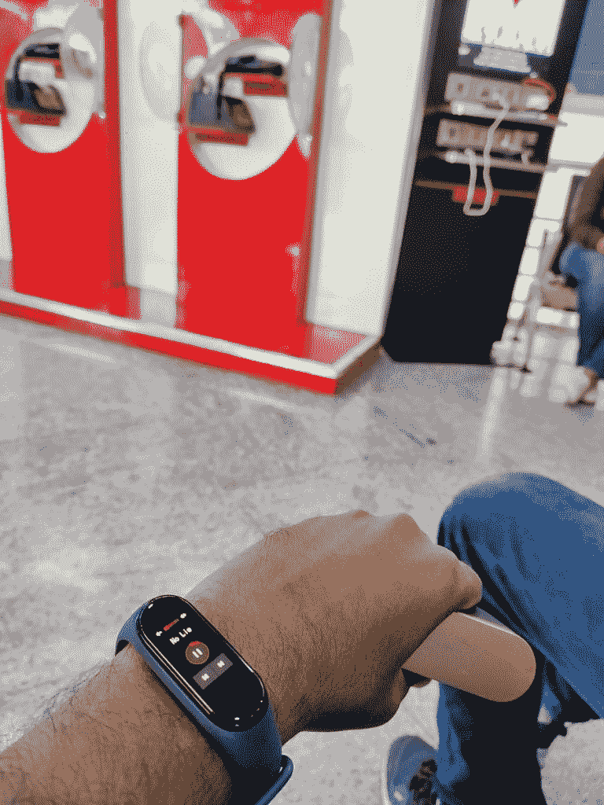

# 小米 Mi Band 4 回顾:健身追踪又做对了

> 原文：<https://www.xda-developers.com/xiaomi-mi-band-4-review-smart-fitness-tracker/>

小米作为一个品牌，最大的吸引力之一是，人们可以期待该公司决定以其名字命名的几乎所有东西都有非常高的价值——从智能手机到配件，到小米生态系统中的几乎所有东西。在像印度这样的国家，小米已经在其所在的细分市场带来了一场革命，极大地压低了价格，提高了终端用户的效用。小米在健身追踪器领域的存在也是如此——这个领域曾经由价格昂贵的选项主导，这些选项可以很好地完成任务，但只有那些认真保持健康的人才能负担得起。小米通过最初的 Mi Band 进入健身追踪细分市场，播下了快速变化的种子，将这一细分市场的目标受众从成熟的健身爱好者扩大到刚刚开始的业余爱好者。随着新的 Mi Band 4 的推出，小米为其健身追踪器带来了一些大而多彩的变化，使一款有竞争力的产品更具吸引力。该乐队在中国很受欢迎，[在该地区推出仅 8 天就卖出了 100 万张专辑](https://www.weibo.com/1771925961/HAmtynUwq?type=comment#_rnd1565099747583)；因此，我们期待在其他地区看到类似的烟花。

那么，米 Band 4 是否不负众望？请继续阅读，我们会找到答案。

## 小米 Mi Band 4 -规格

| 

规范

 | 

小米米 Band 4(亚洲)/小米米智能 Band 4(欧洲)

 |
| --- | --- |
| 显示 | 0.95 英寸 AMOLED 全彩电容式触摸屏 |
| 显示分辨率 | 128 x 240 |
| 颜色深度 | 24 位 |
| 屏幕亮度 | 可调，最高 400 尼特 |
| 屏幕保护 | 带防指纹涂层的 2.5D 钢化玻璃 |
| 重量 | 22.1 克 |
| 防水等级 | 5 ATM |
| 小跟班 | 用于唤醒和返回的单触按钮 |
| 随机存取存储 | 512KB |
| 只读存储器 | 16MB |
| 电池 | 135mAh LiPo，不可拆卸 |
| 传感器 | 

*   三轴加速度计
*   三轴陀螺仪
*   PPG 心率传感器
*   电容式接近传感器

 |
| 连通性 | 

*   蓝牙 5.0 BLE
*   NFC(仅限中国)

 |
| 腕带 | 

*   18 毫米宽
*   155 毫米-216 毫米可调长度
*   材料:热塑性聚氨酯
*   可移动的
*   兼容 Mi 频段 3

 |
| 定价 | 某些地区约 30 美元 |

## 设计

小米 Mi Band 4 立即被认为是 [Mi Band 3](https://www.xda-developers.com/xiaomi-mi-band-3-india-launch/) 的继任者，但它也有自己的一套不同之处。通过 Mi Band 4，小米选择从 Mi Band 3 的 0.78 英寸有机发光二极管触摸屏升级到 0.95 英寸 AMOLED 全彩触摸屏。这是两代人之间最大的不同，它带来的变化是积极的。现在，表带上的显示屏更大、更亮、更有颜色，在大白天也有更好的可见度。光是显示屏就能立即提升 Mi Band 4 的价值，使其超过其价格点，并使其本身值得逐年升级。现在，只需简单一瞥，您就可以在手腕上看到更多数据，选择彩色显示屏可以通过更多组合定制表盘。

> 光是显示屏就能立即提升 Mi Band 4 的价值，使其超过其价格点，并使其本身值得逐年升级。

相比较而言，在 Mi 带 3 和 Mi 带 4 之间，跟踪器的外壳现在更厚。前玻璃现在相对于带 3 上的弯曲边缘显示器具有平坦的外观；触摸按钮没有压痕，这无论如何都不是问题。小米已经设法保留了两代表带的交叉兼容性。Mi Band 3 和 Mi Band 4 都配有黑色表带，其他颜色选项需要单独购买。由于频段是兼容的，你可以像我一样，在 Mi Band 4 上使用你为 Mi Band 3 购买的频段，没有任何问题。

不能交叉兼容的是充电器，因为 Mi Band 4 采用了新的充电器设计。现在，追踪器的弹簧针暴露在底部，而不是像上一代产品那样，弹簧针隐藏在侧面。尽管有所改变，但你仍然需要从表带上弹出追踪器来充电。充电器采用杯状设计，电线的另一端是 USB Type-A。根据我的经验，充电器一直是 Mi Band 的一个弱点——我很难让我的追踪器在 Mi Band 3 上可靠、一致和毫不费力地充电；我预见到更多相同的情况，因为我认为 Mi Band 4 的充电器更差。即使只充了 3 次电，我也已经开始面临让我的跟踪器紧紧地坐在充电器杯中的问题——弹簧针总是把它弹出来，由于充电器的制造材料和设计，充电器内侧的小插销无法有效地将跟踪器固定到位。我不得不把一个重物放在上面来固定我的追踪器，所以我把充电器算作一个负号。希望小米为下一代探索更好的充电器设计。或许是磁铁？

在中国销售的 Mi Band 4 带有 NFC 支付功能和一个麦克风来控制小米的语音助手。这两个硬件特性都是在中国以外销售的手环中所没有的。对于像我这样很少使用 NFC 的印度用户来说，没有 NFC 并不是一个大问题。但对于欧洲的用户来说，NFC 支付解决方案的使用率更高，缺乏这种硬件模块可能是一个问题。同样，对于非常依赖语音助手的用户来说，没有麦克风可能是一个问题——但请注意，在中国，这个麦克风是与小米的语音助手绑定的。您不能将它与其他助手一起使用或用于其他功能。

总的来说，我很喜欢 Mi Band 4 上的设计。它有一个非常低调和谨慎的外观，没有任何吸引注意力的意图。当这种场合需要在你的手腕上佩戴一个华丽的配饰时，这可能对乐队不利，但我个人的偏好是功能胜于形式，Mi Band 4 在这方面表现出色。

## 用户界面和体验

小米健身追踪器的用户界面分为两部分——你在腕带上看到的和你通过 Mi Fit 应用在设备上看到的。

### 米乐队

Mi Band 4 允许用户使用可定制的手表表盘(表带表盘？).在 Mi Fit 中有几个选项可用，但你也可以轻松地从第三方网站如 amazfitwatchfaces.com 的下载手表面部，甚至[使用动画面部](https://amazfitwatchfaces.com/forum/viewtopic.php?f=14&t=709)。根据表盘，band 主屏幕可以显示时间、星期、日期、步数、行走距离、消耗的卡路里和 band 电池状态。你还可以设置手环来显示你的手机通知——由于彩色显示屏和更大的屏幕尺寸，你现在可以一目了然地看到应用程序图标和更多数据，与 Mi Band 3 相比，这带来了很多实用功能。

您可以从主屏幕向左滑动，快速跳转到音乐控制屏幕。通过此屏幕，您可以控制当前正在连接的智能手机上播放的音乐。您可以继续、暂停、转到下一首曲目或上一首曲目并控制音量。音量控制不是很好，而且变化幅度很大——但是在这么小的显示屏上你能做的也就这么多了。音乐控制是我在新款 Mi Band 4 上最喜欢的功能之一:我的新[索尼 WF-1000XM3](https://www.sony.co.in/electronics/truly-wireless/wf-1000xm3) 降噪耳塞没有音量控制功能，所以我手腕上的音量控制功能很方便。

 <picture></picture> 

Xiaomi Mi Band 4's music control features came in handy for me when I had to charge my phone at the airport, and still wanted to listen to music through my wireless earbuds.

另一个方便的附加功能是当 Mi Band 4 没有佩戴时，可以用 4 个字符的 PIN 码(仅 1 到 4)锁定它。这修复了我在以前的 Mi Band 3 中遇到的一个小问题，因为现在如果你让 Band 无人看管，其他人就无法阅读你的通知(在未清除的历史中)。当频段 4 锁定时，只有主屏幕可见。

在主屏幕上向下滑动会为您带来状态(步数、距离、卡路里、空闲警报)、心率、锻炼(户外跑步、跑步机、骑自行车、散步、锻炼、游泳池游泳)、天气、通知等页面(免打扰、闹钟、音乐、秒表、计时器、查找设备、静音、波段显示、设置(亮度、锁屏、重启、工厂重置、监管、关于))。

Smart Band 中有很多值得探索的地方，但不幸的是，我无法找到任何方法来隐藏我不打算定期访问的选项，就像 Mi Band 3 一样。这似乎是一个奇怪的省略，因为有更多的功能可以直接从表带上启动或访问，而不需要 Mi Fit 应用程序。一些组织方式在这里会得到赞赏，我希望未来的乐队固件更新带回这种能力。

### Mi Fit

Mi Band 4 体验的第二步是 Mi Fit 应用程序，可以在 Android 和 iOS 上下载。

Mi Fit 应用程序应该为过去使用过 Mi 乐队的人所熟悉，因为它是与你的乐队沟通的主要方式。Mi Fit 应用程序分为三个选项卡:健身程序、朋友和个人资料。与 Mi Band 4 相关的大部分更改位于“个人资料> Mi 智能 Band 4”中。在这里，你可以控制和定制你的表带的各个方面，包括加载不同的表盘，设置哪些应用程序可以在表带上通知你，以及闲置提醒。该应用程序还需要不时更新 Band 上的固件，因此它确实是 Mi Band 4 体验的重要组成部分。

如果您不喜欢使用 Mi Fit 应用程序，您目前没有太多选择。 [Gadegtbridge](https://www.xda-developers.com/gadgetbridge-open-source-replacement-app-pebble-mi-band-amazfit/) 的主要建议是，开源应用程序可以让你连接到各种追踪器，而无需向供应商传输任何数据，目前尚未更新为支持 Mi Band 4。

## 跟踪

Mi Band 4 将健身和活动跟踪作为其亮点卖点之一，在大多数情况下，Mi Band 4 不会令人失望，尤其是当你记住它的价格时。

Mi Band 4 配备了一个 3 轴加速度计和一个 3 轴陀螺仪，允许用户计算他们的步数，跟踪行走的距离和消耗的卡路里。乐队对记录脚步特别敏感，因为我经常在睡梦中走了大约 30 步，尽管没有真正从床上起来。这个数字来自于我睡觉时的手部动作。尝试受控和计数行走时，该波段的方差约为 3%，这意味着您可能会将手部动作和不完整的步骤也记录为完整的步骤。虽然误差在可承受的范围内，但 Mi Band 4 应该在很大程度上为您提供可靠的步骤数据。您也可以查看您的步数历史，以更好地了解您的表现如何随着时间的推移而变化。

Mi Fit 应用程序试图自动对活动进行分类，如果你是一个想花更多时间做活动而不是浏览数据的临时用户，这非常好。这些数据分类有时可能是错误的，所以如果你希望你的数据准确，我建议定期监控。分类不准确是智能追踪器的固有限制，因此我不会在这方面对 Mi Band 4 做出过于苛刻的判断。

就像步跟踪是如何自动处理的一样，睡眠跟踪也是自动处理的。较厚的 Mi Band 4 可能不如较薄的 Mi Band 3 舒适，所以你需要一些时间来习惯睡觉时手腕上增加的凸起，特别是如果你来自早期的 Mi Band。这一部分的表现令人钦佩，因为 Mi Band 4 已经能够准确地检测到我何时入睡和何时起床，差异低于 2 分钟。我觉得这令人印象深刻，因为我通常会在睡觉前和起床后花很多时间在床上偷看我的手机，经常用我的手机和支架一起看电影或在 YouTube 上聊天。因此，在我没有睡着的情况下，这些时期的手腕运动变慢了——Mi Band 4 像冠军一样处理了这一切。

Mi Band 4 上的心率测量已经有了明显的改进。我在小米以前的腕带上进行心率测量的体验非常差，因为我的肤色较暗，它们无法获得任何读数。这是基于光的心率传感器如何工作的问题，因为它们通常无法通过较暗的皮肤获得血流读数。我曾尝试让肤色较浅的朋友使用相同的波段(在这种情况下是 Mi 波段 2 和 Mi 波段 3)，波段立即返回读数。在我的手腕上，即使在他们报告成功后多次尝试，相同的带也无法获得数据。

然而对于这支乐队，体验完全不同。在我的乐队经历中，这是第一次，我可以设法获得完整的读数，而不需要乐队一路唱下去。我没有任何方法来验证这些读数是否准确，但事实上，我设法得到了一些在我的书中是一个成功。

小米米 Band 4 还提供了专门的运动追踪，即户外跑步、跑步机、骑行、步行、锻炼、泳池游泳。虽然 band 本身没有专用的 GPS，但 Band 4 可以利用手机的 GPS 来跟踪你跑步和骑自行车等活动的路线。您还可以在这里获得一些更详细的信息，如平均心率、步幅、步频等，具体取决于活动。

## 电池寿命

在这篇评论中，我们保持积极的态度，来看看 Mi Band 4 的电池寿命。就像小米的大多数产品一样，Mi Band 4 提供了**出色的电池续航时间**，永远不会让你想要更多。

> Mi Band 4 提供出色的电池续航时间，永远不会让您想要更多

在较重的使用模式下，通过持续的心率监测、频繁的通知、大量的步行和睡眠跟踪，配备 135 毫安时电池的 Mi Band 4 可以轻松使用两周，同时还有 16%的剩余电量。在较轻的使用场景下，Band 4 在我的桌子上花费的时间比我的手腕多得多，但每次通话和通知时仍然会振动，我设法在两周内将电池电量减少到一半左右，这意味着如果我不太热衷于锻炼，Band 4 可能可以支持我整整一个月。在这两种情况之间，人们可以根据经验猜测，即使在非常密集和繁重的使用情况下，Band 4 也应该能够在充电之间处理两周的使用；如果你不经常使用它，就永远继续下去。拿起设备而不必担心电池电量的自由是一种解放，无论小米在电池和电池寿命方面做了什么，显然即使在其智能手环上也是如此。

你会很高兴电池能持续这么长时间，因为给 Mi Band 4 充电是这款出色的健身追踪器的少数几个痛点之一。正如之前在设计部分强调的，充电支架设计得不好，我预见到这方面的挫折。

## 结论

小米 Mi Band 4 是小米产品阵容的一部分，年复一年，不断改进，不断惊喜。就在你认为这家公司已经提供了最有价值的产品时，另一款产品又出现了，把标准提高了。Mi Band 4 是一个绝对的乐趣，可以用作健身追踪器和智能手环，满足所有正确的要求。除了充电，我对这个健身追踪器没有什么大的抱怨，我可以自信地每天把它放在我的手腕上。

[**小米米乐队 4 XDA 论坛**](https://forum.xda-developers.com/mi-band-4)

但是真正使 Mi Band 4 成为一个伟大的健身追踪器的事实是，它能够在不打破你的银行的情况下做任何事情。我在最近的[台湾之旅](https://www.xda-developers.com/oneplus-camera-lab-tour-taiwan/)中购买了 Mi Band 4，花费不到 30 美元(~₹2,150).传统上，小米手环的目标是印度₹1,999(约 28 美元)的价格，小米手环 4 可能也会保持这一趋势。

真正使 Mi Band 4 成为一个伟大的健身追踪器的事实是，它能够在不打破银行的情况下做任何事情。

> 以这个价格，Mi Band 4 可以跟踪从精心计划锻炼的健身爱好者到寻找动力开始更健康生活方式的爱好者和业余爱好者的健身情况。因此，如果你想开始每天跑步，并认为获得一个便宜的健身追踪器会有所帮助，Mi Band 4 的定价和它在健身追踪之外的功能可以确保你不会感觉太差，如果你故态复萌。健身的动力最终来自你自己，Mi Band 4 只是站在场外为你加油——对于这个角色来说，这是一个廉价的决定。如果追踪器更贵，你将需要更强的动力、更强的决心和更迫切的需要来说服自己，你的生活中确实需要一个健身追踪器。这是小米的妙招，将帮助他们占领这个市场，进入另一个产品周期，这是理所应当的。

以这个价格，Mi Band 4 可以跟踪从精心计划锻炼的健身爱好者到寻找动力开始更健康生活方式的爱好者和业余爱好者的健身情况。因此，如果你想开始每天跑步，并认为获得一个便宜的健身追踪器会有所帮助，Mi Band 4 的定价和它在健身追踪之外的功能可以确保你不会感觉太差，如果你故态复萌。健身的动力最终来自你自己，Mi Band 4 只是站在场外为你加油——对于这个角色来说，这是一个廉价的决定。如果追踪器更贵，你将需要更强的动力、更强的决心和更迫切的需要来说服自己，你的生活中确实需要一个健身追踪器。这是小米的妙招，将帮助他们占领这个市场，进入另一个产品周期，这是理所应当的。