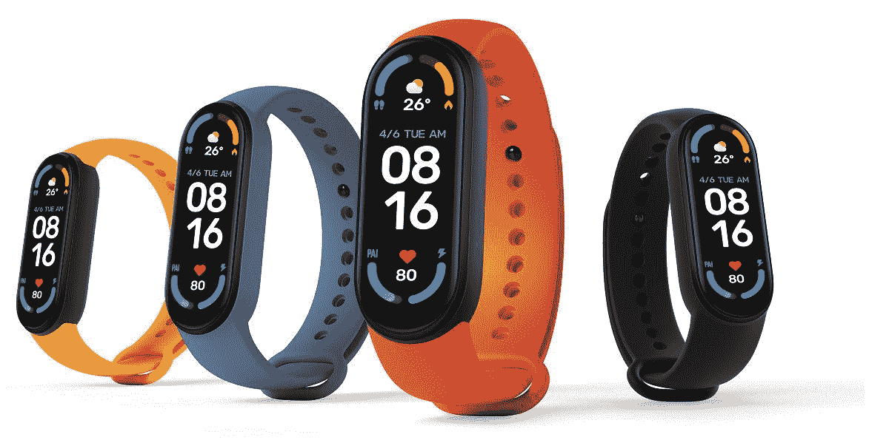

# 小米 Mi Band 6 (Mi Smart Band 6):规格、功能、定价、供货！

> 原文：<https://www.xda-developers.com/xiaomi-mi-band-6/>

谈到智能手表，小米可能不是一个家喻户晓的名字，但他们确实在健康和健身可穿戴市场占有相当大的份额。该公司广受欢迎的可穿戴设备 Mi Band(在欧洲也称为 Mi Smart Band)系列在全球范围内热销，这是因为它们的性价比非常高。今天，该公司公布了其下一款健身追踪器:Mi Band 6(又名 Mi Smart Band 6)。新款 Mi Band 6 的屏幕比 [Mi Band 5](https://www.xda-developers.com/xiaomi-mi-band-5-review/) 大了近 50%，提供了大量传感器、健身功能和健康监测功能，价格低廉。

## 小米 Mi Band 6 (Mi Smart Band 6):设计、规格和功能

与其前代产品一样，Mi Band 6 采用了多种颜色的硅胶表带，包括黑色、橙色、黄色、橄榄色、象牙色和蓝色。每条表带可以在 155-219 毫米之间调节，将主体牢牢固定在手腕上。实际设备的尺寸为 47.4 x 18.6 x 12.7mm 毫米，具有 1.56 英寸对角线的边到边 AMOLED 显示屏。

 <picture></picture> 

Xiaomi's Mi Smart Band 6 (Mi Band 6)

显示器是一个 152 x 486 分辨率的面板，亮度高达 450 尼特，并配有一层具有防指纹涂层的钢化玻璃层。小米的规格表没有透露 Mi Band 6 采用的芯片组，但这最终并不重要，因为我们面对的不是一款成熟的智能手表。然而，重要的是提供的众多健康和健身功能。

小米表示，小米智能手环 6 有一个 PPG 心率传感器、一个 Sp02 传感器、一个 3 轴加速度计和一个 3 轴陀螺仪传感器。该公司还提供了一种单独的 NFC 版可穿戴设备，尽管它的价格比标准型号略高。不过，如果你想要的只是健康和健身追踪，那么你有很多选择。Mi Band 6 具有可定制的功能模块，30 种健身模式(其中 6 种由可穿戴设备自动检测)，5ATM 防水，睡眠跟踪，压力监测，女性健康跟踪和空闲警报。

与大多数智能手表不同，Mi Band 6 一次充电可以轻松续航一周以上。凭借 125 毫安时电池，Mi Smart Band 6 可以持续使用超过 14 天，然后才需要使用随附的磁性充电器充电。给可穿戴设备充电也不到 2 小时。

小米 Mi Band 6 兼容使用 Mi Wear 应用程序或 Mi Fit 应用程序的 iOS 和 Android 设备。对于那些经常使用这项服务的人来说，它也与 Strava 应用程序兼容。

| 

规格

 | 

小米 Mi Band 6

 |
| --- | --- |
| **背带** | 

*   材料:硅胶
*   颜色:黑色、橙色、黄色、橄榄色、象牙色、蓝色
*   长度:155-219 毫米

 |
| **尺寸** | 47.4 x 18.6 x 12.7mm 毫米 |
| **显示** | 

*   1.56 英寸 AMOLED 显示屏
*   152 x 486 像素，326ppi
*   高达 450 尼特的亮度
*   60 多波段显示器
*   带防指纹涂层的钢化玻璃

 |
| **传感器** | 

*   Sp02 传感器
*   PPG 心率传感器
*   三轴加速度计
*   三轴陀螺仪

 |
| **健身功能** | 

*   可定制的功能模块
*   30 种健身模式
*   6 种自动检测模式:跑步、步行、跑步机、自行车、划船、椭圆
*   呼吸练习

 |
| **保健功能** | 

*   睡眠跟踪(睡眠呼吸质量、快速眼动和小睡)
*   压力监控
*   女性健康跟踪
*   个人活动智能
*   空闲警报

 |
| **耐久性** | 5 大气压防水 |
| **连接性&兼容性** | 

*   米穿 app
*   Mi Fit 应用
*   兼容 Strava 应用程序
*   蓝牙 5.0
*   安卓 5.0 及以上
*   iOS 10 及以上
*   相机遥控快门

 |
| **电池&充电** | 

*   磁性充电
*   充电时间:<2 hours
*   ≥ 14 days of standby time
*   125mAh LiPo battery

 |

## Pricing and Availability

Xiaomi is selling the Mi Band 6/Mi Smart Band 6 for ¥229 and the NFC edition for ¥279 in China. In Europe, the wearable costs just €44.99.

The Mi Smart Band 6 was launched alongside several new smartphones from Xiaomi, including the [米 11 Lite](https://www.xda-developers.com/xiaomi-mi-11-lite/) 系列、[米 11i](https://www.xda-developers.com/xiaomi-mi-11i/) 和[米 11 Ultra](https://www.xda-developers.com/xiaomi-mi-11-ultra/) 。由于这些都是 Android 手机，可穿戴设备应该可以很好地搭配。