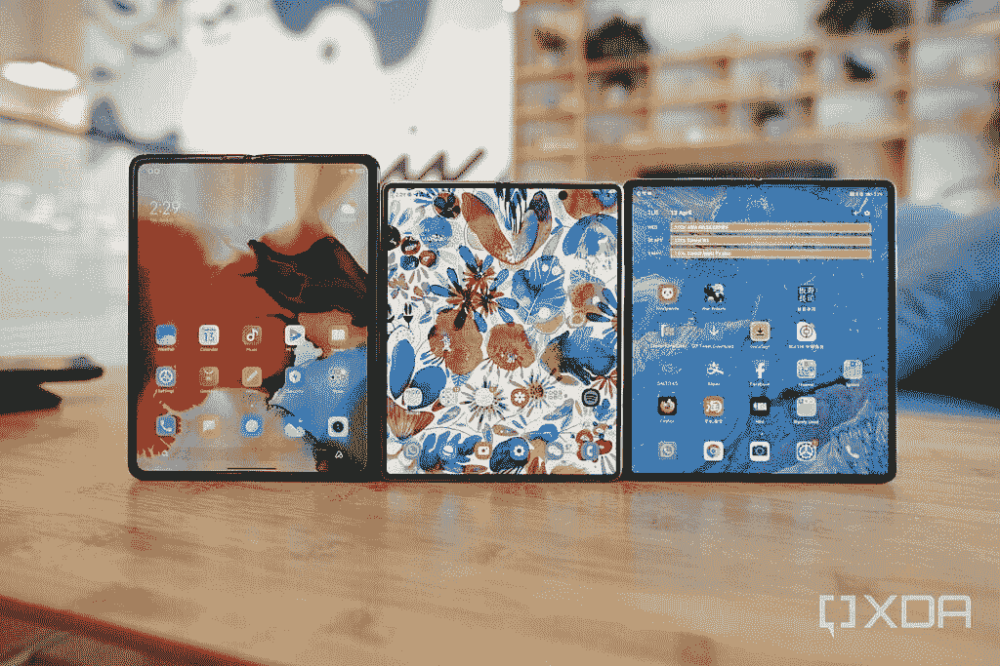
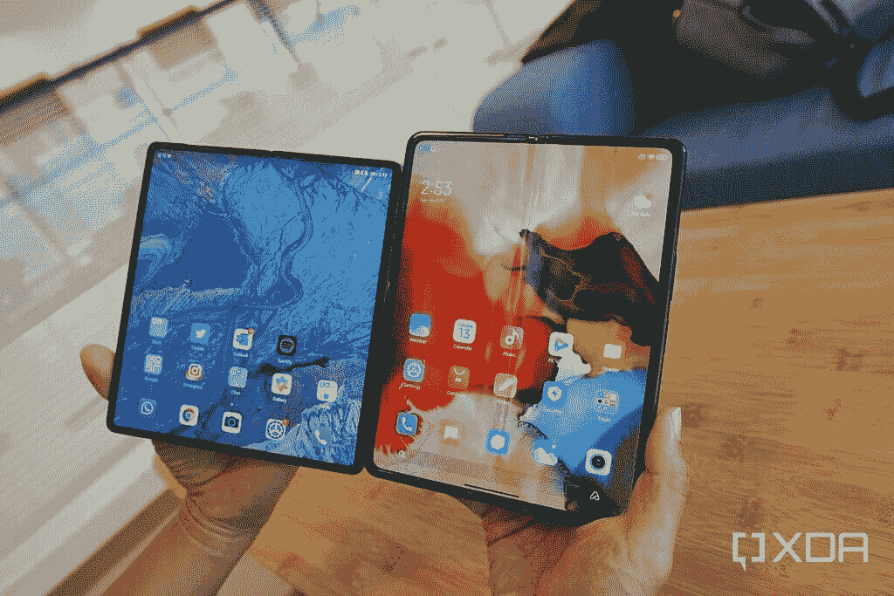
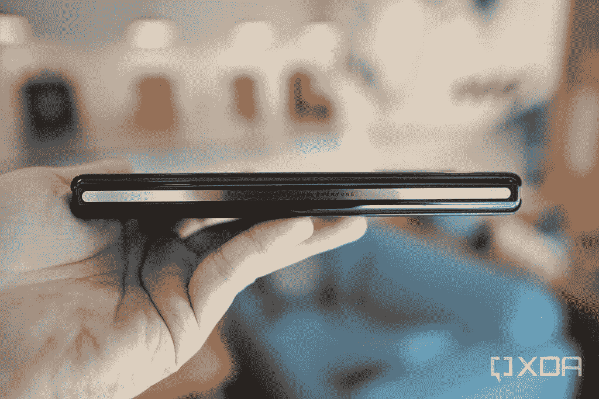
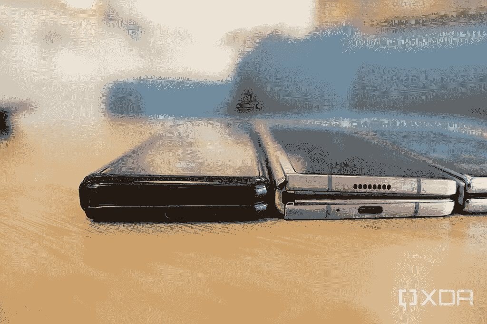
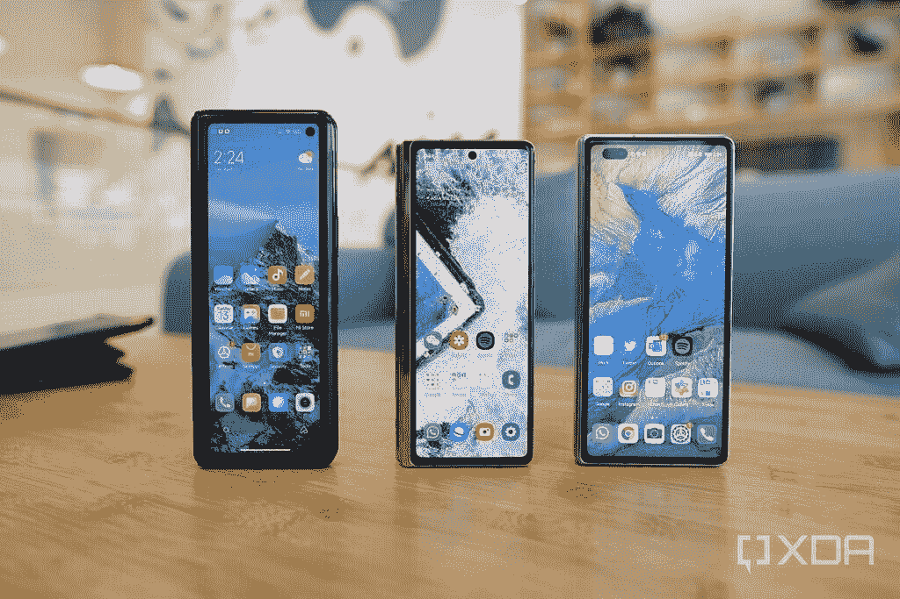

# 小米 Mix Fold 是小米让可折叠产品更实惠、更容易获得

> 原文：<https://www.xda-developers.com/xiaomi-mi-mix-fold-hands-on/>

小米有史以来第一款可折叠手机 [Mi Mix Fold](https://www.xda-developers.com/xiaomi-mi-mix-fold-launch/) 甚至还没有正式销售，但香港手机进口的疯狂速度已经确保了早期的零售单位。其中一家零售商，[三一电子](https://www.facebook.com/Trinityelectronic/)，非常友好地借给我们一台设备进行一个下午的测试。

当然，我将它与目前其他两款著名的可折叠手机进行了比较，分别是[三星 Galaxy Z Fold 2](https://www.xda-developers.com/samsung-galaxy-z-fold-2-review/) 和[华为 Mate X2](http://www.xda-developers.com/huawei-mate-x2-review) 。

 <picture></picture> 

The Xiaomi Mi Mix Fold (left) and the Samsung Galaxy Z Fold 2 (middle) and the Huawei Mate X2 (right).

### 小米米 MIX 折叠规格:点击展开

| 

规格

 | 

小米 Mi MIX Fold

 |
| --- | --- |
| **打造** |  |
| **尺寸&重量** | 

*   折叠后:173.2 毫米 x 69.8mm 毫米 x 17.2mm 毫米
*   展开后:173.2 毫米 x 133.4mm 毫米 x 7.62mm 毫米

 |
| **显示** | 

*   主要的
    *   8 英寸柔性有机发光二极管
    *   WQHD+分辨率(2480 x 1860)，4:3 宽高比
    *   60Hz 刷新率，120Hz 触摸采样率
    *   600 尼特峰值亮度
    *   杜比视界，HDR10+

*   副手
    *   6.5 英寸 AMOLED 屏幕
    *   2520 x 840 分辨率
    *   90Hz 刷新率，180Hz 触摸采样率
    *   900 尼特峰值亮度
    *   HDR 10 岁以上

 |
| **SoC** | 

*   高通骁龙 888
    *   中央处理器
        *   1x ARM Cortex-X1 @ 2.84GHz
        *   3 个 ARM Cortex-A78 @ 2.4GHz
        *   4x ARM Cortex-A55 @ 1.8GHz
    *   GPU: Adreno 660

 |
| **闸板&存放** | 

*   12GB LPDDR5 内存+ 256GB UFS 3.1 存储
*   12GB LPDDR5 内存+ 512GB UFS 3.1 存储
*   16GB LPDDR5 内存+ 512GB UFS 3.1 存储

 |
| **电池&充电** | 

*   5，020 毫安时电池
*   67W 有线涡轮增压

 |
| **安全** | 

*   侧装式指纹读取器

 |
| **后置摄像头** | 

*   **主要:**
    *   108 兆像素 HM2 传感器，1/1.52 英寸
*   **超宽:**
*   **【液体】镜头:**
    *   800 万像素自研镜头，80 毫米焦距(3 倍光学变焦)，3 厘米最小对焦距离(微距模式)，搭载自研浪涌 C1 图像处理芯片

 |
| **前置摄像头** | 20MP，定焦 |
| **端口** | 

*   USB 类型-C
*   没有 3.5 毫米耳机插孔

 |
| **音频&振动** | 

*   四声道扬声器
*   哈蒙·卡顿的声音
*   高分辨率音频认证
*   x 轴线性振动电机

 |
| **连通性** | 

*   高通骁龙 X60 4G LTE 和 5G 集成调制解调器
    *   5G:n1/n3/n5/n7/n8/n20/n28/n38/n40/n41/n77/n78/n79
    *   4G:LTE FDD:B1/2/3/4/5/7/8/12/17/20/28/32/66
    *   4G: LTE TDD: B38/40/41/42
    *   3G: WCDMA: B1/2/4/5/8
    *   2G: GSM: 850 900 1800 1900 MHz
*   双 SIM 卡，双 5G 待机
*   蓝牙 5.2
*   Wi-Fi 6E
*   NFC 和红外增强器

 |
| **软件** | 基于 Android 11 的 MIUI 12 |

* * *

## 小米米 Mix Fold 设计:没什么我们没见过的，但还是值得注意的

如果你远程关注智能手机新闻，小米 Mix Fold 的设计就不会有什么新意。这是三星率先推出的内部折叠手机设计，这意味着大型可弯曲显示屏可以向内折叠，像一本书一样合上，外部还有一个较小的辅助玻璃屏幕。

在 Mi Mix Fold 上，外部较小的屏幕尺寸为 6.5 英寸，长宽比为 27:9，非常高且窄。这使得手机在折叠时，具有 Galaxy Fold 和 Galaxy Z Fold 2 的遥控器(或糖果条)的感觉。90Hz 的刷新率不是最快的，但 MIUI 通过可爱的动画进行了很好的优化，所以用户界面仍然感觉流畅。

更大的内部折叠显示屏尺寸为 8 英寸，看起来很棒。它的亮度高达 600 尼特，可以输出 10 位颜色。不幸的是，它只有 60Hz 的刷新率，如果你从一个角度看手机，中间有一条明显的折痕。折痕问题也存在于三星 Galaxy Z Fold 2 中，不管怎么说。

我就直说了吧:说到折叠方面，Mi Mix Fold *并没有*比华为 Mate X2 更好的硬件。华为的可折叠“修复”了一些问题，例如减少折叠显示屏的折痕，以及有一个完全折叠的铰链，这些问题在小米 Mix Fold 中又出现了。小米可折叠手机的边框，无论是内屏还是外屏，都比华为 Mate X2 的边框大。

 <picture></picture> 

The Huawei Mate X2's screen (left) and the Mi Mix Fold's screen (right).

但是语境是非常必要的。华为 Mate X2 的售价为 17999 元人民币(2700 美元)，而小米 Mix Fold 的售价为 9999 元人民币(1500 美元)。此外，由于美国的禁令，Mate X2 不能运行谷歌的核心服务，但小米的 Mi Mix Fold 可以。因此，尽管 Mate X2 是我拥有过的最令人印象深刻的手机硬件(我们的主编米莎尔[对该硬件也有很高的评价](http://www.xda-developers.com/huawei-mate-x2-review)，但现实仍然是，Mi Mix Fold 更具主流吸引力，不仅在中国，而且在全球范围内。

 <picture></picture> 

The Mi Mix Fold.

Mi Mix Fold 的铰链很坚固，与锋利的 Galaxy Z Fold 2 相比，它在四周都有更圆润的感觉，尤其是在铰链角。

 <picture></picture> 

Mi Mix Fold (left) and Z Fold 2 (right).

手机内部是高通骁龙 888，内存为 12GB 或 16GB，存储空间为 256GB 或 512GB，电池容量为 5，020 毫安。后者是迄今为止可折叠手机中最大的电池。考虑到这款手机也只有 90Hz/60Hz 面板，电池寿命应该很长——我猜很容易就能达到一天半。如果您需要充值，可以通过随附的充电砖以 67W 的速度为手机充电。

* * *

## 小米 Mix 折叠相机:液体镜头像广告宣传的那样工作

Mi Mix Fold 采用了三摄像头主系统，由我们之前在各种小米设备中看到的 108MP 主摄像头、13MP 超宽摄像头和小米大肆炒作的 8MP“液体镜头”组成。由小米自主研发的液体镜头具有一层液体，通过电压改变传感器的焦点和焦距。我不是相机硬件工程师，但我可以告诉它的工作，一个镜头可以产生 3 倍无损光学变焦，也可以捕捉微距镜头。

 <picture></picture> 

The Mi Mix Fold includes the so-called liquid lens at the top, a 108MP main camera in the middle, and a 13MP ultra-wide in the bottom.

在手机正面周围，Mi Mix Fold 有一个 200 万像素的自拍相机。大屏幕内部没有前置摄像头。

我只有大约三个小时的手机时间，所以我只能做一些表面水平的相机测试，但我可以说 Mi Mix Fold 的相机相当不错。如果你拍摄的对象相对较近，主 108MP 传感器会产生自然的散景，即使直接对着太阳拍摄，也会产生出色的动态范围。

超宽的好像还行。在下面的照片中，颜色有点柔和，动态范围不是最好的。公平地说，这是一个相对苛刻的拍摄条件，因为我正对着太阳。我也被业界最好的超宽相机 OPPO Find X3 Pro T1 和 T2 一加 9 Pro T3 宠坏了。

如前所述，液体镜头工作正常。我可以从一个传感器获得清晰的 3 倍变焦和微距拍摄。作为一个变焦镜头，它比 Galaxy Z Fold 2 微不足道的 12MP 2x 长焦镜头要好，但远远低于华为 Mate X2 的 10x 潜望镜变焦镜头。

* * *

## 小米米 Mix Fold 软件:由于某种原因，现在缺少 PC 模式

小米 Mi Mix Fold 在 Android 11 上运行 MIUI 12，如果你最近用过小米手机，你就会知道软件体验。应用程序图标五颜六色，甚至有点花哨，动画充满了异想天开的感觉(就像一个应用程序在卸载后爆炸成碎片)。我个人将 MIUI 放在第四或第五喜欢的安卓 UX 皮肤的位置，在 OPPO 的 ColorOS 和一加的 OxygenOS(我最喜欢的两个)下面，但在华为的 EMUI 和 Vivo 的 FunTouch 上面。就排名而言，它与三星的 OneUI 和谷歌自己的股票 Pixel launcher 差不多。

Mi Mix Fold 的软件体验与我用过的其他折叠手机很相似。如果你在大的内部屏幕上观看，Instagram 故事将会切断顶部和底部，如果你在小屏幕和大屏幕之间切换，应用程序通常需要重新启动和调整大小。MIUI 为应用程序提供了分屏多任务和浮动窗口，因此更大的屏幕不会被浪费。

然而，小米在 Mi Mix Fold 推出期间宣传的“PC 模式”(将 UI 变成类似桌面 UI 的东西)在我的设备上并不可用。我花了 30 分钟搜索手机的设置，找不到模式。我假设这将通过软件更新来实现，但尽管如此，我还是很失望，因为这是小米的可折叠手机区别于华为 Mate X2 和三星 Galaxy Z Fold 2 的一个特征。

## 小米 Mix Fold 早期印象:小米真的在做“人人创新”

就像我之前说过的，如果我们只靠纯硬件，Mi Mix Fold 不会做任何智能手机粉丝之前没有见过的事情(除了液体镜头)。如果你拿过 Galaxy Fold 或者 Z Fold 2，Mi Mix Fold 会感觉很熟悉。

但 Mi Mix Fold 仍因其定价而引人注目。长期以来，可折叠手机的批评者一直引用两个主要原因来表示怀疑——可折叠手机的脆弱性，以及两倍于平板旗舰手机的天价。

 <picture></picture> 

The three foldables phones from Xiaomi, Samsung and Huawei

Galaxy Z Fold 2 在我看来主要解决了耐用性/脆弱性问题。我已经用了七个月了，没有任何问题——它的转轴仍然像石头一样坚固。我也没有看到任何关于 Galaxy Z Fold 2 故障的广泛互联网投诉，所以可以肯定地说，耐用性在现阶段几乎没有意义。

这就剩下定价了，这就是小米的用武之地。Mi Mix Fold 的起价约为 1500 美元，远低于 Galaxy Z Fold 2 和 Mate X2 的 2000 美元和 2700 美元。虽然 1500 美元对普通消费者来说仍然很高，但现在已经足够接近普通平板旗舰手机，可折叠手机的“加价”几乎已经消失。也许再过半年，可折叠价格还能再降几百。

小米的座右铭是“为每个人创新”，Mi Mix Fold 再次证明了小米是认真的。这是小米让所有人都能买得起可折叠手机的开始，而不仅仅是有很多钱可以花的技术极客。