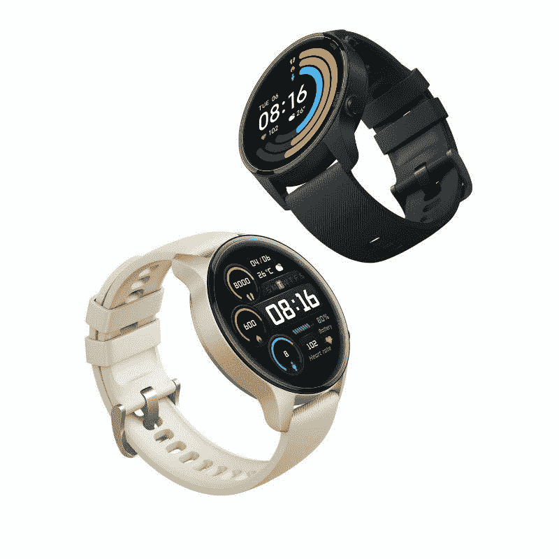

# 小米手表旋转积极审查:伟大的硬件，仍然有缺陷的软件

> 原文：<https://www.xda-developers.com/xiaomi-mi-watch-revolve-active-review/>

智能手表和智能手环有什么不同？仅仅是外形因素吗？还是说智能手表应该更智能、更有能力？这些是我在过去一周评论新的 Mi 手表 Revolve Active 时一直在处理的一些问题。抛开这个拗口的名字不谈，小米手表 Revolve Active 是小米为印度市场推出的新智能手表，它针对的是运动爱好者，比其在印度的前辈[小米手表 Revolve](https://www.xda-developers.com/xiaomi-mi-watch-revolve-review/) 提供了更多的运动跟踪选项，小米手表几乎拥有所有的功能。那么小米手表 Revolve Active 是不是也像小米手表 Revolve 一样是一款被美化的智能手环呢？

有几件事需要注意——你们中的一些人可能会认识到小米手表 Revolve Active，因为它与在中国销售的小米手表彩色运动版和在国际市场销售的[小米手表是同一款智能手表](https://www.xda-developers.com/xiaomi-mi-watch-smartwatch-mi-65w-fast-charger-with-gan-global-launch/)。

**浏览此评论**

### 小米米手表 Revolve 活动规格:点击展开

## 小米 mi 手表旋转活跃:规格

| 

规格

 | 

小米米手表旋转活跃

 |
| --- | --- |
| 建设 | 

*   玻璃纤维增强聚酰胺框架
*   聚碳酸酯背面
*   TPU 表带
*   5ATM

 |
| 尺寸和重量 | 

*   46 毫米表壳
*   45.9×53.35×11.8 毫米(无突起)
*   32 克(表壳)

 |
| 显示 | 

*   1.39 英寸 AMOLED
*   454 x 454 像素
*   326PPI

 |
| 电池和充电 | 

*   420 毫安时
*   双弹簧针充电器
*   额定典型使用 16 天

 |
| 传感器 | 心率传感器、加速度传感器、陀螺仪、地磁传感器、气压传感器、环境光传感器 |
| 连通性 | 

*   蓝牙 5.0
*   全球定位系统，GLONASS，伽利略，BDS

 |
| 声音的 | 语音助手的麦克风 |

***关于本次评测:**小米印度借给我们的 Mi Watch Revolve Active 进行评测。这个评测是在使用一周左右之后。小米在这个评论的内容上没有任何投入。*

## 设计和展示

小米对小米手表 Revolve Active 进行了功利主义的设计。圆形表盘给了它传统手表的感觉，就像 Mi 手表 Revolve，但它看起来也很普通。除了圆脸，手表上还有两个按钮——home 和 sport。虽然默认情况下“运动”按钮会打开“健身程序”菜单，但可以对其进行配置以启动特定的健身程序。home 键可以带你回家，也可以在 app 抽屉里。根据长按持续时间的不同，你还会获得不同的功能，如访问亚马逊 Alexa 语音助手或强制重启。

Revolve Active 的表壳由玻璃纤维增强聚酰胺制成，背面是聚碳酸酯，不像 Revolve 那样采用金属设计，背面是聚碳酸酯。据说玻璃纤维增强聚酰胺材料强度好，重量相对较轻。因此，小米智能手表非常轻，没有表带时仅重 32 克。这使得它更容易佩戴更长时间，尤其是在睡觉的时候。

你还可以得到一个 22 毫米的用户可更换的 TPU 表带，这是非常体面的。小米为智能手表提供了三种颜色选择——米色(我收到的评论)、黑色和海军蓝。还会有一些额外的表带颜色可供选择，您可以单独购买。

触摸屏是 1.39 英寸有机发光二极管，分辨率为 454x454 像素，非常棒。屏幕也变得非常亮，所以我在室内和室外观看都没有问题。它也很有活力，该公司正在利用 OLED 面板的存在，提供一个永远在线的显示选项。我最初试图在没有永远显示选项的情况下使用手表，等待多花几分之一秒来检测手腕转动手势并醒来实在太烦人了。

在手表的背面，你会发现一堆传感器，用来跟踪你的心率和血氧水平。你还会注意到底部用于充电的弹簧针。该公司捆绑了一个比手表本身略小的磁性充电器。你不会得到一个电源适配器，但你可以将充电器的 USB-A 端口插入周围几乎任何智能手机的墙上适配器。

这款智能手表还具有 5 个大气压(水下 50 米)的防水功能，所以你可以在淋浴或泳池中携带它。

总体来说，硬件放在一起很好，感觉很好。我唯一的问题是它的大小。小米只销售一种尺寸的外壳——46 毫米——对于手腕纤细的人来说会感觉非常大。

## 软件

Mi Watch Revolve Active 运行在一个似乎基于 RTOS(实时操作系统)的专有操作系统上。它与 Android 上的小米 Wear 应用程序和 iOS 上的小米 Wear Lite 应用程序配对进行设置。无论你是否拥有一部小米手机，你都可以在几乎所有现代智能手机上获得相同的功能。小米 Wear 应用程序还显示了智能手表完成的所有跟踪的细节。您还可以使用该应用程序来控制哪些应用程序向您发送通知，您是否可以获得来电详细信息，您可以在智能手表的主屏幕上看到哪些小部件，等等。

此外，您可以使用该应用程序下载额外的手表表盘。智能手表上总共有四个预装的表盘，但该应用程序可以让你访问 100 多个表盘。小米没有提供任何简单的方法来侧装额外的 watchfaces，但如果你知道你在做什么，你可以。如果你不知道，小米的手表表盘集合相当不错，它包括模拟和数字类型的手表表盘，有些甚至包括你的心率、步数等细节。

此外，当您启用了常亮显示屏且未与腕表互动时，还有八种待机表盘可供使用。

由于 Mi 手表 Revolve Active 上没有旋转表圈或表冠，因此您只能使用触摸屏与之互动。手势相当简单——向下滑动获得通知，向上滑动获得控制面板，从左边缘滑动返回，向左或向右滑动导航部件。

我与智能手表互动的体验基本上还不错，除了有几次手表死机。除了强制重启之外，什么都不管用。我还遇到了“永远在线”显示的问题，尽管已经启用，但在检查通知后，有几次似乎无法工作。屏幕刚刚进入休眠状态。再次唤醒手表似乎可以让一切恢复正常，但这很烦人。

永远在线显示屏的另一个问题是它并不智能。因此，即使当我把手表从手上拿下来时，它的屏幕仍然开着，因此当它显然没有被使用时，就浪费了电池寿命。

手表上的通知镜像也非常简单。你不能用它做很多事情。您将看到已收到的通知，但您不能回复信息或执行任何其他操作。删除已查看的单个通知的过程也很繁琐。你必须点击打开通知，然后返回到所有通知，这将删除它。

就应用程序而言，你只有一套基本的应用程序——天气、手电筒、查找我的手机、指南针、气压、呼吸、手机摄像头控制、秒表、计时器、闹钟等等。没有日历应用程序来告诉你即将到来的约会，也没有内置的音乐播放器来帮助你在没有手机的情况下跑步时使用无线耳机听音乐。你也没有一个应用商店来下载更多的应用程序。这些限制在这个价格范围及以上的手表上很常见，但它们仍然是限制，它们妨碍了将这款手表称为真正的“智能手表”。

另外，如前所述，你所有的健身和健康跟踪都与小米 Wear 应用程序同步。不过，你也可以要求应用程序将跟踪数据与 Strava 或 Apple Health 同步，以获得更多见解。

你确实有一个 Alexa 形式的语音助手，但由于没有扬声器，你只能得到文本形式的答案。Alexa 支持也意味着你可以使用智能手表来控制你的兼容智能电器。由于智能手表使用你的手机来访问 Alexa 的服务器，响应时间稍微慢了一点，但仍然可用。此外，你只能得到一个低调版本的语音助手。

总的来说，Mi Watch Revolve Active 的软件还有很多不足之处。它提供的大部分功能都可以在智能手环上完成，包括小米出售的那些产品，如 [Mi Band 5](https://www.xda-developers.com/xiaomi-mi-band-5-review/) 。鉴于我前面提到的问题，软件中似乎也有错误，但这些可以通过软件更新很容易地修复。但考虑到这款相同的智能手表已经以不同的名称在其他市场出售，很遗憾看到这些问题还没有得到解决。我们甚至在我们的 [Mi Watch Revolve review](https://www.xda-developers.com/xiaomi-mi-watch-revolve-review/) 中提到了其中一些，所以看到它们在这里重复出现让我们感到怀疑。话虽如此，手表提供的应用程序和功能确实很棒。

[appbox googleplay ]

## 健身和健康跟踪

Mi 手表 Revolve Active 在健身和健康跟踪方面提供了很多功能。它支持 117 种运动模式，这意味着你可以跟踪从步行和跑步到飞镖和游泳的一切。然而，你只会获得更丰富的指标，17 个核心模式是手表中预先配置的，不需要使用应用程序添加。

该公司还在手表中添加了 GPS，因此您可以在跑步、散步和其他类似活动中跟踪您的路线，而无需使用手机。

在我走路的时候，小米智能手表准确地计算了步数，这是我通过手动计算步数并与智能手表显示的数字进行比较来检查的。这款手表在跟踪其他活动方面也很出色，并提供了详细的指标，对喜欢跟踪锻炼表现的人来说很有用。

我发现智能手表的一个缺点是自动锻炼检测。它应该会自动检测你何时开始走路或跑步，但我尝试了多次都没有成功。有一次我确实看到了自动锻炼检测工作，实际上我刚刚完成了一次跑步。所以，总而言之，还是用小米手表手动开始锻炼比较好，其实也不麻烦。

智能手表跟踪的活动指标似乎很准确。显然，该公司在广受欢迎的 Mi Band 阵容和 Firstbeat 算法方面的经验对其跟踪健身相关数据有很大帮助。Firstbeat 以其健身和运动的生理分析而闻名。

虽然 Mi Watch Revolve Active 在健身方面表现良好，但其健康和保健功能并不出色。该公司在手表上增加了能量、压力和睡眠监测等健康功能。虽然睡眠监测在某种程度上看起来确实很好，但它只把醒来后躺在床上浏览手机算作睡觉，如果我想要准确的数据，这并不是很好。此外，这款手表不会跟踪白天的小睡。同样，手表显示的能量和压力水平有时只是随机的，与我的实际感受不匹配，因此它们几乎没有用处。

在其他与健康相关的功能中，Mi Watch Revolve Active 会持续跟踪您的心率，并让您监控您的血氧水平。此时，我无法将手表给出的心率数据与另一台设备进行比较，但除了一些例外，我觉得一切正常，但我不能确定。为什么？因为我看到手表躺在桌子上时似乎在跟踪心率。我不知道我的桌子有一颗心。

在智能手表和智能手环中加入 SpO2(血氧)传感器是目前的时尚，但大多数设备实际上并没有提供任何可行的推断。同样，当 Mi Watch Revolve 处于活动状态时，您可以检查您的血氧水平，但不会获得更多信息。鉴于这两个传感器都不是真正的医疗级，它们提供的任何数据只能帮助业余跟踪。

总的来说，在健身和健康跟踪方面，Mi Watch Revolve 在健身跟踪方面取得了积极的胜利，但其健康和健康功能远非完美。

## 电池寿命

小米 Mi Watch Revolve Active 在电池方面很棒。小米承诺在没有常亮显示屏的情况下电池续航时间为 14 天，虽然我没有时间全面测试这一承诺，但我的使用情况表明，平均使用时间可以轻松持续 12-13 天左右。根据小米的说法，当你使用永远在线的显示屏时，电池寿命会减少一半，所以即使你只有大约 5-6 天的电池寿命，这对任何智能手表来说都很好。

Mi Watch Revolve Active 从 0 到 50 充电需要 35 分钟，达到 100%需要 1.5 个多小时。如果使用手表的时间比我从一周的使用中推断的结果更长，我会更新这一部分。

## 你应该买小米手表吗？

在这篇评论的开头，我围绕智能手表和智能手环的区别提出了一些问题。随着智能手表作为一个产品类别的发展，他们已经设法为自己创造了一个不同于智能手环的空间，提供了一些功能，如广泛的应用选择，增强的通知支持等等。这是我对智能手表的期望。

不幸的是，Mi 手表 Revolve Active 几乎没有提供任何这些功能。正如我所猜测的那样，它几乎是智能手表中的一个美化了的智能带。当然，它有很多优点，比如出色的显示屏、超长的电池续航时间、大范围的健身跟踪选项，以及极具竞争力的价格(₹8,999 有一段时间，之后是₹9,999)。但就智能手表的功能而言，它的局限性令人失望。此外，智能手表的软件需要更多的抛光来消除这些缺陷，这是我们发现自己在重复 Mi Watch Revolve 的过去经验。

那么该不该买呢？好吧，如果你对你的智能手表不抱太大期望，并且只满足于在一个外观体面、电池续航时间长的框架中获得健身跟踪功能，Mi Watch Revolve Active 可能会对你有用。但如果你想要真正的智能手表体验和精致的软件，你应该去别处看看。

 <picture></picture> 

Xiaomi Mi Watch Revolve Active

##### 小米米手表旋转活跃

Mi Watch Revolve Active 是小米面向印度推出的新款智能手表。它在国际上被称为 Mi Watch，在中国被称为 Mi Watch 彩色运动版。