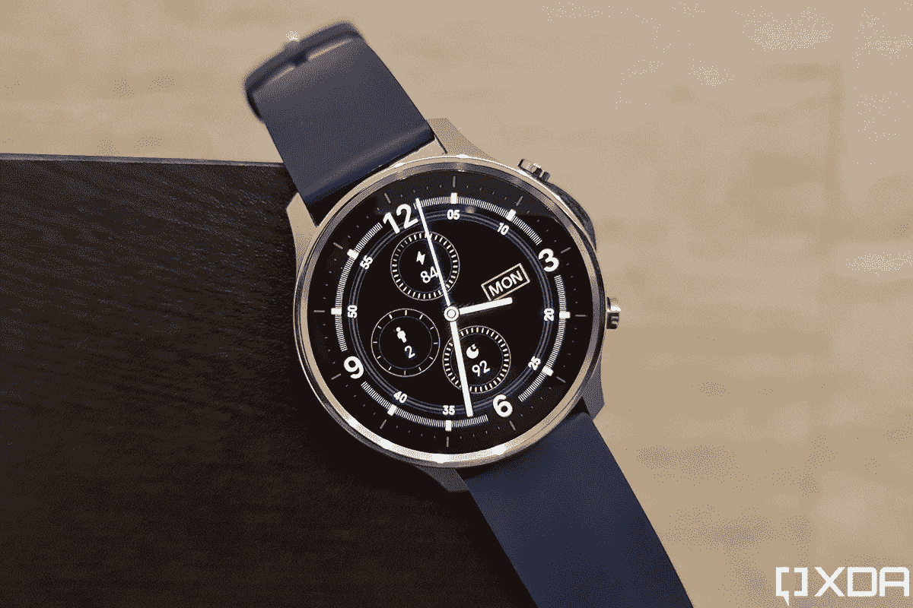

# 小米手表旋转审查:伟大的硬件被错误的软件扼杀

> 原文：<https://www.xda-developers.com/xiaomi-mi-watch-revolve-review/>

在让印度[迷上其 Mi Band 系列健身追踪器](https://www.xda-developers.com/xiaomi-mi-band-5-review/)之后，小米最近在该国推出了 Mi Watch Revolve。小米手表 Revolve 的定价为₹10,999，旨在为现有的小米手环用户提供高级升级，或者为那些对运动健身追踪器美学不感兴趣的人提供第一款智能手表。凭借其闪亮的金属外壳、AMOLED 显示屏和引人注目的功能集，智能手表在纸面上看起来是一个很好的选择。但是小米手表 Revolve 有复制小米乐队成功的潜质吗？请继续阅读，寻找答案。

## 小米手表 Revolve:规格

| 

规格

 | 

小米 mi 手表旋转

 |
| --- | --- |
| **尺寸&重量** | 

*   46.2 x 53.3 x 11.4 毫米(不包括带子和突出部分)
*   40 克(不包括表带)

 |
| **材料** | 

*   不锈钢表壳，硅胶表带

 |
| **表带** | 

*   标准 22 毫米快速释放

 |
| **显示** | 

*   1.39 英寸 AMOLED 触摸屏
*   454 x 454 像素

 |
| **兼容性** | 

*   Android 4.4 或 iOS 10 及以上

 |
| **传感器** | 

*   PPG 心率传感器
*   三轴加速度传感器
*   陀螺仪
*   地磁传感器
*   环境光传感器
*   压力感受器

 |
| **连通性** | 

*   蓝牙 5.0 BLE
*   GPS + GLONASS

 |
| **NFC 支付** | 不 |
| **电池** | 420mAh，专有充电坞 |
| **IP 等级** | 5ATM 防水，无 IP 等级 |
| **颜色** | 铬银，午夜黑 |

***注:**小米印度借给我们铬银材质的 Mi Watch Revolve 用于本次评测。这篇评论是用了一个月后写的。小米没有任何关于这一审查内容的意见。*

## 米手表旋转:设计与展示

小米手表 Revolve 的优质设计使其有别于小米的小米手环系列健身追踪器，尽管它在功能上只不过是一个健身追踪器。它的特点是 46 毫米圆形不锈钢外壳，带有 AMOLED 触摸显示屏，硅胶表带带有传统的表扣，右边有两个按钮可以控制它的所有功能。

虽然不锈钢表盘加工得很好，没有任何锋利的边缘，但我不喜欢它的尺寸。智能手表戴在我的手腕上看起来很大，我可以有把握地说，它不是为那些喜欢更低调外观的人设计的。最重要的是，我收到的铬银版本对我来说有点太亮了，但谢天谢地，小米确实提供了一个哑光黑色版本。

小米手表旋转是巨大的，它不是一个手腕纤细的人很好的选择。

尽管表壳厚重，但 Mi Watch Revolve 采用了 1.39 英寸的 AMOLED 显示屏。这是因为显示屏被带有表盘标记的厚边框所包围。小米本可以很容易地修剪这个边框，并提供一个更小的 42 毫米或 44 毫米的外壳，采用相同的显示屏，特别是因为这些表盘标记在数字手表上没有什么意义。

Chrome Silver Mi 手表 Revolve 配有海王星蓝硅胶表带，但小米确实宣传了三种颜色选择——宇宙尘栗色、太空黑和星光橄榄色。小米的网站还列出了第五款午夜黑色皮革表带，但在撰写这篇评论时，这些替代选项都没有可供购买。值得庆幸的是，小米手表 Revolve 采用了标准的 22 毫米快速释放表带，如果你不喜欢手表附带的那款手表，还可以购买大量第三方选项。

来到显示器，Mi Watch Revolve 上的 AMOLED 面板分辨率为 454 x 454 像素，峰值亮度为 450 尼特。显示屏色彩鲜艳，亮度足以在阳光直射下获得最佳可见度。这款手表提供了 5 级亮度设置，我在大部分测试中使用的是 3 级亮度，完全没有问题。由于 AMOLED 面板，手表还包括一个始终显示选项。您可以打开它，让手表显示时间和日期，即使您关闭显示器。但我不建议使用它，因为它会大大缩短手表的电池寿命。

## 小米手表旋转:功能

如前所述，Mi Watch Revolve 只不过是一个加强版的健身追踪器。因此，它提供了*几乎*所有你能在 Mi Band 上找到的功能。该手表包括 10 种运动模式、连续心率监测、睡眠跟踪、通知提醒和音乐播放控制。但与 Mi Band 不同的是，Mi Watch Revolve 利用 Firstbeat 的运动算法来跟踪其他一些指标。这些包括最大摄氧量、身体能量监测和压力水平。你可以在手表上和小米 Wear 应用程序中跟踪所有这些指标。

在手表上，你会发现主屏幕右侧有七个小部件，包括心率、能量、睡眠、天气、压力、音乐和活动历史。正如你在所附图片中看到的，这些小部件显示了关于每个特性的最重要的信息。心率小部件显示当前心率，以及每天的最高和最低心率。

能量微件显示您当前的能量水平(满分为 100 分)，睡眠微件显示您昨晚的睡眠信息，天气微件显示当前温度、每日最小/最大值和天气信息，压力微件根据您的心率变异性显示您的每日平均压力，活动历史微件显示您一天中消耗的卡路里、步数和站起来的次数。

如果你想在手表上看到这些功能的更多细节，你需要通过点击顶部按钮打开应用抽屉，选择应用，然后在所有可用屏幕中滑动以查看更多细节。在应用程序抽屉中，你还会发现一些附加功能，如呼吸锻炼计时器、闹钟、秒表、计时器、气压计、指南针和“查找我的手机”选项。

除了这些小部件，手表还会向您显示白名单应用程序的接收通知。通知一到达就显示在表盘上，以后你可以像在安卓智能手机上一样拉下通知遮光板来查看。这款手表还有一个快速设置菜单，你可以在主屏幕上向上滑动来访问它。它包括六个快速设置块，用于打开/关闭手电筒、唤醒、切换免打扰模式、锁定显示屏、禁用自动显示屏关闭和打开完整的设置菜单。

在“设置”菜单中，您可以选择不同的表盘、调整显示屏亮度、打开免打扰模式、配置唤醒功能、自定义心率监测、启用/停用活动提醒、打开蓝牙断开提醒、配置附加显示屏设置、调整振动效果，以及打开一项设置以便在收到通知时点亮显示屏。您还可以在主屏幕上点击并按住，然后在可用选项中滑动，从而在已安装的手表表盘之间进行切换。

此外，米手表旋转有全球定位系统板载。对于那些不喜欢在外出慢跑时携带智能手机的人来说，这是一个很好的补充。理论上，这些功能对于这个价位的智能手表来说已经足够了。然而，小米手表 Revolve 缺少一些类似相机快门控制的功能，我们希望小米可以在未来的更新中添加这些功能。

但在添加任何新功能之前，小米必须修复我在过去一个月遇到的大量错误。以下是我在 Mi 手表 Revolve 上遇到的所有问题的快速总结:

*   步跟踪不准确。当我坐下的时候，手表有时会计算步数，而当我走动的时候，它有时什么也不显示。
*   手表有时根本不记录站立数据，即使记录了，也大多不准确。根据配套 app 收集的数据，最近一个月有两天我根本没站起来。那不太可能。
*   唤醒功能仅在 50%的时间内有效。
*   在拒绝手表的来电后，它会持续振动约 30 秒。
*   天气/温度信息并不经常同步，即使同步，有时也不准确。
*   GPS 需要大约 10 分钟来锁定，这导致不准确的位置跟踪。
*   睡眠追踪并不准确，手表显示的数字经常比我实际的睡眠时间低/高。最重要的是，它不会跟踪白天的小睡。
*   从小米 Wear 应用程序同步手表面部是一个繁琐的过程。该应用程序通常不会加载所有可用的表盘，而是显示空白圆圈。
*   下载它加载的手表表面需要令人沮丧的长时间。当手表 face 下载时，不能保证它能与手表成功同步。
*   最大摄氧量读数似乎也不准确。快走 15 分钟后，我的最大摄氧量为 0。我不太清楚那是怎么回事。

而且这些问题不仅限于我的单位。快速浏览一下小米穿戴应用的 [Play Store 评论可以发现，一些早期买家也遇到了类似的问题。](https://play.google.com/store/apps/details?id=com.xiaomi.wearable&hl=en_IN&gl=US&showAllReviews=true)

由于过去几周不满的小米手表 Revolve 买家发布了一系列 1 星评论，小米 Wear 应用程序目前在 Play Store 上的评级为 2.7 星。

一些用户还强调了其他问题，如缺乏 12 小时时间格式，没有为现有 Mi Band 用户从 Mi Fit 应用程序同步数据的选项，以及更多我在测试中没有发现的问题。这为小米手表 Revolve 描绘了一个可怕的形象，小米如果想复制其小米手环阵容所取得的成功，就需要尽快解决这些问题。

## 电池寿命和充电

目前，小米手表 Revolve 的唯一可取之处是其出色的电池续航时间。在我的测试中，这款手表一次充电可持续 13 天，持续心率监测功能打开，常亮显示屏关闭，屏幕亮度设置为 3 级，适度使用 GPS，四个常用应用程序的通知功能打开。这与小米声称的 14 天续航时间相符。然而，在使用永远在线显示功能时，电池寿命受到了巨大的打击，手表在短短 8 天内从 100%下降到 8%。再加上频繁使用 GPS，手表的电池寿命下降到 18 小时左右。

在我看来，永远在线的显示功能不值得权衡。这有点多余，因为无论如何你都要抬起手腕来查看时间，唤醒功能应该可以做到这一点(如果小米通过 OTA 更新修复它)。充电性能也令人满意，专有的充电支架设法在大约两个小时内将 420mAh 电池恢复到 100%。

## 你应该买小米手表吗？

现在你可能已经猜到了，我不会推荐目前状态的 Mi Watch Revolve。小米真的需要加快步伐，推出一个(或几个)更新来修复智能手表的所有软件问题。即使这些问题得到解决，我也可能不会推荐它，因为有几个更便宜的替代产品，如 [Amazfit GTS(评论)](https://www.xda-developers.com/huami-amazfit-gts-review-surprisingly-different-apple-watch-fitness-tracker-smartwatch/)和 [Amazfit GTR(评论)](https://www.xda-developers.com/huami-amazfit-gtr-review-affordable-smart-watch/)，它们提供了更多的功能，并且不会受到这么多软件问题的困扰。

如果你不想买 Amazfit 的旧型号，你也可以等待即将推出的 GTR 2 和 GTS 2，它们最近在美国和英国推出。Amazfit 的第二代智能手表可能比 Mi Watch Revolve 略贵，但它们提供了额外的功能，如亚马逊 Alexa 支持、板载音乐存储和播放等，以证明其较高的标价是合理的。

 <picture></picture> 

Xiaomi Mi Watch Revolve

##### 小米 mi 手表旋转

小米 Mi Watch Revolve 提供了充满活力的显示屏和出色的电池续航时间，但糟糕的软件体验仍有许多不足之处。