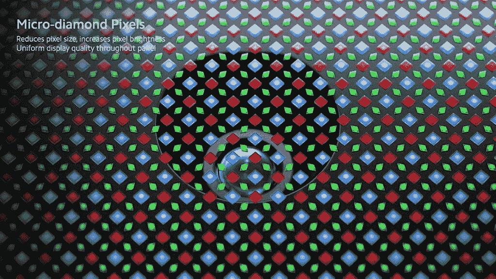
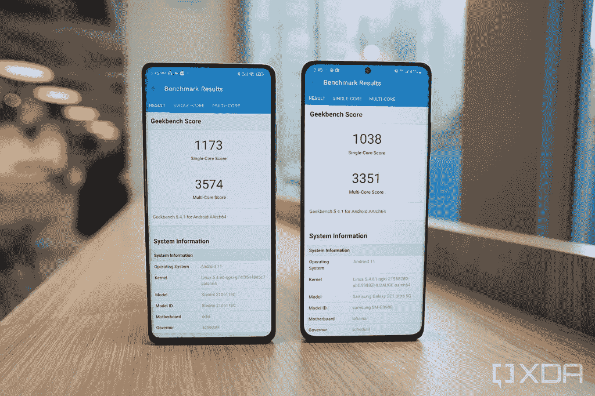

# 小米 Mix 4 预告:最初的小米 Mix 愿景，终于实现到了极致

> 原文：<https://www.xda-developers.com/xiaomi-mix-4-hands-on/>

小米于 2011 年开始制造智能手机——小米 1 于当年 8 月 16 日发布。虽然该公司很快在家乡中国取得了商业成功，但直到 2016 年 10 月 25 日，该公司才在全球舞台上引起了显著的轰动，并引起了人们的关注。那一天，小米发布了 Mi Mix，这是一款所谓的“无边框手机”，在屏幕的顶部、左侧和右侧几乎没有边框。我仍然记得那天西方科技媒体的头条新闻，用“*震撼心灵*、*令人瞠目结舌*、*漂亮疯狂*这样的词来描述这款设备。这是小米第一次获得英国媒体如此热情的赞扬。

当然，Mi Mix 并不是真正没有边框，因为它有一个下巴边框，需要用来容纳显示控制器部件和前置自拍相机。

但是智能手机的创新来得很快。手机制造商很快就找到了如何将显示控制器滚动到屏幕下方以减少下巴边框空间的方法，自拍相机也摆动到了显示面板后面——只需要一个穿孔切口让相机看到。

最终，brands 找到了一种完全不需要那个洞的方法。OPPO [首先将这项技术](https://www.xda-developers.com/oppo-under-screen-camera-prototype/)作为一个概念推出，然后中兴[r](https://www.xda-developers.com/zte-axon-20-5g-under-display-camera-hands-on/)通过 Axon 20 5G 将其商业化，三星通过 [Galaxy Z Fold 3](https://www.xda-developers.com/samsung-galaxy-z-fold-3/) 将其推向全球，现在小米已经将其用于 Mix 4。

这花了五年时间，但小米最初的构想——一款真正的无边框手机——终于实现了。奇怪的是，小米从这款设备的名称中去掉了其通常品牌的“mi”部分。

### 点击扩展:小米 Mix 4 规格

## 小米 Mix 4:规格

| 

规格

 | 

小米 Mix 4

 |
| --- | --- |
| **构建** | 

*   陶瓷单体
*   展出的康宁大猩猩玻璃 Victus

 |
| **尺寸&重量** | 

*   162.65 x 75.35 x 8.02mm 毫米
*   225 克

 |
| **显示** | 

*   6.67 英寸 CUP AMOLED 显示屏
*   2400 x 1080p400PPI
*   DCI-P3，约为 0.34，德约为 0.40
*   120 赫兹刷新率
*   480Hz 触摸采样率
*   5000000:1 对比度
*   10 位真彩色
*   杜比视觉
*   HDR10+

 |
| **SoC** | 高通骁龙 888+。 |
| **风筒&储存** | 

*   8GB LPDDR5 内存+ 128GB UFS 3.1 存储
*   8GB + 256GB
*   12GB + 256GB
*   12GB + 512GB

 |
| **电池&充电** | 

*   4500 毫安时电池
*   120W 有线快速充电
*   100W 无线快速充电

 |
| **安全** | 显示指纹扫描仪 |
| **后置摄像头** | 

*   主要:108 百万像素 1/1.33 英寸 HMX 传感器，1.6 微米 4 合 1 超级像素，OIS，7P 镜头
*   超宽:1300 万像素，自由曲面镜头，120 FoV，6P 镜头
*   长焦:800 万像素潜望镜，5 倍光学变焦，50 倍数码变焦，OIS

 |
| **前置摄像头** | 

*   20MP 杯型摄像头，1.6μm 4 合 1 超像素

 |
| **港口** | USB 类型-C |
| **音频** | 

*   哈曼卡顿调音的立体声扬声器
*   高分辨率音频认证
*   高分辨率音频无线认证

 |
| **连通性** | 

*   5G
*   无线保真
*   蓝牙
*   国家足球联盟
*   红外线增强器

 |
| **软件** | 基于 Android 11 的 MIUI |
| **其他功能** | 

*   x 轴线性电机
*   超宽带点对点连接
*   石墨烯冷却解决方案

 |

***关于这次动手:**收到小米 HQ 送来的 Mix 4 进行评测。小米在这篇文章中没有任何投入*

* * *

## 小米 Mix 4:屏下摄像头

我们必须从那个自拍相机开始。这个 20MP 的摄像头被小米称为“CUP”(面板下的摄像头)，位于 Mix 4 正面的中上部，显示面板的下方。

就像中兴 Axon 20 和三星 Galaxy Z Fold 3 中的实现一样，该技术将覆盖相机镜头的屏幕特定部分的像素缩小，以允许光线信息通过镜头。

 <picture></picture> 

A rendering of Xiaomi’s CUP technology provided by Xiaomi.

但是，虽然中兴和三星的实现(在 Axon 20 5G 和 Galaxy Z Fold 3 中)在部分显示屏上留下了很容易看到的标记，但小米的实现却很难被注意到。

这是 Mix 4 显示屏，从不同角度显示各种图像和颜色。摄像头区域几乎看不见。我刚刚看到它在极端偏离中心的视角弹出几次，但这是我非常努力地寻找它。

但是自拍相机表现如何呢？我会用“好吧”这个词因为相机最终仍然被显示面板覆盖，所以在预览自拍时，相机取景器中会出现一致的模糊外观。如果你在有利的光线条件下拍摄，比如光线平衡的室内，这一点会稍微明显一些。但是当在逆光等更恶劣的环境下拍摄时，取景器看起来像是被烟雾包围，灯光都熄灭了。

但小米的软件在后期处理方面解决了很多问题。如果你拍了一张自拍，然后立即查看镜头，你可以看到实时发生的后期处理(该过程大约需要半秒钟)。以下是图像在相机取景器中的实时显示，以及最终的拍摄效果。

在有利条件下拍摄时，Mix 4 的 20MP 自拍相机仍然可以拍摄出仅次于其他手机拍摄的“正常自拍”的固体镜头。

但在恶劣的拍摄条件下，比如烈日当头或灯光昏暗的街道？Mix 4 自拍图像在动态范围、清晰度和整体进光量方面都有所下降。

小米的软件在后期处理中修复了自拍相机模糊

软件更新可以提高自拍相机在困难光线条件下的性能，但判断手机现在能做什么是必要的。公平地说，如果我们纯粹谈论图像质量，而忽略工程挑战，Mix 4 的前置摄像头拍摄的照片不如最近的其他顶级旗舰。然而，值得一提的是，小米的屏幕下相机比中兴 Axon 20 或三星 Galaxy Z Fold 3 的屏幕下相机表现更好。

## 小米 Mix 4:硬件和设计

看着 Mix 4 的整体设计和构造，premium 和 classy 这两个词浮现在脑海中。Mix 4 的机身由一整块铝制成，这意味着背板和机箱之间没有大多数智能手机都有的明显接缝。

2400 x 1080 有机发光二极管屏幕的对角线尺寸为 6.6 英寸，刷新频率为 60Hz 或 120Hz。这是一个很好看的面板，但没有米 11 Ultra 使用的屏幕那么清晰，而且它也缺乏在 [Galaxy S21 Ultra](https://www.xda-developers.com/samsung-galaxy-s21/) 的屏幕上看到的动态可变刷新率。

Mix 4 的机身由一整块铝制成，看起来绝对经典

不幸的是，我发现 Mix 4 的手掌拒绝低于标准，因为我在处理手机时遇到了几次不想要的手掌触摸。现在，我知道讨厌曲面屏的人会教训我，说这就是为什么“曲面屏很烂”，但我在小米 Mi 11 或 Mi 11 Ultra 显示器上没有遇到类似曲率的问题，华为更激烈的瀑布屏幕有*例外的*手掌拒绝算法，永远不会给我错误的触摸。在我写这篇文章的时候，我使用的设备才上市 24 小时，所以我希望小米很快会通过软件更新解决这个问题。

在内部，Mix 4 由高通骁龙 888+驱动。来自 Geekbench 的基准测试分数显示，它比骁龙 888 略强。但在现实生活中，我并没有注意到有什么优越的表现。手机跑的很好，就像小米米 11 跑的很好一样。我必须提到我不是一个手机游戏玩家，所以也许其他人会从更新更快的 SoC 中受益。

 <picture></picture> 

Mix 4 with Snapdragon 888+ and Galaxy S21 Ultra with Snapdragon 888

有一个 4500 毫安的电池，可以通过 120 瓦的有线充电来充电(盒子里有充电砖！)和 100 瓦速度的无线充电，如果你使用小米的官方充电器(单独出售)。

## 小米 Mix 4:后置摄像头

Mix 4 的主摄像头系统包括一个 108MP 主摄像头，使用三星的 HMX 传感器和 1/1.33 英寸的图像传感器，一个 13MP f/2.2 超宽和一个 8MP 潜望镜变焦镜头，具有 5 倍光学变焦。密切关注智能手机的人会意识到，这些组件比小米在其 Mi 11 Ultra 中使用的组件稍低，结果显示了这种差异。

虽然 Mix 4 的主摄像头保持良好，拍摄出色彩鲜艳的照片，出色的动态范围，甚至是 Mi 11 Ultra 的一些令人敬畏的自然散景，但 Mix 4 的超宽摄像头和变焦镜头都达不到 Mi 11 Ultra 的水平。它仍然是一个非常好的相机系统——只是不是小米的绝对最佳，因为这个标准更高。尽管如此，这仍然是吹毛求疵——大多数购买 Mix 4 的人都会对相机感到满意，因为所有三个镜头都完成了任务。

与 Galaxy S21 Ultra 相比，Mix 4 相机在大多数情况下表现良好，但在超宽照片方面表现不佳。

## 小米 Mix 4:结论

尽管最初的小米 Mix 在推出后不久就在中国国内获得了商业发布，但小米仍然继续称其为“概念设备”，可能是因为该公司知道这款手机是一款有怪癖的实验设备(例如，你需要把手机倒过来才能自拍)。

在我看来，小米 Mix 4 回归了“概念设备”理念。小米知道它的屏幕下“杯子”技术，尽管与其他屏幕下解决方案相比令人印象深刻，但仍然无法击败普通的自拍相机。但这没关系，因为“概念设备”意味着它还不适合主流消费。它是为爱好者提供的，让他们一瞥一个以特定方式执行的有趣想法。我想这就是为什么小米选择只在中国发布 Mix 4，而不是推动全球发布。对于全球市场来说，小米的老大依然是高度打磨、绝对惊艳、矫枉过正的米 11 Ultra。

Mix 4 是小米面向粉丝的一款 flex。小米终于实现了最初的 Mi Mix 愿景:一款真正的无边框手机。