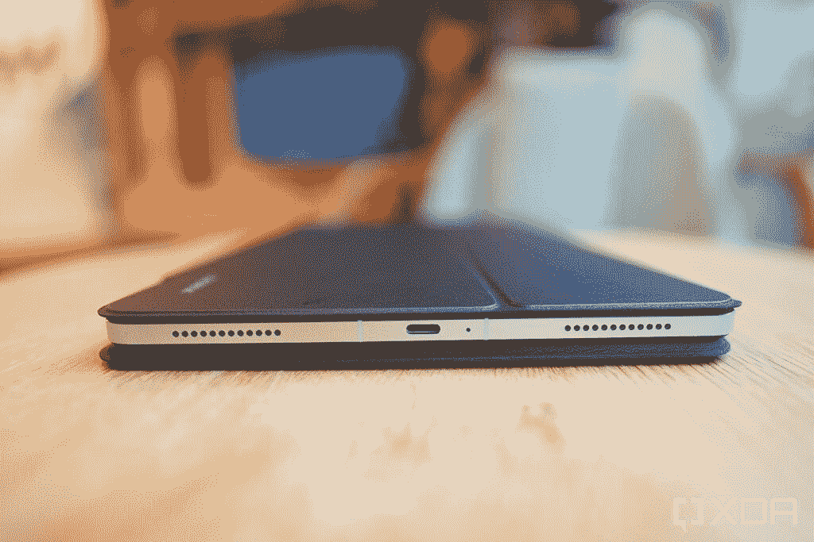
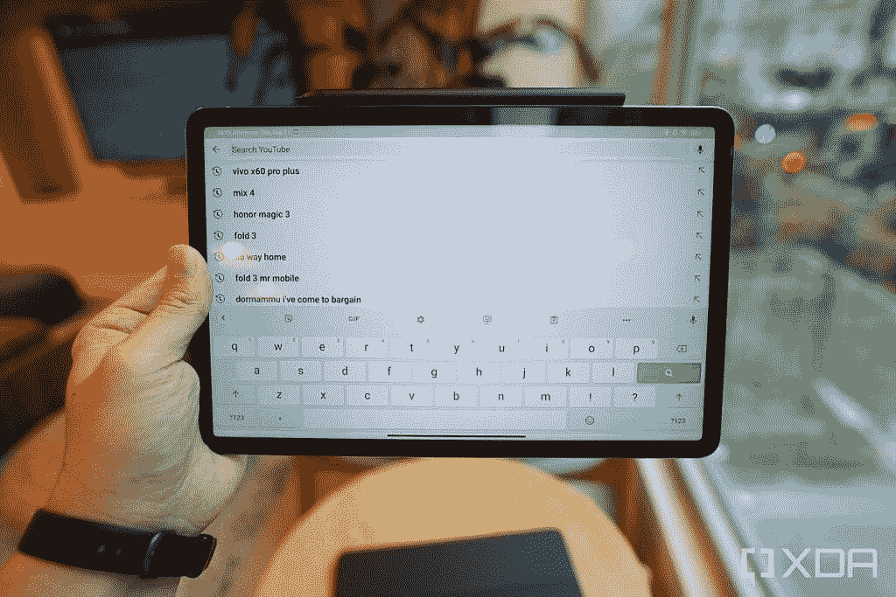

# 小米 Pad 5 评测:一款时尚性感的安卓平板

> 原文：<https://www.xda-developers.com/xiaomi-pad-5-review/>

苹果的 iPads 自问世以来就一直主导着平板电脑市场。另一方面，安卓平板电脑一直是许多笑话的笑柄。不过，这种情况可能正在改变。继去年三星出色的 [Galaxy Tab S7](https://www.xda-developers.com/samsung-galaxy-tab-s7-review/) 之后，又来了新的小米 Pad 5。

小米的最后一款平板电脑 Mi Pad 4 发布于三年前。自那以来，小米已经从一个价格“相当不错”的产品制造商发展成为一个真正的高端硬件制造商，小米 Pad 5 无疑是该公司迄今为止最好看的平板电脑。

但这足以让 Android 平板电脑恢复一些可信度吗？

## 小米 Pad 5:规格

| 

规格

 | 

小米 Pad 5

 |
| --- | --- |
| **建造** | 

*   玻璃前部，铝制框架

 |
| **尺寸&重量** | 

*   254.7 毫米 x 166.2mm 毫米 x 6.9mm 毫米
*   1.15 磅(521 克)

 |
| **显示** | 

*   11 英寸 WQHD+ IPS 液晶屏
*   2,560 x 1,600 像素
*   120 赫兹刷新率
*   杜比视觉

 |
| **SoC** | 高通骁龙 860 |
| **内存&存储** | 

*   6GB LPDDR4X
*   128GB/256GB UFS 3.1

 |
| **电池&充电** | 

*   8720 毫安时
*   22.5 瓦充电(含砖)

 |
| **安全** | 仅 PIN 码或密码 |
| **摄像机** | 

*   1300 万像素主线
*   800 万像素前置

 |
| **端口** | USB-C |
| **音频** | Harmon Kardon 调音的四声道扬声器 |
| **连通性** | 

*   无线网络 6
*   蓝牙 5.2
*   红外线增强器

 |
| **配件** | 

*   小米智能笔手写笔(单独购买)
*   小米键盘套(单独购买)

 |
| **软件** | 搭载 MIUI Global 12.5.2 的 Android 11 |

***关于本次点评:*** 收到小米送的小米 Pad 5 和智能笔进行点评，但小米键盘套是我自己购买的。小米没有对该评论的内容进行任何输入。

## 小米 Pad 5:硬件和设计

小米 Pad 5 是一款 11 英寸的宽屏平板电脑，其正面和侧面看起来类似于苹果的现代 i Pad，特别是 2020 年的 iPad Air。虽然小米在 2021 年决定采用坚硬、平坦的金属侧边，而苹果在过去一年中确立了这一决定，因为它们的美学可能不是巧合，但我会说，设计平板电脑的正面和底盘真的没有太多方法。如果只从正面和侧面看，三星 Galaxy Tab S7 看起来也像 iPad。

至少小米给了 Pad 5 的背面一些自己的特点，从设法具有轻微梯度和光滑表面(至少在我的白色机型上)的哑光涂层(不知何故不会吸引指纹)，到我们在小米 2021 年的许多智能手机上看到的双色摄像头模块设计。

小米 Pad 5 上的后置模块包含一个 1300 万像素的摄像头，正面周围是一个 800 万像素的前置摄像头，当平板电脑处于纵向时，它位于顶部挡板中。

小米 Pad 5 拥有 11 英寸，2560 x 1600 IPS 液晶面板，刷新频率为 120Hz，可以显示超过 10 亿种颜色，并支持 DCI-P3 色域。平板电脑在室内和阴影下看起来很棒，但我发现涂层在室外使用时非常反光。

[sc name="pull-quote" quote= "即使有键盘外壳和手写笔，小米 Pad 5 也足够轻，可以在背包中携带一整天，不会扭伤我的背部。"]

作为一个经常写作和阅读的人，我希望小米采用 3:2 的纵横比(像 iPads 一样)，而不是更宽的屏幕纵横比。但那纯粹是我的个人喜好——那些更喜欢游戏或看电影的人会更喜欢小米 Pad 5 的屏幕尺寸。

小米 Pad 5 也非常适合网飞，因为它装有一个由 Harmon Kardon 调谐的出色的四扬声器系统，可以发出杜比全景声。

小米 Pad 5 的引擎盖下是高通骁龙 860 SoC，8，720 mAh 电池，6GB 内存，128 或 256GB 存储空间。这些组件显然不是 2021 旗舰部件，但它们巩固了小米 Pad 5 作为一款价格实惠的中端平板电脑的地位。奇怪的是，平板电脑缺少指纹扫描仪，所以你必须使用 PIN 码、密码或不太安全的面部解锁作为安全措施。

平板电脑本身的重量为 1.15 磅(521 克)，，即使加上官方的“智能笔”手写笔和官方的小米键盘保护套(后者小米显然没有在欧洲销售)，整个包装仍然不到 2 磅，轻到足以让我整天在背包里拖着走，而不会扭伤我的背部。

 <picture></picture> 

The Pad 5 wrapped in Xiaomi's first party keyboard case

## 小米 Pad 5:软件

小米 Pad 5 运行 Android 11，上面是小米的 MIUI Global 12.5.2 皮肤。除了支持鼠标和触控板等输入设备以及横向分屏之外，Pad 5 上运行的软件似乎与我在小米智能手机上见过十几次的操作系统相同。

这有好有坏。我个人认为小米的软件动画是业内最好的——在我看来，MIUI 上的 120Hz 比三星 One UI 上的 120Hz“更流畅”——在更大的面板上围绕小米 Pad 5 滑动是一场视觉盛宴。

小米的智能手机 UI 也有一个更好的多任务系统，允许用户在一个浮动窗口中打开应用程序，该窗口可以调整大小并放置在屏幕上的任何位置。这是一个比 Android 传统的分屏视图更实用的多任务解决方案。当然，如果你愿意，你仍然可以在分屏视图中运行应用程序，Pad 5 的软件允许在任何方向上进行 50/50 或 75/25 的分割。

但在许多其他方面，小米没有优化该软件，以适应它在更大的屏幕上运行的事实，或者它可以用作桌面电脑。小米 Pad 5(全球版本)的默认也是唯一的键盘是谷歌的 Gboard，仍然缺乏分离/拇指布局。这意味着当平板电脑处于横向时，屏幕键盘看起来很宽，几乎无法使用。

 <picture></picture> 

The default keyboard, Gboard, must show in its full form in landscape mode. You can't shrink it, you can't split it

Gboard 确实可以让你“缩小”键盘，但即使是最小的尺寸，对于单手打字来说还是太宽了。如果你安装了像 SwiftKey 这样的第三方键盘应用程序(它确实有一个分离/拇指布局)，它与物理键盘的配合并不好(到目前为止)，因为 SwiftKey 即使与小米自己的第一方键盘保护套配对，也会继续显示屏幕键盘。

虽然该软件支持输入设备，但手势支持很少。你可以用鼠标的滚轮或两个手指在触控板上滑动来上下滚动网页，但仅此而已。在苹果(Apple)的 iPad 和三星(Samsung)的 Galaxy Tab S7 上，你都可以用多指滑动手势快速进入主屏幕，或者用三指侧面滑动来循环浏览应用程序。这些手势在小米 Pad 5 上都不支持。公平地说，iPad 和 Galaxy Tab S7 有更好的触控板手势支持是有道理的，因为它们的官方键盘壳都配有触控板——小米的没有。

值得一提的是，MIUI 对屏幕光标的实现与 iPadOS 类似——它是一个半透明的白色圆圈，当悬停在文本输入字段上方时，它会变成一条垂直线。

最后一个软件问题——只有在主屏幕上才能访问主屏幕 dock，这意味着你经常必须退出一个应用程序才能启动另一个应用程序。在 iPad 上，可以在任何应用程序中访问该 dock，以便于访问。

困扰 Android 平板电脑的一些软件问题仍然存在——例如，并非所有应用都针对大屏幕进行了优化。无论屏幕有多宽，Android 上的 Twitter 都显示在一个单一的窗格布局中。当小米 Pad 5 处于风景模式时，Twitter 看起来绝对荒谬——一条推文占据了整个屏幕。

相比之下，Twitter 在 iPadOS 上是这样的:

小米 Pad 5 上的应用缩放问题的一个解决方法是简单地在分屏模式下运行有问题的应用和另一个应用。这将迫使应用程序采用更传统的智能手机纵横比。

[sc name="pull-quote" quote= "我发现小米的软件动画是业界最好的。"]

## 小米 Pad 5:作为独立平板的性能

考虑到小米在全球发布会期间没有推出键盘保护套(键盘保护套目前只针对中国市场)，这意味着小米正在设想 Pad 5 主要被大多数消费者用作手持平板电脑。

在这方面，平板电脑表现不错。grippy 背部纹理、轻质和出色的扬声器使小米 Pad 5 成为沙发或床上的一款出色的媒体消费设备。虽然按照 2021 年的标准，7 纳米的骁龙 860 SoC 不能称为真正强大，但它可以处理我扔给它的任何应用程序，包括图形密集型游戏，如 *CarX Highway Racing* 和 *Sierra 7。*

grippy 背部纹理、轻质和出色的扬声器使小米 Pad 5 成为沙发或床上的一款出色的媒体消费设备。

8，730 毫安时电池提供了可观的电池续航时间。在我使用 Pad 5 的前三天，我只把它作为夜间游戏/电影机器使用，在三个晚上大约一个小时的会议后，尽管我没有给设备充电，平板电脑的电池仍然保持在 73%。在第四天，我使用附带的 22.5 瓦充电砖将电池充满 100%，并将 Pad 5 用作工作机，它持续了整整九个小时的工作日，还有 25%的剩余电量。

以下是感兴趣者的基准数据:

## 小米 Pad 5:作为带键盘套的工作机的性能

小米没有向英语媒体评论者提供其 Pad 5 的键盘保护套，因为键盘不会在“国际”(指 mainland China 以外)销售。我个人买了一台(大约相当于 66 美元)，因为仅仅将小米 Pad 5 用作手持平板电脑并不能充分发挥平板电脑的潜力。

外壳由塑料和橡胶制成，并磁性地扣在衬垫 5 的背面；它的外观和感觉与 iPad、Galaxy Tab S7 等其他键盘保护套一样。然而，它只提供了一个视角，而三星或华为的其他键盘壳提供了两个视角。

按键间隔合理，并提供可靠的反馈。我打字速度很快，可以接近全速打字。然而，键盘没有触控板或功能键。

尽管如此，我还是能够写文章，并很好地完成大部分日常任务。正如我所说，我希望屏幕有 3:2 的长宽比而不是宽屏，但仍然有足够的屏幕空间让我打开 WordPress 和第二个窗口，如 Chrome 或 Slack，在分屏视图中没有问题。然而，小米的软件不允许打开第三个应用。你必须在分屏显示两个应用程序或让一个应用程序浮动在另一个之上之间做出选择。

对我个人来说，我发现键盘壳是平板电脑体验中比手写笔更不可或缺的一部分。

## 小米 Pad 5:智能笔性能

小米智能笔是专门为小米 Pad 5 设计的大约 60 美元的手写笔。它磁性地夹在垫 5 的顶部(就像苹果铅笔一样)，在那里它也充电。

整体草图体验类似于 Apple Pencil 或三星的 S-Pen for the Tab S7。我不知道小米的智能笔可以检测多少个压力点，也不知道精确到毫秒的延迟数字，但我可以在小米的平板电脑上画草图，并获得类似于 iPad 和 Apple Pencil 的体验和结果。无论可能有什么延迟，我都没有真正看到——屏幕上的数字墨水跟随着我的笔画足够近。

小米补充说，我喜欢的一点是手写笔底座附近的两个物理 clicky 按钮。它们允许我触发各种快捷方式，比如在绘制草图时切换颜色或绘图工具。

如果我长按一个按钮，我可以抓取特定形状(我画的形状)的截图。长按另一个按钮，小米 Pad 5 会启动其记事本。然而，这是记事本的全屏版本(取代你屏幕上显示的任何内容)，而不是更小的浮动版本，所以它不如 [iPadOS 15](https://www.xda-developers.com/ios-15/) 中引入的快速笔记功能有用。

有一个缺点——小米的软件无法将手写文字转换成数字文本。老实说，我一直觉得这个功能有点噱头。我打字的速度比写字的速度快(我敢打赌大多数阅读这篇文章的人都是这种情况)，那么为什么我需要写单词，然后把它们转换成文本呢？不过，拥有这一功能是软件智能的一种变通，苹果、三星和华为的平板电脑都可以做到这一点(即使我几乎从未使用过)。

## 小米 Pad 5:摄像头

我真的不想成为那些在公共场合用平板电脑拍照的人之一，但尽管如此，为了给大家提供一个完整的评论，我不得不这样做。

小米 Pad 5 的单个 1300 万像素摄像头对于平板电脑来说很好，但当然与智能手机相比就相形见绌了。

然而，对于我们这些像使用电脑一样使用平板电脑的人来说，前置摄像头是一个不幸的位置，因为在横向模式下，摄像头最终位于左侧边框。这意味着在视频通话中，它处于一个尴尬的角度，因为我说话时似乎没有看着摄像头。

后置(主)摄像头可以录制 4K/30fps 的素材；前置摄像头最高可达 1080/30fps。

## 小米 Pad 5:结论

小米在欧洲销售的 Pad 5 基础 6GB/128GB 版本起价为€349 英镑(约 412 美元)(存储价格翻倍至€399 英镑)。这些真空中的价格在欧洲真的很好。然而，苹果昨天刚刚宣布了一款新的 10.9 英寸 iPad，在欧洲的起价为€389 英镑。

就像小米的 Pad 5 一样，苹果新的入门级 iPad 运行在两年前的 SoC(苹果 A13 Bionic)上，从我的经验来看，苹果的 A13 Bionic 比 Pad 5 中的骁龙 860 更强大。当然，iPad 有一个更加充实的生态系统。

Pad 5 的优势包括更现代的设计(苹果新的 10.9 英寸仍然使用厚边框、圆形 home 键设计)，更快、像素密度更高的屏幕，更好的扬声器，以及两倍的基本存储空间。在中国和东南亚，Pad 5 的价格低于欧洲价格，这进一步扩大了它的吸引力。

尽管如此，由于苹果对平板电脑市场的控制如此之强，我觉得西方人真的必须有意识地支持谷歌或反对苹果，才能考虑安卓平板电脑而不是 iPad，尤其是在定价相似的情况下。这些人确实存在——我就是其中之一——即使我们不是主流。

但无论如何，小米 Pad 5，以及三星最近的产品，让安卓平板电脑再次变得重要起来。小米 Pad 5 只需要一些软件润色，当(如果)它们到来时，对于一家以提供最佳价值而闻名的公司来说，它将是又一个超值产品。