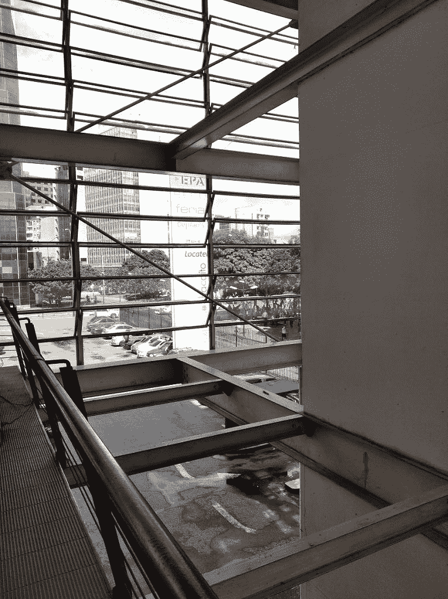

# 小米 Redmi 7A 评论:伟大的手机，甚至更大的定价

> 原文：<https://www.xda-developers.com/xiaomi-redmi-7a-review-great-phone-even-greater-pricing/>

小米是一家我最近越来越尊敬的公司。虽然他们是一家彻头彻尾的中国公司，但他们目前正以其多样化的设备阵容席卷世界，从高端、前沿的旗舰产品到入门级、廉价的智能手机。每个人都有适合自己的东西，无论您是在寻找最前沿的性能，还是只是完成工作并允许您快速完成日常任务、发送消息和打电话的东西。但是，如果说他们的所有产品系列中有什么亮点的话，那就是与竞争对手相比，这些设备的价格是多么实惠。毕竟，销售价格合理、物有所值的手机是小米成功攀登成功阶梯的原因。

截至目前，价格实惠仍是小米最强的优势之一。事实上，他们下了双倍的赌注。今年早些时候，小米[将 Redmi 剥离出来作为自己的子品牌](https://www.xda-developers.com/xiaomi-spins-redmi-sub-brand/)，以提升他们在平价智能手机领域的竞争力。是的，从那以后他们确实交付了。从像[红米 K20/K20 Pro](https://www.xda-developers.com/redmi-k20-pro-first-impressions-masterpiece-xiaomi/) “旗舰杀手”这样的手机，到像红米 Note 7 和红米 Note 7 Pro 这样的中端设备，再到红米 Go，小米目前正在红米子品牌下推出数百万款价格实惠的优质设备。

其中之一是 Redmi A 系列，其最新产品 Redmi 7A 最近在全球市场推出，最近在印度，16GB 版本的₹5,799 售价非常低(85 美元)，高端 32GB 版本的售价高达₹5,999(88 美元)。这款设备正试图抢占入门级智能手机市场，事实上，它在纸面上看起来令人惊叹，似乎真的物有所值。但是 Redmi 家族的新成员在现实生活中的表现到底如何呢？过去几天我一直在使用小米 Redmi 7A，今天，我将我的使用体验摆出来。

## Redmi 7A:规格

| 

规范

 | 

红米 7A

 |
| --- | --- |
| 软件 | 基于 Android 9 派的 MIUI 10 |
| 显示 | 5.45 英寸高清+ (1440×720)，18:9 宽高比 |
| 片上系统 | 高通骁龙 43912 纳米工艺，8 倍 Cortex-A53 @ 2.02 GHz |
| RAM 和存储 | 2GB/16GB、2GB/32GB、3GB/32GB(仅适用于部分市场)microSD 卡插槽，可扩展存储容量高达 256GB |
| 电池和充电 | 4000 毫安，10W 充电 |
| 后置摄像头 | 12MP 索尼 IMX486CMOS 传感器，2.2 孔径，1.25μm 像素尺寸，1/2.9 英寸传感器尺寸，PDAF |
| 前置摄像头 | 500 万像素，带 AI 美颜模式 |
| 安全性 | AI 人脸解锁 |
| 港口 | 微型 USB 端口双 nano-SIM 卡插槽，带专用 SD 卡插槽 3.5 毫米耳机插孔 |
| 连通性 | 双 4G 无线网络 802.11 b/g/nBluetooth 5.0 |
| 颜色；色彩；色调 | 黑色、蓝色、金色 |
| 定价 | 2gb/16gb:₹5,799/$852gb/32gb: ₹5,999/$88 |
| 有效性 | 现已上市！ |

## 设计和建造

小米红米 Note 7 标志着小米在设计方面的重大转变，因为该公司选择在自己的品牌和身份下将红米设备与其他小米智能手机分开。其前身的金属外壳设计已经不复存在，该公司选择了塑料和玻璃的混合。然而，对于 Redmi 7 来说，这是一个更大的变化，因为这款手机看起来更像是 Redmi Note 7 的低端版本，而不是更小的 Redmi 6 的继任者，在其他方面进行了削减，如构建质量(光滑的塑料而不是实际的玻璃)和屏幕分辨率(720p 而不是 1080p)。然而，小米红米 7A 并没有经历如此大的设计变化。虽然它确实从这些手机中汲取了某些设计灵感，但它保留了与红米 6A 相同的外形，而且整体设计与它的哥哥们有很大不同。

不要误会:Redmi 7A 的框架和背部都是塑料的。与 Redmi 7 不同，red mi 7 在背面使用光滑的塑料来复制玻璃背智能手机的外观，Redmi 7A 采用了更简单的哑光塑料一体式机身。我有哑光黑色版本，我不得不说，它看起来很光滑，塑料与否。它摸起来真的很坚固，构造也很好，这一次，我是认真的——当我拿到 red mi Go 时，我还称赞了这款廉价设备的制造质量。但与 Redmi 7A 相比，Redmi Go 感觉像是一个玩具。

正如我之前所说，Redmi 7A 从 Redmi 7 和 Redmi Note 7 中汲取了一些现代设计元素。在我看来，这使得它看起来不像它的前身红米 6A 那么陈旧。它不会试图用自己的外表吸引任何人的注意力。拥有一个哑光塑料一体式机身，我的设备没有任何“极光玻璃”效果或任何种类的渐变，也没有任何过度的设计特征。如果你选择“宝石蓝”或“宝石红”这两种颜色选项，这两种颜色仅在某些市场上提供，那么哑光一体式机身将被替换为有一些渐变的光滑塑料表面，与 Redmi 7 类似，看起来更加引人注目，但在我恰如其分地命名为“哑光黑”的评测单元中，这些颜色都没有。Redmi 7A 的简单设计让工作得以完成，低调的外观保持了时尚和专业。

12MP 单后置摄像头和 LED 闪光灯包含在同一个模块中，与 Redmi 7/Note 7 类似，它是垂直对齐的。它也几乎没有从后面伸出来。左下角有一个 Redmi 的 logo，右下角还有一些认证。与其他具有相同外形的设备相比，这款手机本身感觉有点笨重——这是必须的，因为它在一个较小的机身中装有 4000 毫安时的大电池。

这款手机也没有凹槽，也没有任何无边框屏幕实现或不切实际的屏幕与机身比例。相反，正面由 5.45 英寸 IPS LCD 显示屏主导，分辨率为 1440 x 720，纵横比为 18:9。是的，表圈是有的，但总的来说，它们相当薄。该显示器也有足够好的视角和颜色，就像你对液晶面板的期望一样好，但同样，屏幕相当适中，可能不足以值得拥有自己的一部分。

不过，我们在正面看到的是品牌:Redmi 徽标也出现在底部边框中。我是认为在正面打上品牌是没有意义和必要的人群中的一员，尤其是在当前追求完美屏幕与身体比例的竞赛中。Redmi Go 的表圈更大，正面没有任何品牌，其前身也是如此。不过，在这种情况下，它相当谨慎，不会让人分心。顶部挡板中有一个通知 LED，一个前置摄像头，一个耳机和一些传感器。

该设备的顶部有一个耳机插孔和一个麦克风孔，但遗憾的是，我们这里没有 IR blaster。这是一个奇怪的遗漏，因为红米 Note 7 和红米 7 都有一个，但它的前任红米 6A 没有。不过，再往前追溯，我们发现 Redmi 5A ( [，我们也评论了](https://www.xda-developers.com/xiaomi-redmi-5a-xda-mini-review-buy/))实际上就有一个。所以随你便吧。该设备的底部装有微型 USB 充电端口(USB-C 最终随着 Redmi Note 7 进入 Redmi 品牌，但我们仍然在谈论入门级手机)以及底部的两个扬声器格栅(这里没有双扬声器，因为微型 USB 充电端口的右侧只有一个底部发射扬声器)。

该设备的左侧有一个双 SIM 卡和 microSD 卡插槽。不过，它不是混合的:这款手机让用户可以选择同时使用两张 nano-SIM 卡和一张 microSD 卡，这是非常值得赞赏的，在这个价格范围内更是如此。设备的右侧有经典的音量摇杆和电源按钮。按钮本身感觉非常坚固，发出咔嗒声，这证明了这款设备的耐用性。

这款手机没有指纹扫描仪或任何生物认证。在这个价格范围内，你很难找到一部这样的手机，但它的兄弟 Redmi 7 有。我们现在已经进入 2019 年，设备制造商甚至正在向显示器内指纹扫描仪发展。因此，虽然我知道为了降低成本而省略了指纹扫描仪，但增加一个基本的后置指纹扫描仪会为客户的设备和效用增加很多价值。

值得一提的是，Redmi 7A 的聚碳酸酯一体式机身手感非常好，尽管没有任何优质玻璃或金属元素。虽然没错，这样做是为了保持低成本，但小米确实付出了额外的努力，以确保手机不会感觉轻薄和廉价，这是我非常欣赏的一点。

## Redmi 7A:性能

小米红米 7A 采用高通骁龙 439 片上系统。作为骁龙 400 系列芯片组，它真的没有什么值得大书特书的。它采用 12 纳米 FinFET 工艺制造，具有八核设置，由 Cortex-A53 内核组成，主频为 2.0 GHz，与骁龙 625 相同，领先于其他骁龙 400 系列芯片组。它还采用了 Adreno 505 GPU，仅比 625 的 Adreno 506 低一步。我的电脑有 2GB 内存和 16GB 存储空间，但价格几乎不比₹200 贵的高端型号有 3GB 内存和 32GB 存储空间。

我应该注意的一件有趣的事情是，CPU-Z 报告该设备具有高通骁龙 435，而不是骁龙 439。骁龙 439 与骁龙 435“软件兼容”，但我们谈论的是基于完全不同工艺(28 纳米与 12 纳米)的相似但完全不同的芯片组，因此这里没有混淆的空间。我倾向于相信这只是 CPU-Z 不支持这个芯片组的问题，因为 AnTuTu 报告说该设备有骁龙 439。

我将红米 7A 与我家里其他更强大的设备进行了对比，包括红米 Note 7(骁龙 660)，小米 A2 Lite(骁龙 625)，以及我自己的日常驱动程序 OnePlus 5T(骁龙 835)。我真的很惊讶。这款手机在 AnTuTu 基准测试中获得了 73，708 的总分，略微落后于 Mi A2 Lite 的 77，765 分。虽然它没有达到红米 Note 7 的 143，761 分和一加 5T 的 201，718 分。但该设备仍然提供了一个不错的打击，大约是红米 Note 7 的一半，这非常令人印象深刻，特别是考虑到它的价格以及它由高通骁龙 400 系列 SoC 供电的事实。

Geekbench 4 给了我们类似的结果。Redmi 7A 的单核得分为 862 分，多核得分为 3143 分，分别紧随小米 Mi A2 Lite 的 867 分和 4311 分之后。虽然我没有深入进行性能和基准测试，但可以肯定地说，Redmi 7A 的 guts 中包含的骁龙 439 与小米设备侦探中使用的骁龙 625 非常相似，骁龙 625 在某些方面略有优势。

我没有太深入地使用这款手机玩游戏，因为我的评测单元是 16GB 的型号，不允许我在上面玩很多游戏，但我确实玩了一些游戏，如 PUBG Mobile、《我的世界》和侠盗猎车手:圣安地列斯，它们在 Redmi 7A 上运行没有任何问题。现在，虽然这不是要超越的高标准，但考虑到我们正在谈论低于 90 美元的智能手机中的入门级芯片组，这真的很好。如果您希望获得更高的游戏性能，您需要增加预算来容纳更强大的硬件。

总的来说，Redmi 7A 应该可以很好地完成大多数日常任务。“应该”是这里的关键词，也是我对这个设备的主要抱怨:软件。小米 Redmi Go 是小米 2019 年设备阵容中唯一一款比 Redmi 7A 便宜的设备，该公司选择了轻量级的股票 Android 软件体验，以尽可能保持流畅，而不是试图将他们的 MIUI 皮肤塞进这个不起眼的设备(是的，这是一款 Android Go 手机，但正如三星已经证明的那样，你[确实可以为 Android Go](https://www.xda-developers.com/samsung-galaxy-j4-core-android-go/) 换肤)。在使用 Redmi 7A 之后，我意识到这个决定是多么明智。

MIUI 在这里全面回归，虽然它从来都不是我真正喜欢的，但它实际上已经变得如此臃肿，以至于在某些方面阻碍了设备的发展。这款手机的实际性能非常不稳定。回到 XDA 作家 Idrees Patel [评论小米红米 Note 7 Pro](https://www.xda-developers.com/xiaomi-redmi-note-7-pro-review/) 时，他抱怨说，尽管这款设备表现不错，但经常出现口吃和恶作剧动画的问题，这使得整体用户界面体验不够完美。Redmi 7A 更是如此，它的 CPU 更弱，RAM 更少。

小米在将臃肿软件保持在最低水平方面做得相当不错，唯一额外预装的应用是脸书和 WPS Office，但尽管这款手机可以快速完成大多数日常任务，但有时在浏览网页、查看社交媒体或做其他基本事情时，它会断断续续甚至挂起。它甚至有一次在我查看 Instagram 上的故事时拉下通知遮光板，要求我强制重启。

我将在稍后的评测中更深入地讨论这款手机的软件。但 MIUI 是一个不必要的沉重外壳，尽管小米产品线中的某些设备能够处理它，而不会对整体用户体验产生太大影响，但它有很多东西要处理，可能会开始对一些入门级手机产生影响。

当然，这完全取决于你自己的使用情况，如果你花不到 100 美元买了一部智能手机，你可能并不是在寻找堪称典范的速度。但我真的认为这款手机将受益于股票 Android 很多，因此，定制的 rom。因此，如果你确实遇到了难以忍受的滞后，也许这将是一个可以考虑的选择。我真的希望小米在他们即将到来的 MIUI 11 中解除他们的软件。

当然，这完全取决于你自己的使用情况，如果你花不到 100 美元买了一部智能手机，你可能并不是在寻找堪称典范的速度。但我真的认为这款手机将受益于股票 Android 很多，因此，定制的 rom。因此，如果你确实遇到了难以忍受的滞后，也许这将是一个可以考虑的选择。我真的希望小米在他们即将到来的 MIUI 11 中解除他们的软件。

照相机

## Redmi 7A 的全球型号采用了 12MP IMX486 单后置摄像头传感器，与小米 Mi A2 和印度 Redmi Note 7 上的摄像头传感器相同。它是一个 CMOS 传感器，孔径为 2.2，像素尺寸为 1.25μm，传感器尺寸为 1/2.9 英寸，支持 PDAF(相位检测自动对焦)。考虑到所有因素，对于这样一款入门级的廉价智能手机来说，它是一款非常有能力的相机，在某些情况下，它实际上可以转化为不错的照片。现在，我应该提到这是一部 85 美元的智能手机(再次)，因此，如果你想要一流的相机性能，你应该多花几百美元买一部华为 P30 Pro 或另一部屡获殊荣的智能手机。话虽如此，Redmi 7A 的相机并没有让人失望...当然是因为它的价格范围。

Redmi 7 的功能集简单明了，因为背面没有任何额外的摄像头来增加功能。打开 MIUI 相机，我们发现自己有照片、视频录制、短视频(长达 15 秒)录制以及专业模式的选项，小米在其整个智能手机阵容中包含了这些选项。后置摄像头没有人像模式，这对我来说似乎很有趣，因为 MIUI 10 应该在它支持的每部手机上至少有一个基于人工智能的人像模式，但前置摄像头确实有一个人工智能支持的人像模式。我还应该注意到，你不能在这款手机上使用谷歌相机端口，因为它使用的是 32 位(ARM)软件，而不是 64 位(ARM64)，所以你在这里获得的相机体验将是你所坚持的。

Redmi 7 的功能集简单明了，因为背面没有任何额外的摄像头来增加功能。打开 MIUI 相机，我们发现自己有照片、视频录制、短视频(长达 15 秒)录制以及专业模式的选项，小米在其整个智能手机阵容中包含了这些选项。后置摄像头没有人像模式，这对我来说似乎很有趣，因为 MIUI 10 应该在它支持的每部手机上至少有一个基于人工智能的人像模式，但前置摄像头确实有一个人工智能支持的人像模式。我还应该注意到，你不能在这款手机上使用谷歌相机端口，因为它使用的是 32 位(ARM)软件，而不是 64 位(ARM64)，所以你在这里获得的相机体验将是你所坚持的。

*小米 Redmi 7A 相机样品。*

至于实际的图像质量，12MP 后置传感器确实为你可能想到的大多数用例提供了足够好的质量。在某些情况下，我甚至对捕捉到的大量细节印象深刻。当然，没有什么获奖的，但绝对可行。大多数时候，光天化日下拍摄的照片细节丰富，曝光度也不错。颜色有时会显得有点暗淡，但大多数时候，它们也相当准确。

相机有时确实有一定的过度曝光倾向，正如这张照片所示，但没有什么真的无法忍受，如果它不能自动调整，你可以求助于手机的专业模式来自行调整。

在低于日光的场景中，特别是在室内场景中，我们开始看到小米的降噪算法从图片中去除细节。相机过度曝光的倾向也导致室内拍摄中的灯泡和其他光源看起来过于明亮。某些伪影，如镜头眩光，有时也会出现。然而，这个阶段的图片也是体面和可用的。

 <picture></picture> 

The Redmi 7A's camera tends to overexpose a lot sometimes, particularly in some trickier shots.

当谈到低光照片时，Redmi 7A 提供的性能低于恒星。这里是小米降噪开始把图像变成一团泥泞的时候。降噪开始带走细节，即使在近距离。但既然我们在这里谈论的是一款非常便宜的手机，我们就不应该把它当作黄金标准。毕竟，这款设备的重点不是摄像头，摄像头也不是主要卖点之一。该设备也不支持小米的夜景功能，该功能在这种情况下会有所帮助。

前置摄像头是一个简单的 500 万像素传感器，质量相当一般，可以让你拍出像样的自拍，并相对轻松地捕捉你的记忆。颜色看起来很准确，细节也保留得很好。曝光也很好。我们在这里得到的前置摄像头并不惊人，但它在大多数情况下可以完成工作。同样，我们需要保持对低于 100 美元设备的期望，记住这一点，Redmi 7A 做得很好。

 <picture></picture> 

Low-light pictures with the Redmi 7A turn out looking muddy and cloudy.

前置摄像头是一个简单的 500 万像素传感器，质量相当一般，可以让你拍出像样的自拍，并相对轻松地捕捉你的记忆。颜色看起来很准确，细节也保留得很好。曝光也很好。我们在这里得到的前置摄像头并不惊人，但它在大多数情况下可以完成工作。同样，我们需要保持对低于 100 美元设备的期望，记住这一点，Redmi 7A 做得很好。

*用红米 7A 拍的自拍。第三张图片展示了手机基于人工智能的正面人像模式。*

我之前说过，前置传感器和后置摄像头不一样，确实有人像模式。它是基于人工智能的，因为我们只有一个传感器，所以它的边缘检测并不完美，但它是一个很好的功能。我们还有小米的美化功能，默认情况下是曲柄升到 3。它不像 EMUI 的实现那样过于卡通化，这意味着你可能不会立即注意到它，但如果你想获得准确的自拍，你应该记得关闭它。

总的来说，如果你不是每次都想拍出惊人的照片，这款相机看起来还不错，但在更复杂的光照条件下，它开始出现明显的问题。这是一款非常普通的手机相机。这并不一定是坏事，尤其是对于这么便宜的设备来说。但考虑到小米是如何将这款手机的 12MP IMX486 传感器宣传为这款手机的主要升级之一，我真的没有看到升级后的传感器应该带来的改进，而且用这款设备拍摄的照片对我来说不够值得关注，不值得进行营销努力。用户可能会被误导，认为这款手机在相机方面的表现实际上很好，或者至少可以与更昂贵的设备相媲美，但实际上，它并不比其他廉价手机好。不过，这并不是说它不好。这只是一个预算手机摄像头，预算手机的不足。

总的来说，如果你不是每次都想拍出惊人的照片，这款相机看起来还不错，但在更复杂的光照条件下，它开始出现明显的问题。这是一款非常普通的手机相机。这并不一定是坏事，尤其是对于这么便宜的设备来说。但考虑到小米是如何将这款手机的 12MP IMX486 传感器宣传为这款手机的主要升级之一，我真的没有看到升级后的传感器应该带来的改进，而且用这款设备拍摄的照片对我来说不够值得关注，不值得进行营销努力。用户可能会被误导，认为这款手机在相机方面的表现实际上很好，或者至少可以与更昂贵的设备相媲美，但实际上，它并不比其他廉价手机好。不过，这并不是说它不好。这只是一个预算手机摄像头，预算手机的不足。

电池

## 我觉得值得一提的是，我没有把这款手机作为我的日常驾驶工具，因为这款手机无法与我的运营商(Movistar)兼容。因为这个原因，我去哪里都带着 Redmi 7A 和我的日常驱动程序(OnePlus 5T ),以便尝试接近日常驱动程序的使用。然而不幸的是，电池并不是我想要深入探索的一个方面。不过，我对手机电池的有限体验非常非常有希望，值得关注，足以让我继续阅读这一部分。

Redmi 7A 配备了 4000 毫安时电池。鉴于[更大的电池在所有智能手机系列中变得越来越普遍，这本身可能不会让你大吃一惊。但该设备的大电池进一步得到了 12 纳米骁龙 439 处理器和 720p 液晶显示器等因素的补充。所有这些因素结合在一起，使得这款手机，至少在理论上，有利于电池寿命。在现实生活中，它也很有前途。](https://www.xda-developers.com/asus-rog-phone-ii-specs-features-pricing-availability/)

作为一个实验，我试图看看一次充电可以持续多长时间，我有 4 天 16 小时的空闲时间和 6 小时的屏幕打开时间，在半频繁使用(拍照、拍摄视频、测试应用程序等)的情况下，一次充电的总时间接近 5 天。当然，每个人的用法都不一样，你得到的里程可能和我得到的不一样。但在我看来，这款手机是新的电池寿命之王的有力竞争者，不仅在入门级产品中，在其他类别中也是如此。它真的真的很好，而且有很大的潜力，我想在以后更深入地探索它。

作为一个实验，我试图看看一次充电可以持续多长时间，我有 4 天 16 小时的空闲时间和 6 小时的屏幕打开时间，在半频繁使用(拍照、拍摄视频、测试应用程序等)的情况下，一次充电的总时间接近 5 天。当然，每个人的用法都不一样，你得到的里程可能和我得到的不一样。但在我看来，这款手机是新的电池寿命之王的有力竞争者，不仅在入门级产品中，在其他类别中也是如此。它真的真的很好，而且有很大的潜力，我想在以后更深入地探索它。

软件和用户界面

## 软件是我对这款设备的主要抱怨，因为 MIUI 是一个非常臃肿的皮肤，可能会侵蚀设备的性能，但一旦你越过了整个性能方面，如果你像我一样习惯于股票式的 Android 版本，这将是一种完全不同的体验。MIUI 会引发两极分化的观点——你要么喜欢它，要么彻底讨厌它。Redmi 7A 由 Android Pie 驱动，顶部是小米的 MIUI 10.2.1 皮肤和 2019 年 5 月的安全补丁。在我看来，从通知的行为方式，到最近的菜单，以及系统的行为方式和与其他应用程序的交互方式，对一些人来说，它可能会成为一个完全不同的操作系统。MIUI 在很大程度上在小米设备上是一致的；因此，如果你正在从早期的小米设备迁移，这将是一个熟悉的领域。

功劳归功劳:MIUI 确实有几个优点。像原生的全系统黑暗模式和 Wi-Fi 共享这样的功能，在 AOSP 与 Android Q 一起首次亮相，已经在 MIUI 中存在了一段时间。Redmi 7A 没有遗漏任何 MIUI 功能:你可以获得完整的软件包，无论是好是坏。不幸的是，正如我之前所说，这也意味着你也获得了 MIUI 的所有膨胀软件和应用程序套件。出于存储的原因，他们已经做了很好的工作，将它保持在最低限度，但不幸的是，它仍然存在，广告也是如此。

我在 MIUI 上发现的最令人讨厌的事情之一是他们的应用程序扫描仪，它声称可以扫描你在设备上安装的每个应用程序，与 Google Play Protect 的方式相同。除此之外，你不是静静地做，而是得到一个全屏的弹出窗口，这使得一个很大程度上毫无意义的功能变得更加令人讨厌，而且，是的，给了 MIUI 一个显示广告的机会。广告充斥着整个 MIUI，唯一能彻底摆脱它们的方法是[安装一个定制 ROM](https://www.xda-developers.com/xiaomi-eu-xiaomi-mi-9-fixes-everything-wrong-with-miui/) :要么像小米. eu 提供的那样精简 MIUI 版本(红米 7A 还没有这种版本)，要么像 AOSP 定制 ROM(鉴于这款手机有多新，还没有专门的开发，但你可以安装一个 GSI)。

我真的希望小米通过 MIUI 11 在这方面取得进展，因为截至目前，MIUI 10 是一个真正臃肿和复杂的系统。我自己是一个 Android 纯粹主义者，所以其他人会比我更喜欢它。是的，MIUI 确实有潜在和积极的方面，但臃肿的软件和广告可能会破坏一些人的整体体验。这就是为什么我通常会在我拥有的每台小米设备上闪存定制 rom，只要我能解锁引导程序。

我真的希望小米通过 MIUI 11 在这方面取得进展，因为截至目前，MIUI 10 是一个真正臃肿和复杂的系统。我自己是一个 Android 纯粹主义者，所以其他人会比我更喜欢它。是的，MIUI 确实有潜在和积极的方面，但臃肿的软件和广告可能会破坏一些人的整体体验。这就是为什么我通常会在我拥有的每台小米设备上闪存定制 rom，只要我能解锁引导程序。

结论:小米凭借红米 7A 再次钉钉入门级游戏

## 2019 年的当前趋势表明，手机将变得越来越贵:如今，旗舰手机的价格可能超过 1000 美元。人们购买这些手机有许多不同的原因，其中之一是更便宜的手机通常被认为是劣质的。Redmi 7A 证明了廉价手机也可以是好的。

2019 年的当前趋势表明，手机将变得越来越贵:如今，旗舰手机的价格可能超过 1000 美元。人们购买这些手机有许多不同的原因，其中之一是更便宜的手机通常被认为是劣质的。Redmi 7A 证明了廉价手机也可以是好的。

**[红米 7A XDA 论坛](https://forum.xda-developers.com/redmi-7a)**

让我们在这里把事情弄清楚:这款手机不会在性能、相机或几乎任何方面赢得任何奖项。不，在功能、性能或其他方面，这也无法与旗舰产品相提并论。它没有旗舰智能手机的花哨功能。不过话虽如此，它足以轻松处理您的所有基本任务，甚至可能更多。它足够好，不会让你对购买 85 美元的智能手机感到失望。它甚至可以运行休闲游戏。这是一款低端设备，性能类似于中档手机，这本身就是小米在入门级市场的又一个令人印象深刻的壮举。它不是一流的，但对许多智能手机用户来说已经足够好了。Redmi 7A 延续了小米积极的定价策略，并向我们表明，如果你的智能手机使用在本质上是基本的，你就不需要花很多钱。

是的，Redmi 7A 确实有自己的限制和妥协。它有 720p 显示屏，2GB 内存，有限的内部存储空间(尽管我们有一个 microSD 卡插槽来帮助缓解后者)。但是，凭借 12 纳米的 SoC(性能类似于骁龙 625)、4000 毫安时的电池和功能性相机，**red mi 7A 无疑是目前你能在 100 美元**以下买到的最好的智能手机。到目前为止，我唯一的抱怨是软件和它不支持很多波段的事实，这使得我无法将该设备用作我的日常驱动程序。

从 7 月 23 日开始，你可以在印度通过在线市场购买 Redmi 7A，如 [Flipkart](https://www.flipkart.com/redmi-7a-matte-blue-32-gb/p/itmfhz4cztznu8kk) 和[Mi.com](https://www.mi.com/in/redmi-7a/)，有哑光黑、哑光蓝和哑光金三种颜色可供选择，16GB 机型从₹5,799/$85 开始，32GB 机型到₹5,999/$88。它也将很快在欧洲上映。

从 7 月 23 日开始，你可以在印度通过在线市场购买 Redmi 7A，如 [Flipkart](https://www.flipkart.com/redmi-7a-matte-blue-32-gb/p/itmfhz4cztznu8kk) 和[Mi.com](https://www.mi.com/in/redmi-7a/)，有哑光黑、哑光蓝和哑光金三种颜色可供选择，16GB 的机型在₹5,799/$85 开始，32GB 的机型在₹5,999/$88 开始。它也将很快在欧洲上映。