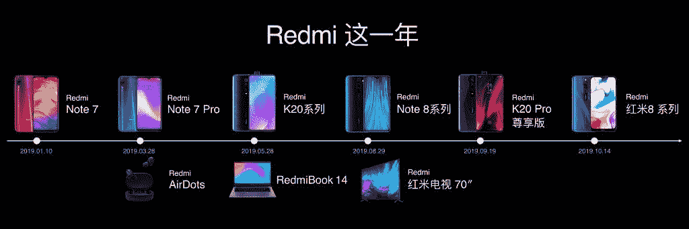

# Redmi K30 推出了 120Hz 屏幕、骁龙 765G 和 64MP 索尼 IMX686

> 原文：<https://www.xda-developers.com/xiaomi-redmi-k30-5g-4g-120hz-display-snapdragon-765g-64mp-sony-imx686-china-launch/>

**更新 1 (01/13/2020 @美国东部时间上午 5:20):**小米已经分享了该公司正在测试 Redmi K30 的 144Hz 刷新率。滚动到底部了解更多信息。这篇发表于 2019 年 12 月 10 日的文章被保存如下。

小米的子品牌 Redmi 凭借 2019 年 5 月在中国推出的red mi K20 和 Redmi K20 Pro 进入平价旗舰游戏。这两款设备采用了相同的设计，两者之间的主要区别在于使用的 SoC。Redmi K20 Pro 是真正的旗舰杀手，配备了旗舰高通骁龙 855 SoC 而 Redmi K20 通过选择高通骁龙 730 SoC 平衡了性能和经济性。半年后，小米再次寻求在价格和性能之间取得平衡，新的 Redmi K30 已经在中国上市。

 <picture></picture> 

Redmi Brand Product Launches

小米已经开始接受设备在发布前会泄露的事实，因此该公司现在在发布会的准备阶段披露了许多关键细节，甚至官方产品渲染。该公司本身透露，Redmi K30 将于 2019 年 10 月成为其首款 5G 智能手机[。接近发布时，Redmi 确认了](https://www.xda-developers.com/xiaomi-redmi-k30-5g-dual-punch-hole-front-cameras/)[四后置摄像头设置，64MP 索尼 IMX686 主传感器](https://www.xda-developers.com/redmi-k30-official-teaser-shows-off-quad-rear-cameras-side-fingerprint-scanner/)，4,500 mAh 电池，30W 快速充电，侧面指纹传感器，3.5 毫米耳机插孔，多功能 NFC。现在，我们有了 Redmi K30 4G 和 Redmi K30 5G 的完整规格表。

## Redmi K30 5G 和 Redmi K30 4G:规格

| 

规格

 | 

红米 K30 5G /红米 K30 4G

 |
| --- | --- |
| **尺寸和重量** | 

*   165.3 x 76.6 x 8.79 毫米
*   208 克

 |
| **显示** | 

*   6.67 英寸 FHD+ (2400 x 1080)液晶显示屏；
*   120Hz 高刷新率
*   带双前置摄像头的打孔显示屏
*   康宁大猩猩玻璃 5
*   HDR 10 支持

 |
| **SoC** | 5G:

*   高通骁龙 765G:
    *   1 个 Kryo 475(基于 ARM Cortex-A76)Prime core @ 2.4 GHz
    *   1 个 Kryo 475(基于 ARM Cortex-A76)性能内核@ 2.2GHz
    *   6 倍(基于 ARM Cortex-A55)效率内核@ 1.8GHz
    *   7 纳米 EUV 工艺
*   肾上腺素 620

4G:高通骁龙 730G |
| **RAM 和存储器** | 

*   6GB LPDDR4X + 64GB UFS 2.1
*   6GB + 128GB
*   8GB + 128GB
*   8GB + 256GB

支持 microSD 卡可扩展性 |
| **电池&充电** | 

*   4，500 毫安时电池
*   快速充电:

 |
| **后置摄像头** | 照片:

*   **主:** 64MP 索尼 IMX686 传感器，f/1.9，1/1.7”传感器，0.8μm 像素
*   **次要:** 8MP 120 广角相机，f/2.2
*   **第三:** 2MP，f/2.4，深度传感器
*   **四元:**
    *   5G - 5MP，微距，f/2.4
    *   4G - 2MP，微距，f/2.4

视频:

*   4K @ 30fps
*   1080p @ 60fps
*   超宽:1080p @ 30fps
*   慢动作:1080p @ 120fps，720p @ 960fps

 |
| **前置摄像头** |  |
| **其他特性** |  |
| **安卓版本** | 基于 Android 10 的 MIUI 11 |

Redmi K30 5G 的主要亮点之一是内部的高通骁龙 765G SoC，这使它成为第一款在该平台上发布的手机。Redmi K30 5G 上的骁龙 765G 采用主频高达 2.4GHz 的 Prime CPU 核心，辅之以主频为 2.2GHz 的 Performance CPU 核心；这两款产品都基于定制的 Kryo 475 架构，而后者又源自 ARM Cortex-A76 设计。还有 6 个基于 ARM Cortex-A55 的效率内核，使 SoC 的配置为 1+1+6，而不是骁龙 730 等旧 SoC 的 2+6 配置。SoC 也是基于 8 毫米 EUV 制造工艺构建的。你可以在 2019 年骁龙峰会的[专题报道中了解更多关于骁龙 765G 的信息。](https://www.xda-developers.com/qualcomm-snapdragon-765-processor-specifications-features/)

骁龙 765G 还在芯片上集成了 5G 调制解调器，从而降低了功耗。红米 K30 5G 自带双模 5G，同时支持 SA 和 NSA 网络。该设备还支持 5G 多链路-基本上允许用户同时连接到 2.4GHz WiFi、5GHz WiFi 和 5G/4G 网络。

Redmi K30 5G 也是小米第一款采用 120Hz 高刷新率显示屏的智能手机。顾名思义，120Hz 显示器每秒显示的图像数量是普通 60Hz 显示器的两倍，极大地增强了用户体验。该设备根据应用和用例在 60Hz、90Hz 和 120Hz 之间动态调整帧速率，以平衡用户体验和功耗。Redmi K30 5G 还具有 91%的屏幕与机身比率，这要归功于用于双前置摄像头的打孔切口。

Redmi K30 5G 也是第一款采用索尼新 64MP 传感器的智能手机，[索尼 IMX686](https://www.xda-developers.com/sony-teases-imx686-image-sensor-2020-smartphones/) 。IMX686 配有 1/1.7 英寸大传感器和 0.8μm 像素。该传感器可以输出 6400 万像素的图像，但常规相机模式将利用像素宁滨将四个像素合并为一个 1600 万像素、1.6μm 像素的图像。64MP 主摄像头两侧是另外三个摄像头:超广角摄像头、景深摄像头和专用微距摄像头。在正面，你有一个 200 万像素的主摄像头，加上一个用于深度感应的辅助摄像头。

Redmi K30 5G 继续包装更多功能，因为它配备了 4,500 mAh 的大电池，支持 30W 快速充电。5G 和高刷新率显示器肯定需要一整天的大量电力，因此拥有大电池以及快速充电的方法将会派上用场。这款手机还具有集成在电源按钮内的指纹扫描仪，并保留了一些经典功能，如 3.5 毫米耳机插孔和 IR Blaster。

Redmi K30 也有一个 **4G 版本**，它有很多相同的功能。主要区别是缺少 5G(当然)，切换到高通骁龙 730G，2MP 专用微距相机而不是 5MP 微距相机，快速充电功率降至 27W，以及缺少双频 GPS。因此，Redmi K30 4G 保留了 120Hz 显示屏、索尼 IMX686 和 4,500 mAh 大电池，使其成为在可预见的未来对 5G 不感兴趣的用户的可行设备。

## 定价和可用性

Redmi K30 5G 和 Redmi K30 4G 都有四种 RAM 和存储版本。

| 

不同的

 | 

红米 K30 4G

 | 

红米 K30 5G

 |
| --- | --- | --- |
| 6GB + 64GB | 1599 元人民币 (~$227/₹16,100) | 1999 年春节(~$284/₹20,100) |
| 6GB + 128GB | 1699 元人民币 (~$241/₹17,100) | 2299 元人民币 (~$327/₹23,100) |
| 8GB + 128GB | 1899 元人民币 (~$270/₹19,100) | **2599 元** (~$370/₹26,100) |
| 8GB + 256GB | 2199 元人民币 (~$312/₹22,100) | 2899 元人民币 (~$412/₹29,200) |

红米 K30 4G 将有蓝色、红色和紫色三种颜色可选；而 [5G 变型](https://www.mi.com/redmik30-5g/specs)获得额外的白色变型。这两款设备都将很快在中国上市。我们希望 K30 能够打入国际市场，但是请记住，它的价格不会和中国的价格一样。

* * *

## 更新:小米调侃 144Hz 刷新率，目前正在红米 K30 5G 上测试

由于每个人现在似乎都在宣传他们的显示和刷新率技术，Redmi 不想落后。Redmi 总经理陆先生[在微博](https://www.weibo.com/1892653244/IpiH2ivmh?ref=home&rid=2_0_8_4734690153807675207_0_0_0&type=comment)上分享了一段视频，展示了 Redmi K30 5G 测试 144Hz 刷新率。

魏兵先生提到，该设备正在以 144 赫兹的刷新率进行测试，但这并不一定意味着这项技术一定会走向最终用户。最终结果可能不值得权衡，因此，该特性可能无法到达最终用户。尽管如此，这个演示证明了该设备能够支持 144Hz。也许我们可以自己启用该功能，就像我们对[红米 K20](https://www.xda-developers.com/xiaomi-mi-9t-redmi-k20-pro-75hz-display-mod/) 所做的那样？

* * *

**你对红米 K30 5G 和红米 K30 4G 有什么看法？请在下面的评论中告诉我们！**