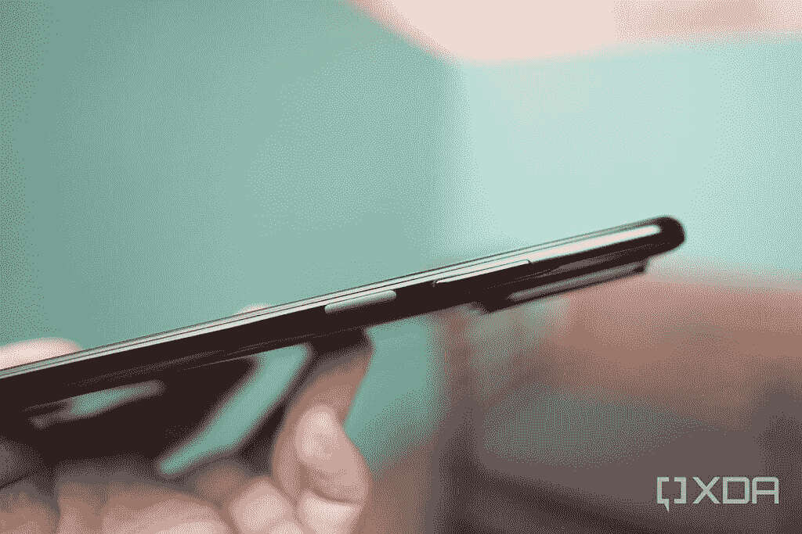

# 红米 Note 10 Pro 评测:为大众带来 120Hz 和 108MP

> 原文：<https://www.xda-developers.com/xiaomi-redmi-note-10-pro-review/>

在消费科技领域，新的尖端硬件总是诞生在具有优质功能和优质价格的优质手机上，只是后来被商品化，成为大众可以负担的起的产品。在大多数行业，这种排他性的寿命可以持续数年，但在快速发展、竞争激烈的智能手机领域——尤其是中国——通常是一年或更短时间。这就是 108MP 摄像头和 120Hz 显示屏正在发生的事情——这两个功能在一年前还是 1400 美元的三星高端旗舰产品的头条卖点，但现在已经出现在 300 美元以下的设备中，如小米的新 [Redmi Note 10 Pro](https://www.xda-developers.com/redmi-note-10/) 。

我用红米 Note 10 Pro 全球版已经一个多星期了，这是我的完整评测。

**注:** *中国手机品牌有一个习惯[使用混淆的名字](https://www.xda-developers.com/opinion-smartphone-branding-out-of-control/)，红米 Note 10 Pro 似乎就是这种情况。我有面向欧洲市场的全球版本，它似乎与同名的印度版本不同。然而，同一款手机正在进入印度，但使用的是 Redmi Note 10 Pro Max 品牌。我们单位是小米借给我们的，但是他们在这次评审中没有任何投入。*

## 红米 Note 10 Pro 规格

### 红米 Note 10 Pro 规格。单击或点击以展开。

| 

规格

 | 

红米 Note 10 Pro

 |
| --- | --- |
| **打造** | 

*   玻璃背面
*   前面是康宁大猩猩玻璃 5

 |
| **尺寸&重量** | 

*   164 毫米 x76.5mm 毫米 x 8.1mm 毫米
*   193g

 |
| **显示** | 

*   6.7 英寸 AMOLED
*   120 赫兹刷新率
*   居中打孔机

 |
| **SoC** | 高通骁龙 732G:

*   Kryo 470 CPU Prime 核心时钟速度高达 2.3 GHz
*   肾上腺素 618

 |
| **闸板&存放** | 

*   6GB + 64GB，UFS 2.2
*   6GB + 128GB
*   8GB + 128GB

 |
| **电池&充电** | 

*   5020 毫安时
*   33W 有线快速充电(包装中包含 33W 充电器)

 |
| **安全** | 侧装式指纹扫描仪 |
| **后置摄像头** | 

*   **主要:**108 兆像素，1/1.52 英寸传感器，9 合 1 像素宁滨，f/1.9
*   **次要:** 8MP 超广角，f/2.2，118 FoV
*   **第三级:** 5MP，宏，f/2.4
*   第四纪: 2MP，深度

视频:

*   4K @ 30fps
*   1080p @ 60fps，30fps

 |
| **前置摄像头** | 16MP |
| **端口** | USB-C，3.5 毫米耳机插孔 |
| **音频** | 双扬声器，AAC，LDAC，LHDC 支持 |
| **连通性** | 

*   无线网络:802.11a/b/g
*   蓝牙 5.1
*   国家足球联盟
*   乐队:
    *   4G: FDD-LTE: B1，3，5，7，8TDD-LTE: B34，38，39，40，41
    *   3G: WCDMA: B1，2，5，8CDMA EVDO: BC0
    *   2G: GSM: B2，3，5，8

 |
| **软件** | 基于 Android 10 的 MIUI 12 |
| **价格** | 

*   6GB+64GB 279 美元
*   6GB+128 GB 299 美元
*   8GB+128 GB 329 美元

 |

## 红米 Note 10 Pro:设计

在我看来，红米 Note 10 Pro 在外观上比红米 Note 9 Pro 有了很大的改进。突然从后面突出来的奇怪的摄像头凸起不见了。取而代之的是一个矩形但带有圆角的摄像头模块，其设计美学与[小米 11](https://www.xda-developers.com/xiaomi-mi-11-hands-on-preview/) 和小米 10 Ultra 的模块相同。108MP 传感器周围的镀银环使其更加华丽。

手机背面是玻璃，但不是像它的前面板一样是康宁大猩猩玻璃。它会稍微吸引指纹，但“缟玛瑙灰”的微妙色调看起来很吸引我的眼睛。这个模型中还有另外两种颜色更鲜艳:“冰川蓝”和“渐变青铜色”，根据官方产品渲染，看起来是浅蓝色和橙色。

在正面，Redmi Note 10 Pro 配备了 1080 x 2400 分辨率、120Hz 刷新率的 AMOLED 显示屏，以及相对较薄的(就其价格而言)边框。尽管有 AMOLED 面板，该设备没有显示下指纹扫描仪。相反，右侧有一个侧装式指纹扫描仪，兼作电源按钮。与我测试过的大多数侧装扫描仪不同，这款扫描仪没有缩进边框，相反，它几乎与手机的塑料底盘齐平。Redmi 称之为“弧形侧指纹传感器”，这个词我不会再用了。这是一个指纹扫描仪/电源按钮组合，效果很好——不需要多说什么。

 <picture></picture> 

The Redmi Note 10 Pro's fingerprint sensor sits on the right side of the device and doubles as a power button.

由于我是一个被最新旗舰手机惯坏的特权评测者(例如[小米 Mi 11](https://www.xda-developers.com/xiaomi-mi-11/) 、[三星 Galaxy S21 Ultra](https://www.xda-developers.com/samsung-galaxy-s21-preview/) )，所以我不能说红米 Note 10 Pro 的 AMOLED 屏幕第一眼就给我留下了深刻的印象。事实上，由于侧面安装的指纹扫描仪和光滑的屏幕保护器(预装)的存在，颜色变暗了，我起初以为 Redmi Note 10 Pro 有液晶面板。只有在我撕下屏幕保护并将 UI 切换到黑暗模式后，我才注意到这确实是一个有机发光二极管屏幕。与小米 Mi 11 并排放置时，它不是最强有力的面板，但话说回来，这不是一个公平的比较，不是吗？

Redmi Note 10 Pro 在阳光下的户外使用变得足够亮，120Hz 的刷新率带来了明显的流畅动画。

在内部，红米 Note 10 Pro 由高通骁龙 732G 驱动。我有一个中等大小的版本，有 6GB 内存和 128GB 内部存储，但其他两个版本提供 6GB + 64GB 和 8GB + 128GB。

## 红米 Note 10 Pro:相机

Redmi Note 10 Pro 的相机系统以 108MP [三星 ISOCELL HM2](https://www.xda-developers.com/samsung-isocell-lineup-promises-smaller-camera-bumps-future-smartphones/) 传感器为标题，两侧是 8MP 超宽镜头，5MP 宏观传感器和 2MP 深度传感器。

主要的 108MP HM2 传感器，与品牌相反，不如[小米的米 11](https://www.xda-developers.com/xiaomi-mi-11-versus-galaxy-s21/) (和[米 10 Pro](https://www.xda-developers.com/xiaomi-mi-10-pro-review/) )使用的 HM1 传感器，因为它有一个更小的 1/1.52”传感器。但由于 9 合 1 像素宁滨(可拍摄 1200 万像素的照片)，它仍然可以捕捉到生动、清晰的图像。由于 Redmi 的图像处理智能，动态范围通常也很准确。值得注意的是[小米 Mi 10i](https://www.xda-developers.com/xiaomi-mi-10i-5g-review/#gallery-1:~:text=Performance,-Xiaomi) 也使用了相同的传感器，我的同事 Tushar 对它的相机性能很满意。

由于大尺寸的图像传感器，当我近距离拍摄一个物体时，会有一种美观的自然散景效果。

在中度到弱光的情况下，Redmi Note 10 Pro 在拉进光线方面做得相当不错。事实上，除非场景非常暗，否则我觉得夜间模式没有必要。下面是两张照片，一张有夜间模式，一张没有。我在夜间模式拍摄中看到的唯一改进是绿色霓虹灯中的中文文字暴露得更好了。

(照片样本的长宽比比通常要大，因为我将相机设置为 9:16 格式，但忘记将其切换回默认的 3:4 长宽比)。

在这个价格范围内，主摄像头的视频性能很好。这款手机能够捕捉高达 4K/30fps 的镜头，但我发现在这种设置下稳定性会受到影响。相反，我以 1080p/30fps 拍摄，白天的镜头出来相当流畅；在晚上，微抖动是一个问题，但我不能对这个价位的设备有太多抱怨。音频录制听起来高于平均水平，因为这是相机的能力，适应动态范围，以改变光源。

红米 Note 10 Pro 超越了标准的照片和视频，还带来了一些之前在小米设备中引入的相机软件技巧。我觉得玩这些非常有趣，尤其是“克隆”功能，它允许用户拍摄同一个人的多个克隆体的照片或视频。

可能有第三方应用程序可以做到这一点，但小米/红米已经将该功能直接内置到相机应用程序中，并使其易于使用(你只需保持相机静止几秒钟，然后轻按快门几次)，这只是增加了整体的相机体验。

另一个自 2019 年以来一直存在的功能是“AI skyscaping”，但我直到测试红米 Note 10 Pro 时才知道它的存在。这项功能将滤镜应用于照片中的天空，可以说是改变了天气，同时也改变了图像中物体对光线的处理方式。一些结果——通常在变成天蓝色时——看起来相当真实。

总的来说，我对红米 Note 10 Pro 的主摄像头很满意。它使用起来既简单又有趣，照片通常都可以上传到 Instagram。

然而，其他后置摄像头表现不佳。如果有足够的照明，8MP 超宽镜头是体面的，但在晚上，它往往在细节上非常柔和。此外，由于某种原因，这款镜头无法使用夜间模式。请注意下面示例中主相机和超宽相机之间的图像质量差异——超宽镜头吹灭了灯，地面上的绿叶和水泥砖的纹理丢失了。

从主摄像头切换到超广角摄像头也会导致每次明显的延迟，可持续半秒钟。微距传感器和深度传感器在技术上都可以工作，但我不确定最终的照片是不是主相机通过一些软件技巧无法实现的。比如下面这个所谓的微距镜头，连那么近的一个主体都对焦不了。

与中国入门级手机一样，最好将这些设备视为具有双摄像头系统，而不是真正的“四摄像头”阵列。另一方面，自拍相机非常好，即使在恶劣的光线下，也能准确曝光，拍摄出清晰的照片。

我对 Redmi Note 10 Pro 的主摄像头非常满意——使用起来既简单又有趣，拍摄的照片通常都可以在 Instagram 上看到

## 红米 Note 10 Pro 性能

因为我正在测试一个预发布的模型，Redmi 显然已经阻止了基准应用程序，因为我无法运行 Geekbench 5(它会在完成测试之前崩溃)；3DMark 或 GFXBench(它无法连接到服务器)。但是我成功地运行了 andro bench——测试存储传输速度，这里的 UFS 2.2 闪存给出了中等的结果。

然而，在现实世界的使用中，除了切换到超广角相机时明显的延迟之外，我没有注意到 Redmi Note 10 Pro 的任何问题。在我一周的测试中，我用手机发送了数百条 WhatsApp/Slack 消息，观看了数十个 YouTube 视频，玩了游戏 *Infinity Ops* ，没有遇到任何问题。6GB 内存的高通骁龙 732G 适合这些使用案例。我怀疑性能与我们[在此评测的小米 Mi 10i 非常相似。](https://www.xda-developers.com/xiaomi-mi-10i-5g-review/#gallery-1:~:text=Performance,-Xiaomi)

Redmi Note 10 Pro 的大平板屏幕和高于平均水平的立体声扬声器使该设备握持舒适，可用作游戏或网飞手机。

正如 Redmi 设备所预期的那样，电池寿命非常好。即使使用 120Hz 的显示屏，我也能完成整整 14 个小时的工作，电池剩余电量超过 35%。请记住，我是一个重度用户，生活在一个密集的城市，有许多手机信号塔，消耗电池的速度更快(我的电池寿命一直比美国评论家报告的要短)。所以对大多数人来说，这可能是一个一天半的电话。对我来说，不尽然。但即使那样，它也为我服务了一整天。

## 红米 Note 10 Pro:软件

我的红米 Note 10 Pro 单元开箱运行 MIUI 12.0.1 global。我从 10 版开始就是 MIUI 的粉丝了，这里几乎没有什么变化:我喜欢丰富多彩、异想天开的软件触感，应用托盘的增加进一步使软件使用起来很愉快。正如我前面提到的，动画是流畅的，反应灵敏的。

然而，有一些抱怨让 MIUI 不再是我最喜欢的 Android 皮肤。单手模式只能在使用屏幕上的软件按钮时触发，这意味着使用手势滑动导航的人没有单手模式。这是小米/红米仍未修复的重大疏忽。

MIUI 的设置面板还是有一些异常复杂的列表。例如，每次我得到一部新手机，我都会把屏幕自动关闭前的空闲时间改为两分钟(默认设置通常只有 30 秒，这让拍摄产品变得很痛苦)。在几乎所有其他安卓手机中，这个设置都列在“显示”下面。在 MIUI 中，它列在“永远显示和锁屏”下，这是一个独立于“显示”的部分

Redmi Note 10 Pro 的大平板屏幕和高于平均水平的立体声扬声器使该设备握持舒适，可用作游戏或网飞手机。

## 红米 Note 10 Pro:结论

我通常会对智能手机品牌的口号翻白眼——我会想到“永不满足”——但小米的口号“为每个人带来创新”是我不能嘲笑的，因为该公司的产品确实将以前的尖端技术带给了大众。

红米 Note 10 Pro 的价格为 279 美元(6GB + 64GB 版本)，299 美元(6GB + 128GB)和 329 美元(8GB + 128GB)，即使预算紧张，也能负担得起 108MP 摄像头传感器和 120Hz 有机发光二极管屏幕。当然，对于使用旗舰手机的人来说，缺少任何变焦摄像头或落后的超广角镜头都很难接受，但对于那些从几年前发布的另一款类似价格的手机升级到 Redmi Note 10 Pro 的人来说，这款设备会感觉像是一个大飞跃。

我所说的红米 Note 10 Pro 也以红米 Note 10 Pro Max 的身份在印度亮相。在印度市场，这款手机在₹20,000(约 275 美元)的带领下取得了很大成绩，让我们想起了它的前辈 Redmi Note 3 和 Redmi Note 7 Pro 带来的高性价比。就目前这个特定的市场而言，这款手机是一个事实上的选择，如果它在最初的几次销售中仍然售罄，我也不会感到惊讶。印度市场竞争激烈，未来几周和几个月，竞争对手肯定会给出答案。但在此之前，红米 Note 10 Pro Max 是中端的绝佳选择。该品牌在“Redmi Note”品牌下成功建立了巨大的商誉，并且具有很高的性价比，看起来他们手中又有了一个赢家。