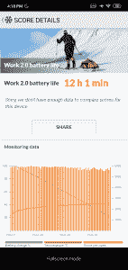

# 小米 Redmi Y3 [Mini]评测:同级领先的自拍性能

> 原文：<https://www.xda-developers.com/xiaomi-redmi-y3-review/>

小米早在 2017 年就推出了 Redmi Y 系列，其中 [Redmi Y1](https://www.xda-developers.com/xiaomi-launches-redmi-y1-redmi-y1-lite-miui-9-global-rom/) 是专注于年轻人系列的第一款设备。其次是 Redmi Y2，它不仅具有更好的前置摄像头，还具有用于人像摄影的双摄像头设置，当时仅适用于 Redmi Note 系列。最近，该公司推出了以自拍为重点的第三代产品，在印度推出了[红米 Y3](https://www.xda-developers.com/xiaomi-redmi-y3-redmi-7-india-launch/) 。通过 Redmi Y3，小米带来了更具吸引力的设计、更大的电池和更好的前置摄像头。Redmi Y2 相当成功，该公司认为 Redmi Y3 可能会重复同样的成功。基本款的起价为 9，999 卢比，这看起来肯定是一款引人注目的设备。但它真的是自拍爱好者的最佳手机吗？我们在这篇综述中找到答案。

## Redmi Y3 规格

| 

规格

 | 

详述

 | 

规格

 | 

详述

 |
| --- | --- | --- | --- |
| 软件 | Android 9 派配 MIUI 10 | 连通性 | 2+1 SIM 卡托架，双 4G VoLTE，GPS，微型 USB 端口。 |
| 中央处理器 | 高通骁龙 632 @1.8GHz - 8x Cortex-A53 | 声音的 | 3.5 毫米耳机插孔，Dirac 高清音效。 |
| 国家政治保卫局。参见 OGPU | Adreno 506(高达 725MHz) | 后置摄像头 | 

*   12MP + 2MP
*   1.25μm 像素尺寸
*   双音 LED 闪光灯
*   1080@60fps / 30fps 视频录制
*   数码变焦
*   自动对焦:PDAF，自动对焦

 |
| RAM 和存储 | 3GB / 4GB LPDDR4 内存和 32 / 64GB eMMC 5.1 存储(microSD 最高支持 256GB) | 前置摄像头 | 

*   32MP f/2.25
*   0.8μm(像素宁滨为 1.6μm)
*   直接热轧制
*   面部解锁
*   屏幕闪光
*   电化学阻抗谱（Electrochemical Impedance Spectroscopy 的缩写）
*   手掌快门

 |
| 电池 | 4230 毫安时 | 指纹扫描仪 | 是(后置) |
| 显示 | 

*   6.26 英寸 1520x720 分辨率 IPS 液晶屏。19:9 宽高比，带显示屏凹槽
*   1670 万色
*   450 尼特亮度
*   大猩猩玻璃 5 保护

 | 在盒子里 | 

*   红米 Y3
*   保护箱
*   微型 USB 充电器和插头
*   SIM 卡弹出工具

 |
| 无线保真 | Wi-Fi 802.11 b/g/n (2.4GHz) | 颜色；色彩；色调 | 动态黑色、动态蓝色、黑色 |
| 蓝牙 | 蓝牙 4.2 | 网络波段 | 

*   GSM:B2/2008 年 3 月 5 日
*   WCDMA: B1/2/5/8
*   LTE: B1/3/5/8/40/41

 |

## Redmi 3 设计和展示

虽然 Redmi Y3 的主要亮点是其前置摄像头，但立即抓住你注意力的是美丽的 Aura 棱镜设计。小米表示，双色调背面由 7 层组成，包括油墨层、电镀层、UX 纹理层、渐变涂料、PET 膜、聚碳酸酯和 UV 涂层。当在直射光下观察时，它会反射出一种凉爽的彩虹般的效果，颜色相互融合。在我们的评论中，我们高度赞扬了 [Realme 3 的设计，并将其称为其价格范围内最好看的智能手机。但似乎我们将不得不把这个头衔传给红米 Y3。Realme 3 仍然是一款外观很棒的设备，但 Redmi Y3 以更引人注目的设计和更好的制造质量超越了它。](https://www.xda-developers.com/realme-3-review-a-solid-device-in-a-crowded-market/)

在设计语言方面，红米 Y3 显然是[红米 Note 7](https://www.xda-developers.com/xiaomi-redmi-note-7-series-sold-million-units-month-india/) 设计理念的后代，正面有水滴凹槽，背面有坡度。虽然设计相同，但材料不同，因为该设备使用塑料而不是金属和玻璃结构。如果不实际将设备握在手中，很难判断它是否由塑料制成，因为它与 Redmi Note 7 具有相同的光泽。这种光滑的表面也意味着背面很容易沾上指纹和污渍。它不是一体式设计，但反射表面和渐变配色方案给了这款设备一种无缝的印象。

除了指纹传感器，你不会在 Redmi Y3 上找到任何金属——甚至 SIM 卡托盘和物理按钮都是塑料制成的。但是整体的构建质量足够可靠，没有什么可抱怨的——除了一件事:按钮。这些按钮缺乏坚实的触觉反应，似乎过于挑剔。有几次按下音量减小按钮后卡在原来的位置，导致屏幕上连续弹出音量滑块窗口。无论如何都不是一个交易破坏者，但对于一个完美的设计来说确实有点令人失望。

该设备的正面由 Gorilla Glass 5 保护，据说它对肩部高度下降的保护力度是竞争眼镜的 4 倍。顶部的水滴凹槽容纳了前置摄像头，而通知 LED 隐藏在底部下巴上。在最上面，你会发现辅助麦克风，3.5 毫米耳机插孔和红外发射器。电源和音量控制键位于右侧，而 2+1 SIM 卡托架位于左侧。同时，micro USB 端口、扬声器和麦克风位于底部。

移到后面，我们可以看到熟悉的红米 Note 7 外观。垂直装配的双摄像头设置在左侧，正下方是闪光灯模块。上半部分有一个凹陷的指纹扫描仪，底部有一个品牌标志，上面写着“小米红米”(因为红米现在是一个独立的品牌)。

Redmi Y3 采用 6.26 英寸高清+液晶显示屏，分辨率为 1520 x 720。虽然不是最清晰的，但显示器本身的质量相当好。颜色是有力和充满活力的，视角也很好。与其他 Redmi 设备类似，您也可以根据自己的喜好调整白平衡和对比度的各种显示设置。我们发现标准对比模式有点太暖了。另一方面，自动对比度模式非常有用，因为它可以根据可用的光线自动调整对比度，以获得最佳的观看体验。室外能见度也非常好——几乎与[红米 Note 6 Pro](https://www.xda-developers.com/xiaomi-redmi-note-6-pro-review-a-great-phone-but-wait-for-the-redmi-note-7/) 不相上下。在最大亮度下，它变得相当明亮，我们在晴天阅读文本和预览照片没有任何问题。

## 红米 Y3 相机

### 前置摄像头性能

红米 Y3 的主要卖点是它的前置摄像头。虽然有点奇怪，但我认为从分析前置摄像头的性能开始摄像头部分是有意义的。Redmi Y2 提供了 1600 万像素的前置摄像头，Redmi Y3 的前置摄像头是 32MP 传感器的两倍。看到巨大的百万像素很容易兴奋，但众所周知，拥有更多的百万像素并不能直接转化为更好的相机性能。影响整体图像质量的因素有很多。32MP 传感器配有较小的像素尺寸，因此在弱光拍摄中光线捕捉可能不会那么好。为了解决这个问题，小米正在使用像素宁滨将 4 个像素合并为 1 个像素，以产生最终的 800 万像素图像。不过，你可以从汉堡菜单中切换 32MP 模式，以最大分辨率拍摄。

就图像质量而言，光线充足条件下的自拍表现出令人愉快的肤色和良好的对比度。颜色是准确的，白平衡和饱和度也是如此。在高对比度场景下，曝光可能会被击中或错过。默认的 800 万像素图像清晰，细节丰富。在良好的照明条件下，Redmi Y3 不会令人失望，并提供惊人的效果。你还可以在前置摄像头上使用肖像模式，效果非常好。在室外场景中，即使场景中有多人，也能非常准确地从背景中识别出主体。只有在默认的 800 万像素分辨率下拍摄时，肖像模式才可用。

至于那些想知道 32MP 拍摄是否会对画面质量产生显著影响的人，简单的答案是肯定的。在细节保留方面，32MP 照片比 8MP 照片保留了更多的细节，尽管你不太可能仅仅通过观察就发现 8MP 和 32MP 照片之间的任何重大差异。只有当你决定放大拍摄对象时，这种差异才会显现出来。我不认为在每种情况下都用全分辨率拍摄是一个好主意，因为它不会产生非常好的图像。更不用说巨大的存储空间了—单个图像高达 20MB。高分辨率照片可能在社交媒体平台上有用，这些平台利用了重度压缩，并且在晚上，如果你喜欢以噪音为代价的更多细节。否则，默认模式在大多数情况下会产生同样好的结果。

在弱光条件下和人工照明下，Redmi Y3 继续提供出色的效果。与 32MP 分辨率的照片相比，使用默认的 800 万像素摄像头拍摄的图像噪点更少。这是因为通过将 4 个像素合并为 1 个像素，传感器可以有效地捕捉更多的光-1.6 μm 对 0.8 μm-从而显著降低图像中的噪声。

到目前为止，Redmi Y3 的前置摄像头的性能和一致性给我们留下了深刻的印象。我们在智能手机上看到过比红米 Y3 更好的自拍性能吗？是的，但肯定不是在这个价格范围内，整体性能仍然非常接近我们在更昂贵的设备上看到的。

总而言之，Redmi Y3 上的**前置摄像头产生了我们在这个领域的任何设备上见过的最清晰、可以说是最好看的图像**。如果自拍是你的优先选择，那么红米 Y3 就是你的不二之选。

注意:我们所有的样本图像都是在禁用美化和人工智能模式的情况下拍摄的。

### 后置摄像头评估

Redmi Y3 背面有一个双摄像头设置，由 12MP 主传感器和 2MP 深度传感器组成。对于这个价位来说，这是一个不错的相机套装，尽管这里没有什么特别的。我们在各种情况下测试了 Redmi Y3 的拍照能力，以评估其性能。在良好的照明条件下，Redmi Y3 通常会提供令人满意的结果，如果照明恰到好处，它也能够捕捉到一些令人惊叹的照片。颜色是准确的，虽然动态范围大约是我们在类似价格的设备上看到的平均水平。有自动 HDR 模式，声称可以提高高对比度场景的动态范围，但我们对结果不满意。大多数用自动 HDR 拍摄的照片都被洗掉了，有点卡通化。我们建议设置 HDR 模式关闭，因为往往不是自动 HDR 不能把事情做好。我们还遇到了一些问题，相机会使色彩过饱和，并在室外场景中过度曝光高光。幸运的是，这些特殊的问题在第一次软件更新中就被解决了。

日光图像有很多细节，并且很好地保留了纹理，但是当你移动到低光场景时，事情开始变得模糊。低光性能不是 Redmi Y3 的最大优势，但它确实完成了任务。它表现得很好。值得一提的是，它大部分时间都能获得正确的颜色和曝光，但细节会模糊，导致图像更柔和。在 HDR 手动拍摄确实改善了细节和阴影，但它只方便拍摄静态物体。在 HDR 模式下不可能拍摄任何移动的物体，因为生成最终图像需要很长时间。

Redmi Y3 上的人像非常出色，实际上比我们在 Realme 3 上看到的要好很多。这是 Realme 和华硕等公司仍需迎头赶上的领域。Redmi Y3 在这个价格范围内生产了一些最好看的肖像。深度估计比我们希望的要慢一点，但最终结果通常非常准确，有令人愉快的模糊效果和精确的遮罩主题。户外图像中很少有任何伪像，头发和太阳镜边缘等复杂细节处理得相当好。

## Redmi Y3 性能

Redmi Y3 由高通骁龙 632 SoC 驱动，是骁龙 626 的继任者。虽然 CPU 时钟速度与骁龙 636 相似，但这是一种不同的架构。它使用 8 个基于 ARM Cortex-A53 的 Kryo 250 内核，而骁龙 636 的 Kryo 260 内核使用更强大的 Cortex-A73 内核以及 Cortex-A53 效率内核。最终，Redmi Y3 不会成为一个性能强劲的引擎，但它有足够的原始动力来保持平稳运行。在使用过 Redmi Y2 之后，我可以告诉你，Redmi Y3 肯定比它的前身更上一层楼，在正常操作中感觉更快。

在我们的应用程序打开速度测试中，这款设备表现相当不错，以轻松的优势击败了 Realme 3，同时接近骁龙 636 驱动的 Redmi Note 6 Pro。该测试快速连续打开 Play Store、Gmail 和 YouTube 应用程序 150 次，最终结果显示在下图中。

请记住，我们并不是在测量一个应用程序在所有元素都绘制在屏幕上的情况下完全渲染所需的时间。相反，我们通过记录应用程序创建应用程序的主要活动所花费的时间来使用代理。我们包括的时间度量包括启动应用程序流程、初始化其对象、创建和初始化活动、展开活动的布局以及第一次绘制应用程序。它忽略了不会阻止应用程序初始显示的内联进程，这反过来意味着记录的时间不会真正受到外部变量的影响，例如获取繁重资产的网络速度。

总的来说，Redmi Y3 是一款非常有用的设备，尽管对重度用户来说远非理想。当你开始打开新的应用程序，内存填满时，设备会变得有点不稳定。当我们不时在应用程序之间切换时，会遇到一些 UI 冻结和反应迟钝的问题，但没有严重影响我们的体验。Redmi Y3 在价格上仍然表现不错，事实上，比处理能力更强的 Realme 3 好得多。

关于该设备的性能方面，没有更多要补充的了。它不是为超级用户设计的，这是需要记住的一点。如果你在这个价格范围内寻找强大的性能，那么像红米 Note 7 或最近发布的红米 Note 7S 这样的产品将是更好的选择。对于其他人来说，Redmi Y3 不会令人失望，在日常场景中提供相当快的性能。

在解锁速度方面，来自 Realme 3 上非常不准确的指纹扫描仪，我对 Redmi Y3 上后置指纹扫描仪的速度和准确性感到惊喜。它真的很快，很准确，即使我的手指出汗了，也很少会记录不到。Redmi Y3 上的面部解锁也非常有效，即使在弱光条件下也是如此。作为一个不错的补充，最近的软件更新增加了一个留在锁定屏幕上的选项，并不会在面部解锁成功后直接带你到主屏幕。当你只想在锁屏界面上查看时间或通知时，这真的很方便。

## Redmi Y3 电池寿命

Redmi Y3 提供了一个 4000 毫安时的大电池，比 Redmi Y2 的 3000 毫安时电池有所提高。更大的电池加上低分辨率的屏幕带来了惊人的电池续航时间。我的使用量相对较大，包括大量的 Chrome 浏览器冲浪、拍照、Spotify 和 YouTube 上的流媒体以及大量的社交媒体使用，这款设备在充满电的情况下可以轻松持续近两天。当然，电池寿命因人而异，取决于他们的个人使用模式，但这是一个非常好的估计，你可以从这款设备的总体预期。

我们的标准 PCMark 电池 2.0。测试中，该设备在亮度设置为 50%的情况下存活了 12 小时 1 分钟。测试是在禁用后台服务并关闭互联网连接的情况下进行的。

 <picture></picture> 

Redmi Y3's score on PCMark Battery 2.0

至于充电时间，该设备从休眠状态充满电需要接近 2 小时 15 分钟。对于通过 5V / 2A 充电器充电的 4，000 mAh 电池来说，这是完全可以接受的。当设备充电时，背面没有异常的发热，这在我们的 Redmi Note 6 Pro 设备中很常见。

## Redmi Y3 软件

Redmi Y3 自带 Android Pie 9.0，上面运行着熟悉的 MIUI 10。在我们对[红米 Note 6 Pro](https://www.xda-developers.com/xiaomi-redmi-note-6-pro-review-a-great-phone-but-wait-for-the-redmi-note-7/) 和[红米 Note 7 Pro](https://www.xda-developers.com/xiaomi-redmi-note-7-pro-review/) 的评测中，我们已经详细讨论了 MIUI 10 的各个部分。我们建议您查看这些评论的软件部分，因为这些设备提供的整体软件体验和功能几乎没有什么不同。在我们的审查期间，我们收到了一个软件更新，它带来了 4 月份的安全补丁，对面部解锁和摄像头的改进，以及对用户报告的错误的修复。

## Redmi Y3 连接和通话质量

听筒和扬声器的通话质量都非常清晰。信号接收也普遍良好，没有掉线或信号丢失的情况。然而，与 Redmi Note 6 Pro 等产品相比，数据速度明显较慢。这主要是因为相对较慢的骁龙 X9 LTE 调制解调器。这款设备支持两个 sim 上的 VoLTE，由于它有一个 2+1 托盘，你还可以在两个 sim 旁边容纳一个 microSD 卡，这是甚至更昂贵的设备如 Redmi Note 7 Pro 都无法做到的。

## 结论

Redmi Y3 是小米的又一款可靠设备。它主要针对那些正在寻找一个有能力的前置摄像头的自拍爱好者。如果你属于这一类别，Redmi Y3 是一个完美的选择，它以合理的价格提供了一流的自拍性能，惊人的电池续航时间和令人惊叹的设计。除了前置摄像头，红米 Y3 没有什么特别突出的地方。这是一款不错的设备，但那些希望在相同价格范围内获得最佳性价比和更全面的智能手机体验的人会发现红米 Note 7 和红米 Note 7S 更有吸引力。

在竞争方面，Redmi Y3 有一个直接的竞争对手 Realme U1，它也以类似的价格提供以自拍为主的体验。但 Redmi Y3 有一个优势，因为它提供了更大的电池，更新的软件版本，以及可以说更好的相机性能。如果你正在考虑购买 Redmi Y3，我们建议购买基本型号，因为 32GB 的存储空间对于应用程序来说已经足够了，而且由于该设备有一个专用的 microSD 插槽，如果需要，你可以随时增加存储容量来存储照片和其他媒体文件。

[**从 Mi.com 购买红米 Y3**](https://store.mi.com/in/buy/product/redmi-y3)[**从 Flipkart 购买红米 Y3**](https://www.flipkart.com/redmi-y3-elegant-blue-32-gb/p/itmffwjxzghnv6u6)