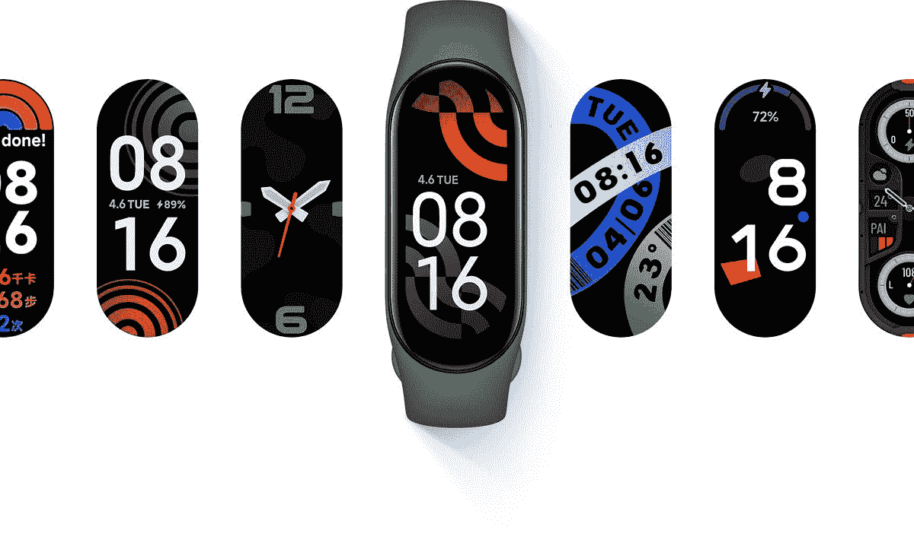
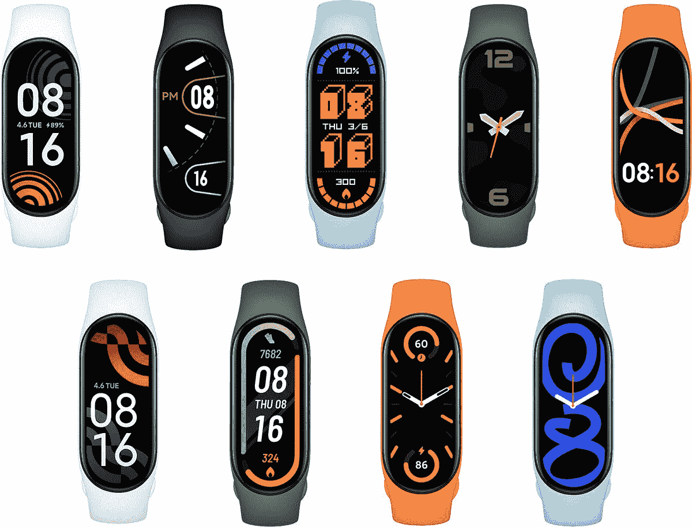

# 小米智能手环 7 评测:这款 60 美元的健身追踪器是一款超值产品

> 原文：<https://www.xda-developers.com/xiaomi-smart-band-7-review/>

多年来，小米的健身追踪器系列经历了几次小的名称变化，从 Mi Smart Band 到 Mi Band，再到现在的 Smart Band，但吸引力仍然保持不变——这是一款非常实惠的健身追踪器，可以提供准确的健身和健康追踪，数据可以立即在屏幕上看到，近年来，屏幕变得更大，更有活力。我们现在有小米智能手环 7，或者普通人会称之为“小米手环 7”，它承诺做更多同样的事情。

考虑到这些手环可以做几乎与苹果手表(T0)或银河手表(T1)相同的健康跟踪，而价格却只有其一小部分，难怪这些手环卖得很好。这款最新型号的价格略有上涨——现在是 60 美元——但它仍然是一个比 Fitbit Charge 5 便宜得多的选择。虽然小米智能手环 7 可能不像智能手表或大显示屏健身追踪器那样华丽或引人注目，但它证明了一个实用的产品在定价合适的情况下仍会找到自己的市场。它按照盒子上说的做，大多数买这个的人会很满意。

 <picture></picture> 

Mi Smart Band 7

##### 小米智能手环 7

小米智能手环 7 是一款价格实惠的健身追踪器，可以很好地记录步数、心率和睡眠，屏幕也很大，充满活力。

## 小米智能手环 7:定价和供货情况

小米智能手环 7 现已通过亚马逊和其他在线零售商在全球发售，包括难以捉摸的北美市场。它也将在小米的实体店出售，供住在附近的人使用。Mi Band 7 的官方价格为 62 美元，但在亚马逊上，价格在 58 美元至 66 美元之间不等。

* * *

## 小米智能手环 7:规格

| 规范 | 小米智能手环 7 |
| --- | --- |
| **尺寸和重量** | 

*   46.5 x 20.7 x 12.25mm 毫米
*   13.5 克

 |
| **材料** | 聚碳酸酯 |
| **腕带** | 硅酮 |
| **兼容性** | 安卓、iPhone |
| **显示** | 1.62 英寸 AMOLED (152 x 486) 500 尼特亮度 |
| **连通性** | 蓝牙 5.2 |
| **GPS** | 不 |
| **传感器** | 

*   PPG 心率传感器
*   三轴加速度计
*   三轴陀螺仪
*   晴雨表
*   近程传感器

 |
| **NFC 支付** | 不 |
| **电池** | 180 毫安时 |
| **耐水性** | 5ATM 或 50m，最长 10 分钟 |

***关于本次评测:**小米给我发了一个智能 Band 7 进行评测。这篇文章是在佩戴该设备九天之后写的。小米在这次评审中没有任何投入。*

* * *

## 小米智能手环 7:硬件和设计

像它的前辈小米手环 6 一样，小米智能手环 7 实际上是一个微小的椭圆形设备，可以完全从橡胶带上拆卸下来。这个豆荚状的小核心只有 12.2 毫米厚(比 Band 6 的 12.7 毫米薄)，重量只有 13 克。即使有了表带，重量也只有 16g。它是如此精致小巧，以至于我把它(没有带子)放在裤子口袋里，却忘了它已经放了一整天了。

1.62 英寸的有机发光二极管屏幕是有史以来最大的

1.62 英寸的有机发光二极管屏幕是有史以来最大的，比去年的 1.56 英寸略有提高，比[小米 Band 5](https://www.xda-developers.com/xiaomi-mi-band-5-review/) 的 1.1 英寸有了很大的提高。显示屏尺寸的增加主要是水平延伸，这意味着 Smart Band 7 的屏幕比去年的 Band 6 更宽(而不是更长)。最大屏幕亮度已经提高到 500 尼特，仍然不足以在直射的阳光下容易看到，但屏幕在其他地方看起来都很棒。

该设备的背面是心率和血氧水平传感器，以及专用充电器的磁性引脚空间。我可以确认 Band 6 的充电器仍然可以与 Smart Band 7 一起工作，但我不确定 Mi Band 5 的充电器是否可以(因为我没有测试)。

这个小豆荚滑入橡胶表带舒适。没有开关或按钮需要处理，橡胶带就像橡皮筋一样缠绕在它周围，贴合牢固。

小米手环系列的卖点之一是替换手环，小米出售的手环颜色鲜明，如“霓虹绿”、“卡奇绿”和橙色。如果你发现缺少这些选项，第三方卖家将很快出现，提供更多不同风格和颜色的选项。将会有点缺乏“优质”乐队，但考虑到这个健身追踪器阵容的历史，你会对乐队的选择非常满意。

就我个人而言，我并不喜欢橡胶表带，当我出汗时，它们感觉很粘，“黏糊糊”(如果有可能，我总是购买第三方皮革表带)。但考虑到其两位数的价格，我对橡胶表带是包含在内的带没有问题。这不像苹果或三星为我们提供价格超过 300 美元的可穿戴设备橡胶表带。在这个价格，这是伟大的，你可以随时扑通几美元，并得到其他东西，如果你需要。

表带舒适地套在我的手腕上，有足够的槽口用于增量大小调整。这种可穿戴设备的等级为 5ATM，这意味着它可以在 50 米的水中浸没长达 10 分钟。这个数字是一个安全的估计——我已经在水下戴了 6 号腕带(也是 5 大气压)超过 20 分钟，没有出现任何问题。

里面有一块 180 毫安的电池，根据设置，足以为 Smart Band 7 供电长达两周。有关电池性能的更多信息，请参见“性能”部分。虽然这款手环的中国版有 NFC 功能，但全球版(我正在评测的这款)没有。也没有全球定位系统，所以你需要随身携带手机来跟踪跑步。同样，在我看来，这些都是可以接受的价格妥协。

* * *

## 小米 Mi Band 7:软件和功能

小米 Band 7 的导航完全通过滑动和点击来完成，因为没有物理按钮。这在很大程度上是没问题的，但有时当显示屏是湿的，或者如果我的手指是湿的，可能需要多次点击才能获得所需的操作。这并不经常发生，但有时我会尝试唤醒屏幕，这需要两到三次点击。也许一个物理按钮会有所帮助。顺便说一句，有一个唤醒功能效果很好。我可以说 98%的时间我都能很好地浏览乐队的用户界面。

UX 是可穿戴设备的标准配置:从顶部向下滑动可以看到通知，从底部向上滑动可以访问一系列功能，你可以在配套的应用程序中定制这些功能。水平滑动可以循环播放音乐播放器、运动追踪等各种功能。

几乎没有什么应用生态系统可言，这意味着你可以用 band 做的一切都已经是现成的了，你不能去下载更多的东西来做。虽然与其他 Android 智能手表相比，这听起来像是一个缺点，但现实是所有非 Apple Watch 智能手表平台，无论是谷歌自己的 WearOS，三星的 Tizen，华为的鸿蒙系统，还是 Fitbit 的 OS，反正都有*贫血的第三方应用*支持。如果我们将 Mi Band 7 与 Apple Watch 进行比较，当然，Apple Watch 可以做更多的事情，比如访问数字助理或控制 Spotify 播放列表或打开数字登机牌(至少对北美航空公司而言)。但与华为手表 GT 3 或 Fitbit Sense 相比呢？小米智能手环 7 几乎可以做那些价格更高的智能手表能做的一切。

该手环通过小米的 Mi Fitness 应用程序与智能手机配对，该应用程序适用于 Android 和 iOS。我将我的 Smart Band 7 与小米智能手机配对，然后与 Galaxy S22 Ultra 配对，一切正常。不像华为的可穿戴设备那样，小米智能手机没有独家和仅限于小米智能手机的功能，所以你可以在 Android 上非常灵活地使用这些功能，而不会受到任何 OEM 厂商的限制。

你可以直接在可穿戴设备上查看当天的健康数据——行走的步数、心率、完成的锻炼、睡眠时间。但如果你想查看旧数据，你必须进入 Mi 健身应用程序，它提供了一个相当典型的概览。所谓典型，我的意思是它很好，它不会比 Fitbit 或 Apple Watch 向我展示的东西更有洞察力或更缺乏洞察力。例如，对于锻炼，我可以看到整个过程中我的心率的详细地图。对于睡眠，我可以在深度睡眠或快速眼动时看到。

Mi Fitness 应用程序也有几十种表盘可供选择，它们非常美观，在我看来，比三星或华为可穿戴商店的选项好得多。社区也想出了创建自定义手表表面的方法，所以这里有足够的空间来探索。

换表脸也只需要 10-30 秒(你要先下载表脸)，不像 Fitbit 几乎都要五到十分钟(这是 Fitbit 的 app 的一个 bug，多年来一直没有修复)。

其中一些表盘甚至支持复杂功能，尽管它非常有限(例如，你可以指定一种复杂功能来显示心率、步数或天气)。这与苹果手表表盘上的各种有用的复杂功能相去甚远，但仍然比任何支持零复杂功能的 Fitbit 或华为手表表盘好得多。

你注意到这篇评论的趋势了吗？我对这个 60 美元的表带的任何缺点或挑剔都是当我把它与最低价格为 199 美元的 Apple Watch 进行比较时。除此之外，这款手环的性能经常保持甚至超过其他所有人的其他可穿戴设备。

* * *

## 小米智能手环 7:性能和续航

作为一个健身追踪器，Smart Band 7 可以完成这项工作。我在一系列散步和锻炼中戴着 Apple Watch 7 的手环，数字是可比的。睡眠追踪似乎也相当准确，因为乐队足够聪明，不会想到我不断的辗转反侧是我在“醒来”

除了跟踪血氧水平和心率等预期的事情，小米智能手环 7 还可以跟踪月经周期和呼吸，尽管后者还处于测试阶段。

我戴着苹果手表 7 和一系列散步和锻炼的手环，数字是可比的

小米智能手环 7 不会自动检测锻炼，而是像价格更高的健身追踪器那样开始追踪，所以你必须手动记录锻炼。有大量的锻炼模式，从基础的如骑自行车到瑜伽，到晦涩的如钓鱼和跑酷。我总是对这些健身模式持半信半疑的态度——我的意思是，一个手腕佩戴的设备真的能准确区分羽毛球和网球吗？钓鱼还是太极？这不是小米的问题，我怀疑 Apple Watch 是否也能看出来。我的建议是选择一个和你正在做的事情足够接近的锻炼。当我在健身房时，我可以选择“自由式锻炼”或“力量训练”，我不需要区分在倾斜的跑步机上行走或在爬楼梯上行走。在我看来这是浪费时间。

我对 band 的一个不满是，它只能以静态形式反映来自我智能手机的通知。我根本无法与通知互动。但同样，这个问题存在于几乎 99%的健身腕带和大多数 Android 智能手表上。因此，如果 300 美元的 Android 智能手表也不允许我回复通知，我甚至不确定这是否是一个合理的投诉。

续航非常好。如果您关闭常亮显示屏，电池续航时间可达 14 天。我已经 14 天没有使用这款手环了，但是在我写这篇文章的时候已经使用了 9 天，我的手环还有 38%的电池剩余，所以看起来它将超过 14 天的大关。小米表示，如果你一直开着显示屏，电池寿命会下降到大约一周。那还是挺好的。

* * *

## 该不该买 Mi Band 7？

**你应该买小米智能手环 7 如果:**

*   你想要一个负担得起的健身带来记录健身数据
*   你想要一款轻薄的可穿戴设备，不会妨碍长袖衬衫、睡眠或其他活动

**你不应该买小米智能手环 7 如果:**

*   你已经拥有小米智能手环 6 了
*   你不介意花更多的钱买一个功能更强的整体可穿戴设备，比如 Galaxy Watch 4 或 Apple Watch

即使价格略有上涨，小米智能手环 7 也是那些寻求物有所值的健身追踪器的人的一个简单推荐。这款产品售价 60 美元，比它声称要做的更好，比这个价格范围内的其他追踪器提供了更大、更有活力的屏幕和更好的表盘。然而，Mi Band 7 并不是 Mi Band 6 的一大进步(唯一的改进是更好的电池寿命和更大的屏幕)，所以那些拥有去年可穿戴设备的人已经不需要升级了。

 <picture></picture> 

Xiaomi Smart Band 7

##### 小米智能手环 7

小米智能手环 7 是一款售价 60 美元的追踪器，屏幕大且充满活力，能够准确追踪健身情况