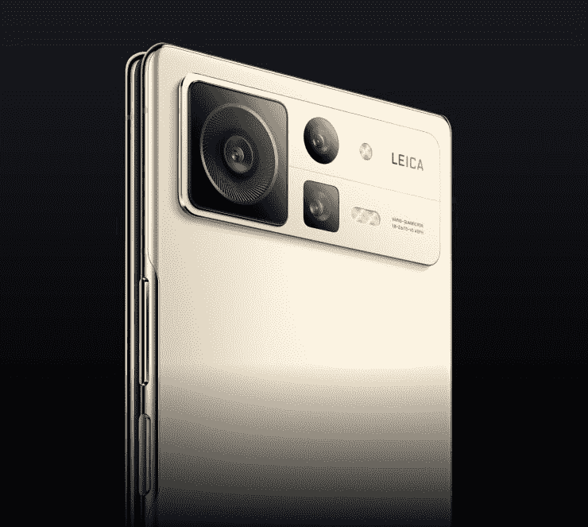

# 小米的 Mix Fold 2 是来挑战 Galaxy Z Fold 4 的

> 原文：<https://www.xda-developers.com/xiaomis-mix-fold-2-launch/>

紧随三星发布之后，小米发布了其最新的可折叠旗舰产品——小米 Mix Fold 2。新设备比去年的原始 Mi Mix Fold 带来了几项设计改进，包括更耐用的转轴和更纤薄的外形。此外，小米在该设备上安装了高通最新的旗舰芯片组，以及新的主摄像头、更好的显示屏和额外的存储空间。这使得新的小米 Mix Fold 2 与新推出的 [Galaxy Z Fold 4](https://www.xda-developers.com/samsung-galaxy-z-fold-4-hands-on/) 处于同一水平。

与三星最新的旗舰产品 foldable 一样，小米 Mix Fold 2 采用了高通的骁龙 8 Plus Gen 1 SoC，12GB 的内存和高达 1TB 的板载存储。但它配备了略大的 6.56 英寸覆盖显示屏，提供更高的 2520 x 1080p 分辨率和 120Hz 刷新率，更大的 8.02 英寸可折叠显示屏，支持 120Hz 刷新率和 1-120Hz 自适应刷新率，以及更快的 67W 有线充电能力。查看下表，快速了解其硬件概况。

## 小米 Mix Fold 2:规格

| 

规格

 | 

小米 Mix Fold 2

 |
| --- | --- |
| **尺寸&重量** | 

*   折叠后:161.6 x 73.9 x 11.2mm 毫米
*   展开后:161.6 x 144.7 x 5.4mm 毫米
*   262 克

 |
| **显示** | 

*   封面:
    *   6.56 英寸 FHD+ AMOLED
    *   2520 x 1080p 分辨率
    *   120 赫兹刷新率
    *   1000 尼特亮度
    *   HDR 10 岁以上
    *   杜比视觉
*   主要:
    *   8.02 英寸 2K+ LTPO 2.0 AMOLED
    *   2160 x 1914p 分辨率
    *   120 赫兹刷新率(1-120 赫兹自适应刷新率)
    *   1000 尼特亮度

 |
| **SoC** | 高通骁龙 8 加第 1 代 |
| **内存&存储** | 

*   12GB LPDDR5 内存+ 256GB UFS 3.1 存储
*   12GB + 512GB
*   12GB + 1TB

 |
| **电池&充电** | 

*   4500 毫安时
*   67W 有线快速充电支持

 |
| **安全** | 侧装式指纹扫描仪 |
| **后置摄像头** | 

*   主要:50MP f/1.8 索尼 IMX766，OIS
*   超宽:1300 万像素/2.4 英寸
*   长焦:800 万像素 f/2.6，2 倍光学变焦，双 PD 对焦

 |
| **前置摄像头** | 

*   覆盖屏幕:
*   主屏幕上没有自拍相机

 |
| **端口** | USB 类型-C |
| **连通性** | 

*   5G
*   4G LTE
*   无线网络 6
*   蓝牙 5.2

 |
| **软件** | 基于 Android 12L 的可折叠 MIUI 13 |

* * *

小米 Mix Fold 2 比去年的型号明显更薄，并采用了更新的铰链，比上一代产品耐用 20%。小米声称，新铰链的水滴设计使得可折叠显示屏不会像最初的 Mix Fold 或三星的 foldables 那样出现粗糙的折痕。

该设备还采用了新的摄像头模块设计，该设计采用了新的主摄像头。小米已经放弃了去年型号的 108MP 主摄像头，转而支持索尼的 50MP IMX766 传感器，结合骁龙 8 Plus Gen 1 上改进的 ISP 和小米的徕卡合作伙伴关系，应该能够提供更好的图像。

 <picture></picture> 

Xiaomi Mix Fold 2

然而，你不应该指望该设备上的超宽和长焦摄像头会比去年的型号性能好得多，因为小米这次使用的是相同的传感器。20MP 自拍相机也保持不变，手机的主显示屏上仍然没有自拍相机。

新型号还装有一个更小的 4500 毫安时电池，但鉴于其更薄的外形，这是意料之中的。其他值得注意的功能包括侧装指纹扫描仪、四扬声器、USB Type-C 端口、红外发射器和由哈曼卡顿调谐的双扬声器设置。

小米 Mix Fold 2 在软件方面也带来了一些值得注意的改进。它基于 Android 12L 运行 MIUI 13 for foldables，该系统引入了针对可折叠显示屏优化的重新设计的主屏幕布局、第三方应用优化、易于使用的分屏视图手势等。

## 定价和可用性

小米 Mix Fold 2 有两种颜色可供选择——星空金和月影黑。它将在中国销售，基本 12GB+256GB 版本的起价为 CNY 8999 英镑(约 1336 美元)。更高端的 12GB+512GB 和 12GB+1TB 型号将分别花费你 9999 CNY(约 1484 美元)和 11999 CNY(约 1780 美元)。小米 Mix Fold 2 的基础版本比 Galaxy Z Fold 4 便宜很多，这应该有助于吸引更多的买家。但小米目前尚未透露任何在中国市场以外推出这款手机的计划。