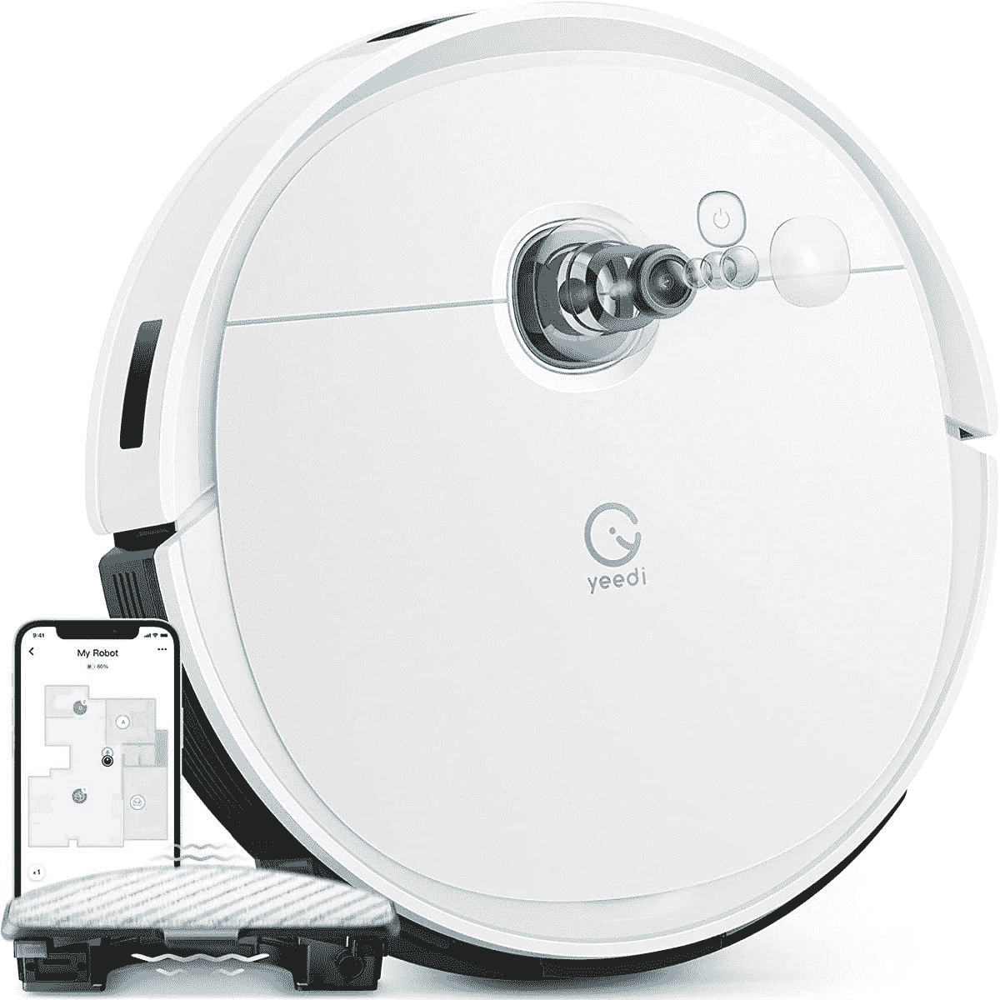
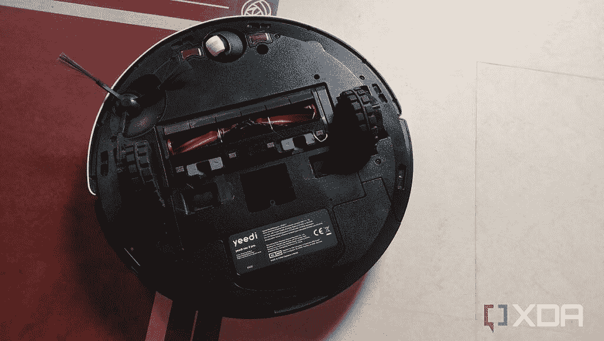

# Yeedi Vac 2 Pro 机器人真空审查:快速清洁与摆动拖把

> 原文：<https://www.xda-developers.com/yeedi-vac-2-pro-robot-vacuum-review/>

Yeedi Vac 2 Pro 是一款扫地拖地机器人吸尘器，可以作为独立吸尘器使用。它有一个可选的自动清空站，可以将机载垃圾箱清空到基站，因此您不需要经常清空垃圾箱。

耶迪人的拖地系统和我见过的大多数其他拖地系统都不一样。该拖地模块在经过该区域时摆动以擦洗硬地板。Yeedi 声称这个系统是独一无二的。然而， [Hobot Legee 688](https://www.amazon.com/HOBOT-LEGEE-688-Vacuum-Mop-Automatic-Cleaning/dp/B07R4BJXBH/?tag=xda-1r3m4lt-20&ascsubtag=UUxdaUeUpU42661&asc_refurl=https%3A%2F%2Fwww.xda-developers.com%2Fyeedi-vac-2-pro-robot-vacuum-review%2F&asc_campaign=Authority) 有一个类似的振动拖地机器人真空。当 Hobot 机器人在我家周围导航时，拖地垫会震动。我敢肯定，网上还有其他机器人具有与 Vac 2 Pro 类似的功能。

Yeedi Vac 2 Pro 有一个功能齐全的应用程序，所以你可以设置一个时间表，然后忘记它。如果你将拖地模块安装到机器人真空吸尘器上，Vac 2 Pro 将扫地或扫地和拖地。将拖地模块装满水，它会将地板上的污垢擦洗掉。

 <picture></picture> 

Yeedi Vac 2 Pro robot vacuum

##### Yeedi Vac 2 Pro

Yeedi Vac 2 Pro 有一个 3000Pa 的吸力来扫地，还有一个摆动拖把垫来擦洗顽固的污渍

#### **浏览此评论:**

## Yeedi Vac 2 Pro:定价和供货情况

Yeedi Vac 2 Pro 机器人吸尘器于 2022 年 5 月推出，价格位于 Yeedi 生产的机器人吸尘器的高端。目前在 [Yeedi 的网站](https://eu.yeedi.com/products/yeedi-vac-2-pro)和[亚马逊](https://www.amazon.com/dp/B09M8LG59J?tag=xda-1r3m4lt-20&ascsubtag=UUxdaUeUpU42661&asc_refurl=https%3A%2F%2Fwww.xda-developers.com%2Fyeedi-vac-2-pro-robot-vacuum-review%2F&asc_campaign=Authority)上以低于 450 美元的价格出售。此价格仅适用于机器人吸尘器。如果你想要自动清空工作站，那么你必须在 Yeedi 的网站上再支付[180 美元，或者在亚马逊上以 579.99 美元](https://eu.yeedi.com/products/accessories-yeedi-vac-series-self-empty-station)购买 [Yeedi Vac 2 Pro 机器人真空和自动清空工作站。](https://www.amazon.com/yeedi-Robot-Vacuum-Authentic-Station/dp/B09ZV93F8B?tag=xda-1r3m4lt-20&ascsubtag=UUxdaUeUpU42661&asc_refurl=https%3A%2F%2Fwww.xda-developers.com%2Fyeedi-vac-2-pro-robot-vacuum-review%2F&asc_campaign=Authority)

* * *

## Yeedi Vac 2 Pro:规格

| 

投机

 | 

价值

 |
| --- | --- |
| 吸力 | 3000 帕(最大) |
| 额定功率(自动清空工位) | 1000 瓦 |
| 蓄电池容量 | 5200 毫安时 |
| 车载垃圾箱容积 | 420 毫升 |
| 水箱模块体积 | 180 毫升 |
| 自动清空站集尘袋容量 | 2.5l |

***关于这篇评论**:这篇评论是在测试了 Yeedi 提供的一款 Yeedi Vac 2 Pro 二合一机器人吸尘器一个多月之后写的。Yeedi 在这篇文章中没有任何投入。*

* * *

## Yeedi Vac 2 Pro:盒子里是什么？

Yeedi Vac 2 Pro 的包装盒仅包含机器人真空吸尘器。如果你想买自动清空台，需要额外付费，装在不同的盒子里。一些制造商以同样的价格捆绑销售自动清空台，但是如果你不想要自动清空台，Yeedi 为消费者提供了选择。

盒子里有:

*   一台机器人真空吸尘器
*   一个扩展坞
*   机器人真空吸尘器的一侧刷
*   一个主滚刷
*   一个车载垃圾箱
*   一个摆动拖地模块
*   一个可清洗的拖地垫，其连接到拖地模块
*   一个清洁工具，用于清洁滚筒刷上的毛发和灰尘
*   一根电源线。

* * *

## 设计和特点:摆动拖地和 3000Pa 吸力

*   智能视觉制图和导航
*   强大的 3000 帕吸力
*   地毯检测传感器将在拖地模式下避开地毯，并在清扫模式下增加吸力
*   电池电量低时自动充电
*   自动清空工作站
*   语音助手兼容性

自从 2020 年 8 月我第一次测试 Yeedi k700 机器人以来，Yeedi 真空技术已经突飞猛进。该公司已经大大提高了其游戏和产品质量当然显示。Yeedi 品牌在应用程序设计和功能上都进行了投资。Yeedi Vac 2 Pro 是其多功能机器人系列中的最新产品，其摆动拖把可以在扫地时擦洗地板，这表明该品牌继续创新。

## 

### 使用功能全面的应用程序进行精确映射

*   每次清洁时，清洁地板一到两次
*   遇到地毯时吸力增加
*   安装拖地模块时避免地毯
*   有效的物体回避

白色的 Yeedi Vac 2 Pro 多功能机器人真空吸尘器设计得既时尚又流畅。该装置下方有一个侧扫刷和一个带硅胶翅片的滚筒刷。Yeedi Vac 2 Pro 在机器人真空顶部没有激光雷达导航单元。

不幸的是，Yeedi Vac 2 Pro 上没有激光雷达。

相反，Vac 2 Pro 使用视觉映射和导航来映射您的空间。可选的自动清空站是紧凑的，当它清空车载垃圾箱时相当安静。在最大功率下，Vac 2 Pro 的运行噪音为 67dB，相当安静。

Yeedi Vac 2 Pro 可以轻松连接到 Yeedi 应用程序。我没有问题连接到 Vac 2 专业版。打开 Yeedi 应用，点击应用右上角的加号，扫描掀盖下机器上的二维码。按照应用程序上的说明调用 wifi，并将您的 wi-fi 连接到机器人吸尘器。

app 是合理的，虽然 app 上保存的地图有点原始。你可以在应用程序上控制几个功能。您可以调节真空吸尘器的吸力，当安装了摆动拖把模块时，您可以改变通过拖把输送的水量。

### 避免地毯和定期拖地

Yeedi Vac 2 Pro 在机器人真空吸尘器的后部有一个虚拟模块，在连接摆动拖把模块之前必须将其移除。点击按钮并拉动，移除虚拟模块，并将其更换为拖地单元。语音提示将宣布它现在处于扫地和拖地模式。

当拖把就位后，您可以改变流向拖把的水流，并指定是否要清洁该区域一次或两次。当它清洁时，机器人以平行线的方式清扫，并覆盖其部分轨迹，以确保地板上没有脏条纹。如果你有一个特别脏的区域，你需要确保机器人清洁该区域两次。

### 3000 帕吸力用于清扫

在使用中，Yeedi 的 3000Pa 吸力可有效收集地板上的污垢、绒毛和灰尘。它还擅长从地毯和硬地板上收集宠物毛发。摆动拖把擅长清除地板上多余的灰尘。我有几个机器人在同一层楼工作，每天都要清洗几次。

有足够的吸力来吸附灰尘、污垢和宠物毛发。

Vac 2 Pro 在只拖了一个房间后仍然设法弄脏了它的拖把。机器人吸尘器避开了房间里的所有地毯，拖了整个硬地板空间。当 Yeedi Vac 2 Pro 机器人真空吸尘器仅处于清扫模式时，它会跨越到地毯上，并将吸力提高到最大功率。

当机器人吸尘器检测到电池电量低时，它将返回到坞站充电，然后返回到上次清洁的位置并继续清洁。

### 物体回避

Yeedi Vac 2 Pro 具有高级避障功能。如果你有一个相对整洁的地板，你可以将应用程序设置为基本的避障。但如果你的地板不整洁，请将应用程序设置为高级避障。

这将确保机器人真空将避开所有物体。事实上，Yeedi Vac 2 Pro 确实避开了我放在地板上的咖啡杯，但它在房间里踢了一个透明的塑料酒杯。幸运的是，杯子是空的。

你可以将机器人吸尘器连接到你的 Alexa 或 Google Home 语音助手，并使用命令开始、暂停或停止清洁。您也可以指定机器人要清洁的区域。

* * *

## 谁应该买一台 Yeedi Vac 2 Pro 机器人吸尘器？

*   如果你家里到处都是坚硬无孔的地板，你应该买 Yeedi Vac 2 Pro
*   如果你有地毯和硬地板的混合物，如果你想清扫地毯，你需要拆除拖地模块。当拖地模块连接到机器人真空吸尘器时，机器人将避开地毯。
*   为 Yeedi Vac 2 Pro 购买额外的自动清空站，在自动清空站袋中存储多达 30 天的灰尘和污垢。

### 为什么我喜欢 Yeedi Vac 2 Pro

Yeedi 机器人吸尘器能快速完成工作。它在坚硬的地板和地毯上呼啸而过，似乎根本不会经常被卡住。它的振荡拖地模块似乎比其他机器人更容易清除地板上的污垢，例如 dream Bot D10 Plus 机器人吸尘器，它只能用湿布拖地板，而不能擦洗地板。

如果你真的想从这个机器人吸尘器中得到最好的东西，自动清空站是必须的。

要获得 Vac 2 Pro 的最佳手动体验，请购买额外的自动空站。将应用程序设置为每次清扫和拖地两次，以获得摆动拖把最干净的拖地效果。

如果你有一大片地板，留意一下拖地模块。在 180 毫升的容量下，拖地水箱将清洁一个合理大小的区域，但是如果您将拖把设置为最湿设置，水箱可能在您第二次拖地之前就已经清空了。

### 智能拖地

您不需要在 Yeedi 应用程序中添加无拖把区域。Vac 2 Pro 将识别地毯区域，不会穿越它们——不像梦想机器人 D10 Plus 会拖着湿拖把穿越任何地毯区域，除非你在它的应用程序中设置了禁止拖把区域。唯一的缺点是，你需要记得移除拖地模块，并再次派出机器人清扫地毯区域。

幸运的是，应用程序时间表将允许您指定自动清洁或区域清洁。您只需要在地毯清洁的预定时间之前小心更换和移除拖地模块，否则您的地毯将不会被清扫。

* * *

## 该不该买这款机器人吸尘器？

。bestawarddiv {

浮动:对；

宽度:20%；

边距:1em

边距-顶部:0；

}

作为独立单元的[价格为 449.99 美元，或与自动清空站捆绑的](https://www.amazon.com/dp/B09M8LG59J?tag=xda-1r3m4lt-20&ascsubtag=UUxdaUeUpU42661&asc_refurl=https%3A%2F%2Fwww.xda-developers.com%2Fyeedi-vac-2-pro-robot-vacuum-review%2F&asc_campaign=Authority)[价格为 579.99 美元，Yeedi Vac 2 Pro](https://www.amazon.com/yeedi-Robot-Vacuum-Authentic-Station/dp/B09ZV93F8B?tag=xda-1r3m4lt-20&ascsubtag=UUxdaUeUpU42661&asc_refurl=https%3A%2F%2Fwww.xda-developers.com%2Fyeedi-vac-2-pro-robot-vacuum-review%2F&asc_campaign=Authority) 将在最少干预的情况下自动完成日常清扫和拖地。机器人将返回其基地充电，并继续清洁。自动清空站意味着你只需要每月清空集尘袋，摆动拖把会在拖地的同时擦洗你的地板。

我当然更喜欢 Yeedi Vac 2 Pro，而不是 499.99 美元的[、Dreame Bot D10 Plus 机器人吸尘器](https://www.xda-developers.com/dreame-bot-d10-plus-review/)。这种机器人吸尘器似乎能更快地完成工作，擦洗地板，而不仅仅是用布快速擦拭。然而，你需要为自动清空站支付额外的费用，因为它没有捆绑，我当然认为你应该把它添加到你的购物车中。

 <picture></picture> 

Yeedi Vac 2 Pro robot vacuum

##### Yeedi Vac 2 Pro

一种多用途清扫和拖地机器人，具有可选的自动排空站和摆动拖把模块