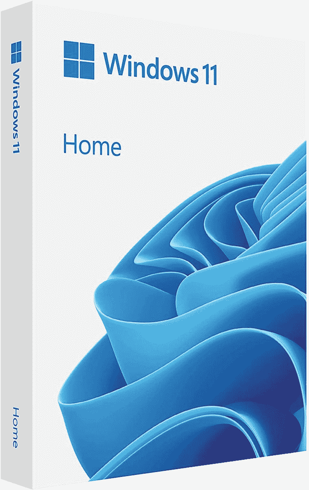
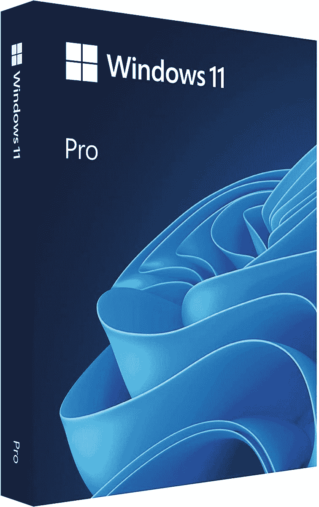

# 你现在可以购买 Windows 11 的实体版本

> 原文：<https://www.xda-developers.com/you-can-now-buy-physical-copy-windows-11/>

Windows 11 已经发布半年多了，但是如果你一直想买一个该操作系统的实体版本，现在是时候了。到目前为止，获得 Windows 11 的唯一方法是升级您的 Windows 10 PC 或购买一台开箱安装 Windows 11 的新 PC。然而，最近发现你现在可以为自己购买 Windows 11 Home 或 Pro 的物理副本。

Twitter 用户 Luke Blevins(通过 *OnMSFT* )在周末首次发现了这些零售版本，但它们可能已经存在了更长时间。这些产品的百思买列表显示，它们于 4 月 14 日首次上市，距离正式上市大约 6 个月。尽管如此，由于微软从未宣布可以购买纸质版本，许多人可能没有意识到这一点。

当然，乍看之下，购买一本纸质书并没有多大意义。反正大部分笔记本电脑已经自带 Windows 11 了，如果自带 Windows 10，你自己升级就可以了。你也可以在网上购买许可证。但是物理拷贝确实给了你一个 USB 闪存驱动器，开箱即可用作安装介质。当然，你可以使用任何闪存驱动器来安装 Windows 11，但这确实让这个过程变得更容易，例如，如果你正在安装一台刚刚制造的全新 PC。另外，如果你喜欢收集这种东西，你会得到一个整洁的小盒子。盒子本身突出显示了 Windows 11 Bloom 背景，它为 Windows 11 Home 使用了浅色主题，为 Windows 11 Pro 使用了深色主题，与 Windows 10 相比，这使得包装更具吸引力。

就像数字许可证一样，Windows 11 Home 的物理副本价格为 139.99 美元，而 Windows 11 Pro 的价格为 199.99 美元，所以你不必为物理版本支付额外费用。许可证对单台 PC 有效。请记住，如果你想有一个流畅的体验，你的电脑仍然需要满足 Windows 11 的[最低要求。感兴趣的话可以在下面买。](https://www.xda-developers.com/windows-11-minimum-requirements/)

 <picture></picture> 

Windows 11 (Home or Pro)

##### Windows 11 主页

用于 Windows 11 家庭版的 USB 安装驱动器和许可证密钥。

 <picture></picture> 

Windows 11 Pro

##### Windows 11 专业版

用于 Windows 11 Pro 的 USB 安装驱动器和许可证密钥，以及 Hyper-V 和 Windows 沙盒支持等附加功能。

* * *

来源:[卢克·布莱文斯(推特)](https://twitter.com/luke_blevins1/status/1523179821249052672)

Via: [OnMSFT](https://www.onmsft.com/news/windows-11-official-retail-packaging)