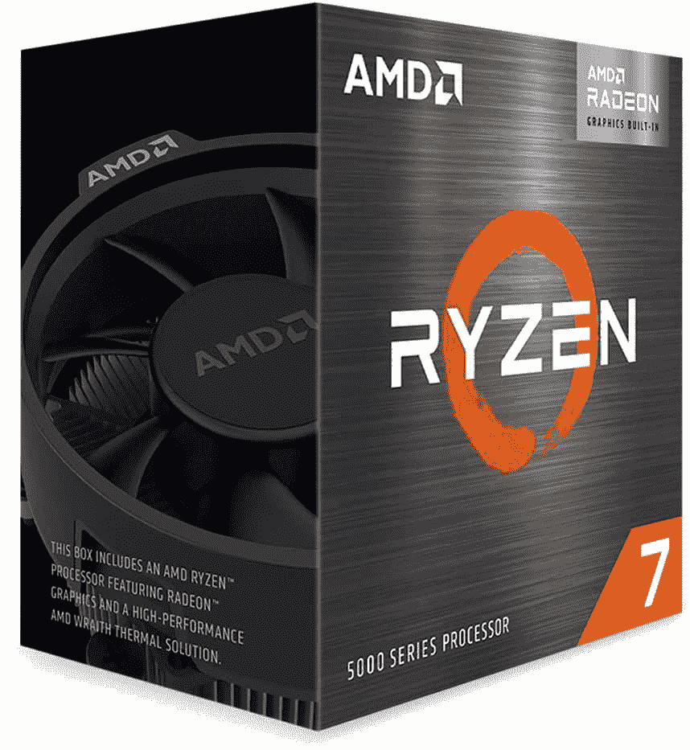
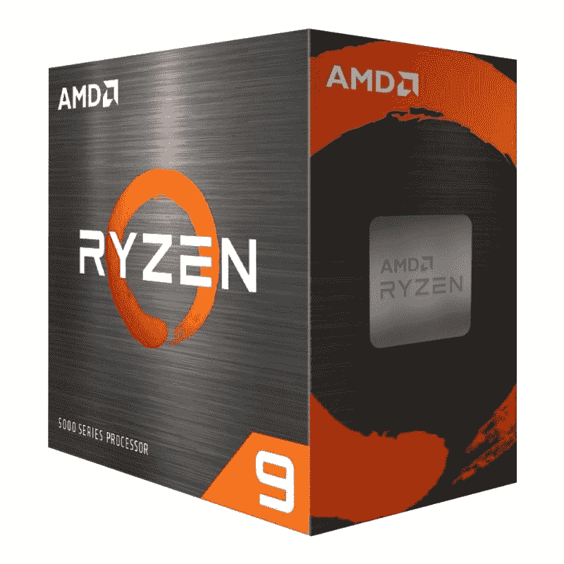

# 现在，购买 AMD 锐龙 5000 台式机处理器，您可以节省高达 100 美元

> 原文：<https://www.xda-developers.com/you-can-now-save-up-to-100-on-amd-ryzen-5000-desktop-processors/>

# 现在，购买 AMD 锐龙 5000 台式机处理器，您可以节省高达 100 美元

如果你想在市场上购买 AMD 锐龙 5000 系列台式机处理器，那么你可能想看看亚马逊上的这个黑色星期五交易。

黑色星期五即将来临，许多交易已经在各种网站上直播。如果你一直在观望，等待 AMD 的锐龙 5000 系列处理器的大折扣，那么你很幸运。现在，您可以在亚马逊上购买 AMD 锐龙 5000 系列台式机处理器，最高可节省 100 美元。作为这笔交易的一部分，有三款[高性能 CPU](https://www.xda-developers.com/best-cpus/)可供选择 AMD 锐龙 7 5700G、锐龙 7 5800X 和锐龙 9 5900X。

## AMD 锐龙 7 5700G

AMD 锐龙 7 5700G 是你现在可以为一台稳定的入门级 PC 找到的最好的 APU 之一。8 核锐龙 7 5700G 是 AMD“Cezzane”APU 的一部分。它目前位于 AMD 的 APU 产品堆栈的顶部。它基于 Zen 3 架构，提供 8 核 16 线程，基础频率为 3.8GHz，提升频率为 4.6GHz。集成 GPU 基于 Vega 架构，具有 8 个计算单元和 512 个 2GHz 的 GCN 内核。你可以用这个 APU 作为权宜之计，直到[显卡](https://www.xda-developers.com/these-are-the-best-graphics-cards-you-can-buy-nvidia-geforce-rtx-3080-amd-radeon-rx-6800-xt-and-more/)市场稳定下来。锐龙 7 5700G 现在仅售 314 美元，低于原价 359 美元。这是我们在一段时间内看到的这款 CPU 的最低价格，所以趁它还能用的时候抓住它。

 <picture></picture> 

AMD Ryzen 7 5700G

##### AMD 锐龙 7 5700G

AMD 锐龙 7 5700G 是一款可靠的 APU，适合那些倾向于预算游戏 PC 构建，没有独立 GPU 来玩休闲游戏的人。

## AMD 锐龙 7 5800X

AMD 锐龙 7 5800X 是一款出色的 CPU，适合在游戏等单线程应用程序中寻求可靠性能的专业游戏玩家。值得注意的是，5800X 还提供了 8 核和 16 线程，可实现令人印象深刻的多线程性能。对于那些倾向于流媒体等内容创作工作负载的人来说，这是一个很好的芯片。锐龙 7 5800X 的规格与其上一代产品相似，但新芯片具有更高的提升时钟。这是一个巨大的进步，尤其是当您考虑到每个内核都可以直接访问高速缓存时。锐龙 7 5800X 现在仅售 342 美元，为您节省多达 100 美元。由于 5800X 不与库存冷却器捆绑在一起，您可以利用节省下来的成本购买高性能 CPU 冷却器。在我们的[最佳 CPU 冷却器集合](https://www.xda-developers.com/best-cpu-coolers/)中，你会发现大量可靠的选项。

 <picture></picture> 

AMD Ryzen 7 5800X processor

##### AMD 锐龙 7 5800X

锐龙 7 5800X 是目前市场上最好的 CPU 之一，为游戏等单线程应用程序提供了令人印象深刻的性能。

## AMD 锐龙 9 5900X

AMD 锐龙 9 5900X 可能没有锐龙 9 5950X 强大，但它仍然充满了冲击力。5900X 基于 AMD 的 Zen 3 架构，拥有 12 个内核和 24 个线程。与锐龙 9 3900X 上的分布式高速缓存不同，每个内核都可以直接访问 32MB 的三级高速缓存。锐龙 9 5900X 的最大提升时钟额定为 4.8GHz，但在有利的条件下，它经常会突破 5Ghz 大关。将它与坚固的[主板](https://www.xda-developers.com/best-motherboard/)和可靠的冷却解决方案搭配起来，你就会得到一个强大的装备，在可预见的未来为你服务。锐龙 9 5900X 现在仅售 484 美元。这是我们一段时间以来看到的最低价格，所以一定要在存货售完时购买。

 <picture></picture> 

AMD Ryzen 9 5900X ($91 off)

##### AMD 锐龙 9 5900X

锐龙 9 5900X 与锐龙 9 5950X 一起位于 AMD 5000 系列产品堆栈的顶部。这种高性能代表了 AMD 在高端 CPU 领域的最佳表现。

我们现在仅仅触及黑色星期五交易的表面，我们建议你在周末睁大眼睛寻找大量这种惊人的交易。