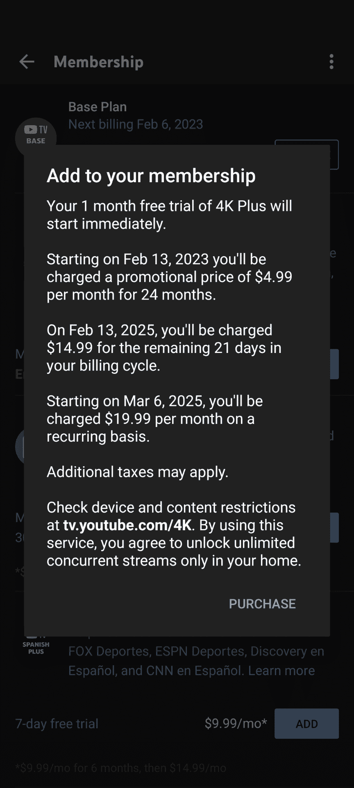

# YouTube 电视用户正在 4K Plus 插件上观看优惠到每月 4.99 美元的宣传片

> 原文：<https://www.xda-developers.com/youtube-tv-discount-4k-plus-499-per-month/>

# YouTube 电视用户正在 4K Plus 插件上观看优惠到每月 4.99 美元的宣传片

一些 YouTube 电视用户看到大量弹出窗口，将 4K Plus 附加服务的价格降至每月 4.99 美元。

当 YouTube TV 首次推出时，它为各种电视频道提供了前所未闻的价格。但是，随着时间的推移，价格会慢慢攀升。虽然它不像以前那么便宜，但现在每月 64.99 美元的价格仍然很有竞争力。现在有报道称，一些现有用户获得了优惠，允许他们以每月 4.99 美元的价格添加 4K Plus 套餐。考虑到 4K Plus 插件通常售价 19.99 美元，这是一笔不小的交易。

关于新的促销价格的报道来自 YouTube TV subreddit，一些人在那里插话询问 4K Plus 附加服务的降价情况。虽然有些人根本看不到这笔交易，但其他人报告的价格从每月 9.99 美元到 4.99 美元不等。显然，该交易在 24 个月内可以以该价格点进行，届时将恢复到每月 19.99 美元的标准价格。在很大程度上，对于那些大量投资 YouTube 电视的人来说，这听起来是一笔很好的交易。

 <picture></picture> 

Image via u/noneofyourbizzness (Reddit)

虽然没有明确的理由说明为什么会提供不同的促销活动，但一些人建议去会员区看看折扣计划是否会出现。如果没有，你只能希望在未来的某一天，它会发生。有趣的是，尽管提供了 100 多个频道，但 YouTube TV 在 2023 年并没有默认提供 4K 广播。

此外，它仍然是一个非常昂贵的附加组件，每月 19.99 美元。这意味着如果你选择标准套餐和 4K 附加服务，你将每月支付大约 85 美元的服务费。当然，你可以选择付费节目和服务，其中一些已经包括了 4K。如果你看到促销活动并考虑升级，在升级你的计划之前，确保你有合适的 [4K 流媒体设备](https://www.xda-developers.com/best-media-streaming-devices/)。

* * *

**来源** : [Reddit](https://www.reddit.com/r/youtubetv/comments/10c07pg/4k_plus_699_for_24_months/)

**Via** : [9to5Google](https://9to5google.com/)