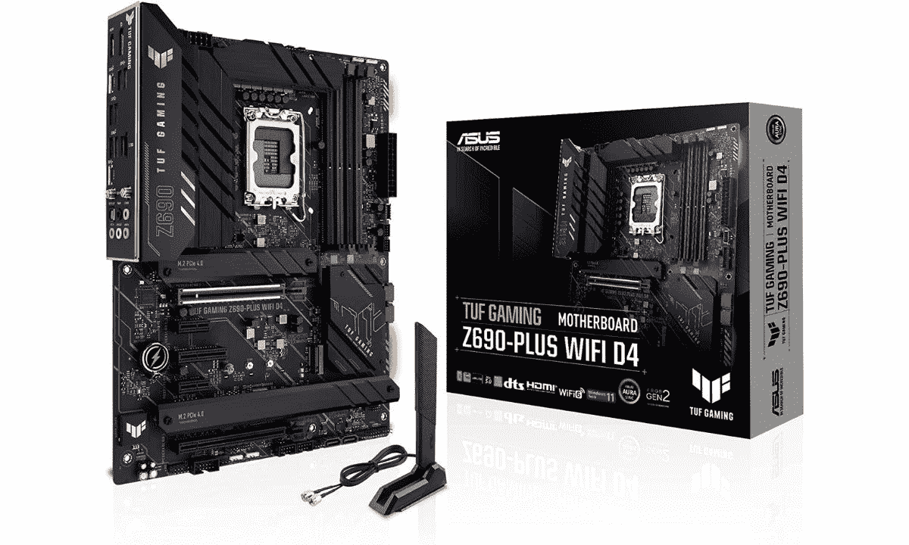

# 华硕 TUF 游戏 Z690-Plus WiFi D4 评论

> 原文：<https://www.xda-developers.com/z690-tuf-gaming-motherboard-review/>

华硕 TUF 游戏 Z690-Plus WIFI D4 是您在搜索兼容 DDR4 的 Z690 主板时会遇到的主板之一。在使用了这个特殊的主板几个星期并对其进行测试后，我认为可以肯定地说，这是支持 DDR4 的经济型 Alder Lake 版本中最好的主板之一。只需 290 美元，您就可以获得 PCI Express 5.0 支持、四个 M.2 插座、四个 SATA 端口、2.5GbE 和集成 WiFi 6E、可靠的供电等等。TUF 博彩 Z690-Plus WiFi D4 提供了大量的价值。

为新的 [Alder Lake CPU](https://www.xda-developers.com/intel-12th-gen-alder-lake/) 购买一个兼容 DDR4 的主板是你在新的个人电脑上省钱的最佳选择。能够使用 [DDR4 RAM 套件](https://www.xda-developers.com/best-ddr4-ram/)意味着你可以从以前的版本中带来旧的 DDR4 RAM 记忆棒。正如我们在[的 DDR4 和 DDR5 RAM 比较](https://www.xda-developers.com/ddr4-vs-ddr5/)中提到的，性能差异并不显著，不足以保证立即升级到新的内存标准。

当然，如果你真的想在新电脑上省钱，你也可以购买相对便宜的 B660 主板，但你会错过很多功能，包括正确的超频支持、PCIe、M.2 插槽等等。此外，TUF 游戏 Z690-Plus WiFi D4 主板也将能够处理高端构建的高性能 CPU，这是许多 B660 主板可能会遇到的问题。华硕 TUF 游戏 Z690-Plus WiFi D4 主板也没有太多抱怨，特别是考虑到它在这个价格范围内的性能。然而，我认为华硕可以增加几个 USB 型端口，甚至 SATA 端口。

我已经在下面的评论文章中讨论了这种特殊主板的整体性能和功能集，所以一定要查看一下。但是，如果你想要它的简短版本，那么我会说它是大多数用户的一个伟大的选择，他们正在寻找建立一个新的和负担得起的阿尔德湖个人电脑

 <picture></picture> 

ASUS TUF Gaming Z690-Plus WiFi D4 motherboard

##### 华硕 TUF 游戏 Z690 Plus WiFi

华硕 TUF 游戏 Z690-Plus WiFi D4 是最好的 Z690 主板之一，支持 DDR4 内存模块和 PCIe 5.0。

* * *

**浏览此评论:**

## 华硕 TUF 游戏 Z690-Plus WiFi D4 评论:价格和可用性

*   华硕 TUF 游戏 Z690-Plus WiFi D4 现在可以以 290 美元的价格购买。

华硕 TUF 游戏 Z690-Plus WiFi D4 是第一批 Z690 主板之一，这些主板在去年新的 Alder Lake 芯片首次上市时就投入使用。你现在可以花 290 美元从主要的线上和线下零售商那里买到这款手机。它不是目前市场上最实惠的主板，但尽管是 Z690 芯片组板，它的价格标签还是相当令人满意的。在印度，在撰写本文时，这种特殊的主板可以在[亚马逊印度](https://www.amazon.in/ASUS-TUF-D4-Motherboard-Thunderbolt/dp/B09M8VDLXC/?tag=xdaportalin-21)上为₹23,900 买到。

## 华硕 TUF 游戏 Z690-Plus WiFi D4 审查:规格

在我们深入了解 TUF 游戏 Z690-Plus WiFi D4 主板的详细信息之前，让我们快速浏览一下规格，了解一下您的价格:

| 

规格

 | 

TUF 博彩 Z690-Plus WiFi D4

 |
| --- | --- |
| **主板芯片组** | 英特尔 Z690 高速芯片组 |
| **插座** | LGA1700 |
| **外形尺寸** | ATX |
| **电压调节模块** | 15 相(14+1 个 DrMOS 功率级) |
| **内存** | 4 个 DDR4 5333(OC)，最高 128GB |
| **M.2 插槽** | 

*   3 个 PCIe 4.0 x4 (64 Gbps)
*   1 个 PCIe 4.0 x4 (64 Gbps)

 |
| **SATA** | 4 个 SATA3 6 Gbps |
| **扩展槽** | 

*   1 个 PCIe 5.0 x16 (CPU)
*   1 个 PCIe 3.0 x16 (PCH，x4 模式)
*   2 辆 PCIe 4.0 x1
*   1 台 PCIe 4.0 x4

 |
| **后面板 IO** | 

*   1 个 USB Type-C 端口，支持 USB 3.2 Gen 2x2
*   1 个 USB Type-C 端口，支持 USB 3.2 Gen 1
*   4 个 USB 3.2 第 1 代 A 类端口
*   2 个 USB 3.2 第二代端口
*   2 个 SMA 天线连接器(2T2R)
*   1 个显示端口
*   1 个 RJ-45 港
*   1 个光学 S/PDIF 输出连接器
*   2 个音频插孔

 |
| **保修** | 3 年 |

除了像 SATA 电缆这样的基本附件，您还可以通过华硕 TUF Gaming-Plus WiFi D4 主板获得以下物品:

*   华硕 Wi-Fi 移动天线
*   M.2 固态硬盘螺丝包
*   TUF 博彩贴纸
*   TUF 认证
*   用户手册

* * *

## 华硕 TUF 游戏 Z690-Plus WiFi D4 评论:设计和硬件

*   黑色六层 PCB，带大型散热器
*   RGB 照明
*   四个 M.2 插座

TUF Gaming-Plus WiFi D4 主板看起来与该品牌的许多其他主板非常相似。它采用黑色六层 PCB，配有大型散热器。这是一个 ATX 主板，它有相当多的重量，所以要确保所有的支架都在适当的位置，你不会错过任何充分支持它。还值得指出的是，主板上没有背板，但你会得到一个预安装的 I/O 屏蔽。

TUF 游戏品牌相当突出，尽管我们很高兴华硕没有用 LED 灯突出他们。我也喜欢华硕如何在板上的模板图案上变得有点轻松。在我看来，这一点，以及 VRM 散热器上的拉丝铝涂层，使这款主板的整体外观非常出众。

RGB 灯光只能从主板上的两个位置看到-芯片组散热器后面，沿着主板的右边缘有一个半透明的线条图案，通过它可以看到灯光。你可以通过华硕的 Armoury Crate 软件来控制这种照明，所以请随意尝试，找到最佳设置。我觉得 RGB 灯光整体看起来很不错。我很高兴华硕决定添加适量的照明，而不会让它看起来太令人讨厌。

继续组件概述，您首先会注意到的是 Alder Lake 芯片的 LGA1700 插座。插槽旁边有四个 DRAM 插槽。这些是未加固的单边锁定 DRAM 插槽，允许您向计算机添加高达 128GB 的 DDR4 内存。华硕列出了这些插槽对 DDR4 5333+(OC)速度的支持。

华硕 TUF Gaming-Plus WiFi D4 主板采用 15 相 DrMOS 功率级，将高端和低端 MOSFETs 和驱动器集成到单个封装中。每个功率级的额定电流为 80 安培，以提供稳定的性能。这种特殊的设置与 12900K 和 Core i7-12700 CPU 都工作得很好，我将这个主板与它们配对进行测试。VRM 散热器即使在高负载下也能保持良好的散热，这很棒。

接下来，您将获得两个全长 PCIe 插槽，以及两个 x1 插槽和一个 x4 插槽。GPU 的顶级 PCIe 插槽以 PCIe 5.0 x16 的速度运行。这个特殊的插槽从处理器获得其通道，而底部的全长插槽通过芯片组连接，并以 PCIe 3.0 x4 的速度运行。值得指出的是，x4 和 x1 插槽也从芯片组获取通道，并分别运行 PCIe 4.0 x4 和 x1。

华硕 TUF Gaming-Plus WiFi D4 共有四个 M.2 插座，其中三个带有散热器。顶部的 M.2 插座支持 PCIe 4.0 x4 (64 Gbps)和高达 110 毫米的设备。第二个插座(中间一个)没有散热器，但它运行 PCIe 4.0 x4 (64 Gbps)。最后两个端口共享一个散热器，但它们也运行 PCIe 4.0 x4 设备。总的来说，我认为这是一个很好的设置，并为那些希望添加大量 NVMe 驱动器的人提供了大量的选择。如果您想知道，您还可以获得对 NVMe 驱动器的 RAID 0/1/5 模式支持。

作为一款相对高端的 Z690 主板，你还会在主板上获得很多组件，包括 Realtek ALC1220 音频芯片、SATA 端口等等。我没有展示每个单独的项目，而是从下面的华硕网站添加了一个主板的示意图，以便您更容易理解什么去哪里。

在我们进入性能部分之前，先来看看华硕 TUF 游戏加 WiFi D4 主板背面的 I/O 端口。正如我前面提到的，I/O shield 是预装的，它与主板的黑色主题相匹配。您还可以轻松阅读符号和标签来识别端口。你会注意到的第一件事是，如果你没有使用独立显卡，华硕增加了 HDMI 和 DisplayPort 端口，以便向你的显示器发送信号。除此之外，您还可以获得 2.5 GbE 端口、Wi-Fi 天线连接和 5 插头 plus SPDIF 音频堆栈。

至于 USB 端口，你总共有六个 USB A 型端口和两个 USB C 型端口在后面。虽然六个对于 USB 类端口的总数来说不是一个坏数目，但我认为如果有更多的端口就更好了。在我的 USB 麦克风、耳机、鼠标、键盘和控制器之间，我已经用完了六个 USB Type-A 端口中的五个。我知道这对许多人来说是个问题，尤其是如果他们的电脑机箱没有额外的扩展端口。

* * *

## 软件概述

*   干净易用的 BIOS
*   军械库板条箱软件是有用的

华硕 TUF 游戏 Z690-Plus WiFi D4 主板与一些旧型号附带的 BIOS 相同。新的，但是，来了新的阿尔德湖 P 和 E 核心调整，等等。它相对容易地通过 UEFI 移动，我认为大多数人会很容易地找到他们正在寻找的选项。您还可以获得许多调整组件的选项，这很好。

您还可以下载华硕的 Armoury Crate Windows 软件，该软件为您提供了所有组件的概述、更改照明的选项等。如果你是来自华硕笔记本电脑，这是你可能习惯的相同软件。它只是碰巧为台式电脑提供了更多的选择。

* * *

## 华硕 TUF 游戏 Z690-Plus WiFi D4 评论:性能

*   阿尔德湖 CPU 兼容
*   可靠的电力输送
*   良好的超频支持

作为标准的基准测试实践，我使用 CPU 的库存和超频频率进行了测试。还值得指出的是，我使用 Windows 11 通过其更新的任务调度程序获得了 Alder Lake 芯片的最佳性能。我认为，如果你打算建造一台基于阿尔德湖的电脑，最好改用 Windows 11。除此之外，Windows 11 现在处于一个很好的位置，大多数错误已经被压制，特别是在性能方面。

下面是我使用 12900K 在该主板上运行的一些综合基准测试。我还使用该主板运行英特尔酷睿 i7-12700，尽管我只是为 12900K 生成结果，以便轻松地与我们以前的主板评测分数进行比较。综合性能指标评测有助于了解主板的总体性能，尤其是在负载情况下。这些数字应该让你知道主板是如何处理 CPU 和其他组件的，即使是在高负载的情况下。

| 

试验

 | 

华硕 TUF 游戏 Z690-Plus WiFi D4(12900K 带 DDR4)

 | 

千兆字节 Aorus Pro(12900K 带 DDR5)

 |
| --- | --- | --- |
| **Cinebench R23 -单个(越高越好)** | 1932 | 1962 |
| **Cinebench R23 - Multi(越高越好)** | 26652 | 27086 |
| **CPU-Z 单机(越高越好)** | 806 | 814 |
| **CPU-Z Multi(越高越好)** | 10976 | 11396 |
| **电晕 1.3** **(越低越好)** | 51 | 59 |
| **Blender BMW(越低越好)** | 85 | 87 |
| **PCMark 10(越高越好)** | 11628 | 12145 |

总的来说，我认为华硕 TUF 游戏加 WiFi D4 设法跟上所有高要求的工作负载。事实上，我也能够顺利地超频 12900K，主板能够毫无问题地满足高要求的负载。值得指出的是，你将需要一个高质量的 CPU 冷却器来抑制超频设置下 12900K 的热输出。

* * *

## 值得买吗？

如果你是在市场上购买一个兼容 DDR4 的 Z690 芯片组主板为您的奥尔德湖为基础的 PC 建设，那么是的，我认为 TUF 游戏 Z690-Plus WiFi D4 应该是你的主板清单上的高考虑。

### 谁应该购买华硕 TUF 游戏 Z690-Plus WiFi D4 主板？

*   对于那些希望购买经济实惠的 Z690 主板的人来说，这是一个很好的选择。
*   如果你想要一个兼容 DDR4 的主板，也值得考虑。

### 谁不应该购买华硕 TUF 游戏 Z690-Plus WiFi D4 主板？

*   那些谁是建立一个相对较低的中档阿尔德湖个人电脑。在这种情况下，您最好购买 B660 主板。
*   想用 DDR5 RAM 套件就不要买这个了。它只支持 DDR4 棒。

好了，这就结束了我对华硕 TUF 游戏 Z690-Plus WiFi D4 主板的评论。不到 300 美元就有很多价值，而且即使在负载下也能很好地处理高性能 CPU。它不是市场上最实惠的主板，但比许多其他 Z690 主板便宜。此外，能够使用 DDR4 RAM 套件也将为您节省大量购买 DDR5 套件所需的金钱和时间。

另一方面，如果你是一个预算购物者，希望使用相对更实惠、低功耗的 Alder Lake 芯片，例如 Core i5-12600，那么我认为你最好购买 B660 主板。尽管 Z690 主板的功能集很好，但对于不需要所有花里胡哨的预算钻机来说，它仍然是一个大材小用。

 <picture></picture> 

ASUS TUF Gaming Z690-Plus WiFi D4 motherboard

##### 华硕 TUF 游戏 Z690 Plus WiFi

华硕 TUF 游戏 Z690-Plus WiFi D4 是最好的 Z690 主板之一，支持 DDR4 内存模块和 PCIe 5.0。

如果你在为你的新电脑寻找组件时偶然看到这篇评论，那么你可能会有兴趣看看我们的其他文章，包括[最佳 CPU](https://www.xda-developers.com/best-cpus/)、[最佳显卡](https://www.xda-developers.com/best-graphics-cards/)等等。或者，您可以访问我们最好的 [LGA1700 主板系列](https://www.xda-developers.com/best-lga-1700-motherboard/)，为您基于阿尔德湖的新 PC 版本找到其他可用选项。