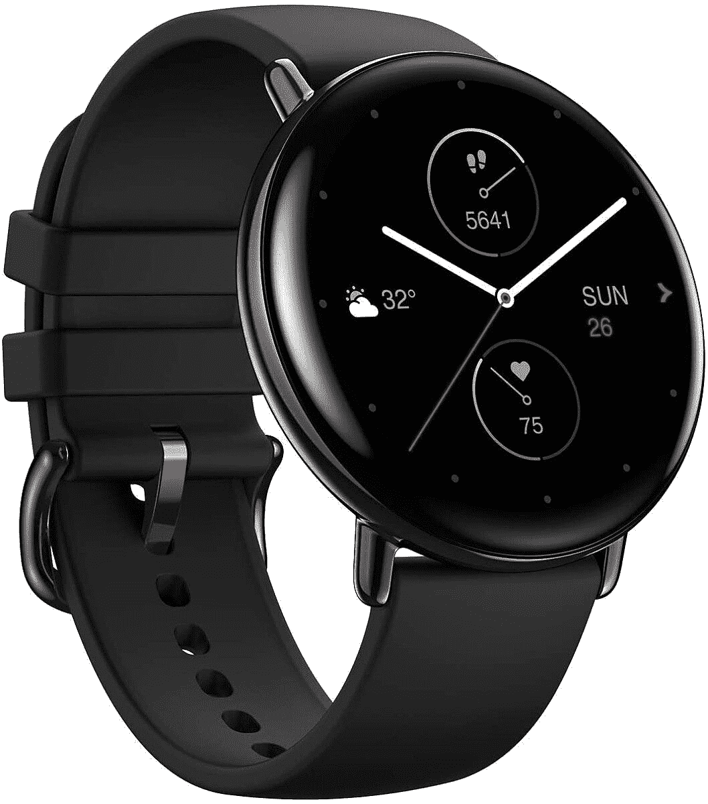

# Zepp E Circle Review:一款不完美但很可靠的中档智能手表

> 原文：<https://www.xda-developers.com/zepp-e-circle-review/>

现在是 2020 年，一切都很智能(我没有说每一个*一个*)。智能手机、智能冰箱、智能耳塞、智能咖啡机，应有尽有。我们甚至有智能手表，这就是这篇评论的内容。Zepp E 是 Amazfit 的姊妹公司 Zepp 的智能手表。这是一款中档选择，在美国售价 250 美元。这是一个好产品吗？它能做好基本的手表工作吗？它到底有多聪明？让我们来了解一下！

## Zepp E:规格

| 

投机

 | 

Zepp 电子广场

 | 

Zepp 电子圈

 |
| --- | --- | --- |
| **大小** | 43.3 x 35.7 x 9.0mm 毫米 | 42.2 x 42.2 x 9.1mm 毫米 |
| **重量** | 36g | 32g |
| **材质** | 不锈钢 | 不锈钢 |
| **耐水性** | 5ATM | 5ATM |
| **显示** | 1.65 英寸 AMOLED @ 348 x 442px 像素 | 1.28 英寸 AMOLED @ 416 x 416px 像素 |
| **电池容量** | 188mAh | 188mAh |
| **传感器** | 

*   心率/血氧饱和度
*   加速计
*   地磁传感器
*   环境光传感器

 | 

*   心率/血氧饱和度
*   加速计
*   地磁传感器
*   环境光传感器

 |
| **蓝牙** | 5.0 BLE | 5.0 BLE |
| **乐队** | 20 毫米 | 20 毫米 |

***关于这个评测:**华米给我发了一个 Zepp E 圈评测，我已经定期用了一个多月了。他们没有参与这次审查。*

## 在盒子里&第一印象

如果你拿到 Zepp E，你可能会注意到的第一件事就是盒子有多长。说真的，我知道这是一个手表，但乐队不必像他们一样直出。不过，这是相当不错的包装。你打开外盒，找到一个内盒。打开内盒，手表就在那里。取出手表和分离器，你会得到另一个更小的盒子，里面有手册、充电器和一条超长的表带。

额外的乐队实际上是一个很好的接触。Zepp E 附带的那个对我来说太小了，所以很高兴能够立即用一个更适合我手腕的长版本来替换它。

说到充电器，我不得不说我有点失望。Zepp E 没有使用 Qi 充电，而是使用了一种专有的磁性弹簧针充电器。如果你把这个充电器忘在家里，你就不能给手表充电了。不过，除了是专有的以外，它还是很不错的。只是一根 USB-A 线锚定在充电底座上，方便随身携带，不需要专门的电源。

现在实际使用手表。似乎华米就是想不出如何为它的设备做一个简单的配对/设置过程。当我查看 Amazfit PowerBuds 时，我花了多次尝试才能在应用程序中配对和设置它们，Zepp E 也是如此。当我最终配对成功时，开箱即用的固件更新在最终完成前多次卡住并失败。

但是当我真正安装并开始使用 Zepp E 时，我对这个软件的第一印象非常好。它并不花哨，也不是像 Wear OS 或 Tizen 那样的标准软件，但它工作得相当好。定制软件也意味着 Zepp 能够给手表带来令人难以置信的长电池寿命，这一点我稍后会详细介绍。

Zepp E Circle 的设计毫不起眼，既好看又薄

最后，我们来谈谈手表的外观。Zepp E 相当普通。不是特别华而不实，也不难看。我个人很喜欢。圆形款的设计只是一个简单的圆形不锈钢机身，前面有一些玻璃和一些表带支架。它很好，也很薄，所以如果你要进入一个狭小的空间，它不太可能碍事。不过，Zepp E 的直径确实很大，所以如果你的手腕比较小，它可能看起来或感觉起来有点大。

这部分差不多就是这些了。在真正的华米时尚中，初始设置很糟糕，但一旦你过了那个阶段，产品本身似乎工作得很好。当然，稍后我会更详细地介绍，但是我对 Zepp E 的第一印象非常好。

## Zepp E 圈:显示

Zepp E 是一款智能手表，当然，它有显示屏。不过，这不是一个无聊的老式单色液晶显示器。它也不是那种既有有机发光二极管又有基本 LCD 的花哨的双显示器。Zepp E 有一个漂亮的 1.28 英寸中间位置 AMOLED 显示屏。这也是一个非常好的展示。它的像素密度为 326 PPI，与 Galaxy Watch Active 2 等更昂贵的手表不相上下。除非你真的在找，否则你一般不会看到像素。

Zepp E 也变得非常明亮。即使在阳光直射的情况下，我也没觉得有什么问题。由于 Zepp E 配备了环境光传感器，您永远不必担心手动调高室外亮度，或者在晚上因为忘记调低亮度而失明。

所以我们有高分辨率和高亮度。还有什么？嗯，1.28 英寸对于圆形显示器来说是一个不错的直径。它并不是大得离谱，但是仍然有很大的空间来显示密集的信息，并使用户界面更容易滑动。

最后，稍微消极一点。虽然显示器有相当高的像素密度，你通常看不到像素，但当你看到像素时，它比我想的要简单一点。这里要么有一些奇怪的像素布局，要么软件没有做好反走样的工作，因为有时事情看起来很奇怪。无论如何这都不是什么大不了的事，但它确实存在。

## Zepp E:软件

如果没有一些软件，它就不是智能手表，如果不谈论软件，这就不是智能手表评论。所以我们来谈谈。

Zepp E 自带定制操作系统。你在这里找不到 WearOS 或者 Tizen。但是，根据你对手表的要求以及软件制作的好坏，定制系统不一定是件坏事。

可惜 Zepp 的软件有很多负面。也有一些积极的方面，但我是一个悲观主义者，所以我从坏的方面开始。

### 通知

首先，应用程序通知。任何智能手表最好的功能之一(在我看来)是能够从你的手腕上看到你手机的通知。虽然 Zepp E 有一个通知镜像系统，但它真的没有那么好。

默认情况下，没有应用程序启用接收通知，所以你必须进入并启用你想要的应用程序。也没有(取消)全选系统，所以如果你想要大多数应用程序的通知，你需要轻击一段时间。最重要的是，你安装的任何新应用都不会自动启用。

但是，一旦您最终设置好了通知情况...还是不好。Zepp E 忽略通知的重要性级别。所以如果你手机收到静音通知，手表还是会震动。

然而，事情并没有就此结束。当弹出通知时，它实际上并没有告诉你应用程序的名称。它确实会给你图标(有时)和通知标题，但要一眼看出通知来自哪个应用程序并不容易。如果你真的想看通知的内容呢？祝你好运。有时候有文字，有时候没有。

接下来，清除通知。当一个通知弹出时，你不能从那里清除它。你必须首先使用单个硬件按钮退出，然后向上滑动到通知中心，然后向下滚动到底部，点击“全部清除”按钮。你不能解雇一个。那个按钮并不总是在那里。它只是随机消失。

最后，通知中心本身就在手表上。你从显示屏底部向上滑动进入，就可以了。它会显示自您上次清除后收到的通知列表。您可以轻按单个通知来查看有关它的更多详细信息(如果它们已被录制)。但这很基本。就像我前面说的，你不能单独地关闭通知，并且关闭所有通知的按钮并不总是有效。

当你关闭所有通知时，它不会将状态同步到手机，反之亦然。Zepp E 的通知系统与手机系统是完全分开的。你可能喜欢这种行为，但我个人觉得很讨厌。

所以这是很多关于通知的负面消息，对吗？是啊，它是。不用说，如果你正在寻找一种方便的方式来接收通知，你可能不应该得到这款手表。

### 单位

继续消极的，是时候谈谈单位了。如果你不知道，世界上有两种主要的单位制:公制和英制。因为我在美国长大，所以我习惯了帝国制度。是的，我知道在大多数情况下，与公制相比，它在客观上更差，但事实就是如此。

因为我在美国，Zepp E 自动设置自己使用英制系统...算是吧。虽然所有的数字都是英制的，但单位标签仍然是公制的。因此，我的 8 英里自行车行程被记录为 8 公里，当我写这篇文章时，当前的温度显然是 50 摄氏度。我尝试了几次将单位转换为公制，但没有任何改变。在这个(漫长的)审查期间，我甚至得到了一些固件更新，但它们都没有解决这个问题。

显然，一旦你意识到这个问题的存在，你可以自动切换你头脑中的单位。毕竟数字是对的。但这仍然是一个奇怪的疏忽，我已经向 Zepp 报告了，但至今没有解决方案。

### 使用

好了，是时候来个更笼统的了。少一些消极！不是抱怨软件中的具体问题，是时候进行一般性的抱怨和表扬了。还是那句话，先说负面的。

Zepp E 只有一个硬件按钮，所以它很大程度上依赖于滑动来浏览软件。在很大程度上，这是可以的，但并不总是直观的。根据你当前在软件的哪个部分，滑动有时会有不同的动作，有时这些滑动只是用点击按钮来代替。

你应该做什么并不总是显而易见的，比如在退出锻炼时。我的直觉是按下硬件按钮，但实际上你应该从屏幕的左侧扫入并点击那里的停止按钮。没有迹象表明那里有控制面板。你应该知道它的存在。

不过，由于显示屏的设计方式，没有任何突出的边框，滑动很容易进行。不需要用嘴唇去触碰显示器的边缘或任何东西。

但还记得我说过这会变得不那么消极吗？嗯，这就是下一个问题的所在。

总的来说，Zepp 的软件相当流畅

总的来说，Zepp 的软件相当流畅。我想我从来没有见过它冻结或口吃，它总是对轻敲和轻扫有反应。这些动画并不十分花哨，而且它们运行的帧速率相当低，但它们播放时是一致的。这比我的 Galaxy Watch Active2 要好得多。虽然那里的动画以高得多的帧速率运行，但我经常注意到它们断断续续，我已经让手表在一个空白的主页上冻结了几次。

### 功能和定制

现在是另一个不那么消极的部分:这个！

由于 Zepp E 有自己的定制软件，定制仅限于 Zepp 给你的东西。幸运的是，他们给了你很多。

在表盘方面，有很多选择。你可以选择带有可定制背景图像的简单的只显示时间的人脸，或者选择带有时间、天气、健身细节等信息的人脸。在每个类别和复杂程度中也有大量的风格。因此，虽然可能没有第三方选项，但你可能会找到一款适合你的表盘。

但是应用程序呢？不幸的是，Zepp E 没有应用程序商店。你只能得到手表上已经有的应用程序。不过，有很多应用程序大多以健身为重点，比如测量你的压力或 SpO2 水平或开始锻炼。还有一些非健身应用程序，如指南针和待办事项列表。

虽然你可能无法使用 Zepp E 在城市中导航，但它在功能性方面仍然有很多优势。

### 智能手机上的 Zepp 应用

现在，一些技术上的软件，但不是真正的手表软件:手机伴侣应用程序。Zepp 应用程序以前被称为 Amazfit 应用程序，它可以让你做很多涉及联网 Zepp E 的事情。

在主页上，Zepp 应用程序会给你一个所有健身项目的总结:步数、心率、目标跟踪等。轻按卡片或互动程序以查看其更多详细信息。在“享受”页面上，Zepp 应用程序允许你设置各种选项，比如选择当你接到电话时你的手表应该做什么，设置闹钟，找到设备，等等。最后是个人资料页面。在这里，您可以查看连接的 Amazfit 或 Zepp 设备，并更改高级选项。您可以检查固件更新，进行客户满意度调查，以及做一些随机的事情。

总的来说，Zepp 应用程序实际上相当不错。它在某些方面还不够完善，我在最初的配对过程或固件更新方面运气一直不好，但一旦它工作了，它就工作得相当好。

## Zepp E:健身

相当多的智能手表的主要焦点是健身，Zepp E 在这里也不例外。但是有多少健身功能，它们的效果如何？

### 锻炼追踪

像任何专注于健身的手表一样，Zepp E 具有锻炼跟踪功能。你可以从一系列不同的锻炼中选择，包括跑步、散步、骑自行车、游泳、爬山、徒步旅行....甚至滑雪也是一种选择。当然，还有椭圆和其他活动的标准健身房相关跟踪选项。

我主要使用 Zepp E 来跟踪自行车，至少与我的 Galaxy Watch Active 2 相比，它做得相当好。所有的指标，如平均心率、距离和所走的路，都几乎完全匹配。我遇到的唯一问题是偶尔会收到 GPS 丢失的通知，但这似乎并没有影响到任何事情。

然而，Zepp E 的健身追踪功能中有一个值得注意的遗漏，那就是自动追踪。例如，Galaxy Watch Active 2 能够检测到你正在进行某种已知的锻炼，并自动跟踪它。这对我很有用，因为我经常忘记手动开始锻炼。这并不是什么大问题，但如果有就好了。

### 传感器

但是 Zepp E 如何进行径赛训练呢？嗯，像位置和速度跟踪，它使用蓝牙连接到你的手机。对于其他一切，背面有一组传感器。

为了给你更好的锻炼数据，Zepp E 能够跟踪和记录你的心率和 SpO2 水平。它还可以使用这些数据来做一些事情，比如告诉你你睡得有多好或者你有多大压力。我真的没有任何方法来检查 SpO2 的准确性，但我得到的测量值不是 80 多，就像某个三星手表一样。

有趣的是，Zepp E 上还有一个环境光传感器，我不知道它在哪里，但我知道在强光下移动手表会导致屏幕平滑变亮，反之亦然。这绝对是一个很好的功能，而且我不确定即使是 Galaxy Watch Active 2 也有这个功能。

如果你的手表有自动亮度还不够，指南针怎么样？Zepp E 里面有一个地磁传感器，还有一个简单的指南针应用程序。所以，如果你被困在某处的森林中，记得带上你的 Zepp E。

现在，据我所知，Zepp E 没有内置 GPS。如果你要用它来跟踪你的锻炼，它需要连接到你的手机上。当然，Zepp 似乎并没有真的将它作为一款独立的手表来营销，所以这是有道理的。

这将是一小段。虽然 Zepp E 拥有你所期望的专注于健身的智能手表的大部分基本功能，但它并没有太多额外的功能。唯一值得注意的潜在特点是包括一个振动电机。没有扬声器或麦克风，但你仍然可以通过手腕上的虚拟点击获得提醒。

## Zepp E:电池和充电

智能手表的主要限制之一似乎是电池寿命。不难发现 1000 美元的手表充电最多只能用一两天。

幸运的是，Zepp E 不是 1000 美元。同样幸运的是，它持续了很长一段时间。即使有了锻炼跟踪，它也应该可以轻松地持续至少五天，然后才需要再次充电。在这一点上，充电速度并不重要。只要在周末给它充电，或者当你可以的时候把它放在充电器上一会儿。

即使有锻炼追踪，Zepp E 在需要充电之前至少可以持续五天

电池寿命如此之长也是一件好事，因为 Zepp E 使用了一种专有的磁性 pin 充电器。充电器是一根简单的电缆，一端是 USB-A 插头，另一端是充电接口，所以它很小，很轻，便于携带，可以与任何 5V USB 插座配合使用。

但是如果你忘了充电器，你就不能给你的手表充电了。Zepp E 没有任何形式的无线充电，齐，三星，苹果，或其他。

## Zepp E Circle:舒适贴合

当谈到你应该整天戴在手腕上的东西时，它的舒适性非常重要，无论是手表戴在手腕上的感觉还是普通表带的质量。

我的 Zepp E 的评测单元自带了 Zepp 的 20mm 皮筋，不幸的是，不是很舒服。带子的边缘有点锋利，它会扎进我的皮肤，这并不好玩。幸运的是，这只是你的标准 20 毫米表带，可以用任何其他标准 20 毫米表带代替。

由于我已经更换了 Galaxy Watch Active2 上的表带，我只是在我的 Zepp E 上安装了三星的库存硅胶表带。虽然它不是非常舒适，但肯定比皮革表带好。Zepp 确实也提供金属和橡皮筋，但是我没有所以不能说有多好。

不过，除了乐队的问题，Zepp 相当舒适。比我的 Galaxy Watch Active2 薄很多，所以更难注意到。我可以穿一天，偶尔穿一晚上。

## 结论

Zepp E 是一款非常坚固的智能手表

总的来说，Zepp E 是一款非常坚固的手表。你看不到三星或苹果的一些更花哨的功能，如心电图和自动跟踪，目前也没有第三方应用程序或手表面部，但鉴于 Zepp E Round 在美国的售价为 250 美元，我想说这是有一定道理的。

甚至有一些地方 Zepp E 比其更昂贵的竞争对手做得更好，比如电池寿命。苹果和三星甚至不能指望从他们的手表中获得 5 天的正常使用。如果你想要一款电池续航时间长的特色智能手表，你可以在这里找到它。

我对 Zepp E 唯一真正的不满是软件质量。就像我前面提到的，安装过程根本就不顺利。像它显示错误的测量单位这样的小毛病并不可怕，但它确实显示了对细节的关注不足。

不过最后，我还是喜欢 Zepp E。这是一款可靠的产品，很高兴看到智能手表有一些中端选择。

如果你有兴趣购买 Zepp E，你可以在美国亚马逊上以 249.99 美元的价格买到它。

 <picture></picture> 

Zepp E Circle

##### Zepp E 圈

Zepp E circle 是一款价格合理的智能手表，拥有不错的健身追踪功能和时尚指数。