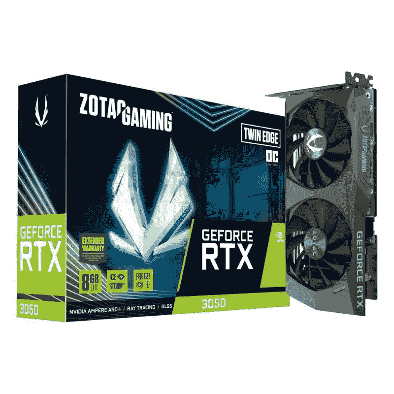

# Zotac GeForce RTX 3050 双刃 OC 版评测

> 原文：<https://www.xda-developers.com/zotac-nvidia-geforce-rtx-3050-review/>

Zotac GeForce RTX 3050 是少数几个你现在可以真正以零售价或至少接近其零售价购买的 GPU 之一。但这款特殊的 Twin Edge OC Edition 3050 显卡售价 400 美元，比标准 RTX 3050 台式机显卡的建议价格还要贵。对于额外的 150 美元，你基本上得到了约 2%的超频性能，因此命名为 OC 版。那么值得买吗？

嗯，事实上它至少可以买到，这使它成为一个很好的选择，首先。你现在必须花至少 400 美元，甚至 500 美元以上购买像 RTX 2060s 这样的旧 GPU。其他 RTX 30 系列卡，如 RTX 3060 更贵，从而使 Zotac RTX 3050 Twin Edge OC edition 看起来更好，即使是 400 美元。至于性能，嗯，Zotac GeForce RTX 3050 Twin Edge OC edition 提供了令人印象深刻的 1080p 游戏性能。

我能够以 1080 便士的价格运行各种高要求的 AAA 游戏，没有任何大的问题。事实上，按照 2022 年的标准，我甚至将 GPU 与相对低端的 CPU 配对，性能也一样好，如果不是更好的话。我并不指望这个 GPU 能够处理我测试的很多游戏，但我的测试套件的性能远远超过 60 fps。

 <picture></picture> 

Zotac GeForce RTX 3050 Twin Edge OC

##### Zotac GeForce RTX 3050 双刃 OC

Zotac GeForce RTX 3050 Twin Edge OC Edition 是目前实际上可以买到的 GPU 之一。它在各种不同的 AAA 游戏中提供令人印象深刻的 1080p 游戏性能。

* * *

**浏览此评论:**

* * *

## 定价和可用性

*   Zotac GeForce RTX 3050 Twin Edge OC Edition GPU 现已上市，价格约为 400 美元。

Zotac GeForce RTX 3050 Twin Edge OC Edition 现已上市，建议零售价为 399 美元。在印度，你现在就可以从各种线上和线下零售合作伙伴那里为₹34,999 购买这款显卡。虽然这款 GPU 的建议建议零售价略高于 RTX 3050 的 250 美元的上市价格，但你实际上获得了工厂超频和其他一些功能。还值得指出的是，这是目前可以购买的极少数 GPU 之一，至少在撰写本文时是如此。

* * *

## 规范

在我们深入性能分析、硬件等等之前；下面快速浏览一下 Zotac GeForce RTX 3050 Twin Edge OC Edition GPU 的规格:

| 

规格

 | 

Zotac GeForce RTX 3050 双刃 OC 版

 |
| --- | --- |
| **建筑** | GA106 |
| **晶体管(十亿)** | 12 |
| **GPU 核心** | 2560 |
| **张量核** | 80 |
| **RT 内核** | 20 |
| **升压时钟(MHz)** | 1807 |
| **内存** | 8GB GDDR6 |
| **VRAM 速度(Gbps)** | 14 |
| **VRAM 总线宽度** | 128 |
| **带宽(Gbps)** | 224 |
| **TDP** | 130 |
| **管理系统更新项目** | $399 |

* * *

## Zotac GeForce RTX 3050 双刃 OC 版评测:设计和硬件

*   双 88 毫米风扇实现良好的散热管理
*   配有背板，可保护背面的组件
*   三个显示端口和一个 HDMI 端口

关于这个特定的 Zotac GeForce RTX 3050 GPU 的整体设计，没有太多可说的。它看起来与市场上的许多其他 Zotac GPUs 非常相似。如果您曾经使用过任何一款最新的 Zotac 显卡，您会有宾至如归的感觉。你可以在这个卡上找到两个 88 毫米的风扇，在我的测试中，它们能够很好地处理热量输出。这个版本的 RTX 3050 也没有 RGB 闪亮，这是我非常喜欢的。不过，如果你更喜欢在你的电脑组件上使用 RGB，你可能得去别处看看。

Zotac RTX 3050 Twin Edge OC Edition GPU 的总尺寸为 222x115x40mm，重量约为 600 克。我想说它比其他 OEM 的许多其他 RTX 3050 显卡略大，但它非常小，非常紧凑。它不是外面更大的 RTX 3070 和 3080 的对手。不过，这不一定是件坏事。由于它的外形小巧，因此可以轻松放入各种电脑机箱中，而不会有任何间隙问题。

关于这款 Zotac RTX 3050 GPU，我想强调的另一点是，它配有背板来保护背面的组件。背板是其他原始设备制造商的许多其他 RTX 3050 变种所缺少的，所以这肯定是要考虑的事情。我确信它增加了这张卡的总重量，但这不一定是一个交易破坏者，即使你有一个非加固的 PCIe 插槽。Zotac GeForce RTX 3050 Twin Edge OC Edition 使用单个 8 引脚 PEG 连接器供电，并配有三个 DisplayPort 和一个 HDMI 输出。

* * *

## Zotac GeForce RTX 3050 Twin Edge OC 版评测:性能

*   Zotac GeForce RTX 3050 Twin Edge OC Edition 轻松处理 1080p 游戏。
*   支持光线跟踪和 DLSS。
*   性能略好于 GTX 1660 超级。

正如我前面提到的，Zotac GeForce RTX 3050 Twin Edge OC Edition 主要专注于 1080p 游戏。它本质上是试图在预算空间中取代旧的 16 系列显卡。RTX 3050 的 OC 版本具有略高的升压时钟，达到 1807MHz，而 RTX 3050 的参考时钟为 1777MHz。与标准版相比，这并不是一个巨大的进步，所以它也为超频留下了更多的空间，如果你有兴趣探索一种有效的冷却解决方案的话。

只是为了了解规格，Zotac GeForce RTX 3050 Twin Edge OC Edition 具有 2560 个 GPU 核心、80 个张量核心和 20 个 RT 核心。这种 GA106 安培显卡能够为支持的标题进行光线跟踪和 DLSS。虽然我不会把我的钱赌在光线跟踪性能上，但我会说 DLSS 支持的增加使它成为一个伟大的显卡。例如，这是推荐任何 RTX 3050 显卡而不是 GTX 1660 超级显卡的主要原因之一。下面是我在使用 Zotac GeForce RTX 3050 Twin Edge OC Edition GPU 和英特尔酷睿 i7-12700 CPU 的系统上获得的 3DMark 分数:

| 

3DMark 测试

 | 

Zotac GeForce RTX 3050 Twin Edge OC 版分数

 |
| --- | --- |
| 皇家港 | 3343 |
| **时间间谍** | 6005 |
| **火击** | 12901 |

现在，转到游戏性能部分，我最终在这块显卡上运行了许多 AAA 游戏，主要是为了看看它在 2022 年的一些现代和要求更高的游戏中的表现。我们正在研究像微软飞行模拟器、孤岛惊魂 6 等游戏。相信这个性能分析应该能让你对 Zotac GeForce RTX 3050 Twin Edge OC Edition 的整体性能有所了解。

我已经添加了平均值。我能够使用 Nvidia 的 FrameView 软件将 FPS 数字记录到下表中。我还添加了平均值。使用 GTX 1660 超级显卡录制的 FPS 向您展示这款显卡与旧显卡的对比。Zotac RTX 3050 能够以超过 60FPS 的 1080p 速度轻松击败旧的 GPU。对于大多数游戏来说，你可能无法用这个 GPU 以最大设置运行，但你应该可以通过一点点调整获得超过 60FPS 的速度。

| 

比赛

 | 

Zotac GeForce RTX 3050 双刃 OC 版(FPS)

 | 

微星 GeForce GTX 1660 超级 XS OC (FPS)

 |
| --- | --- | --- |
| **孤岛惊魂 6(1080p 中等)** | 82 | 73 |
| **微软飞行模拟器(1080p 中型)** | 68 | 51 |
| **Apex 图例(1080p 中号)** | 121 | 113 |
| **地平线零点曙光(1080p 中号)** | 79 | 71 |
| **红色亡灵救赎 2(1080p 中等)** | 83 | 73 |
| **边境地带 3(1080p 中号)** | 111 | 93 |

Zotac GeForce RTX 3050 Twin Edge OC Edition 的光线追踪性能还不错。多亏了 DLSS 的帮助，我才能够在《控制》、《赛博朋克 2077》等游戏中使用这款 GPU 获得不错的实时性能。不过，我不建议把 RT 设置调到最高。中等实时设置与 DLSS 设置为性能模式似乎是甜蜜点在许多现代标题。

我也尝试过以 1440p 运行一些游戏，但这并不是一个特别愉快的体验。这并不奇怪，因为 RTX 3050 是一张 1080 便士的卡。这款显卡只能提供 1440p 的边缘性能。您的最佳选择是升级到 RTX 3060 或 RTX 3070，以获得更高的 1440p 游戏性能。

接下来谈谈 GPU 的热性能，我能够在 GPU 处于重负载下时记录到大约 65C 的峰值温度。我还注意到风扇始终以相对较低的转速运行，这也是这款显卡运行安静的原因。然而，值得指出的是，我没有添加任何手动超频，所以可能有更多的空间让这个 GPU 在热封套内传播。

* * *

## 值得买吗？

正如你所见，Zotac GeForce RTX 3050 Twin Edge OC Edition 的整体性能绝对非常出色。它没有赢得任何比赛，但在 1080p 游戏方面，它像宣传的那样工作。

### 谁应该购买 Zotac GeForce RTX 3050 Twin Edge OC 版？

*   非常适合那些希望购买 GPU 来玩休闲 1080p 游戏的人。
*   GeForce RTX 3050 是那些从 GTX 1650 甚至 GTX 1660 超级 GPU 升级的可靠选择。
*   如果你想要一个支持 DLSS 的 GPU 来获得更好的性能

### 谁不应该购买 Zotac GeForce RTX 3050 Twin Edge OC Edition？

*   1440p 游戏不要买这个 GPU。
*   此外，不要因为工厂超频而期待明显更好的性能。

以上就是我对 Zotac GeForce RTX 3050 Twin Edge OC 版的评价。如果你想要一个好的 1080p 游戏体验，这是一个很好的选择，但不要指望它会超越。为了获得更好的性能，您必须升级到 30 系列中更好的卡之一。我们建议你看一下我们收集的最好的显卡，从中找到一些好的选择。

 <picture></picture> 

Zotac GeForce RTX 3050 Twin Edge OC

##### Zotac GeForce RTX 3050 双刃 OC

Zotac GeForce RTX 3050 Twin Edge OC Edition 是目前实际上可以买到的 GPU 之一。它在各种不同的 AAA 游戏中提供令人印象深刻的 1080p 游戏性能。