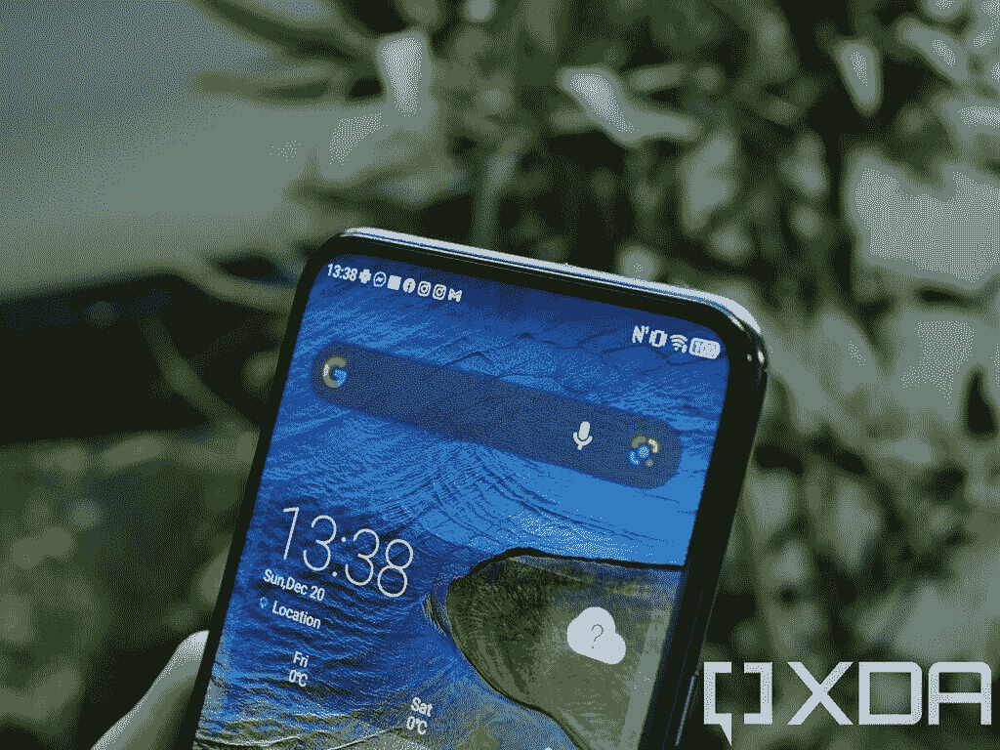

# 中兴 Axon 20 5G 上手:下显相机交付不足

> 原文：<https://www.xda-developers.com/zte-axon-20-5g-under-display-camera-hands-on/>

你见过凹口，你见过弹出式摄像机，但你从来没有见过显示器下的摄像机，直到现在。中兴 Axon 20 5G 是该品牌最新的中端手机，它有一个突出的特点:摄像头位于显示屏下方，永远不会完全暴露在肉眼面前。不幸的是，我真的不认为这项技术已经存在，只是还没有。这是九月在[发布的第一款带下视摄像头的手机，尽管当时它只在中国发布。](https://www.xda-developers.com/zte-axon-20-5g-china-launch-first-smartphone-under-display-camera/)

我将在 XDA YouTube 频道上对中兴 Axon 20 5G 进行全面评论，但目前，这些是我对显示屏和前置摄像头的初步想法。

| 规格 | 中兴 Axon 20 5G |
| --- | --- |
| **尺寸&重量** |  |
| **显示** |  |
| **SoC** | 高通骁龙 765G:肾上腺素 620 肾上腺素 620 肾上腺素 620

*   1 个 Kryo 475(基于 ARM Cortex-A76)Prime core @ 2.4 GHz
*   1 个 Kryo 475(基于 ARM Cortex-A76)性能内核@ 2.2GHz
*   6 倍(基于 ARM Cortex-A55)效率内核@ 1.8GHz
*   7 纳米 EUV 工艺

Adreno 620 |
| **内存&存储** |  |
| **电池&充电** |  |
| **指纹传感器** | 显示屏内指纹传感器 |
| **后置摄像头** |  |
| **前置摄像头** | 32MP |
| **连通性** | **NR**:N78(SA&NSA)**FDD**:B1/3/5/7/8/20**TDD**:B38/40/41**UMTS**:B1/2/4/5/8**GSM**:B2/3/5/8 |
| **安卓版本** | 基于 Android 10 的 MiFavor 10.5 UI |

**[中兴 Axon 20 5G 论坛](https://forum.xda-developers.com/c/zte-axon-20-5g.11461/)**

## 中兴 Axon 20 5G 的显示效果相当不错

由于中兴 Axon 20 5G 的无凹槽体验，我想起了我最喜欢带弹出式摄像头的智能手机的地方——它们给了我完全无边框的体验。它看起来很好，用起来感觉很好，正如我经常说的，1080p 在几乎任何尺寸的智能手机上都很好。Axon 20 5G 是我用过的最大的手机之一，屏幕尺寸为 6.92 英寸，但使用起来仍然很好，全高清+分辨率显示屏也很好。我会喜欢 1440p 的显示器吗？当然，但中兴 Axon 20 5G 原样提供了良好的观看体验。显示器也是一个高刷新率，90Hz 的面板，但我注意到在系统设置中默认启用 60Hz。我需要手动切换，我觉得这有点奇怪。我担心 90Hz 可能会导致问题，我可能会面临电池耗尽或有明显的打嗝。幸运的是，我没有遇到这样的问题，我不确定为什么中兴没有默认启用 90Hz。这是手机的卖点之一，默认不开机很奇怪。然而，我发现在 MiFavor UI(中兴的 Android 变体名称)中，它指的是“顶部区域设置”中的“无切口显示屏”。状态栏，它涵盖了下显示相机是全黑的，当我把开关切换到“无缺口显示”，我意识到为什么。打开无缺口显示可以让壁纸充满显示器的顶部，也可以让状态栏改变颜色以适应当前使用的应用程序。看看下面的照片，把焦点放在状态栏的中心。

完全看不出来？这是放大给你的。

遗憾的是，这不是只有我的相机才能捕捉到的东西。无论什么时候状态栏区域是任何颜色的，它都会立刻被注意到并突出出来。如果你买了这个设备，我强烈建议你把状态栏隐藏起来。直到我深入了解这些设置，我才真正意识到这一点，但这是值得记住的事情，它显示了这项技术有多早。

## 前置摄像头本身

对于一台显示不足的相机，我真的不知道该期待什么样的质量。我很好奇它是否真的会工作得很好，是否可以像其他前置摄像头一样使用，如果我诚实的话，它只是勉强及格。我真的不是这款设备前置摄像头的粉丝，我觉得只有很少用的人才会真的满意。我会给你们分享几百张我的脸的照片，但是真的，所有的照片都一样糟糕。

相机的问题只是它有多模糊，这似乎是它在显示器下面的副作用。我知道上面的两张照片在较低的光线下，但在所有的光线条件下都可以看到相同的模糊平滑效果。事实上，当在直射光下，取景器中显示的任何光源都会大量绽放，完全破坏照片质量。我可以用“柔和”来形容这台相机拍摄的照片。总的来说，这款自拍相机的范围从可以忍受到...几乎不能用了。如果你想要好看的自拍，那么这绝对是

*not*

要获取的电话。如果你不在乎自拍，那很好，但请记住，显示器上显示的任何内容都会出现各种奇怪的“网格”。中兴通讯发布这款手机只是为了让这种新的创新技术首先进入市场吗？说实话，可能性很大。这很酷，我真的很喜欢它对未来的意义，但这种体验绝对是

*not *

达到我设定的标准。我对显示屏下摄像头技术的未来感到兴奋，但这款手机绝对不是它的最佳代表。

## (最初的)判决

听着，这不是评论。这是我对显示器下摄像头技术的初步想法，使这款智能手机脱颖而出，遗憾的是，我认为它有点超前。我是不是因为它而不喜欢中兴 Axon 20 5G？肯定不是。这是一款使用起来很有趣的设备，我喜欢它的显示屏，高通骁龙 765G 一如既往地好。然而，指出使用该设备几分钟后明显的突出问题不能被忽视，可悲的是，它们夺走了原本美好的体验。这种相机技术很有趣，我很期待它的发展。中兴通讯还没有做到这一点，但这是一个良好的开端...老实说，对于消费类硬件来说，感觉有点太早了。如果你对我对中兴 Axon 20 5G 的最终评价感兴趣，我会在

[XDA YouTube channel soon](https://www.youtube.com/channel/UCk1SpWNzOs4MYmr0uICEntg)

，在这里我将更深入地讨论性能、后置摄像头等等！