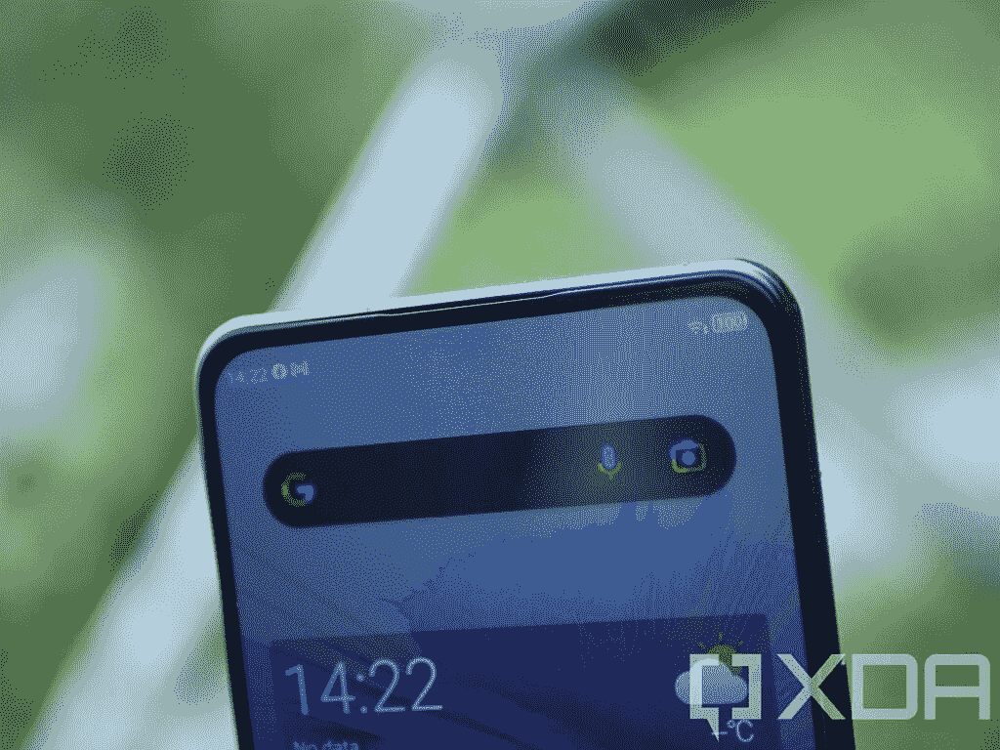
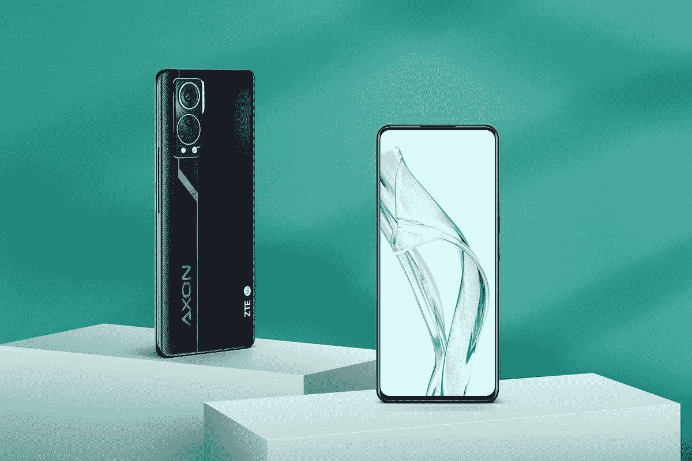

# 中兴 Axon 30 hand-on:一款眼不见心不烦的显示器下摄像头

> 原文：<https://www.xda-developers.com/zte-axon-30-hands-on/>

弹出式相机和凹口或多或少已经成为过去，打孔相机已经取而代之。虽然它远不如纯粹的无边框体验美观，但在过去的一年中，它们一直是任何寻求最小边框智能手机的人的最佳选择。然而，去年中兴 Axon 20 提供了市场上第一款智能手机下显示相机之一，尽管它有些令人印象深刻。现在它的继任者来了，这比我希望的要大得多。

中兴 Axon 30 不是最*旗舰*的智能手机——你会想去[中兴 Axon 30 Ultra](https://www.xda-developers.com/zte-axon-30-ultra-hands-on/) 看看——但为这款特殊设备提供动力的高通骁龙 870 肯定足够好。可以把它想象成去年为旗舰提供动力的骁龙 865 的升级版；这已经足够好了。

***关于这次动手:**中兴在 8 月 16 日给我们发来了 Axon 30 的评测。中兴通讯对这篇文章的内容没有意见。*

## 中兴 Axon 30:规格

| 

规格

 | 

中兴 Axon 30

 |
| --- | --- |
| **尺寸和重量** | 

*   170.2 x 77.8 x 7.8 毫米
*   189 克

 |
| **显示** | 

*   6.9 英寸有机发光二极管 FHD+
*   1080 x 2460
*   120 赫兹刷新率
*   360Hz 触摸采样率
*   10 位颜色深度
*   100% DCI-P3 覆盖率

 |
| **SoC** | 

*   高通骁龙 870
    *   1x ARM Cortex-A77 @ 3.2GHz
    *   3 个 ARM Cortex-A77 @ 2.4GHz
    *   4x ARM Cortex-A55 @ 1.8GHz
*   Adreno 650 GPU

 |
| **RAM 和存储器** | 8GB 内存+ 128GB UFS 3.1 存储 |
| **电池&充电** | 

*   4，200 毫安时电池
*   65W 快充支持

 |
| **后置摄像头** | 

*   主像素:6400 万像素四像素 f/1.79
*   二级:800 万像素超宽
*   第三级:5MP 宏
*   第四纪:2MP 深度

 |
| **前置摄像头** | 

*   1600 万像素 f/2.0，2.24 米
*   显示不足的照相机

 |
| **端口** | USB 类端口 |
| **连通性** | 

*   5G
*   国家足球联盟
*   蓝牙 5.1
*   WiFi 802.11 . b/g/n/AC(2.4 GHz+5 GHz)

 |
| **安全** | 显示屏内指纹识别器 |
| **软件** | 安卓 11 配 MyOS 11 |

## 中兴 Axon 30 的显示屏改进很多

中兴 Axon 30 的无刻痕体验是我最喜欢的智能手机之一，这是我很久没有真正体验过的东西。只有*1080 p 有点令人失望(但在这个尺寸的几乎任何显示器上都很好)，它通过 120Hz AMOLED 面板来弥补这一点，即使在 6.7 英寸的大显示器上也仍然看起来很好。它提供了良好的观看体验，在中兴 Axon 30 上观看网飞和 YouTube 是一种几乎无与伦比的体验，纯粹是因为没有打孔或切口。市场上很少有设备实际上有欠显示摄像头，而[小米 Mix 4](https://www.xda-developers.com/xiaomi-mix-4-hands-on/) 和[三星 Galaxy Z Fold 3](https://www.xda-developers.com/samsung-galaxy-z-fold-3/) 是仅存的两款。*

[sc name="pull-quote" quote= "中兴 Axon 30 的无刻痕体验是这款智能手机中我最喜欢的部分之一"]

中兴 Axon 30 的无切口显示体验比 Axon 20 有很大改善。如果你还记得，Axon 20 上的状态栏默认情况下总是设置为黑色。然而，在 Axon 30 上，中兴显然对其设计更有信心。默认情况下，无凹槽显示屏是启用的，因此前置摄像头所在位置的矩阵稍微可见，但只有在你寻找它时才可见。很难看到，特别是在屏幕明亮的时候，不像 Axon 20，相机上显示器的像素密度要低得多，以允许更多的光线通过。

这种显示屏让人想起弹出式相机设备，如一加 7 Pro，它有我最喜欢的智能手机显示屏之一。我非常喜欢完全无障碍的内容体验，即使打孔相机有时很容易忘记。

## 前置摄像头本身并无亮点...

这就是前置摄像头的问题——它们必须透过玻璃屏幕才能给你拍照，这也包括透过显示屏的一部分。中兴 Axon 30 的前置摄像头非常模糊，像 Axon 20 一样有“高光”效果。如果我诚实的话，它*感觉*像 Axon 20 上的同一台相机。质量似乎差不多，最大的改进是相机在一般使用中的隐藏方式。即使与小米 Mix 4 相比，差异也只是白天和黑夜。

下面所有的照片都是压缩的，但是照片的整体质量还是很容易辨认的。

中兴 Axon 30 绽放一个 *lot* ，真的很纠结额外的光源。照片中的“光晕”是指照片中光源周围可见的光晕效果，这是一个问题，尤其是在显示不足的相机上。在上面的照片中，光源看起来像一个明亮的光晕，周围有缺陷，这对于这些类型的相机来说是正常的。

[sc name = " pull-quote-right " quote = "这是一款非常适合不喜欢自拍的人的带自拍相机的手机"]此外，照片本身看起来很平滑，没有任何清晰的细节，使照片看起来没有吸引力。对于不喜欢自拍的人来说，这是一款带有自拍相机的手机，尽管我可以理解这对一些人的吸引力。我永远不会用这款手机相机与朋友和家人自拍，但我可以看到它被用于视频通话等。如果照片质量是你的特权，那么我当然会去别处看看。如果你真的不在乎自拍相机，那么老实说，这对于 2021 年的全屏显示来说是一个不错的选择。

与其他显示不足的相机相比，Mix 4 的自拍相机显然高于 Galaxy Z Fold 3 和 Axon 30。不过，Axon 30 在我看来是在 Galaxy Z Fold 3 所能做到的之上，但三星最新的可折叠显然具有优势，如果你真的想使用外主相机作为自拍相机。

## 但是后置摄像头很棒

背面的主要传感器给我留下了深刻的印象，我比我想象的更喜欢它。这绝对是一款旗舰级相机，也是一款不会让你失望的相机。很明显，中兴通讯理解摄影，即使是 Axon 30 的自拍相机也比去年的 Axon 20 有所改进，这表明该公司对改进是认真的。

下面的照片是压缩的，但让你对 Axon 30 的动态范围和颜色输出有所了解。

## MyOS 11 看起来和 Android 12 一模一样，尽管它是基于 Android 11 的

中兴的定制 Android 变种并不那么糟糕，这要归功于 MyOS 11 看起来或多或少有点像 Android 12 的最新测试版。这是一个非常明显的影响，我比我想象的更喜欢使用它。它有很多有用的功能，看起来很好，尽管值得一提的是中兴通讯并不以支持 windows 著称。软件更新有时可能不足，但如果你对此没问题，那么我在这里没有其他真正的抱怨。

Axon 30 的性能几乎与 2021 年发布的任何其他功能相当强大的设备一样好。它肯定没有其他原始设备制造商制造的一些 Android 变种那么夸张，而且它是对中兴通讯推出的 Axon 20 的旧款 MyOS 的改进，我已经很喜欢它了。这款手机的性能也完全符合人们对骁龙 870 的期望——它比去年的 865+高了一步，但幅度并不大。这当然足够好了，虽然基本上任何人。

[sc name = " pull-quote " quote = " Axon 30 的性能几乎与 2021 年发布的任何其他相当强大的设备一样好"]

最后，该公司还在盒子里包装了一个 65W 的充电器，大约 40 分钟就可以将手机从 0%充电到充满。

## 中兴 Axon 30 仍然是一款小众智能手机

Axon 30 的自拍相机非常眼不见，心不烦，但它仍然无法与*常规*前置相机的功能相提并论。它可以进行视频通话和快速拍照，但我从来不会用它来拍摄任何“重要”的快照。这是一种达到目的的手段，目的是获得完全无边框、无打孔的体验，结果它很好地实现了这一点。如果你重视自拍相机，那么我怎么强调这款手机都不适合你。

 <picture></picture> 

ZTE Axon 30

##### 中兴 Axon 30

如果你不太在乎自拍质量，尤其是如果你想要全屏智能手机体验，中兴 Axon 30 是一个非常好的选择。

然而，如果你*不在乎*自拍相机，那么没有理由不买 Axon 30。摄像头上方的区域不再碍眼，并与显示屏的其余部分融为一体，如果需要的话，对于偶尔的视频通话来说已经足够好了。主摄像头非常出色，由于高通骁龙 870 的性能也非常出色，€499 美元的起价使这款设备处于一个非常有竞争力的空间。